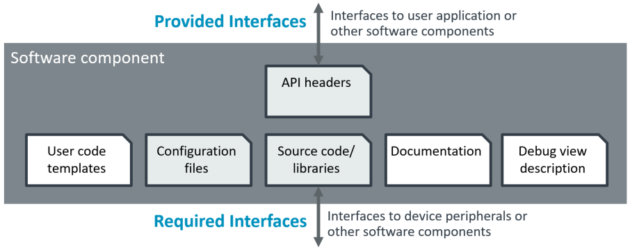
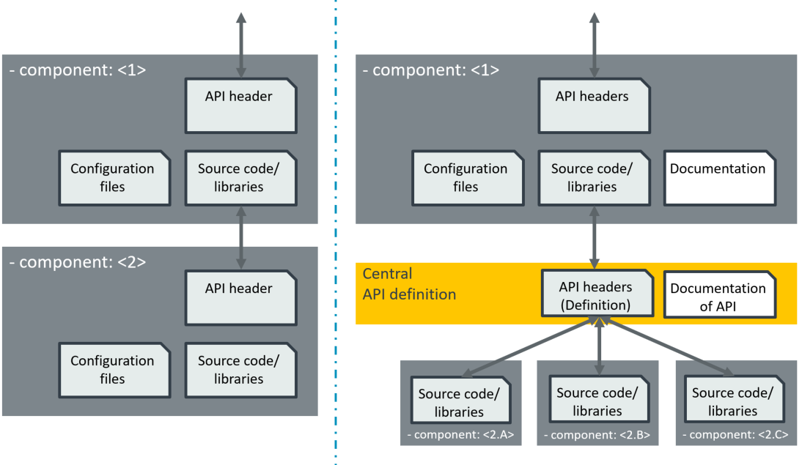
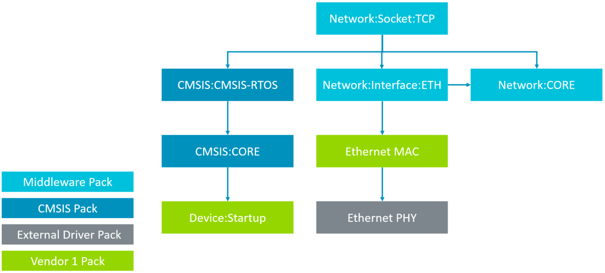
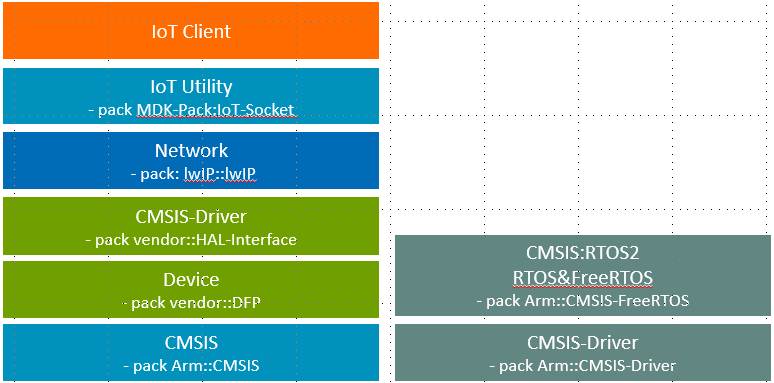

# Generate Application from Components

<!-- markdownlint-disable MD009 -->
<!-- markdownlint-disable MD013 -->
<!-- markdownlint-disable MD036 -->
<!-- markdownlint-disable MD032 -->

[**CMSIS-Toolbox**](README.md) **> Generate Application from Components**

The following chapter explains the structure of a software pack and how it can be used in an application.

- [Generate Application from Components](#generate-application-from-components)
  - [Overall Process](#overall-process)
  - [Software Component](#software-component)
    - [Required Interfaces](#required-interfaces)
  - [Example: Network Stack](#example-network-stack)
  - [Update Software Packs](#update-software-packs)

## Overall Process

The steps to create an application based on software components are:

1. Step: **Select software components**
   - Select the software pack that provides the required functionality (this could be based on pack datasheets) and identify the required software component(s).
   - Add the pack and the component to your `*.cproject.yml` file.
   - Run `csolution *.csolution.yml list dependencies` to identify other required software components.
   - Run `csolution list components --filter` to identify packs that provide this software components.
   - Repeat this step until all software components are part of your project.

2. Step: **Configure software components**
   - Run `csolution *.csolution.yml update-rte` to copy configuration files into the [RTE directory](./build-overview.md#rte-directory-structure).
   - Set the parameters in the configuration files for your application.
  
3. Step: **Use software components in application program**
   - User code templates provide a starting point for your application. 
   - Copy these template files to your project directory add add it to your `*.cproject.yml` file.
   - Adjust the code in the user template files as required.

## Software Component

A software component encapsulates a set of related functions. By offering API headers, it provides interfaces to other software components or to the user application.

The software pack provides for a software component other optional items such as configuration files, documentation, user code templates that show the usage of the software component, and a debug view description (for [CMSIS-View](https://arm-software.github.io/CMSIS-View/latest/index.html)). A software component typically interfaces to other software components or to device peripherals.



In the CMSIS-Pack system software components:

- Are identified by the node [components:](YML-Input-Format.md#components) using a [component name](YML-Input-Format.md#component-name-conventions).
- Use dependencies to describe required interfaces.
- List API header files for provided interfaces.

For example the LwIP network stack:

- requires an CMSIS-RTOS2 compliant kernel or a FreeRTOS kernel
- CMSIS-Drivers for the communication interface.
- List API header files for their interfaces.

> ToDo: Create a pack datasheet to display information about software components.

### Required Interfaces

There are two ways to describe required interfaces as shown in the diagram below. 

- Dependency reference to a component (a selection list is supported).
- Dependency reference to a API definition. Components that implement this API fulfill then the required interface.



The API definition has the benefit that components which implement the interface can be added over time. The exact component names need not to be known by the component that requires an interface.

ToDo: Use the command `csolution list components` to display available implementations for a required interface.

## Example: Network Stack

In this example, the application requires TCP Socket connectivity. Using the steps described under [Overall Process](#overall-process) delivers this content for *.cproject.yml file.

```yml
  packs:
    - pack: Keil::MDK-Middleware@7.16.0
    - pack: ARM::CMSIS@5.9.0
    - pack: ARM::CMSIS-Driver@2.7.2
    - pack: Keil::LPC1700_DFP@2.7.1

  components:
    - component: Keil::Network&MDK-Pro Net_v6:Socket:TCP
    - component: Keil::Network&MDK-Pro Net_v6:CORE&Release
    - component: Keil::Network&MDK-Pro Net_v6:Interface:ETH
    - component: ARM::CMSIS:CORE
    - component: ARM::CMSIS:RTOS2:Keil RTX5&Source
    - component: Keil::CMSIS Driver:Ethernet:KSZ8851SNL
    - component: Keil::CMSIS Driver:SPI:SPI
    - component: Keil::Device:PIN
    - component: Keil::Device:GPIO
    - component: Keil::Device:Startup
```

The required interfaces are identified using `csolution list dependencies`:



Adding more components such as a IoT Client would be the next step.



## Update Software Packs

The update of software packs can be performed with these steps:

- Download new software packs as needed using `cpackget`.

- Use the command `csolution convert` with the option `--load latest` to update the software packs.

  ```bash
  >csolution convert Hello.csolution.yml --load latest
  ```

- List potentially outdated configuration files using the command `csolution list configs`.

  ```bash
  >csolution list configs Hello.csolution.yml
  ../RTE/CMSIS/RTX_Config.c@5.1.1 (update@5.2.0) from ARM::CMSIS:RTOS2:Keil RTX5&Source@5.8.0
  ../RTE/Device/SSE-300-MPS3/startup_SSE300MPS3.c@1.1.1 (up to date) from ARM::Device:Startup&C Startup@2.0.0
  ../RTE/Device/SSE-300-MPS3/system_SSE300MPS3.c@1.1.1 (up to date) from ARM::Device:Startup&C Startup@2.0.0
  ```

> **Note:** 
>
> The text `update@version` indicates that there is a new configuration file available. Use a merge utility to identify and merge configuration settings from a previous version. Refer to [PLM of configuration files](build-overview.md#plm-of-configuration-files) for more information.
