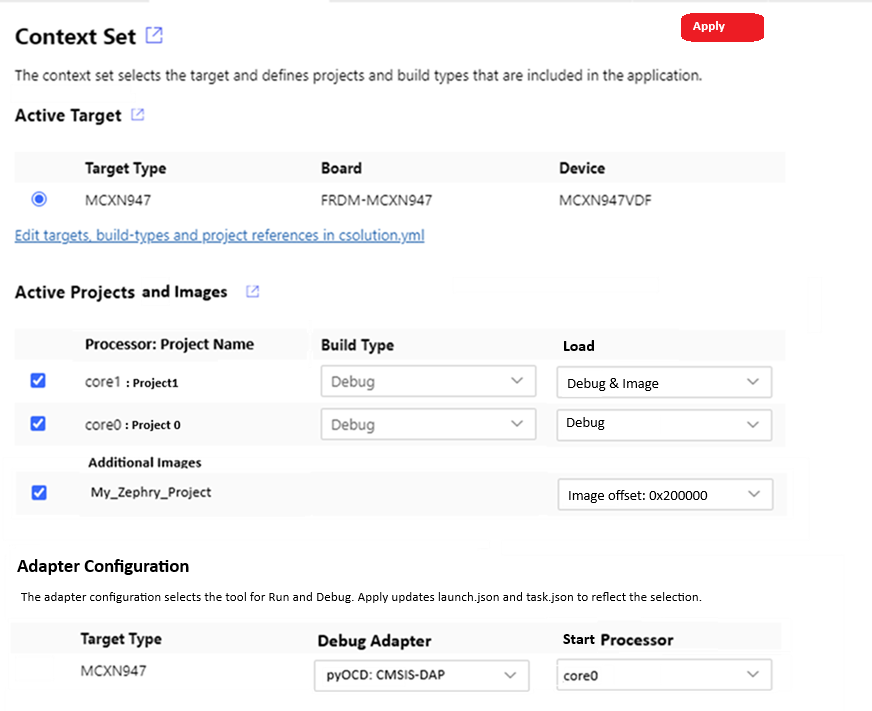

# CMSIS Debugger Integration

<!-- markdownlint-disable MD009 -->
<!-- markdownlint-disable MD013 -->
<!-- markdownlint-disable MD036 -->
<!-- markdownlint-disable MD032 -->

This document summarizes how to integrate the CMSIS-Debugger and pyOCD into the workflows.

ToDo: extend cbuild-set.yml, review debugger: 

## Overview

The diagram below shows how the VS Code Debugger uses the GDB server ports of a multi-processor system. The SoC is in this case a heterogenous processor system with one Cortex-A running Linux and a dual-core Cortex-M system. Using a debug adapter with GDB server (for the Cortex-M part exemplified with pyOCD and CMSIS-DAP), the connection to each core is represented by one GDB Port. The GDB server that is part of Linux offers another GDB Port.

For trace capturing, a separate Trace Port is used. The information may be streamed to data files for analysis.


The integration in VS Code works via:
- [Arm CMSIS Solution](https://marketplace.visualstudio.com/items?itemName=Arm.cmsis-csolution) extension for project management.
- [Arm CMSIS Debugger](https://marketplace.visualstudio.com/items?itemName=Arm.vscode-cmsis-debugger) for bare metal targets connected a debug adapter with GDB server (pyOCD with CMSIS-DAP or ST-Link, JLINK GDB Server, etc.).
- [Microsoft C/C++](https://marketplace.visualstudio.com/items?itemName=ms-vscode.cpptools) extension for Linux user space or application debugging.

The CMSIS View offers for the bare metal targets action buttons to:
- **Load & Run** a *csolution* application which downloads and starts the image in the target.
- **Load & Debug** a *csolution* application which downloads the image and starts the debugger.
- **Context Set** allows to select the target, projects, and debug adapter to use.

Depending on the debug adapter the action button:
- **Load & Run** starts the GDB server or executes the tasks.json command `CMSIS Run`.
- **Load & Debug** starts the GDB server or executes the tasks.json command `CMSIS Debug`.

tbd: how is the GDB server identified in launch.json.  Could be via `cmsis:` node.

## Context-Set

The Context Set dialog is extended as shown below.



### Changes

- **Apply** makes the dialog stateful (similar to new Components/Packs dialog). It triggers the update of `launch.json` and `tasks.json`.

### Active Projects and Images

- **Processor:** is only shown for projects that contain a `pname` selection.
    - `cbuild-idx.yml` and `cbuild.yml` should be extended with `pname:` information.
  
- **Run and Debug** allows to select how the project is used (setting is in `cbuild-set.yml` file)
    - `Debug & Image` (default) debug adapter loads debug (DWARF) information and project output image.
    - `Debug` debug adapter loads only debug (DWARF) information.
    - `Image` debug adapter loads only project output image.
    - Offset can be specified in the `cproject.yml` file or for images in the `csolution.yml` file. It is shown when specified (but cannot be modified)
    - **Additional Images** shows additional image files that are specified in `csolution.yml` using [`load:`](YML-Input-Format.md#load).

### Adapter Configuration

The list allows to select the tool to use for debug and run for each target in the csolution project. When the default adapter is changed, this selection is stored in the *.csolution.yml* file as it is also valid for command line usage of pyOCD.

- **Target Type** lists all target types of the csolution.
- **Debug Adapter** is a selection from `adapters.yml` (see below).  If cbuild-xxx.yml contains a debugger name, this debugger is the pre-selected (default).
- **Start Processor** is only shown for projects that contain a `pname` selection. The choosen `pname:` is the primary processor of the system. Default is `pname' of the first project.

#### launch.json and tasks.json update process

The `arm.cmsis-csolution-xxx` directory (where the VS Code CMSIS Solution extension is stored) gets a sub-directory with the name `.\adapters`.  This directory contain a file `adapters.yml` along with template files for updating `launch.json` and `tasks.json`.  It defines the configuration for the CMSIS-View `Run` and `Debug` button and specifies the templates that are used to inject content in the related files.

- The file `./.vscode/launch.json` is updated for VS Code Debugger (replaced are sections with same type).
- The file `./.vscode/tasks.json` is updated external debuggers / tools.

**Potential `adapters.yml` content**

```yml
adapters:
  name: "pyOCD: CMSIS-DAP"
  short: pyOCD                              # short name
  template: pyOCD-CMSIS-DAP.adapter.json    # template file

  name: "JLink Server"
  short: JLink                              # short name
  template: jlink.adapter.json              # template file

  name: "AVH-FVP"
  short: "FVP"
  template: FVP.adapter.json                # template file

  name: "Keil uVision"
  short: uVision
  template: uVision.adapter.json            # template file
```

Initially, only the features required for "pyOCD: CMSIS-DAP" could be implemented.

**Template file proposal for `pyOCD-CMSIS-DAP.adapter.json`**

`%<symbol>` strings are replaced with values when updating `launch.json` or `tasks.json`.

- `%port` is the port number (port-default is initial value).
- `%port-next` is incremented before each use, and configures the various processors.
- `%image-debug` the elf file of the project. Resolves to `<empty>` when "Debug" is inactive in Context Set.
- `%image-load` the file that should be loaded (for AC6 the HEX file, other compilers ELF file). Resolves to `<empty>` when "Load" is inactive in Context Set.
- `%adapter-short` the short name of the adapter.
- `%target-pname` the pname of the processor.
- `%active-target` is the target-type name of the active target selected in Context Set view.

If more than one *.cproject.yml* is assigned, `%image-debug` and `%image-load` results in a comma-separated file list. For multi-core systems the file list is also `pname:` specific.

- The section `singlecore:` is used for systems that do not use `pname:` specifiers.
- The section `multicore-xxx:` is used for systems that use `pname:` specifiers.

```json
    "port-default:"  3333     // start value for port (if not specified otherwise)

    "launch:"                 // section for launch.json
        {
       "singlecore":          // for single core systems
            {
                "name": "GDB %adapter-short"
                "cmsis": {
                    "updateConfiguration": auto     // without auto, this section would be not touched.
                    "cbuildRunFile": %{cmsis-csolution.getCbuildRunFile}
                    "target-type": %active-target
                }
                "type": "gdbtarget",
                "request": "launch",
                "cwd": "${workspaceFolder}",
                "program": %image-debug
                "gdb": "arm-none-eabi-gdb",
                "initCommands": [
                    "load %image-load"
                    "tbreak main"
                ],
                "target": {
                "server": "pyocd",
                "port": %port
                },
            }, 
            {                                       // might require also attach section
                "name": "GDB %adapter-short"
                "cmsis": {
                    "updateConfiguration": auto     // without auto, this section would be not touched.
                    "cbuildRunFile": %{cmsis-csolution.getCbuildRunFile}
                    "target-type": %active-target
                }
                "type": "gdbtarget",
                "request": "attach",
                "cwd": "${workspaceFolder}",
                "program": %image-debug
                "gdb": "arm-none-eabi-gdb",
                "target": {
                "server": "pyocd",
                "port": %port
                },
            }

        "multicore-start":        // for start processor in multi-core systems
            {
                "name": "%target-pname %adapter-short"
                "type": "gdbtarget",
                "request": "launch",
                "cwd": "${workspaceFolder}",
                "program": %image-debug
                "gdb": "arm-none-eabi-gdb",
                "initCommands": [
                    "load %image-laod"
                    "tbreak main"
                ],
                "target": {
                    "server": "pyocd",
                    "port": %port
                },
                "cmsis": {
                    "cbuildRunFile": %{cmsis-csolution.getCbuildRunFile}
                    "pname:" %target-pname
                }
            }
    
        "multicore-other:"    // added multiple times for each processors (that is not start) in multi-core systems
                "name": "%target-pname %adapter-short"
                "type": "gdbtarget",
                "request": "attach",
                "cwd": "${workspaceFolder}",
                "program": %image-load
                "gdb": "arm-none-eabi-gdb",
                "initCommands": [
                ],
                "target": {
                    "server": "pyocd",
                    "port": %port-next
                },
                "cmsis": {
                    "pname:" %target-pname
                }
            }
        }
    
    "tasks:"                  // section to update tasks.json
       ...                    
```

With the `Apply` button, the files `tasks.json` and `launch.json` are updated. Based on the *csolution project* it results in a singlecore or multicore configuration.

**launch.json: Example for multicore:**

```json
    "configurations": [
        {
            "name": "Core 0 (launch - pyOCD)",
            "type": "gdbtarget",
            "request": "attach",
            "cwd": "${workspaceFolder}",
            "program": "./out/core0/MCXN947/Debug/core0.axf",
            "gdb": "arm-none-eabi-gdb",
            "initCommands": [
                "load ./out/core0/MCXN947/Debug/core0.hex",
                "tbreak main"
            ],
            "target": {
                "server": "pyocd",
                "port": "3333"
            },
            "cmsis": {
                "cbuildRunFile": "DualCore+MCXN947.cbuild-run.yml",
                "pname:" 
            }
        },
        {
            "name": "Core 1 (attach)",
            "type": "gdbtarget",
            "request": "attach",
            "cwd": "${workspaceFolder}",
            "program": "./out/core1/MCXN947/Debug/core1_image.axf",
            "gdb": "arm-none-eabi-gdb",
            "target": {
                "port": "3334"
            },
            "cmsis": {
                "cbuildRunFile": "DualCore+MCXN947.cbuild-run.yml",
                "pname:" 
            }
        }
    ]
```

## Multi-Workspace

[Problem #156](https://github.com/Open-CMSIS-Pack/vscode-cmsis-debugger/issues/156) describes that `${workspaceFolder}` does not work in multi-workspace configurations.
As Linux App and Cortex-M software development is supported in the same IDE, this issue should be solved.

The proposal here is to replace `${workspaceFolder}` with `${cmsis-csolution.workspaceFolder}` in above scripts.

### New csolution Feature

Command                               | Description
:-------------------------------------|:-----------------------------------------------------
`cmsis-csolution.workspaceFolder`     | Resolves to workspace path of active *csolution project*. Solves [problem #156](https://github.com/Open-CMSIS-Pack/vscode-cmsis-debugger/issues/156)

### Test Environment for Multi-Workspace

- Open [NXP_FRDM-MCXN947 DualCore](https://github.com/Open-CMSIS-Pack/NXP_FRDM-MCXN947_BSP/tree/cmsis-debugger/boards/frdmmcxn947/cmsis/examples/DualCore) - branch "cmsis-debugger"
- Use *File - Add Folder to Workspace() and add https://github.com/Open-CMSIS-Pack/csolution-examples

Using "Select Active Solution from Workspace" allows to select the active solution, but unfortunately does not select the right `/.vscode` folder for `launch.json` and `tasks.json`
