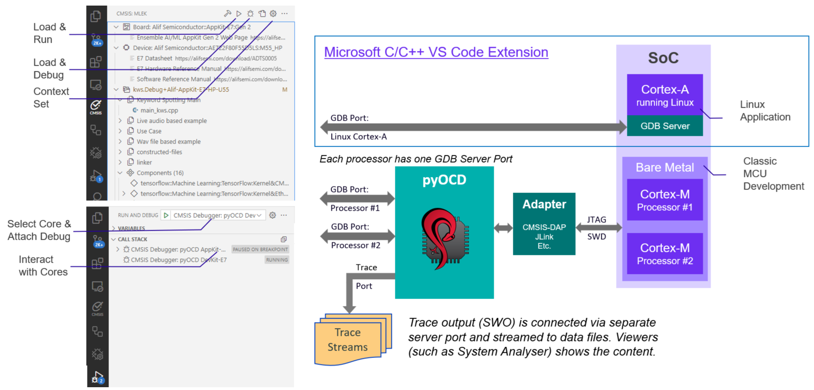
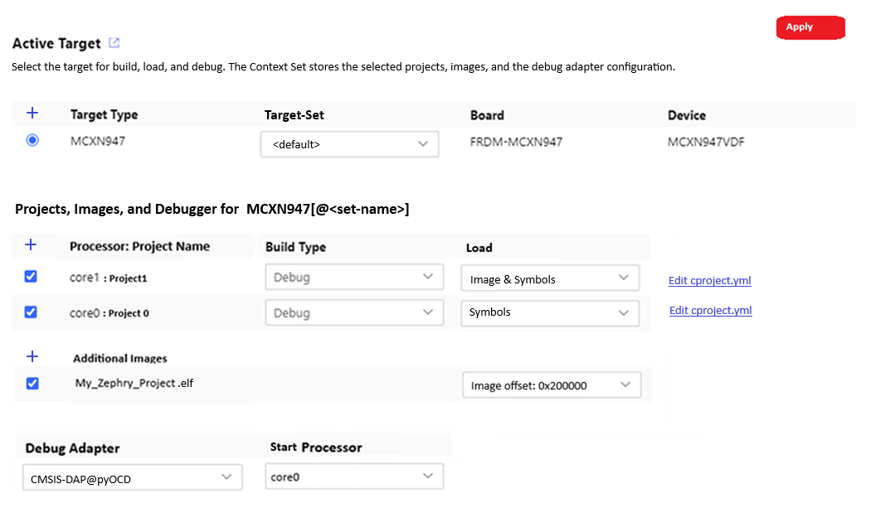

# CMSIS Debugger Integration

<!-- markdownlint-disable MD009 -->
<!-- markdownlint-disable MD013 -->
<!-- markdownlint-disable MD036 -->
<!-- markdownlint-disable MD032 -->

This document summarizes how to integrate the CMSIS-Debugger and pyOCD into the workflows.

## Summary of Proposed Changes

- One or more [context-set configurations](#changes-cmsis-toolbox) are stored in `csolution.yml` for each target.
- [Manage Solution](#manage-solution) dialog allows debugger configuration.
- [launch.json and tasks.json update process](#launchjson-and-tasksjson-update-process) to enable load and run commands.
- [Multi-Workspace](#multi-workspace) command to access the solution workspace.
- [Build Information File Locations](#build-information-file-locations)
- [ToDo's](#todos) is a list of open questions

## Overview

The diagram below shows how the VS Code Debugger uses the GDB server ports of a multi-processor system. The SoC is in this case a heterogenous processor system with one Cortex-A running Linux and a dual-core Cortex-M system. Using a debug adapter with GDB server (for the Cortex-M part exemplified with pyOCD and CMSIS-DAP), the connection to each core is represented by one GDB Port. The GDB server that is part of Linux offers another GDB Port.

For trace capturing, a separate Trace Port is used. The information may be streamed to data files for analysis.



The integration in VS Code works via:
- [Arm CMSIS Solution](https://marketplace.visualstudio.com/items?itemName=Arm.cmsis-csolution) extension for project management.
- [Arm CMSIS Debugger](https://marketplace.visualstudio.com/items?itemName=Arm.vscode-cmsis-debugger) for bare metal targets connected a debug adapter with GDB server (pyOCD with CMSIS-DAP or ST-Link, JLINK GDB Server, etc.).
- [Microsoft C/C++](https://marketplace.visualstudio.com/items?itemName=ms-vscode.cpptools) extension for Linux user space or application debugging.

The CMSIS View offers for the bare metal targets action buttons to:
- **Load & Run** a *csolution* application which downloads and starts the image in the target.
- **Load & Debug** a *csolution* application which downloads the image and starts the debugger.
- **Manage Solution** configures the solution.  For each target, the context set stores the project and debug adapter selection. Multiple context set configuration can be selected.

The action button:
- **Load & Run** executes from tasks.json the command CMSIS Run.
- **Load & Debug** executes from launch.json CMSIS attach or from tasks.json the command CMSIS Debug.

Further commands are available under `...`:
- **Load**
- **Erase**
- **Run**

**Potential implementation:**
The commands in tasks.json create a terminal that starts GDB servers (one instance per core). Use the **Run and Debug View** to attach to a GDB server instance. All instances can be closed by terminating the terminal (Kill Terminal button or with CTRL-C). 

## Changes CMSIS-Toolbox

Multiple `context-set:` for each target can be stored in `*.csolution.yml`.  The file `*.cbuild-set.yml` is in this case no longer required.

```yml
solution:
    :

  target-types:
    - type: MCXN947
      board: FRDM-MCXN947
      device: NXP::MCXN947VDF
      context-set:
        - set:                             // without id, <default> set
          debugger: ST-Link
          images:
          - project-context: core1.Debug
          - project-context: core0.Release
            load: symbols
        - set: production
          images:
          - project-context: core1.Release
          - project-context: core0.Release

    - type: Custom-HW
      device: NXP::MCXN947VDF
      context-set:
        - set:                             // without id, <default> set
          debugger: ULINKplus
          images:
          - project-context: core1.Debug
          - project-context: core0.Release

  build-types:
    - type: Debug
      debug: on
      optimize: debug

    - type: Release
      debug: off
      optimize: balanced

  projects:
    - project: ./cm33_core1/core1.cproject.yml
    - project: ./cm33_core0/core0.cproject.yml
```

The active context set is selected using the cbuild/csolution tool with the option:

```txt
  -a   --active arg       select active context-set: <target-name>[@<context-set>]
```

Note: `-a` option cannot be used in combination with `-s`.  It replaces `-s` over time.

### Default Values

The default value when `context-set:` is missing is:
- first project with first build-type. `load:` image & symbols
- debugger from BSP, if this does not exist CMSIS-DAP@pyOCD

## Manage Solution

The Manage Solution dialog is changed as shown below.  The selection is stored in `csolution.yml`.



### Changes

- **Apply** makes the dialog stateful (similar to new Components/Packs dialog). 

### Projects, Images, and Debugger for Context Set

Allows to choose the projects and images that belong to a context set. 

- **Processor:** is only shown for projects that contain a `pname` selection.
    - `cbuild-idx.yml` and `cbuild.yml` should be extended with `pname:` information.
  
- **Load** allows to select how the project is used (setting is in `cbuild-set.yml` file)
    - `Image & Symbols` (default) debug adapter loads debug (DWARF) information and project output image.
    - `Symbols` debug adapter loads only debug (DWARF) information.
    - `Image` debug adapter loads only project output image.
    - `None` debug adapter does not use the output, however the project is included in build.
    - Offset can be specified in the `cproject.yml` file or for images in the `csolution.yml` file. It is shown when specified (but cannot be modified)
    - **Additional Images** shows additional image files that are specified in `csolution.yml` using [`load:`](YML-Input-Format.md#load).

### Debug Adapter

- **Debug Adapter** is a selection from `adapters.yml` (see below).  If BSP or DFP contains a debugger name, this debugger is the pre-selected (default). Otherwise CMSIS-DAP@pyOCD is the default.
- **Start Processor** is only shown for projects that contain a `pname` selection. The choosen `pname:` is the primary processor of the system. Default is `pname' of the first project.

Over time debug adapter configuration settings may be added.

## launch.json and tasks.json update process

The update process is triggered when a new solution is loaded or the file `*.cbuild-run.yml` is has a new timestamp as files `./.vscode/launch.json` or `./.vscode/tasks.json`. It uses the information of the file `*.cbuild.run.yml`.

The update process only replaces configurations with same `pname` and `target-type` provided that `updateConfiguration: auto` is present 

The `arm.cmsis-csolution-xxx` directory (where the VS Code CMSIS Solution extension is stored) gets a sub-directory with the name `.\adapters`.  This directory contain a file `adapters.yml` along with template files for updating `launch.json` and `tasks.json`.  It defines how to update the configuration for the files `./.vscode/launch.json` and `./.vscode/tasks.json`.\

The file `adapters.yml` is also part of the CMSIS-Toolbox in the `./etc` folder to ensure a consistent list of supported debug adapters.  CMSIS-Toolbox could use fuzzy search for manually created csolution.yml files.

```json
            "cmsis": {
                "pname": cm33_core0
                "target-type": MCXN947 
                "updateConfiguration": auto     // without auto, this section would be not touched.
```

**Potential `adapters.yml` content**

```yml
adapters:
  name: "CMSIS-DAP@pyOCD"
  template: CMSIS-DAP-pyOCD.adapter.json    # template file
  default-port: 3333                        # default value of first gdbserver port

  name: "ST-Link@pyOCD"
  template: STLink-pyOCD.adapter.json       # template file
  default-port: 3333                        # default value of first gdbserver port

  name: "JLink Server"
  template: jlink.adapter.json              # template file

  name: "AVH-FVP"
  template: FVP.adapter.json                # template file

  name: "Keil uVision"
  template: uVision.adapter.json            # template file
```

Initially, only the features required for "pyOCD: CMSIS-DAP" could be implemented.

**Template file proposal for `pyOCD-CMSIS-DAP.adapter.json`**

`%<symbol>` strings are replaced with values from `*.cbuild-run.yml` when updating `launch.json` or `tasks.json`.

- `%adapter-name` the value of `debugger:` `name:`
- `%target-type` the value of `target-type:`.
- `%gdb-port` the value `port:` for the processor core from `gdbserver:` - `core:`
- `%gdb-pname` the value `pname:` of the processor core from `gdbserver:` - `core:`.
- `%symbol-file-list` is the image file list with `Load: symbols` attribute for the processor core with name `%gdb-name`.

If more than one *.cproject.yml* is assigned, `%image-debug` and `%image-load` results in a comma-separated file list. For multi-core systems the file list is also `pname:` specific.

- The section `singlecore:` is used for systems that do not use `pname:` specifiers in `gdbserver:` nodes.
- The section `multicore-start:` is used for the `gdbserver:` `start:` node in systems that use `pname:` specifiers.
- The section `multicore-other:` is used for other `gdbserve:` nodes in systems that use `pname:` specifiers.

```json
    "launch:"                 // section for launch.json
        {
       "singlecore":          // for single core systems
            {
                "name": "%adapter-name"
                "type": "gdbtarget",
                "request": "launch",
                "cwd": "${workspaceFolder}",
                "program": %symbol-file-list
                "gdb": "arm-none-eabi-gdb",
                "preLaunchTask": "CMSIS Program",  // Load is executed via the dedicated task
                "initCommands": [
                    "tbreak main"
                ],
                "target": {
                    "server": "pyocd",
                    "port": %gdb-port
                },
                "cmsis": {
                    "cbuildRunFile": %{cmsis-csolution.getCbuildRunFile}
                    "target-type": %target-type
                    "updateConfiguration": "auto" 
                }

        "multicore-start":        // for start processor in multi-core systems
            {
                "name": "%gdb-pname %adapter-name"
                "type": "gdbtarget",
                "request": "launch",
                "cwd": "${workspaceFolder}",
                "program": %symbol-file-list
                "gdb": "arm-none-eabi-gdb",
                "preLaunchTask": "CMSIS Program",  // Load is executed via the dedicated task
                "initCommands": [
                    "tbreak main"
                ],
                "target": {
                    "server": "pyocd",
                    "port": %gdb-port
                },
                "cmsis": {
                    "cbuildRunFile": %{cmsis-csolution.getCbuildRunFile}
                    "pname:" %gdb-pname
                    "target-type": %target-type
                    "updateConfiguration": "auto" 
                }
            }
    
        "multicore-other:"    // added multiple times for each processors (that is not start) in multi-core systems
                "name": "%gdb-pname %adapter-name"
                "type": "gdbtarget",
                "request": "attach",
                "cwd": "${workspaceFolder}",
                "program": %symbol-file-list
                "gdb": "arm-none-eabi-gdb",
                "initCommands": [
                ],
                "target": {
                    "server": "pyocd",
                    "port": %gdb-port
                },
                "cmsis": {
                    "pname:" %gdb-pname
                    "target-type": %target-type
                    "updateConfiguration": "auto" 
                }
            }
        }
    
    "tasks:" [                       // section to update tasks.json
        {
            "label": "CMSIS Load+Run",
            "type": "shell",
            "command": [
                "pyocd load --no-reset --cbuild-run ${command:cmsis-csolution.getCbuildRunFile}",
                "pyocd gdbserver --reset-run --cbuild-run ${command:cmsis-csolution.getCbuildRunFile}",
            ],
            "problemMatcher": [],
        },
        {
            "label": "CMSIS Load",
            "type": "shell",
            "command": [
                "pyocd load --cbuild-run ${command:cmsis-csolution.getCbuildRunFile}",
            ],
            "problemMatcher": [],
        },
        {
            "label": "CMSIS Erase",
            "type": "shell",
            "command": [
                "pyocd erase --chip --cbuild-run ${command:cmsis-csolution.getCbuildRunFile}",
            ],
            "problemMatcher": [],
        }
    ]
```

Example of `launch.json` updated for multicore configuration.

**launch.json: Example for multicore:**

```json
    "configurations": [
        {
            "name": "cm33_core0 CMSIS-DAP@pyOCD",
            "type": "gdbtarget",
            "request": "launch",
            "cwd": "${workspaceFolder}",
            "program": "./out/core0/MCXN947/Debug/core0.axf",
            "gdb": "arm-none-eabi-gdb",
            "preLaunchTask": "CMSIS Program",  // Load is executed via the dedicated task
            "initCommands": [
                "tbreak main"
            ],
            "target": {
                "server": "pyocd",
                "port": "3333"
            },
            "cmsis": {
                "cbuildRunFile": "%{cmsis-csolution.getCbuildRunFile}",
                "pname": cm33_core0
                "target-type": MCXN947 
                "updateConfiguration": "auto" 
            }
        },
        {
            "name": "cm33_core1 CMSIS-DAP@pyOCD",
            "type": "gdbtarget",
            "request": "attach",
            "cwd": "${workspaceFolder}",
            "program": "./out/core1/MCXN947/Debug/core1_image.axf",
            "gdb": "arm-none-eabi-gdb",
            "target": {
                "port": "3334"
            },
            "cmsis": {
                "pname:" cm33_core1  // only if mapped to "debugger:gdbserver:processors:port", otherwise not provided
                "target-type": MCXN947 
                "updateConfiguration": "auto" 
            }
        }
    ]
```

## Multi-Workspace

[Problem #156](https://github.com/Open-CMSIS-Pack/vscode-cmsis-debugger/issues/156) describes that `${workspaceFolder}` does not work in multi-workspace configurations.
As Linux App and Cortex-M software development is supported in the same IDE, this issue should be solved.

The proposal here is to replace `${workspaceFolder}` with `${cmsis-csolution.workspaceFolder}` in above scripts.

### New csolution Feature

Command                               | Description
:-------------------------------------|:-----------------------------------------------------
`cmsis-csolution.workspaceFolder`     | Resolves to workspace path of active *csolution project*. Solves [problem #156](https://github.com/Open-CMSIS-Pack/vscode-cmsis-debugger/issues/156)

### Test Environment for Multi-Workspace

- Open [NXP_FRDM-MCXN947 DualCore](https://github.com/Open-CMSIS-Pack/NXP_FRDM-MCXN947_BSP/tree/cmsis-debugger/boards/frdmmcxn947/cmsis/examples/DualCore) - branch "cmsis-debugger"
- Use *File - Add Folder to Workspace()* and add https://github.com/Open-CMSIS-Pack/csolution-examples

Using "Select Active Solution from Workspace" allows to select the active solution, but unfortunately does not select the right `/.vscode` folder for `launch.json` and `tasks.json`

## Build Information File Locations

The locations for the build information files should change as follows:

- `*.cbuild-run.yml` relocate to `out\$target-type$`
- `*.cbuild.yml` relocate to `out\$target-type$\$build-type$`

## ToDo's

- How to prevent that tasks.json commands start a GDB server twice?  Executing another Load&Run while the terminal is still running would fail. 
- How is the active solution and active context-set stored in the VS Code environment.
- How are the commands mapped to JLink?  We need here examples.
- How to create launch.json when using CMSIS Run command (with attach instead of launch) - should we just duplicate the sections launch and attach for the time being?
- Can we simplify the `updateConfigruation: auto` to just the first core?
- Do we always update tasks.json with commands that start with `CMSIS`?
- Currently the Linux GDB server must be manually entered.  I believe this is OK, but let's discuss.
- Discuss if we move debugger: configuration in csolution to context-set: section.
- Finalize workaround for GDB AXF file load with gdb (see below)

pyOCD can use two separate calls for Load and Run. This does not require a LOAD command from GDB init commands and  solves the issue with AC6 axf and gdb! The proposal is to use the "CMSIS Program" task as "preLaunchTask" (see below the launch.json example) - this simplifies also pyOCD implementation.