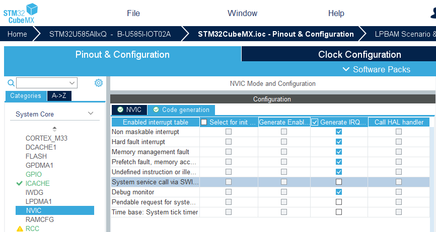

# Configure STM32 Devices with CubeMX

<!-- markdownlint-disable MD009 -->
<!-- markdownlint-disable MD013 -->
<!-- markdownlint-disable MD036 -->

This chapter explains how to use [STM32CubeMX](https://www.st.com/en/development-tools/stm32cubemx.html) with the CMSIS-Toolbox to manage device and board configuration.

!!! Note
    For the CMSIS-Toolbox CubeMX integration, [STM32 packs with generator support](https://github.com/Open-CMSIS-Pack#stm32-packs-with-generator-support) are required. These software packs contain in the release information: **Updated for new CMSIS-Toolbox CubeMX integration**.

## Introduction

[STM32CubeMX](https://www.st.com/en/development-tools/stm32cubemx.html) (CubeMX) is a graphical tool for configuration of an STM32 device or board. CubeMX generates C code for project and peripheral initialization, based on user settings. Depending on the device configuration, related drivers are added to the user application. The CMSIS-Toolbox interacts with CubeMX using the [generic interface for generators](build-operation.md#generator-integration).

The `component: Device:CubeMX` connects a *csolution project* to CubeMX. This component imports the CubeMX generated files for a selected `device:` or `board:` using the [generator import file `*.cgen.yml`](YML-CBuild-Format.md#generator-import-file). This file is similar to a [software layer](build-overview.md#software-layers) but managed by CubeMX and should be not modified directly.

An example project created with CubeMX can be found in [**csolution-examples/CubeMX**](https://github.com/Open-CMSIS-Pack/csolution-examples/tree/main/CubeMX).

!!! Note
    - If a board is specified in the *csolution project*, CubeMX pre-configures the device peripherals with sensible settings for the evaluation board. The user may change these settings using the CubeMX dialogues.
    - If a device is specified, the user needs to configure the peripherals manually using CubeMX dialogues.

## Simple Project

Below is a simple project that just adds the CubeMX-generated components.

!!! Tip
    The packs required for boards and devices are listed on [www.keil.arm.com/boards](https://www.keil.arm.com/boards/) and [www.keil.arm.com/devices](https://www.keil.arm.com/devices/).

**File: `CubeMX.csolution.yml`**

```yml
solution:
  created-for: CMSIS-Toolbox@2.3.0
  description: Simple CubeMX example
  cdefault:                                   # use toolchain default settings
  compiler: AC6                               # select toolchain

# it is recommended to list the pack or packs that define the device or board used in the csolution.yml file
  packs:
    - pack: ARM::CMSIS                        # CMSIS pack is required for most projects
    - pack: Keil::B-U585I-IOT02A_BSP
    - pack: Keil::STM32U5xx_DFP@>=3.0.0-0

  target-types:
    - type: MyBoard                           # My evaluation kit
      board: B-U585I-IOT02A                   # Board name as defined by the pack

  build-types:                                # defines toolchain options for 'debug' and 'release'
    - type: Debug
      debug: on
      optimize: none

    - type: Release
      debug: off
      optimize: balanced

  projects:                                   # list related projects
    - project: ./CubeMX.cproject.yml
```

**File: `CubeMX.cproject.yml`**

```yml
project:
  components:
    - component: CMSIS:CORE                   # CMSIS-Core component is required
    - component: Device:CubeMX                # Component that connects to CubeMX
```

Such a project cannot be directly built, as initially, the `*.cgen.yml` file is missing. It requires to run the CubeMX generator.  Before you start, you may need to [`install missing packs`](build-tools.md#install-missing-packs).

- Identify the required generator and the directory where the generated files are stored with:

```bash
csolution CubeMX.csolution.yml list generators --verbose
CubeMX (Global Registered Generator)    # generator name
  base-dir: STM32CubeMX/MyBoard         # directory for generated files
    context: CubeMX.Debug+MyBoard       # list of context that uses this directory
    context: CubeMX.Release+MyBoard
```

- Use the information above to run the generator:

```bash
csolution CubeMX.csolution.yml run --generator CubeMX --context CubeMX.Debug+MyBoard
```

   This starts CubeMX and passes the information about the selected board, device, and select toolchain. For a project that selects a board, CubeMX imports the default configuration for it. In CubeMX, review and adjust configuration options as required for your application, then just click the button `GENERATE CODE`. The generated files will be stored in the directory `STM32CubeMX/MyBoard`.

- Build the project using this command:

```bash
cbuild CubeMX.csolution.yml --update-rte
```

!!! Note
    You may run the CubeMX generator at any time to change the configuration setting of your device or board.

**Directory with generated files**

CubeMX generates the following content in the generator output directory of the *csolution project*. In our example, the generator output directory is `STM32CubeMX/MyBoard`.

Directory `STM32CubeMX/MyBoard`     | Content
:-----------------------------------|:---------------
`CubeMX.cgen.yml`                   | Generator import file that adds the CubeMX generated files to  the *csolution project*.
`MX_Device/MX_Device.h`             | Header file with configuration settings for CMSIS software components.
`STM32CubeMX/STM32CubeMX.ioc`       | CubeMX native project file that includes settings.
`STM32CubeMX/Src`                   | CubeMX generated application code: `main.c` and STM32 setup code.
`STM32CubeMX/Inc`                   | Header files for CubeMX generated application code.
`STM32CubeMX/EWARM`                 | Project files for IAR; only startup code and linker scripts are used for *csolution projects*.
`STM32CubeMX/STM32CubeIDE`          | Project files for STM32CubeIDE (GCC); only startup code and linker scripts are used for *csolution projects*.
`STM32CubeMX/MDK-ARM`               | Project files for MDK version 5; only startup code and linker scripts are used for *csolution projects*.

!!! Note
    CubeMX generates only the directory for the selected toolchain, which is either `STM32CubeMX/EWARM`, `STM32CubeMX/STM32CubeIDE`, or `STM32CubeMX/MDK-ARM`.

**Content of Generator Import File: `CubeMX.cgen.yml`**

The file `*.cgen.yml` lists the files and settings that are generated by CubeMX and imported in the *csolution project*. The files under `group: CubeMX` may be modified by the user in sections marked with `USER CODE BEGIN` and `USER CODE END` to implement the application-specific features. In the file `*.cproject.yml` additional [user files](YML-Input-Format.md#files) can be added.

```yml
generator-import:
  for-device: STM32U585AIIx
  for-board: B-U585I-IOT02A
  define:
    - USE_FULL_LL_DRIVER
    - USE_HAL_DRIVER
    - STM32U585xx
  add-path:
    - ./STM32CubeMX/Drivers/STM32U5xx_HAL_Driver/Inc
    - ./STM32CubeMX/Drivers/STM32U5xx_HAL_Driver/Inc/Legacy
    - ./STM32CubeMX/Drivers/CMSIS/Device/ST/STM32U5xx/Include
    - ./STM32CubeMX/Inc
    - ./MX_Device/CubeMX
  groups:
    - group: CubeMX
      files:
        - file: ./STM32CubeMX/Src/main.c
        - file: ./STM32CubeMX/Src/stm32u5xx_it.c
        - file: ./STM32CubeMX/Src/stm32u5xx_hal_msp.c
        - file: ./STM32CubeMX/MDK-ARM/startup_stm32u585xx.s
        - file: ./STM32CubeMX/Src/system_stm32u5xx.c
    - group: STM32 HAL Driver
      files:
        - file: ./STM32CubeMX/Drivers/STM32U5xx_HAL_Driver/Src/stm32u5xx_ll_utils.c
        - file: ./STM32CubeMX/Drivers/STM32U5xx_HAL_Driver/Src/stm32u5xx_ll_exti.c
            :
        - file: ./STM32CubeMX/Drivers/STM32U5xx_HAL_Driver/Src/stm32u5xx_hal_pcd_ex.c
        - file: ./STM32CubeMX/Drivers/STM32U5xx_HAL_Driver/Src/stm32u5xx_ll_usb.c
```

## Adding an RTOS

Many applications require an RTOS kernel. By default, CubeMX implements interrupt functions for all Cortex-M exception handlers. However, some exception handlers are typically required for the RTOS kernel execution.

Adding an RTOS kernel requires these steps:

### Step 1: Add RTOS

The example below adds the [CMSIS-RTX](https://github.com/ARM-software/CMSIS-RTX) RTOS kernel to a project.
Other kernels require different components and packs, but the concept is similar.

   **File: `CubeMX.cproject.yml`**

```yml
project:
  packs:
    - pack: ARM::CMSIS-RTX                    # RTOS Software Pack
  groups:
    - group: MyApp
      files:
        - file: MyMain.c
  components:
    - component: CMSIS:CORE                   # CMSIS-Core component is required
    - component: Device:CubeMX                # Component that connects to CubeMX
    - component: CMSIS:RTOS2:Keil RTX5&Source # RTOS component
    - component: CMSIS:OS Tick:SysTick        # OS Tick implementation for RTOS
```

### Step 2: Configure interrupt handlers

Configure the interrupt handlers by running CubeMX with:

```bash
csolution CubeMX.csolution.yml run --generator CubeMX --context CubeMX.Debug+MyBoard
```

Open the dialog *Pinout & Configuration - System Core NVIC - Code generation* and disable *Generate IRQ handler* for:

- System service call via SWI instruction
- Pendable request for system service
- System tick timer



Then click the button `GENERATE CODE` to update the generated files in the directory `STM32CubeMX/MyBoard`

## Linker Script

Usually, STM32CubeMX generates a linker script file that is tightly coupled with the generated startup and system
initialization code. To ensure proper memory layout and application behavior, the generated linker script file must be
used for all toolchains. It serves as a reliable baseline and can be tailored by the user to meet specific application
requirements.

### Adding the linker script manually

If generated, the linker script is available as described in this table:

| Toolchain | Name in STM32CubeMX | Linker script location |
|-----------|---------------------|------------------------|
| Arm Compiler for Embedded (AC6) | MDK-ARM | `./STM32CubeMX/<target_name>/STM32CubeMX/MDK-ARM/<device_name>.sct` |
| IAR Compiler | EWARM | `./STM32CubeMX/<target_name>/STM32CubeMX/EWARM/<device_name>.icf` |
| GCC | STM2CubeIDE/Makefile/CMake | `./STM32CubeMX/<target_name>/STM32CubeMX/<device_name>.ld` |

Add the linker script to your project by referencing it in the `*.cproject.yml` or `*.clayer.yml` file using the
`linker:` node as shown in this example (adapt the `for-compiler` to your needs):

```yml
    linker:
      - script: ./STM32CubeMX/B-U585I-IOT02A/STM32CubeMX/STM32U585AIIX_FLASH.ld
        for-compiler: GCC
```

### Special case for Arm Compiler

For Arm Compiler for Embedded (AC6), linker scripts are only generated for advanced configurations (e.g., when using
the CubeMX Memory Manager). If generated, they must be used as shown above, as they align with the CubeMX-generated
startup/system code.

If no linker script is generated by STM32CubeMX, the default CMSIS-Toolbox linker script can be used, but it requires
manual modification to remove `ARM_LIB_HEAP` and `ARM_LIB_STACK`, which are already defined in the generated startup
file.

- In the `regions_<device>.h` file, remove this code:

```c
// <h> Stack / Heap Configuration
//   <o0> Stack Size (in Bytes) <0x0-0xFFFFFFFF:8>
//   <o1> Heap Size (in Bytes) <0x0-0xFFFFFFFF:8>
#define __STACK_SIZE 0x00000200
#define __HEAP_SIZE 0x00000C00
// </h>
```

- In the project's `ac6_linker_script.sct.src` file, add this at the beginning before the "Stack seal size definition":

```text
/* Stack and Heap are configured in startup file */
#define __STACK_SIZE     0
#define __HEAP_SIZE      0
```

- In the project's `ac6_linker_script.sct.src` file around line 64, guard the `ARM_LIB_STACK` as follows:

```text
#if __STACK_SIZE > 0
  ARM_LIB_STACK (__RAM0_BASE + __RAM0_SIZE - __STACKSEAL_SIZE) EMPTY -__STACK_SIZE {   ; Reserve empty region for stack
  }
#endif
```

## Use CubeMX with Board Layer

A [software layer](build-overview.md#software-layers) is a set of pre-configured software components and source files that can be reused in multiple projects. A board layer typically contains basic I/O drivers and related device and board configuration.

For a board layer, CubeMX can be used to generate device configuration and peripheral drivers. As a board layer uses a separate directory that is independent of a specific *csolution project*, the location of the  STM32CubeMX generated files should be specified using the [`generators:`](YML-Input-Format.md#generators) node in the `<board>.clayer.yml` file. This locates the CubeMX-generated files in the directory structure of the [software layer](build-overview.md#software-layers). As a board layer is used by several projects, the name of the generator import file should also be explicitly specified, as shown below:

```yml
generators:
    options:
    - generator: CubeMX
      path: ./CubeMX              # path relative to the `*.clayer.yml` file
      name: Board                 # generator import file is named `Board.cgen.yml`.
```

This configuration results in the following directory structure:

Directory and Files          | Description
:----------------------------|:---------------------------------------
`<board>.clayer.yml`           | Defines the source files and software components of the board layer.
`CubeMX/`                    | Directory with CubeMX ioc file and other generated files and folders.
`CubeMX/Board.cgen.yml`      | Generator import file that lists CubeMX-generated files and options.
`CubeMX/STM32CubeMX/`        | Directory with CubeMX generated files.
`CubeMX/STM32CubeMX/Drivers/`| Directory with driver-related source files.

Several [STM32 Board Support Packs with Generator Support](https://github.com/Open-CMSIS-Pack) contain board layers that use such a configuration. For examples, the [Nucleo-F756ZG_BSP](https://www.keil.arm.com/packs/nucleo-f756zg_bsp-keil/overview/) or [B-U585I-IOT02A_BSP](https://www.keil.arm.com/packs/b-u585i-iot02a_bsp-keil/overview/).

## TrustZone or Multi-Core Project

Projects that use TrustZone or a multi-core device share the same STM32CubeMX configuration. Therefore, there is just one directory, `STM32CubeMX,` located at the same level as the `*.csolution.yml` project file.

## CubeMX Runtime Context Mapping

Some devices, for example the STM32H7S series, provide in CubeMX *runtime contexts*, for example: `Boot`, `Appli`, `ExtMemLoader`. To map the *csolution* project context to these CubeMX *runtime contexts* it is required for this type of devices to use `map:` key in the `generator`: option, as shown below.

The STM32H7S series uses the following CubeMX run-time names:

- `Boot` for the boot loader.
- `Appli` for the user application program.
- `ExtMemLoader` for the part that is in external memory.

The `generators:` node is used to map a `*.cproject.yml` or `*.clayer.yml` file to a CubeMX run-time context as shown below.

```yml
generators:
    options:
    - generator: CubeMX
      map: Appli            # map project or layer to CubeMX runtime context
```

## Migration to CMSIS-Toolbox CubeMX Integration

In previous CubeMX integrations a `*.gpdsc` file is used to import the generator output. The following table compares the CMSIS-Toolbox CubeMX integration (based on `*.cgen.yml` files) with the previous STM32CubeMX integration (based on `*.gpdsc` files).

Comparison                       | CMSIS-Toolbox `*.cgen.yml` Integration           | Previous `*.gdpsc` Integration
:--------------------------------|:-------------------------------------------------|:------------------------------
IDE Support                      | [VS Code](https://marketplace.visualstudio.com/items?itemName=Arm.keil-studio-pack), Keil uVision 5.40 or higher   | Keil uVision, [CMSIS-Pack for Eclipse](https://github.com/ARM-software/cmsis-pack-eclipse)
CLI Tools                        | [CMSIS-Toolbox 2.4.0](installation.md) or higher | n/a
STM32CubeMX project file         | `STM32CubeMX.ioc`                                | `STCubeGenerated.ioc`
STM32CubeMX source location      | `./STM32CubeMX/<target-type/STM32CubeMX/Src`     | `./RTE/Device/<device name>/STCubeGenerated/Src` or `./Board/<board name>/STM32CubeMX/Src`
STM32CubeMX include location     | `./STM32CubeMX/<target-type/STM32CubeMX/Inc`     | `./RTE/Device/<device name>/STCubeGenerated/Inc` or `./Board/<board name>/STM32CubeMX/Inc`
ST Firmware                      | Provided by STM32Cube Firmware Packs           | Provided by STM32*_DFP software pack
CMSIS-Driver                     | Provided by [CMSIS-Driver_STM32](https://github.com/Open-CMSIS-Pack/CMSIS-Driver_STM32) software pack     | Provided by STM32*_DFP software pack

To migrate existing projects that were using the previous STM32CubeMX integration (based on `*.gpdsc` files), use the following steps:

1. Remove all `component: Keil::Device:xxx` from the `*.cproject.yml` file.
2. Add the `component: Device:CubeMX` to the `*.cproject.yml` file.
3. Use `csolution run *.csolution.yml -g CubeMX` to initialize the directory structure.
4. Replace the file `STM32CubeMX.ioc` with the file `STCubeGenerated.ioc` from the previous project.
5. Copy the source and include files from the previous location, as they may contain user modifications.
6. Use `csolution run *.csolution.yml -g CubeMX` to generate the output from the previous STM32CubeMX project.
7. Update the configuration in STM32CubeMX:
    - In the tab `Project Manager - Project` set *Project Settings - Toolchain/IDE* to match the compiler selection in the csolution project.
    - In the tab `Project Manager - Code Generator` under *STM32Cube MCU packages and embedded software packs* select `Copy only necessary library files`.
    - Click `GENERATE CODE` to complete the migration.

### uVision - Update STM32 DFP Packs

The [Generator Integration](build-operation.md#generator-integration) of the CMSIS-Toolbox is also available with uVision version 5.40 or higher.

New `STM32*_DFP` software packs containing release information **Updated for new CMSIS-Toolbox CubeMX integration** require migration. The steps below describe the migration process of a previous CubeMX configuration.

1. In &micro;Vision open the dialog *Manage - Run-Time Environment*.

2. Remove all components from the `Device` Cclass, as CubeMX now manages the STM32 device firmware.
3. Close *Manage - Run-Time Environment* with *OK*.
4. Open the dialog *Manage - Run-Time Environment* again.
5. Select the component `Device:CubeMX` and start STM32CubeMX with the `play` button.
6. Update the configuration in STM32CubeMX:
    - In the tab `Project Manager - Project`, set *Project Settings - Toolchain/IDE* to `MDK-ARM`.
    - In the tab `Project Manager - Code Generator` under *STM32Cube MCU packages and embedded software packs* select `Copy only necessary library files`.
    - Click `GENERATE CODE` to complete the migration.

**Starting a new project** works similarly with these steps:

1. In uVision use *Project - New uVision Project* and select the STM32 device that you want to use.
   - Optional: *Project - Manage - Project items* tab *Project Info / Layer* allows to select an evaluation board under `Board`.

2. Open the dialog *Manage - Run-Time Environment*.
3. Select the component `Device:CubeMX` and start STM32CubeMX with the `play` button.
4. Create a new device configuration in STM32CubeMX:
    - Follow the instructions of STM32CubeMX and verify settings.
    - In the tab `Project Manager - Project` set *Project Settings - Toolchain/IDE* to `MDK-ARM`.
    - In the tab `Project Manager - Code Generator` under *STM32Cube MCU packages and embedded software packs* select `Copy only necessary library files`.
    - Click `GENERATE CODE` to complete the migration.
