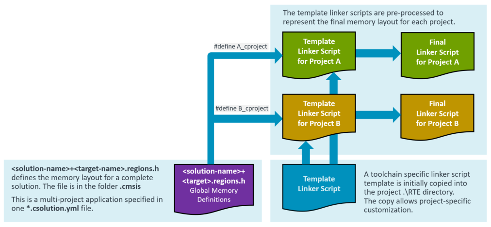

# Experimental Features

<!-- markdownlint-disable MD009 -->
<!-- markdownlint-disable MD013 -->
<!-- markdownlint-disable MD036 -->
<!-- markdownlint-disable MD032 -->

Experimental features are implemented to iterate on new functionality. Experimental features have limited test coverage and the functionality may change in future versions of the CMSIS-Toolbox without further notice.

The CMSIS-Toolbox version 2.7 implements the experimental features for:
- [Resource Management](#resource-management)

Hardening and finalizing of these features is planned for CMSIS-Toolbox version 2.9.

## Resource Management

In a multi-processor or multi-project application, the `target type` describes the target hardware. A solution is a collection of related projects, and the context set defines the projects that are deployed to the target hardware. A project uses a subset of resources (called regions at linker level).

The [linker script management](build-overview.md#linker-script-management) is extended for multi-processor or multi-project applications with the following features:

- When [`resources:`](#resources) node is specified in one of the `*.cproject.yml` or `*.clayer.yml` files of a *csolution project*:
    - The file `.\cmsis\<solution-name>+<target-name>.regions.h` is generated. This file contains the global region settings of a solution for one target type.
    - The file `.\cmsis\<solution-name>+<target-name>.regions.h` replaces the `regions_<device_or_board>.h` that is  located in the directory `./RTE/Device/<device>`. The `regions_<device_or_board>.h` is no longer generated.

- A `define: <project-name>_cproject` is always added to the linker script pre-processor (also when no `resources:` node is used).

The following picture explains the extended linker script management for multi-project applications.



### `resources:`

The `resources:` node specifies the resources required by a project. It is used at the level of `project:`, `setup:`, or `layer:`. The `resources:` node is additive; when multiple `resources:` nodes specify the same region, the size is added.

!!! Note
    In a next iteration, the linker script may be generated by the CMSIS-Toolbox and [features from uVision to allocate source modules to specific regions](https://developer.arm.com/documentation/101407/0541/Creating-Applications/Tips-and-Tricks/File-and-Group-Specific-Options) may get added. Therefore the `resources:` node is forward-looking in the way heap and stack are specified.

```yml
  resources:
    regions:
      - region: __ROM0    # region name pre-defined in script template: __ROM0..3
        size: 0x10000     # specifies region size
#       name: ITCM_Flash  - maps to physical memory name(s), if missing use PDSC default memory
#       address:          - absolution address of region; not in scope for 2.7
#       startup:          - locate startup/vectors to this region; not in scope for 2.7
#       align:            - alignment restrictions of the regions; not in scope for 2.7

      - region: __RAM0    # region name pre-defined in script template: __RAM0..3
        size:  0x8000     # specifies region size
        heap:  0x2000     # heap size (only permitted region __RAM0)
        stack: 0x4000     # stack size (only permitted in region __RAM0)
#       name:             - maps to physical memory name(s), if missing use PDSC default memory
#         - SRAM1
#         - SRAM2
#       address:          - absolution address of region; not in scope for 2.7
#       align:            - alignment restrictions of the regions; not in scope for 2.7
#       sections:         - potentially locate sections (requires linker script generation); not in scope for 2.7
#         - .text.function
```

### Example `<solution-name>+<target-name>.regions.h` file

```c
#ifndef USBD_STM32F746G_DISCO_REGIONS_H
#define USBD_STM32F746G_DISCO_REGIONS_H

// *** DO NOT MODIFY THIS FILE! ***
//
// Generated by csolution 2.7.0 based on packs and csolution project resources
// Device Family Pack (DFP):   Keil::STM32F7xx_DFP@3.0.0
// Board Support Pack (BSP):   Keil::STM32F746G-DISCO_BSP@1.0.0

// Available Physical Memory Resources
// rx ROM:   Name: ITCM_Flash (from DFP)  BASE: 0x00200000  SIZE: 0x00100000
// rx ROM:   Name: Flash (from DFP)       BASE: 0x08000000  SIZE: 0x00100000 (default)
// rwx RAM:  Name: DTCM (from DFP)        BASE: 0x20000000  SIZE: 0x00010000
// rwx RAM:  Name: SRAM1 (from DFP)       BASE: 0x20010000  SIZE: 0x00020000 (default)
// rwx RAM:  Name: SRAM2 (from DFP)       BASE: 0x20030000  SIZE: 0x00020000 (default)
// rwx RAM:  Name: BKP_SRAM (from DFP)    BASE: 0x40024000  SIZE: 0x00001000
// rwx RAM:  Name: ITCM (from DFP)        BASE: 0x00000000  SIZE: 0x00004000

//--------------------------------------
#ifdef A_cproject
// Resources allocated in A.cproject.yml

#define __ROM0_BASE  0x08000000      /* Memory Name: Flash */
#define __ROM0_SIZE  0x00010000

#define __RAM0_BASE  0x20010000      /* Memory Name: SRAM1 */
#define __RAM0_SIZE  0x00008000

#define __STACK_SIZE 0x00004000
#define __HEAP_SIZE  0x00002000

#endif /* A_cproject */

//--------------------------------------
#ifdef B_cproject
// Resources allocated in B.cproject.yml

#define __ROM0_BASE  0x08010000      /* Memory Name: Flash */
#define __ROM0_SIZE  0x00030000

#define __RAM0_BASE  0x20018000      /* Memory Name: SRAM1+SRAM2 */
#define __RAM0_SIZE  0x00020000

#define __STACK_SIZE 0x00000200
#define __HEAP_SIZE  0x00000000

#endif  /* B_cproject */

#endif /* USBD_STM32F746G_DISCO_REGIONS_H */
```

### Question

- Should the `<solution-name>+<target-name>.regions.h` file contain also `#define` symbols for the overall available memory, i.e. for a boot loader?
