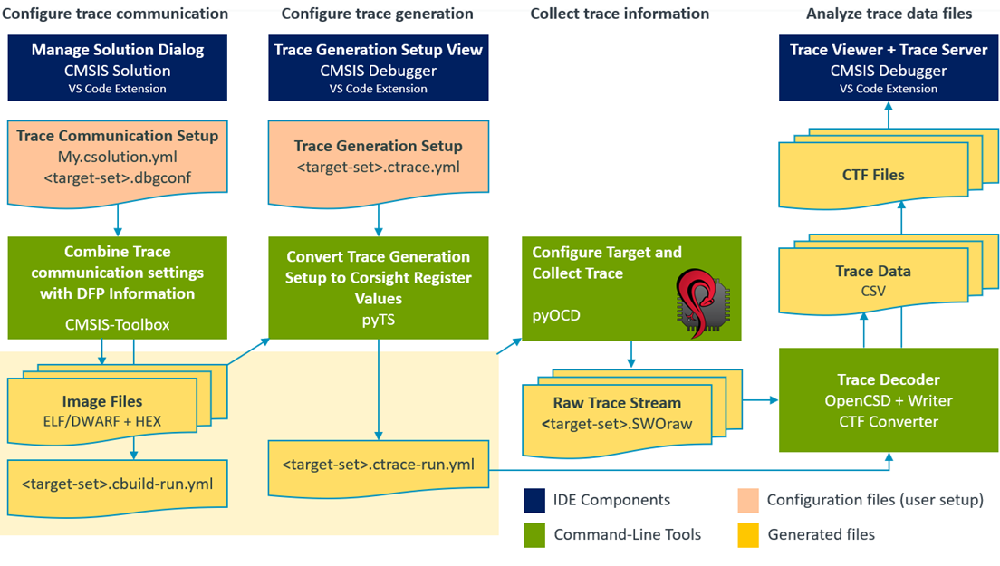
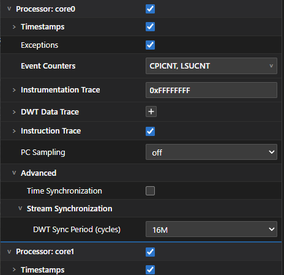

# Experimental Features

<!-- markdownlint-disable MD009 -->
<!-- markdownlint-disable MD013 -->
<!-- markdownlint-disable MD036 -->
<!-- markdownlint-disable MD032 -->

Experimental features are implemented to iterate on new functionality. Experimental features have limited test coverage and the functionality may change in future versions of the CMSIS-Toolbox without further notice.

## Resource Management

The CMSIS-Toolbox version 2.7 implements the experimental features for:
- [Resource Management](#resource-management)

Hardening and finalizing of these features is planned for a later CMSIS-Toolbox version.

In a multi-processor or multi-project application, the `target type` describes the target hardware. A solution is a collection of related projects, and the context set defines the projects that are deployed to the target hardware. A project uses a subset of resources (called regions at linker level).

The [linker script management](build-overview.md#linker-script-management) is extended for multi-processor or multi-project applications with the following features:

- When [`resources:`](#resources) node is specified in one of the `*.cproject.yml` or `*.clayer.yml` files of a *csolution project*:
    - The file `.\cmsis\<solution-name>+<target-name>.regions.h` is generated. This file contains the global region settings of a solution for one target type.
    - The file `.\cmsis\<solution-name>+<target-name>.regions.h` replaces the `regions_<device_or_board>.h` that is  located in the directory `./RTE/Device/<device>`. The `regions_<device_or_board>.h` is no longer generated.

- A `define: <project-name>_cproject` is always added to the linker script pre-processor (also when no `resources:` node is used).

The following picture explains the extended linker script management for multi-project applications.


### `resources:`

The `resources:` node specifies the resources required by a project. It is used at the level of `project:`, `setup:`, or `layer:`. The `resources:` node is additive; when multiple `resources:` nodes specify the same region, the size is added.

!!! Note
    In a next iteration, the linker script may be generated by the CMSIS-Toolbox and [features from uVision to allocate source modules to specific regions](https://developer.arm.com/documentation/101407/0541/Creating-Applications/Tips-and-Tricks/File-and-Group-Specific-Options) may get added. Therefore the `resources:` node is forward-looking in the way heap and stack are specified.

```yml
  resources:
    regions:
      - region: __ROM0    # region name pre-defined in script template: __ROM0..3
        size: 0x10000     # specifies region size
#       name: ITCM_Flash  - maps to physical memory name(s), if missing use PDSC default memory
#       address:          - absolution address of region; not in scope for 2.7
#       startup:          - locate startup/vectors to this region; not in scope for 2.7
#       align:            - alignment restrictions of the regions; not in scope for 2.7

      - region: __RAM0    # region name pre-defined in script template: __RAM0..3
        size:  0x8000     # specifies region size
        heap:  0x2000     # heap size (only permitted region __RAM0)
        stack: 0x4000     # stack size (only permitted in region __RAM0)
#       name:             - maps to physical memory name(s), if missing use PDSC default memory
#         - SRAM1
#         - SRAM2
#       address:          - absolution address of region; not in scope for 2.7
#       align:            - alignment restrictions of the regions; not in scope for 2.7
#       sections:         - potentially locate sections (requires linker script generation); not in scope for 2.7
#         - .text.function
```

### Example `<solution-name>+<target-name>.regions.h` file

```c
#ifndef USBD_STM32F746G_DISCO_REGIONS_H
#define USBD_STM32F746G_DISCO_REGIONS_H

// *** DO NOT MODIFY THIS FILE! ***
//
// Generated by csolution 2.7.0 based on packs and csolution project resources
// Device Family Pack (DFP):   Keil::STM32F7xx_DFP@3.0.0
// Board Support Pack (BSP):   Keil::STM32F746G-DISCO_BSP@1.0.0

// Available Physical Memory Resources
// rx ROM:   Name: ITCM_Flash (from DFP)  BASE: 0x00200000  SIZE: 0x00100000
// rx ROM:   Name: Flash (from DFP)       BASE: 0x08000000  SIZE: 0x00100000 (default)
// rwx RAM:  Name: DTCM (from DFP)        BASE: 0x20000000  SIZE: 0x00010000
// rwx RAM:  Name: SRAM1 (from DFP)       BASE: 0x20010000  SIZE: 0x00020000 (default)
// rwx RAM:  Name: SRAM2 (from DFP)       BASE: 0x20030000  SIZE: 0x00020000 (default)
// rwx RAM:  Name: BKP_SRAM (from DFP)    BASE: 0x40024000  SIZE: 0x00001000
// rwx RAM:  Name: ITCM (from DFP)        BASE: 0x00000000  SIZE: 0x00004000

//--------------------------------------
#ifdef A_cproject
// Resources allocated in A.cproject.yml

#define __ROM0_BASE  0x08000000      /* Memory Name: Flash */
#define __ROM0_SIZE  0x00010000

#define __RAM0_BASE  0x20010000      /* Memory Name: SRAM1 */
#define __RAM0_SIZE  0x00008000

#define __STACK_SIZE 0x00004000
#define __HEAP_SIZE  0x00002000

#endif /* A_cproject */

//--------------------------------------
#ifdef B_cproject
// Resources allocated in B.cproject.yml

#define __ROM0_BASE  0x08010000      /* Memory Name: Flash */
#define __ROM0_SIZE  0x00030000

#define __RAM0_BASE  0x20018000      /* Memory Name: SRAM1+SRAM2 */
#define __RAM0_SIZE  0x00020000

#define __STACK_SIZE 0x00000200
#define __HEAP_SIZE  0x00000000

#endif  /* B_cproject */

#endif /* USBD_STM32F746G_DISCO_REGIONS_H */
```

### Question

- Should the `<solution-name>+<target-name>.regions.h` file contain also `#define` symbols for the overall available memory, i.e. for a boot loader?

## Server Mode

The `csolution` tool supports the command line argument `rpc` to initiate a server mode. With this mode [rpc commands](https://github.com/Open-CMSIS-Pack/csolution-rpc/blob/main/api/csolution-openapi.yml) can be initiated. The first set of commands will be used by the VS Code CMSIS Solution extension to select components and packs for projects and layers.

Refer to [github.com/Open-CMSIS-Pack/csolution-rpc](https://github.com/Open-CMSIS-Pack/csolution-rpc) for more information.

## Zephyr Module Export

This is work in progress and the intended usage is initially for ML models generated for ExecuTorch. However the concept is flexible enough so that it can extend to other software components. 

The CMSIS-Toolbox 2.14 allows to export a software layer (defined in `*.clayer.yml`) into a Zephyr module so that software delivered as CMSIS-Packs can be integrated in Zephyr builds.

A layer is converted to a Zephyr module with the standard Zephyr entry points:

- `zephyr/module.yml` to declare the module and connect it to CMake/Kconfig integration.
- `Kconfig` options that expose the available CMSIS-Pack components and allow enabling/disabling them via `CONFIG_...` defines.
- `CMakeLists.txt` / `sources.cmake` that map the selected CMSIS-Pack sources and include paths into the Zephyr build.
- Generated compatibility headers (for example `RTE_Components.h` / `Pre_Include_Global.h`) to bridge CMSIS component configuration into the consuming build.

The exported module can then be consumed by a Zephyr application by adding the module path to `ZEPHYR_EXTRA_MODULES` (or through a west manifest) and enabling the desired `CONFIG_...` symbols in `prj.conf`.

Example: the [cmsis-to-zephyr-concept `ml_inference` example](https://github.com/brondani/cmsis-to-zephyr-concept/tree/main/ml_inference) shows a minimal end-to-end flow: exporting a layer as a Zephyr module and consuming it from a Zephyr application.

## Trace

Target execution data is captured through trace stream channels. The overall process has these steps:

1. Configure trace communication (how trace leaves the MCU) with the `target-set:` in `*.csolution.yml` (and optional settings in `*.dbgconf`).
2. Configure trace generation (what the MCU produces: ITM, DWT, etc.) with the `*.ctrace.yml` file.
3. Collect trace information (debugger receives and records the stream) into raw data files.
4. Analyze trace data files (host tools interpret the collected raw trace data files) and generate CSV and CTF files.

This section uses `<solution-set>` as the combined name of the `solution`, `target-type`, and `target-set` name, for example `SDS+AppKit-E8@HIL`.

!!! Note
    - Trace does not include SEGGER RTT, SystemView, or STDIO UART output. These features use separate data output paths.

### Trace Stream Channels

The trace stream channels are configured using the [`trace:`](pyOCD-Debugger.md#trace) node in `target-set:` of the `*.csolution.yml` project file. The following trace stream `<channels>` may be used:

`<channel>`   | Description
:-------------|:------------------------
SWO           | Serial-Wire Output: one-pin interface that sends trace information using [UART](pyOCD-Debugger.md#swo-uart) or Manchester mode (tbd).
TB            | [Embedded Trace Buffer or Micro Trace Buffer](pyOCD-Debugger.md#trace-buffer) that stores trace information in memory. 
ER            | Event Recorder: uses code annotations that store program events in memory.

### Directory and File Structure

Trace-related files are stored relative to the directory that contains the `*.csolution.yml` file.

Directory or File                      | Created by                | Description
:--------------------------------------|:--------------------------|:------------------------------------
`.`                                    | User                      | Contains the `*.csolution.yml` project file.
`.cmsis/<solution-set>.ctrace.yml`     | CMSIS-Debugger            | User trace intent and "solution-set specific" trace capture configuration.
`.trace/<solution-set>.ctrace-run.yml` | [pyTS](#pyts-utility)     | Generated trace run information, including resolved symbols and register values.
`.trace/<solution-set>.<channel>.raw`  | pyOCD                     | Raw trace data files, specific to a `<channel>` (`SWO`, `TB`, or `ER`).
`.trace/<solution-set>.<channel>.csv`  | [ctrace](#ctrace-utility) | CSV files that represent raw trace data files.
`.trace/<solution-set>.ctf/`           | [ctrace](#ctrace-utility) | Directory for CTF files such as `metadata`, `stream_0`, and `stream_1`.

The file `.cmsis/<solution-set>.ctrace.yml` configures the trace generation. It is created or updated by the user interface of the CMSIS-Debugger Trace View.

The [`pyTS`](#pyts-utility) utility resolves symbol-based settings in `*.ctrace.yml` against the ELF/DWARF information of the active `<solution-set>` and generates the register setup for the hardware configuration. The output is the file `.trace/<solution-set>.ctrace-run.yml` which is used by the debugger for register setup in target hardware. During trace analysis the information of this file connects the raw trace data back to the `*.ctrace.yml` configuration.

Raw trace streams are stored as binary files, for example `.trace/<solution-set>.SWO.raw`. The [`ctrace`](#ctrace-utility) utility converts raw trace data files into [CSV](#csv-format) and [CTF](#ctf-format) for viewers and analysis tools.

### Name Conventions

#### Location

Locations can be symbols or numeric addresses. An additional project or path to an image file may be specified.

Location Form                         | Description
:-------------------------------------|:------------------------------------
`symbol`                              | Finds matching symbols in all available symbol files.
`"sourcefile"::symbol`                | Finds matching symbols in a source file across all available symbol files.
`project\|symbol`                     | Finds matching symbols in symbol files from a specific project.
`project\|"sourcefile"::symbol`       | Finds matching symbols in a source file from a specific project.
`file-path\|symbol`                   | Finds matching symbols in symbol files from a specific image file.
`file-path\|"sourcefile"::symbol`     | Finds matching symbols in a source file from a specific image file.

ToDo: examples

#### References

References identify a node in the `ctrace.yml` that generated information in `ctrace-run.yml`. These nodes are used for diagnostics and for linking trace analysis results back to the trace setup.

**Examples:**

```yml
ctrace-ref: <pname>/data#2        # refers to pname section, `data:` node, list node #2
ctrace-ref: data#2                # `data:` node, list node #2
ctrace-ref: instruction:start#0   # `instruction:` node, `start:` node, list node #0
```

### Tools and Extensions

The trace workflow is split across the command-line tools and VS Code extensions as shown below.



Tool or Extension              | Input                                         | Output                         | Description
:------------------------------|:----------------------------------------------|:-------------------------------|:------------------------------------
[Arm CMSIS Solution](https://marketplace.visualstudio.com/items?itemName=Arm.cmsis-csolution) | `*.csolution.yml`, optional `.cmsis/*.dbgconf` | `*.cbuild-run.yml` | Generates the run and debug information consumed by debuggers.
[Arm CMSIS Debugger](https://marketplace.visualstudio.com/items?itemName=Arm.vscode-cmsis-debugger)<br/>Trace Generation Setup View | `.cmsis/*.ctrace.yml` | Updated `.cmsis/*.ctrace.yml` | Configures trace capture.
[pyTS](#pyts-utility)          | `.cmsis/*.ctrace.yml`, ELF/DWARF symbols       | `.trace/*.ctrace-run.yml`      | Resolves symbols and generates CoreSight trace register values.
[pyOCD](pyOCD-Debugger.md)     | `*.cbuild-run.yml`, `.trace/*.ctrace-run.yml`  | Raw trace data files in `.trace/` | Programs trace registers and captures trace streams during the debug session.
[`ctrace`](#ctrace-utility)    | Raw trace data files, `.trace/*.ctrace-run.yml` | CSV, CTF files, Trace Compass XML Analysis file | Generates CSV files (human readable) and CTF files
[Trace Viewer for VS Code](https://marketplace.visualstudio.com/items?itemName=eclipse-cdt.vscode-trace-extension) and<br/> [VS Code Trace Server](https://marketplace.visualstudio.com/items?itemName=eclipse-cdt.vscode-trace-server) | CTF files, Trace Compass XML Analysis file | Trace viewer panes | Visualizes the CTF output in VS Code.

**Interactive Debug Workflow:**

It is possible to change the **Trace Generation Setup** during debugging. For this workflow:

- pyTS generates a new `*.ctrace-run.yml` file.
- pyOCD reloads this `*.ctrace-run.yml` file and deletes existing **Raw Trace Stream** files when changes are detected and a new trace collection is started.

**CI Workflow:**

CI requires a prepared `.cmsis/<solution-set>.ctrace.yml` file. This file may be under source control or maintained manually.

### Configuration Files

Trace setup is split between target infrastructure configuration and capture configuration.

Configuration File             | Description
:------------------------------|:------------------------------------
`*.csolution.yml`              | Selects the solution-set and debug adapter. It may also reference solution-set specific debugger configuration files.
`.cmsis/*.dbgconf`             | Optional solution-set specific debugger configuration, for example trace clock, trace pins, ETB setup, and related hardware setup.
`.cmsis/<solution-set>.ctrace.yml` | User trace generation setup. This file defines which data, events, ITM channels, PC samples, or instruction trace streams are enabled.
`.trace/<solution-set>.ctrace-run.yml` | Generated trace run configuration. This file contains resolved symbols and ordered register accesses for pyOCD or other debug tools.

The trace run configuration (in `.trace/<solution-set>.ctrace-run.yml`) is written to target trace resources such as `DWT`, `ITM`, `ETM`, `MTB`, or `PMU` registers. The generated register accesses are loaded by pyOCD when the debug session starts. When pyOCD detects an updated `*.ctrace-run.yml` file, it updates the target trace registers and deletes previous raw trace data files.

Based on these settings pyOCD captures raw trace data files in the [directory `.trace`](#directory-and-file-structure). These raw trace data files are converted by the `ctrace` utility.

In a later step, a preprocessing tool may generate `.trace/README.md` with setup instructions and code snippets that can be inserted in the application code.

### File Structure of `*.ctrace.yml`

The `*.ctrace.yml` file starts with the node `ctrace:` and contains the trace capture settings for one solution-set.

!!! Note
    Cortex-M processors and the DWT, ITM, ETM, MTB, and PMU implementations differ in ways that affect the available configuration options. The pyTS tool uses the `*.cbuild-run.yml` file to discover the processor and implemented capabilities and rejects incompatible settings.

`ctrace:`                                               |             | Content
:-------------------------------------------------------|:------------|:------------------------------------
&nbsp;&nbsp;&nbsp; `created-by:`                        |  Optional   | Tool and version that created or last updated the file.
&nbsp;&nbsp;&nbsp; `setup:`                             |  Required   | Setup for each processor.

`setup:`                                                  |             | Content
:---------------------------------------------------------|:------------|:---------------------------------------                                      
`- pname:`                                                |  Optional   | Section applies to a processor name (required for multi-processor systems).
&nbsp;&nbsp;&nbsp; `disable:`                             |  Optional   | When set, this list node is ignored; useful for testing.
&nbsp;&nbsp;&nbsp; [`timestamps:`](#timestamps)           |  Optional   | Enables timestamps in the emitted trace streams.
&nbsp;&nbsp;&nbsp; [`timesync:`](#timesync)               |  Optional   | Enables time synchronization between trace streams.
&nbsp;&nbsp;&nbsp; [`data:`](#data)                       |  Optional   | DWT data trace configuration.
&nbsp;&nbsp;&nbsp; [`exceptions:`](#exceptions)           |  Optional   | DWT exception trace configuration.
&nbsp;&nbsp;&nbsp; [`events:`](#events)                   |  Optional   | DWT or PMU event trace configuration.
&nbsp;&nbsp;&nbsp; [`itm:`](#itm)                         |  Optional   | ITM channel configuration.
&nbsp;&nbsp;&nbsp; [`instructions:`](#instructions)       |  Optional   | ETM or MTB instruction trace configuration.
&nbsp;&nbsp;&nbsp; [`pcsampling:`](#pcsampling)           |  Optional   | DWT PC sampling configuration.
&nbsp;&nbsp;&nbsp; [`synchronization:`](#synchronization) | Optional  | Trace synchronization packet period configuration.
&nbsp;&nbsp;&nbsp; [`tracehalt:`](#tracehalt)             |  Future     | Trace sink or formatter halt trigger configuration.

**Example:**

```yml
ctrace:
  created-by: CMSIS-Debugger v1.4.0
  setup:
    - pname: 
#     disable:    # disables trace without need to remove settings
      timestamps:
        clock: 24000000
      timesync:

      data:
        - location: mysimple

        - location: App|0x20001000
          access: RW
          size: 0x100
          output: PC

        - location: App|"main.c"::sample_counter
          access: R
          output: PC
          match:
            value: 0x00001234
            size: 4

      exceptions:
      events:
        - event: CPICNT
        - event: LSUCNT

      itm:
        enable: 0x0000000F
        privileged: 0x0
```

#### `timestamps:`

When `timestamps:` is present, timestamp generation is enabled in the trace stream. ITM uses local timestamps with a synchronous timestamp source.

`timestamps:`                                            |             | Content
:--------------------------------------------------------|:------------|:------------------------------------
&nbsp;&nbsp;&nbsp; `clock:`                              |  Optional   | Timestamp clock frequency in Hz.
&nbsp;&nbsp;&nbsp; `itm-prescaler:`                      |  Optional   | ITM timestamp prescaler: `1` (default), `4`, `16`, `64`.

The timestamp `clock` typically is the processor clock.

#### `timesync:`

When `timesync:` is present, time synchronization between streams is enabled, for example between ITM and ETM by global timestamps.

#### `data:`

The `data:` node configures DWT data trace. DWT comparator resources are limited and shared with data access breakpoints, trigger conditions, and trace start/stop logic.

`data:`                                                  |             | Content
:--------------------------------------------------------|:------------|:------------------------------------
`- location:`                                            |**Required** | Symbol or numeric address [location](#location) to trace.
&nbsp;&nbsp;&nbsp; `label:`                              |  Optional   | User-defined short label for Trace Compass.
&nbsp;&nbsp;&nbsp; `access:`                             |  Optional   | Access type: `W`, `R`, or `RW`. Default: `W`.
&nbsp;&nbsp;&nbsp; `size:`                               |  Optional   | Number of bytes in the traced range. Default: `sizeof(symbol)`, `4` for numeric addresses.
&nbsp;&nbsp;&nbsp; `output:`                             |  Optional   | Trace output mode (see table below). Default: `value`.
&nbsp;&nbsp;&nbsp; `match:`                              |  Optional   | Value match condition. When present, trace is emitted only for matching accesses.
&nbsp;&nbsp;&nbsp;&nbsp;&nbsp;&nbsp; `value:`            |**Required** | Value to match.
&nbsp;&nbsp;&nbsp;&nbsp;&nbsp;&nbsp; `size:`             |  Optional   | Number of bytes to compare. Allowed values: `1`, `2`, `4`. Default: `4`.

`output:`       | Description
:---------------|:------------------------------------
`value`         | Emits the value of the access.
`offset`        | Emits the address offset. This is useful when tracing an address range.
`PC`            | Emits the PC value that caused the access.
`match`         | Emits only the comparator ID of a match. This requires Armv8-M and saves trace bandwidth.
`PC+value`      | Emits PC and value.
`offset+value`  | Emits address offset and value.
`PC+offset`     | Emits PC and address offset. This requires Armv8-M.

!!! Note
    `size:` values greater than `4` may require two DWT comparators, depending on the DWT architecture. A `match:` condition can also require two DWT comparators.

#### `exceptions:`

The `exceptions:` node enables DWT exception trace. This does not enable ETM exception trace.

#### `events:`

The `events:` node enables DWT or PMU event trace for all processors or for a specific processor.

`events:`                             |             | Content
:-------------------------------------|:------------|:------------------------------------
`- event:`                            |**Required** | Event selector.

Supported DWT event selectors include `CYCCNT`, `CPICNT`, `EXCCNT`, `SLEEPCNT`, `LSUCNT`, and `FOLDCNT`.

**Example:**

```yml
events:
  - event: CPICNT
  - event: FOLDCNT
  - event: LSUCNT
```

#### `itm:`

The `itm:` node enables ITM channels.

`itm:`                                |             | Content
:-------------------------------------|:------------|:------------------------------------
`- enable:`                           |**Required** | ITM channel bit mask.
&nbsp;&nbsp;&nbsp; `privileged:`      |  Optional   | Privileged access only mask by blocks of eight channels. Default: `0`.

Each bit in `enable:` represents one ITM channel.

!!! Note
    ITM channel 0 is often used for `printf` output. This output should be routed to an output window or debug console instead of the trace analysis components.

#### `pcsampling:`

The `pcsampling:` node enables DWT PC sampling.

`pcsampling:`                         |             | Content
:-------------------------------------|:------------|:------------------------------------
`- period:`                           |  Optional   | Sampling period in CPU cycles.

Supported values for `period:` `0` (off), `64`, `128`, `256`, ..., `16384`. Default: `0`.

#### `synchronization:`

The `synchronization:` node specifies the frequency of the DWT synchronization packet.

`synchronization:`                    |             | Content
:-------------------------------------|:------------|:------------------------------------
`- DWT:`                              |**Required** | Frequency `off`, `16M`, `64M`, `256M` processor cycles. Default: `256M`.

**Example:**

```yml
synchronization:
  - DWT: 16M
```

#### `instructions:`

The `instructions:` node is reserved for ETM and MTB instruction trace. It is not required for the initial implementation.

`instructions:`                       |             | Content
:-------------------------------------|:------------|:------------------------------------
&nbsp;&nbsp;&nbsp; `start:`           |  Optional   | Conditions that start instruction trace.
&nbsp;&nbsp;&nbsp; `stop:`            |  Optional   | Conditions that stop instruction trace.

`start:` and `stop:` contain [condition](#conditions) entries. These entries define when instruction trace starts or stops; they do not define trace output.

#### `tracehalt:`

The `tracehalt:` node contains [condition](#conditions) entries that halt a trace sink or formatter by a trace trigger. It affects all trace streams that use the sink. Support to combine two conditions by logic operators may be added in the future.

#### Conditions

The nodes `start:`, `stop:`, and `tracehalt:` may contain a condition list that is logically OR-combined. They have the following form.

`start:`, `stop:`, `tracehalt:`                        |             | Content
:------------------------------------------------------|:------------|:------------------------------------
`- location:`                                          |**Required** | Code symbol, data symbol, or numeric address [location](#location) used as the trace condition.
&nbsp;&nbsp;&nbsp; `access:`                           |  Optional   | Access type: `X`, `R`, `W`, or `RW`.
&nbsp;&nbsp;&nbsp; `size:`                             |  Optional   | Number of bytes in the condition range. Defaults to `sizeof(symbol)` for symbols and `4` for numeric addresses.
&nbsp;&nbsp;&nbsp; `match:`                            |  Optional   | Value match condition for data symbols or numeric addresses.
&nbsp;&nbsp;&nbsp;&nbsp;&nbsp;&nbsp; `value:`          |**Required** | Value to match.
&nbsp;&nbsp;&nbsp;&nbsp;&nbsp;&nbsp; `size:`           |  Optional   | Number of bytes to compare. Allowed values: `1`, `2`, `4`.

The default `access:` is `X` for code symbols and `W` for data symbols or numeric addresses.

### File Structure of `*.ctrace-run.yml`

The `*.ctrace-run.yml` file starts with the node `ctrace-run:`. It is generated from `*.ctrace.yml`, `*.cbuild-run.yml`, and ELF/DWARF symbol information. This file is a generated artifact and should not be edited manually.

`ctrace-run:`                                            |             | Content
:--------------------------------------------------------|:------------|:------------------------------------
&nbsp;&nbsp;&nbsp; `generated-by:`                       |  Optional   | Tool and version that generated the file.
&nbsp;&nbsp;&nbsp; `ctrace-setup:`                       |  Optional   | Copy of [`setup`](#file-structure-of-ctraceyml) node in the `*.ctrace.yml` file.
&nbsp;&nbsp;&nbsp; `ctrace-refs:`                        |**Required** | List of [references](#references) in the `*.ctrace.yml` file.

The `ctrace-setup` node uses the same format as the [`setup`](#file-structure-of-ctraceyml) node in the `*.ctrace.yml` file and preserves the original user input for consumers of the `*.ctrace-run.yml` file. This includes settings that do not resolve to a `ctrace-ref` but are required for higher-level output formats such as CTF. For example the `timestamps:clock` node.

`ctrace-refs:`                                           |             | Content
:--------------------------------------------------------|:------------|:------------------------------------
`- ctrace-ref:`                                          |**Required** | [Reference](#references) to a node in the `*.ctrace.yml` file that generated the register setup.
&nbsp;&nbsp;&nbsp; `type:`                               |**Required** | Trace source type.
&nbsp;&nbsp;&nbsp; `pname:`                              |  Optional   | Processor name the reference resolves to for multi-core systems.
&nbsp;&nbsp;&nbsp; `info:`                               |  Optional   | Additional information (for example alignment extension).
&nbsp;&nbsp;&nbsp; `warning:`                            |  Optional   | Warning message.
&nbsp;&nbsp;&nbsp; `error:`                              |  Optional   | Error message when setup cannot be completed.
&nbsp;&nbsp;&nbsp; `symbol-file:`                        |  Optional   | Absolute path to the symbol file used in this reference.
&nbsp;&nbsp;&nbsp; `symbol-address:`                     |  Optional   | Address of the symbol.
&nbsp;&nbsp;&nbsp; `label:`                              |  Optional   | User-define short label for Trace Compass
&nbsp;&nbsp;&nbsp; `stream:`                             |  Optional   | Stream ID (CoreSight ATB ID).
&nbsp;&nbsp;&nbsp; `source:`                             |  Optional   | Source ID.
&nbsp;&nbsp;&nbsp; `regs:`                               |  Optional   | Register setup.

The trace source types are: `dwt`, `event`, `exception`, `itm`, `pmu`, `overflow`, `pcsample`, `global_ts`.

Multiple `ctrace-ref` entries may reference the same configuration node when it generates setups for multiple streams. The combination of `ctrace-ref` and `stream` identifies each generated setup.

The meaning of `source:` depends on the `type:` as shown below.

`type:`      | Usage of `source:`
:------------|:------------------------------------
`dwt`        | Number or array of allocated DWT comparators.
`itm`        | Number of allocated ITM channel.

`regs:`                                                  |             | Content
:--------------------------------------------------------|:------------|:------------------------------------
`- name:`                                                |**Required** | Symbolic name of the register.
&nbsp;&nbsp;&nbsp; `value:`                              |**Required** | Value to write in this register.
&nbsp;&nbsp;&nbsp; `mask:`                               | Optional    | Bit mask for value write (default: `0xFFFFFFFF`).

**Example:**

```yml
ctrace-run:
  generated-by: pyTS v0.0
  ctrace-refs:
  - ctrace-ref: core0/itm
    pname: core0
    type: itm            # packet types
    symbol-file: <symbol file used>
    symbol-address: address of symbol
    stream: 1            # stream id
    source: 0            # ITM channel #0
    regs:
      - name:  ITM_TER0
        value: 0xFFFFFFFF
      - name:  
        value:

  - ctrace-ref: data#0
    type: dwt
    stream: 1            # stream id
    error: cannot find symbol

  - ctrace-ref: data#1
    type: dwt
    stream: 1            # stream id
    source: [0, 1]       # allocated DWT comparators #0 and #1
    regs:
      - name: DWT_COMP0
        value: 1
        mask:  0xFF
      - name: DWT_COMP1
        value: 2

  - ctrace-ref: core0/timestamps
    type: itm
    pname: core0
    stream: 1
    regs:
      - name: ITM_TCR
        value: 0x00000002
        mask: 0x00000002

  # - ctrace-ref: core0/timestamps
  #   type: etm            # etm not yet supported, for demonstration purposes only
  #   pname: core0
  #   stream: 2
  #   regs:
  #     - name: TRCCONFIGR
  #       value: 0x00000010
  #       mask: 0x00000010
  #     - name: TRCCCCTLR
  #       value: 0x4
```

#### Register Accesses

The `ctrace-run.yml` file contains the register values that are required for trace generation. It does not include enable sequences required by the Arm processor to access these registers. The debugger (pyOCD) has knowledge about architecturally defined trace components (listed in the table below) and therefore generates the right sequences, potentially with timeouts.

Trace Component | Base Address | Description
:---------------|:------------:|:------------------------------------
`ITM`           | `0xE0000000` | Instrumentation Trace Macrocell.
`DWT`           | `0xE0001000` | Data Watchpoint and Trace unit.
`PMU`           | `0xE0003000` | Performance Monitoring Unit.
`ETM`           | `0xE0041000` | Embedded Trace Macrocell.

The `ctrace-ref:` node references the trace generation configuration in the file `*.ctrace.yml` and contains register values that represent the setup for trace sources.
A single-core system has no `pname:` value; a multi-processor always includes a `pname:` value in the `ctrace-ref:` node.

### Initial Implementation

The initial implementation focuses on pyOCD with SWO UART and interactive operation in CMSIS-Debugger.

Subsequent releases may extend this initial solution to:

- Instruction trace using ETM or MTB.
- Event Recorder.
- CI workflow automation.

### Remaining Design Questions

- Cross-trigger functionality will be represented later (potentially in `*.ctrace.yml`)
- What are system wide settings? How are they represented? What trace component is configured with such settings?

### Out-of-Scope

- SEGGER RTT, SystemView, and STDIO UART output are not part of trace capture and use separate output paths.
- ITM channel 0 `printf` output should not be routed to trace analysis components. It should be shown in an output window or debug console.

## Configure Trace Generation

The file [`.cmsis/<solution-set>.ctrace.yml`](#file-structure-of-ctraceyml) is the user-facing configuration file for the trace generation. The CMSIS-Debugger implements a graphical user interface that is shown below. Each processor has a separate configuration section.



The available options in the user interface depend on the Cortex-M processor and on the selected [trace stream channel](#trace-stream-channels) that is used to obtain trace. Depending on the processor implemention, option setting may get rejected at the level of pyTS or pyOCD.

Option                 | M0 | M0+, M23 | M3, M4, M7, M33 | M52, M55 | M85
:----------------------|:--:|:--------:|:---------------:|:--------:|:------:
Timestamps             | -  | -        | yes             | yes      | yes
Exceptions             | -  | -        | yes             | yes      | yes
Event Counters         | -  | -        | yes             | yes      | yes
PMU Event              | -  | -        | no              | yes      | yes
Instrumentation Trace  | -  | -        | yes             | yes      | yes
DWT Data Trace         | -  | -        | 4 comparators   | 8 comparators | 8 comparators
Instruction Trace      | -  | with TB  | with TB         | with TB  | with TB
Start, Stop, Halt      | -  | 2 comparators | 4 comparators | 8 comparators | 8 comparators
PC Sampling            | -  | -        | yes             | yes      | yes
Time Synchronization   | -  | -        | yes             | yes      | yes
Stream Synchronization | -  | -        | yes             | yes      | yes

!!! Note
    - The available Event Counters depend on the Cortex-M processor.
    - M52, M55, M85 use the first 4 DWT comparators for data trace.

## `pyTS` Utility

The `pyTS` utility generates the file `.trace/<solution-set>.ctrace-run.yml`. It performs the following steps:

- Reads the file `<name>.cbuild-run.yml` to provide the solution set, processor names, and ELF output files.
- Converts symbolic names in the file `.cmsis/<solution-set>.ctrace.yml` to physical addresses by using the corresponding ELF output files.
- Uses processor information and implementation details to map the trace generation setup into CoreSight trace register values. See [Processor-Specific Trace Features](#processor-specific-trace-features)
- Rejects incompatible configuration settings with user-oriented messages (`info:`, `warning:`, or `error:`) in the `ctrace-ref:` node of the file `*.ctrace-run.yml`

The final trace generation setup is written to the file `.trace/<solution-set>.ctrace-run.yml`.

This utility will be part of pyOCD.

```txt
Usage:
  pyts <name>.cbuild-run.yml
```

## `ctrace` Utility

The `ctrace` utility reads the raw trace data files in the [directory `.trace`](#directory-and-file-structure). It can check the raw data trace files for consistency or convert the files into CSV and CTF format.

`ctrace` is based on the open source trace decoder [github.com/linaro/opencsd](https://github.com/linaro/opencsd) and adds a CSV and CTF converter. This utility will be part of CMSIS-Toolbox.

```txt
Usage:
  ctrace <trace-dir> [options]

Options:
      --csv                Generate only CSV files (default: generate CSV and CTF)
      --ctf                Generate only CTF files (default: generate CSV and CTF)
  -a  --all                Generate both CSV and CTF files
      --type sel [...]     Filter output for specific packet types (default: all packet types)
      --stream sel [...]   Filter output for specific streams (default: all streams)
  -t, --target arg         Specify <solution-set> (default: process all solution sets in trace-dir)
  -V, --version            Print version
```

`ctrace` processes files in the specified `<trace-dir>`. If this directory contains more than one `<solution-set>`, each solution set is processed separately.
CSV and CTF output files are written to the `<trace-dir>` as explained under [directory and file structure](#directory-and-file-structure).
When no option for generating files is specified, the raw trace data files are validated.

### `--type` option

The `--type` option is applied to the decoded packet type for both CSV and CTF files. Only the specified packet types are contained in the generated files.

Accepted packet types are: `itm`, `dwt`, `event`, `pmu`, `exception`, `pcsample`, `global_ts`, `overflow`, `error`.

**Example:**

Output only the packet types `dwt` and `event` to the generated CSV and CTF files.

```bash
ctrace .trace --all --type dwt event
```

### CSV Format

The CSV output file uses these columns:

Column         | Description
:--------------|:------------------------------------
`cycles`       | Timestamp in CPU clock cycles, if available.
`stream`       | Stream ID (CoreSight ATB ID) of the trace packet. Empty if no formatting.
`type`         | Packet type: `itm`, `dwt`, `event`, `pmu`, `exception`, `pcsample`, `global_ts`, `overflow`, `error`.
`source`       | Source ID: ITM channel, DWT comparator, exception number, or hardware discriminator.
`value`        | Value in hexadecimal form. Payload width is represented by the number of hex digits: 1 byte: `0x00`, 2 bytes: `0x0000`, 4 bytes: `0x00000000`. For packet type `exception` state transition: `0x1` enter, `0x2` exit, `0x3` return.
`pc`           | Program counter for packet types `dwt` and `pcsample` (hexadecimal format, example `0x08001234`).
`offset`       | Data address offset for packet type `dwt` (hexadecimal format, example `0xfdf9`).
`note`         | Additional details, used for error notification.

The following table contains details about the packet type. Information is empty when not provided by the trace packet.

`type`      | Description
:-----------|:------------------------------------
`itm`       | `source` = ITM channel.
`dwt`       | `source` = DWT comparator, `value` = data value, `offset` = data address offset, `pc` = program counter.
`event`     | Reserved for profiling/event-counter rows. Detailed semantics will be specified in a future version.
`pmu`       | Reserved for PMU counter rows. Detailed semantics will be specified in a future version.
`exception` | `source` = exception number. `value` = exception state transition.
`pcsample`  | `pc` = program counter.
`global_ts` | Global timestamp for synchronization between streams.
`overflow`  | Marks an overflow, reason can be an overflow packet or an internal decoder overflow.
`error`     | Decode error, for example unexpected trace byte values. `note` field carries details.

!!! Note
    The timestamp packet type information is provided in the `cycles` column.

**Exception State Transition:**

Value | State    | Meaning
:-----|:---------|:------------------------------------
`0x0` | reserved | Causes a decode error.
`0x1` | `enter`  | The exception became the active processor context.
`0x2` | `exit`   | The exception context was left or completed; consumers usually close that exception lane.
`0x3` | `return` | Execution returned to, or resumed, the named exception context after another exception.

**Example:**

```csv
cycles,stream,type,source,value,pc,offset,note
2518192,,itm,0,0x53,,,
2518404,,itm,0,0x54,,,
2518616,,itm,0,0x4d,,,
949338400,,dwt,2,0xfffffdf9,0x08001234,0xfdf9,
949338400,,dwt,3,0x0000006c,0x08001240,0x006c,
949338400,,dwt,0,0x00,,,
949339000,,pcsample,,,0x08000100,,
949338400,,exception,0,0x3,,,
949338400,,overflow,,,,,
950364820,,exception,11,0x1,,,
950389420,,exception,0,0x3,,,
```

cycles    | stream | type      | source | value      | pc         | offset  | note
:---------|:-------|:----------|:-------|:-----------|:-----------|:--------|:-----
2518192   |        | itm       | 0      | 0x53       |            |         |
2518404   |        | itm       | 0      | 0x54       |            |         |
2518616   |        | itm       | 0      | 0x4d       |            |         |
949338400 |        | dwt       | 2      | 0xfffffdf9 | 0x08001234 | 0xfdf9  |
949338400 |        | dwt       | 3      | 0x0000006c | 0x08001240 | 0x006c  |
949338400 |        | dwt       | 0      | 0x00       |            |         |
949339000 |        | pcsample  |        |            | 0x08000100 |         |
949338400 |        | exception | 0      | 0x3        |            |         |
949338400 |        | overflow  |        |            |            |         |
950364820 |        | exception | 11     | 0x1        |            |         |
950389420 |        | exception | 0      | 0x3        |            |         |

### CTF Format

The generated [Common Trace Format (CTF) v1.8.3](https://diamon.org/ctf/v1.8.3/) is compatible with [Trace Compass](https://eclipse.dev/tracecompass/) and is used by [Trace Viewer for VS Code](https://marketplace.visualstudio.com/items?itemName=eclipse-cdt.vscode-trace-extension). It uses the following files that are generated by `ctrace` in the directory `.trace/<solution-set>.ctf/`.

File           | Description
:--------------|:------------------------
`metadata`     | Metadata information for Trace Compass.
`stream_<n>`   | Trace data stream.

## Processor-Specific Trace Features

TODO: Discard most of the following chapters. Condensed in table further above.

The following information lists the Cortex-M processors and the DWT, ITM, ETM, MTB, and PMU implementation options.

### Processor Trace Capabilities

In the table, the three `ITM/DWT Comps` columns show the number of Data Watchpoint and Trace comparators for each available debug setup; `-` means that setup is not available. `ITM/DWT` means instrumentation, event, PC-sampling, exception, and *data trace* packets generated by the ITM and DWT; a DWT that is present without ITM/DWT trace support is shown as **no trace**. `PMU` means the architectural Performance Monitoring Unit and its event counters. `ETM` and `MTB` provide *instruction trace*; ETM streams trace into a CoreSight trace system, while MTB writes a compact execution trace into system SRAM.

Processor | ITM/DWT Comps *reduced* | ITM/DWT Comps *mid* | ITM/DWT Comps *full* | PMU | ETM | MTB
:---------|:------------------------|:--------------------|:---------------------|:----|:----|:---
Cortex-M0 | `0-2` comps; no trace   | -                   | -                    | -   | -   | -
Cortex-M0+ | `0-2` comps; no trace | - | - | - | - | Optional; start/stop using `TSTART`/`TSTOP` integration inputs or software; integration inputs can be driven by `0-2` MTB_DWT comparators; watermark autostop
Cortex-M1 | `1` comp; no trace | - | - | `2` comps; no trace | - | - 
Cortex-M3 | `1` comp | - | `4` comps | - | Optional ETMv3.4/v3.5 *instruction trace*<br>Up to `4` DWT comparator inputs; `1` reduced-function counter in newer revisions; `2` external inputs; start/stop logic; read-only `ETMSYNCFR` fixed at `1024` | -
Cortex-M4 | `1` comp | - | `4` comps | - | Optional ETMv3.5 *instruction trace*<br>Up to `4` DWT comparator inputs; `1` reduced-function counter; `2` external inputs; start/stop logic; read-only `ETMSYNCFR` fixed at `1024` | -
Cortex-M7 | `2` comps | - | `4` comps | - | Optional ETMv4 *instruction trace* or *instruction and data trace*;<br>*instruction-only* resources: `4` DWT inputs, `1` reduced-function counter, `2` resource-selector pairs, `1` single-shot control, read-only `TRCSYNCPR`;<br>*instruction+data* resources: `4` DWT inputs, `2` counters, `8` resource-selector pairs, `4` address-comparator pairs, `2` data-value comparators, `1` four-state sequencer, read/write `TRCSYNCPR` | -
Cortex-M23 | `2` comps; no trace | - | - | `4` comps; no trace | - | Optional ETMv3.5 *instruction trace*; mutually exclusive with MTB<br>`4` DWT comparator inputs; `1` reduced-function counter; `2` external inputs; start/stop logic; read-only `ETMSYNCFR` fixed at `1024` Optional; mutually exclusive with ETM; start/stop using `2` or `4` DWT inputs, `TSTART`/`TSTOP` inputs, or software; watermark autostop
Cortex-M33 | `2` comps | - | `4` comps | - | Optional ETMv4 *instruction trace*<br>`2` or `4` DWT inputs; `1` reduced-function counter; `2` resource-selector pairs; `1` single-shot control; read-only `TRCSYNCPR` | Optional; start/stop using `2` or `4` DWT inputs, CTI inputs, or software; watermark autostop
Cortex-M52 | `2` comps | `4` comps | `8` comps | Debug-set-dependent | Optional ETMv4.5 *instruction trace*<br>`2`, `4`, or `8` DWT inputs; `1` reduced-function counter; resource selectors; `1` single-shot control; read-only `TRCSYNCPR` | -
Cortex-M55 | `2` comps | `4` comps | `8` comps | Debug-set-dependent | Optional ETMv4.5 *instruction trace*<br>`2`, `4`, or `8` DWT inputs; `1` reduced-function counter; `2` resource-selector pairs; `1` single-shot control; `4` external-input selectors; `2` external outputs; read-only `TRCSYNCPR` | -
Cortex-M85 | `4` comps | - | `8` comps | Debug-set-dependent | Optional ETMv4.5 *instruction trace*<br>`4` or `8` DWT inputs; `1` reduced-function counter; `2` resource-selector pairs; `1` single-shot control; `4` external-input selectors; `2` external outputs; read-only `TRCSYNCPR` | -

## DWT Feature Variants

The DWT comparator count alone does not describe the implemented feature set. Data-value matching normally uses an address comparator together with a value comparator, so enabling it also allocates one or more address comparators. For Armv8-M and Armv8.1-M implementations, comparator capabilities can differ within the same DWT. Software must read each `DWT_FUNCTIONn` before allocating it.

Processor | DWT variants | Cycle counter | Profiling counters | Address and PC matching | Data-value matching | Range matching | DWT trace and trigger features
:---------|:-------------|:--------------|:-------------------|:------------------------|:--------------------|:---------------|:------------------------------
Cortex-M0 | `0-2` comparators | - | - | Watchpoint and debug-event matching | - | `DWT_MASKn` | -
Cortex-M0+ | `0-2` comparators | - | - | Watchpoint and debug-event matching | - | `DWT_MASKn` | Optional MTB_DWT matches can drive the MTB `TSTART` and `TSTOP` integration inputs
Cortex-M1 | *Reduced* `1`; *full* `2` comparators | - | - | Watchpoint and debug-event matching | - | `DWT_MASKn` | -
Cortex-M3 | *Reduced* `1`; *full* `4` comparators | `DWT_CYCCNT` | `5` DWT counters | Watchpoint, PC match, and data-address match | *Reduced*: -; *full*: `COMP1` only, using address comparator references | `DWT_MASKn` | PC, data-address, and data-value trace; cycle, exception, and event trace triggers
Cortex-M4 | *Reduced* `1`; *full* `4` comparators | `DWT_CYCCNT` | `5` DWT counters | Watchpoint, PC match, and data-address match | *Reduced*: -; *full*: `COMP1` only, using address comparator references | `DWT_MASKn` | PC, data-address, and data-value trace; cycle, exception, and event trace triggers
Cortex-M7 | *Reduced* `2`; *full* `4` comparators | `DWT_CYCCNT` | `5` DWT counters | All comparators: watchpoint, PC match, and data-address match; `COMP0`: cycle matching | *Reduced* and *full*: `COMP1` only, using address comparator references | `DWT_MASKn` | All implemented comparators support triggers and, when ITM/DWT trace is included, trace packets
Cortex-M23 | *Reduced* `2`; *full* `4` comparators | - | - | All comparators: watchpoint, instruction-address match, and data-address match | - | *Reduced*: linked `COMP0-1`; *full*: linked `COMP0-1` or `COMP2-3` | Debug and trigger events; no cycle matching or DWT trace packets
Cortex-M33 | *Reduced* `2`; *full* `4` comparators | `DWT_CYCCNT` | `5` DWT counters | All comparators: watchpoint, instruction-address match, and data-address match; `COMP0`: cycle matching; *reduced* `COMP1`, *full* `COMP1` and `COMP3`: linked or limit matching | *Reduced*: `COMP1`; *full*: `COMP1` and `COMP3` | *Reduced*: linked `COMP0-1`; *full*: linked `COMP0-1` or `COMP2-3` | All implemented comparators support triggers and, when ITM is included, trace packets
Cortex-M52 | *Reduced* `2`; *mid* `4`; *full* `8` comparators | `DWT_CYCCNT` | `5` DWT counters | *Reduced* `COMP0-1`, *mid* `COMP0-3`, *full* `COMP0-7`: instruction-address and data-address matching; `COMP0`: cycle matching; *reduced* `COMP1`, *mid* `COMP1` and `COMP3`, *full* `COMP1`, `COMP3`, `COMP5`, and `COMP7`: linking | *Reduced*: `COMP1`; *mid* and *full*: `COMP1` and `COMP3` | *Reduced*: linked `COMP0-1`; *mid*: linked `COMP0-1` or `COMP2-3`; *full*: linked `COMP0-1`, `COMP2-3`, `COMP4-5`, or `COMP6-7` | *Reduced* `COMP0-1` and *mid* `COMP0-3`: watchpoints, triggers, and trace; *full* `COMP0-3`: watchpoints, triggers, and trace; *full* `COMP4-7`: watchpoints and triggers only
Cortex-M55 | *Reduced* `2`; *mid* `4`; *full* `8` comparators | `DWT_CYCCNT` | `5` DWT counters | *Reduced* `COMP0-1`, *mid* `COMP0-3`, *full* `COMP0-7`: instruction-address and data-address matching; `COMP0`: cycle matching; *reduced* `COMP1`, *mid* `COMP1` and `COMP3`, *full* `COMP1`, `COMP3`, `COMP5`, and `COMP7`: linking | *Reduced*: `COMP1`; *mid* and *full*: `COMP1` and `COMP3` | *Reduced*: linked `COMP0-1`; *mid*: linked `COMP0-1` or `COMP2-3`; *full*: linked `COMP0-1`, `COMP2-3`, `COMP4-5`, or `COMP6-7` | *Reduced* `COMP0-1` and *mid* `COMP0-3`: watchpoints, triggers, and trace; *full* `COMP0-3`: watchpoints, triggers, and trace; *full* `COMP4-7`: watchpoints and triggers only
Cortex-M85 | *Reduced* `4`; *full* `8` comparators | `DWT_CYCCNT` | `5` DWT counters | *Reduced* `COMP0-3`, *full* `COMP0-7`: instruction-address and data-address matching; `COMP0`: cycle matching; *reduced* `COMP1` and `COMP3`, *full* `COMP1`, `COMP3`, `COMP5`, and `COMP7`: linking | *Reduced* and *full*: `COMP1` and `COMP3` | *Reduced*: linked `COMP0-1` or `COMP2-3`; *full*: linked `COMP0-1`, `COMP2-3`, `COMP4-5`, or `COMP6-7` | *Reduced* `COMP0-3`: watchpoints, triggers, and trace; *full* `COMP0-3`: watchpoints, triggers, and trace; *full* `COMP4-7`: watchpoints and triggers only

The five DWT profiling counters are `DWT_CPICNT`, `DWT_EXCCNT`, `DWT_SLEEPCNT`, `DWT_LSUCNT`, and `DWT_FOLDCNT`. Their presence is reported by `DWT_CTRL.NOPRFCNT`.

Here, data-value matching means comparing an observed load or store value. It does not by itself imply that the implementation can emit a data-value trace packet; that capability is listed separately in the final column.

### Synchronization

The ETM synchronization range `0`, `256`, ... , `1M` is not generally configurable on the listed Cortex-M processors.

- Cortex-M3, Cortex-M4, and Cortex-M23 ETMv3 implementations use a read-only `ETMSYNCFR` fixed at `1024` trace bytes.
- Cortex-M33, Cortex-M52, Cortex-M55, and Cortex-M85 use a read-only `TRCSYNCPR` fixed at `1024` trace bytes.
- Cortex-M7 instruction-only ETM uses a read-only `TRCSYNCPR` fixed at `1024` trace bytes.
- Cortex-M7 instruction-and-data ETM has a programmable `TRCSYNCPR`. The requested period must use an implemented power-of-two encoding.

Among the listed Arm ETM implementations, an `ETM\<period>` override is therefore configurable only for the Cortex-M7 instruction-and-data ETM. For other implementations, the tool should accept a fixed or default setting and diagnose attempts to override it.

The ETM synchronization unit is **trace bytes**, not processor cycles.

### DWT Synchronization

DWT synchronization is controlled through `DWT_CTRL.SYNCTAP`.

- Architecturally encoded periods are `16M`, `64M`, and `256M` processor cycles.
- All listed Cortex-M DWT implementations that support DWT trace provide a read/write `SYNCTAP` field.
- Processors or debug configurations marked as having no DWT trace cannot emit DWT synchronization packets and do not provide a functional `SYNCTAP` field.
- `SYNCTAP` selects the synchronization period; synchronization packet generation is enabled or disabled through `ITM_TCR.SYNCENA`.
- `DWT\0` should therefore disable DWT synchronization packets through `ITM_TCR.SYNCENA`, not attempt to encode zero in `SYNCTAP`.

For the listed Cortex-M processors, the configuration generator can treat DWT trace support as implying a writable `SYNCTAP`. It must still discover whether DWT trace and the associated ITM are implemented and accessible.

### PC Sampling

DWT PC sampling uses two fields:

- `CYCTAP` selects bit 6 or bit 10 of `CYCCNT`.
- `POSTPRESET` provides a four-bit post-scaler reload value.

The supported periods are the following discrete values:

- `64 * (1..16)` processor cycles.
- `1024 * (1..16)` processor cycles.

PC sampling additionally requires:

- An implemented cycle counter, reported by `DWT_CTRL.NOCYCCNT == 0`.
- PC sampling support in the DWT implementation.
- An enabled cycle counter.
- A trace-capable DWT and ITM implementation.

The schema should validate the discrete supported values rather than accept an arbitrary cycle count.

### DWT Events

The DWT event selectors are not universally available.

- `CYCCNT` requires an implemented cycle counter.
- `CPICNT`, `EXCCNT`, `SLEEPCNT`, `LSUCNT`, and `FOLDCNT` require the DWT profiling counters.
- `DWT_CTRL.NOPRFCNT` reports whether the profiling counters are absent.
- Newer processors can expose PMU events instead of, or in addition to, the legacy DWT profiling counters.

The generator must discover event-counter presence rather than validate events only by processor name.

### DWT Data Trace

DWT comparator functions vary between architectures and implementations.

- Armv7-M DWT implementations generally require comparator pairing for data-value matching.
- Armv8-M adds linked comparator functions and compact match packets.
- The `match` output mode is Armv8-M-specific.
- The `PC+offset` output mode is Armv8-M-specific.
- Address range support, address masks, access sizes, data-value matching, linked comparators, and emitted packet types must be checked for each comparator through `DWT_FUNCTIONn`.
- Some comparator numbers can support fewer functions than other comparators in the same DWT.

A requested range can require:

- One comparator using an address mask.
- Two linked comparators.
- Multiple comparators when the range is not naturally aligned.

A value match can also require more than one comparator. Comparator allocation therefore depends on the DWT architecture, requested function, alignment, and range. The statement that a size greater than four bytes “may require two comparators” is not sufficient as a complete allocation rule.

### Instruction Trace Start and Stop

The generic `start:` and `stop:` condition syntax cannot always map directly to every trace component.

- Cortex-M3, Cortex-M4, and Cortex-M23 ETMv3 implementations and Cortex-M7, Cortex-M33, Cortex-M52, Cortex-M55, and Cortex-M85 ETMv4 implementations use DWT or processor comparator inputs for stateful start/stop control. ETMv4 can additionally use resource selectors for event-based trace filtering; single-shot control is needed only when a transient comparator match must be latched.
- Cortex-M7 instruction-and-data ETM additionally provides local address comparators, data-value comparators, counters, and a sequencer.
- Cortex-M0+ MTB uses `TSTART` and `TSTOP` integration inputs. These can be driven by optional MTB_DWT comparators in an SoC implementation.
- Cortex-M23 and Cortex-M33 MTB implementations can use DWT comparator matches for start and stop control.
- Available start and stop conditions are constrained by DWT comparators shared with watchpoints and data trace.

The requested `X`, `R`, `W`, `RW`, value-match, and range conditions are not supported by every ETM or MTB trigger path. The resolver should report when a condition is syntactically valid but cannot be represented by the selected component.

### Timestamps

ITM local timestamps, ETM timestamp packets, and ETM cycle-count timing are distinct facilities. ETM timestamp packets can carry values derived from a shared system or global timestamp source.

- ITM timestamp prescaler values `1`, `4`, `16`, and `64` are architectural.
- ITM timestamps require ITM and a functioning cycle counter.
- ETM timestamp packets correlate trace with the shared system timestamp domain, while ETM cycle counts report elapsed processor cycles within the instruction trace. The system timestamp generator and its distribution infrastructure are optional.

### ITM Channels

A 32-bit `enable` mask is suitable for the architectural ITM stimulus ports.

### PMU Events

PMU resources depend on the processor and selected debug implementation.

- PMU event counters are wider architectural counters, but PMU overflow trace monitors the lower eight bits of each counter.

### Recommended Documentation and Schema Changes

1. Mark ETM synchronization as fixed for all listed processors except Cortex-M7 instruction-and-data ETM.
2. Define whether an unsupported setting produces an error, warning, fixed-value notice, or nearest-supported-value adjustment.

### Related

- [v8-M Architecture Reference Manual](https://developer.arm.com/documentation/ddi0553/latest/)
    - The Instrumentation Trace Macrocell (B14.1)
    - The Data Watchpoint and Trace unit (B14.2)
    - The Performance Monitors Extension (B15)
    - ITM and DWT Packet Protocol Specification (F1)
- [v7-M Architecture Reference Manual](https://developer.arm.com/documentation/ddi0403/latest/)
    - The Instrumentation Trace Macrocell (C1.7)
    - The Data Watchpoint and Trace unit (C1.8)
    - Debug ITM and DWT Packet Protocol (D4)
- [v6-M Architecture Reference Manual](https://developer.arm.com/documentation/ddi0419/latest/)
    - The Data Watchpoint and Trace Unit (C1.7)

- [Cortex-M55 PMU](https://developer.arm.com/documentation/101051/0101/Performance-Monitoring-Unit-Extension)
- [Cortex-M85 PMU](https://developer.arm.com/documentation/101924/0101/Performance-Monitoring-Unit-Extension)
