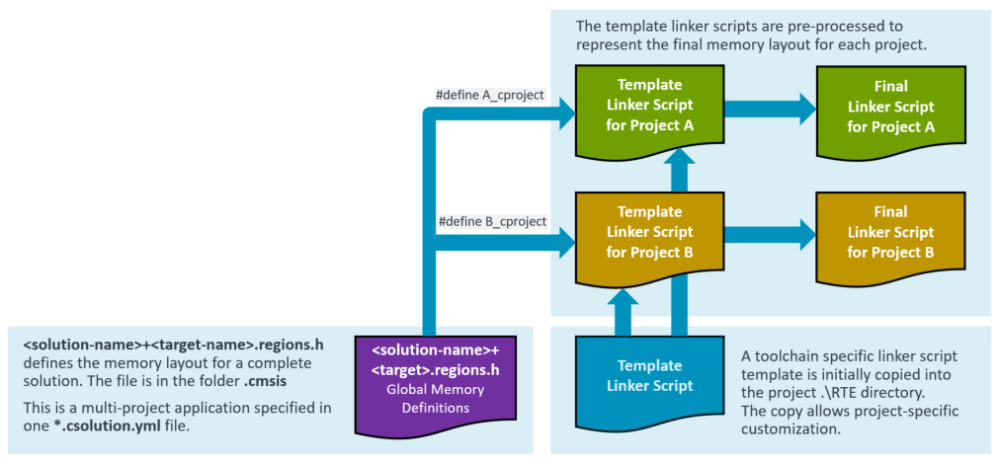

# Experimental Features

<!-- markdownlint-disable MD009 -->
<!-- markdownlint-disable MD013 -->
<!-- markdownlint-disable MD036 -->
<!-- markdownlint-disable MD032 -->

Experimental features are implemented to iterate on new functionality. Experimental features have limited test coverage and the functionality may change in future versions of the CMSIS-Toolbox without further notice.

## MLOps Management

These are proposed features for managing MLOps systems.

These features are designed for systems that contain one or more ML models and optional Ethos-U NPUs. It is assumed that the MLOps system creates **only one ML model at a time** and therefore needs information about which ML model to target and which Ethos-U NPU to use.

The CMSIS-Toolbox allows you to specify parameters for an MLOps system using the `mlops:` node in the `*.csolution.yml` file. When this node is used, the CMSIS-Toolbox generates an additional information file with the extension `*.cbuild-mlops.yml` that contains the parameters for the MLOps system. The `*.cbuild-mlops.yml` file is generated in the same folder as the `*.csolution.yml` file.

The following information is provided in the `*.cbuild-mlops.yml` file:

- Processor type
- NPU type with MAC configuration
- Vela INI file and parameters (only for Ethos-U NPUs)
- Location of the `*.clayer.yml` file that contains the ML model under development
- `cbuild` active target for testing on hardware
- `cbuild` active target for testing on FVP simulation models along with information for FVP invocation

Example:

`*.csolution.yml` input:

```yml
solution:
  description: SDS recorder/player reference example
  created-for: CMSIS-Toolbox@2.12.0
  cdefault:

  mlops:                      # enable *.cbuild-mlops.yml
    description: ML model for detecting Rock/Paper/Scissors images
    npu:
      type: Ethos-U85         # specify NPU (default: first NPU from DFP device features)
      macs: 256               # specify MACs (default: first NPU from DFP device features)
    vela: 
      ini: <file>.ini         # explicit INI file (default: use INI file from DFP)
      system: <selector>      # system configuration from INI file
      memory: <selector>      # memory configuration from INI file
      misc:                   # string with additional options for Vela
    model:
      clayer: $AI-Layer$      # path to layer or variable
      name: <name>            # optional model name (default Algorithm), serves as namespace
    hardware:                 # hardware target for testing
      target-type:            # explicit target-type name (default: first target-type)
      target-set:             # explicit target-set name (default: first target-type, first set)
    simulator:                # simulator target for testing
      target-type:            # explicit target-type name (default: last target-type, check if debugger name: Arm-FVP)
      target-set:             # explicit target-type name (default: last target-type, first set: check if debugger name: Arm-FVP)

    :
  target-types:
    - type: AppKit-E8-U85  # hardware
      device: AE822FA0E5597BS0
      board: AppKit-E8-AIML
      variables:
        - Board-Layer: $SolutionDir()$/Board/AppKit-E8_M55_HP/Board_HP-U85.clayer.yml
        - SDSIO-Layer: $SolutionDir()$/sdsio/usb/sdsio_usb.clayer.yml
        - AI-Layer: $SolutionDir()$/ai_layer/ai_layer.clayer.yml
      target-set:
        - set:
    :
    - type: SSE-320-U85  # Simulator (Cortex-M85 + Ethos-U85)
      board: SSE-320
      device: SSE-320-FVP
      define:
        - SIMULATOR
      variables:
        - Board-Layer: $SolutionDir()$/Board/Corstone-320/Board-U85.clayer.yml
        - SDSIO-Layer: $SolutionDir()$/sdsio/fvp/sdsio_fvp.clayer.yml
        - AI-Layer: $SolutionDir()$/ai_layer/ai_layer.clayer.yml
      target-set:
        - set: FVP-Test
          debugger:
            name: Arm-FVP
            model: FVP_Corstone_SSE-320
            config-file: Board/Corstone-320/fvp_config.txt
```

`*.cbuild-mlops.yml` output (example). Paths are relative to the location of the `*.cbuild-mlops.yml` file (which is in the same directory as the `*.csolution.yml` file).

```yml
cbuild-mlops:
  description:                      # descriptive text from *.csolution.yml mlops section
  processor:
    type: Cortex-M55

  npu:                              # this node is only there for devices with NPU
    type: Ethos-U85
    macs: 256

  vela:                             # this node is only there for devices with NPU type Ethos-U
    ini:  path/file.ini             # relative path and file name of INI file, i.e. ".cmsis/ensemble_vela.ini"
    options:                        # option string, i.e. "--accelerator-config ethos-u85-256 --system-config SYSTEM_CONFIG --memory-mode MEMORY_MODE"

  model:
    clayer: /ai_layer/ai_layer.clayer.yml
    name: Algorithm                 # model name

  hardware:                         # for testing on hardware
    active: AppKit-E8-U85           # target-set name passed to cbuild with option --active, i.e. cbuild my.csolution.yml --active AppKit-E8-U85
    cbuild-run: out/SDS-ml.AppKit-E8-U85.cbuild-run.yml        # cbuild-run file for execution on hardware using pyOCD (JLink needs command-line derived from output: node)
    output:
      - file: out/AppKit-E8-U85/Debug/AlgorithmTest.axf
        type: elf

  simulator:                        # for testing with simulation Models
    active: SSE-320-U85@FVP-Test    # target-set name passed to cbuild with option --active
    cbuild-run: out/SDS-ml.SSE-320-U85.cbuild-run.yml        # cbuild-run file for execution on simulation (currently not used as there is no translator for FVP models).
    output:
      - file: out/SSE-320_U85/Debug/AlgorithmTest.axf
        type: elf
    model: FVP_Corstone_SSE-320     # name of the FVP model to use
    config-file: Board/Corstone-320/fvp_config.txt   # configuration file for the ML model
```

Using the information in the `*.cbuild-mlops.yml` file, the MLOps system knows:

- How to call `vela`
- How to call `cbuild` to build for hardware or simulator tests, including the location of output files
- How to use the hardware output files to call pyOCD
- How to invoke the simulation model

Pseudocode for running an ML algorithm on a target (hardware or simulation) using the default name `Algorithm`

```c
void AlgorithmThread() {
  InitEnvironment();     // Initialize for Input/Output interfaces
  InitAlgorithm();       // Initialize for ExecuteAlgorithm processing

  for (;;) {
    GetInputData(in_buf, sizeof(in_buf));
    // SDS input capturing here (as ExecuteAlgorithm may change in_buf)
    ExecuteAlgorithm(in_buf, sizeof(in_buf), out_buf, sizeof(out_buf));
    // SDS output capturing here (as ProcessOutputData may change out_buf)
    ProcessOutputData(out_buf, sizeof(out_buf));
  }
}
```

### ToDo's

- define clearly the invocation lines for vela, cbuild, pyocd, and FVPs
- clayer is only for CMSIS projects, need a defined path to Zephyr (ExecuTorch is giving this, but LiteRT is missing)
- Need templates for clayer's
- pseudocode does not specify expected file names; the files should have also a namespace and must ensure that no symbol duplicates are exposed; there should be also a C++ version of the pseudocode
- memory configuration may have implications on linker script and section names

## Resource Management

The CMSIS-Toolbox version 2.7 implements the experimental features for:
- [Resource Management](#resource-management)

Hardening and finalizing of these features is planned for a later CMSIS-Toolbox version.

In a multi-processor or multi-project application, the `target type` describes the target hardware. A solution is a collection of related projects, and the context set defines the projects that are deployed to the target hardware. A project uses a subset of resources (called regions at linker level).

The [linker script management](build-overview.md#linker-script-management) is extended for multi-processor or multi-project applications with the following features:

- When [`resources:`](#resources) node is specified in one of the `*.cproject.yml` or `*.clayer.yml` files of a *csolution project*:
    - The file `.\cmsis\<solution-name>+<target-name>.regions.h` is generated. This file contains the global region settings of a solution for one target type.
    - The file `.\cmsis\<solution-name>+<target-name>.regions.h` replaces the `regions_<device_or_board>.h` that is  located in the directory `./RTE/Device/<device>`. The `regions_<device_or_board>.h` is no longer generated.

- A `define: <project-name>_cproject` is always added to the linker script pre-processor (also when no `resources:` node is used).

The following picture explains the extended linker script management for multi-project applications.



### `resources:`

The `resources:` node specifies the resources required by a project. It is used at the level of `project:`, `setup:`, or `layer:`. The `resources:` node is additive; when multiple `resources:` nodes specify the same region, the size is added.

!!! Note
    In a next iteration, the linker script may be generated by the CMSIS-Toolbox and [features from uVision to allocate source modules to specific regions](https://developer.arm.com/documentation/101407/0541/Creating-Applications/Tips-and-Tricks/File-and-Group-Specific-Options) may get added. Therefore the `resources:` node is forward-looking in the way heap and stack are specified.

```yml
  resources:
    regions:
      - region: __ROM0    # region name pre-defined in script template: __ROM0..3
        size: 0x10000     # specifies region size
#       name: ITCM_Flash  - maps to physical memory name(s), if missing use PDSC default memory
#       address:          - absolution address of region; not in scope for 2.7
#       startup:          - locate startup/vectors to this region; not in scope for 2.7
#       align:            - alignment restrictions of the regions; not in scope for 2.7

      - region: __RAM0    # region name pre-defined in script template: __RAM0..3
        size:  0x8000     # specifies region size
        heap:  0x2000     # heap size (only permitted region __RAM0)
        stack: 0x4000     # stack size (only permitted in region __RAM0)
#       name:             - maps to physical memory name(s), if missing use PDSC default memory
#         - SRAM1
#         - SRAM2
#       address:          - absolution address of region; not in scope for 2.7
#       align:            - alignment restrictions of the regions; not in scope for 2.7
#       sections:         - potentially locate sections (requires linker script generation); not in scope for 2.7
#         - .text.function
```

### Example `<solution-name>+<target-name>.regions.h` file

```c
#ifndef USBD_STM32F746G_DISCO_REGIONS_H
#define USBD_STM32F746G_DISCO_REGIONS_H

// *** DO NOT MODIFY THIS FILE! ***
//
// Generated by csolution 2.7.0 based on packs and csolution project resources
// Device Family Pack (DFP):   Keil::STM32F7xx_DFP@3.0.0
// Board Support Pack (BSP):   Keil::STM32F746G-DISCO_BSP@1.0.0

// Available Physical Memory Resources
// rx ROM:   Name: ITCM_Flash (from DFP)  BASE: 0x00200000  SIZE: 0x00100000
// rx ROM:   Name: Flash (from DFP)       BASE: 0x08000000  SIZE: 0x00100000 (default)
// rwx RAM:  Name: DTCM (from DFP)        BASE: 0x20000000  SIZE: 0x00010000
// rwx RAM:  Name: SRAM1 (from DFP)       BASE: 0x20010000  SIZE: 0x00020000 (default)
// rwx RAM:  Name: SRAM2 (from DFP)       BASE: 0x20030000  SIZE: 0x00020000 (default)
// rwx RAM:  Name: BKP_SRAM (from DFP)    BASE: 0x40024000  SIZE: 0x00001000
// rwx RAM:  Name: ITCM (from DFP)        BASE: 0x00000000  SIZE: 0x00004000

//--------------------------------------
#ifdef A_cproject
// Resources allocated in A.cproject.yml

#define __ROM0_BASE  0x08000000      /* Memory Name: Flash */
#define __ROM0_SIZE  0x00010000

#define __RAM0_BASE  0x20010000      /* Memory Name: SRAM1 */
#define __RAM0_SIZE  0x00008000

#define __STACK_SIZE 0x00004000
#define __HEAP_SIZE  0x00002000

#endif /* A_cproject */

//--------------------------------------
#ifdef B_cproject
// Resources allocated in B.cproject.yml

#define __ROM0_BASE  0x08010000      /* Memory Name: Flash */
#define __ROM0_SIZE  0x00030000

#define __RAM0_BASE  0x20018000      /* Memory Name: SRAM1+SRAM2 */
#define __RAM0_SIZE  0x00020000

#define __STACK_SIZE 0x00000200
#define __HEAP_SIZE  0x00000000

#endif  /* B_cproject */

#endif /* USBD_STM32F746G_DISCO_REGIONS_H */
```

### Question

- Should the `<solution-name>+<target-name>.regions.h` file contain also `#define` symbols for the overall available memory, i.e. for a boot loader?

## Server Mode

The `csolution` tool supports the command line argument `rpc` to initiate a server mode. With this mode [rpc commands](https://github.com/Open-CMSIS-Pack/csolution-rpc/blob/main/api/csolution-openapi.yml) can be initiated. The first set of commands will be used by the VS Code CMSIS Solution extension to select components and packs for projects and layers.

Refer to [github.com/Open-CMSIS-Pack/csolution-rpc](https://github.com/Open-CMSIS-Pack/csolution-rpc) for more information.
