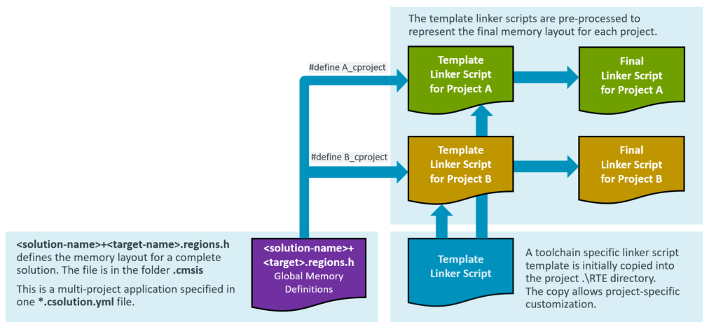
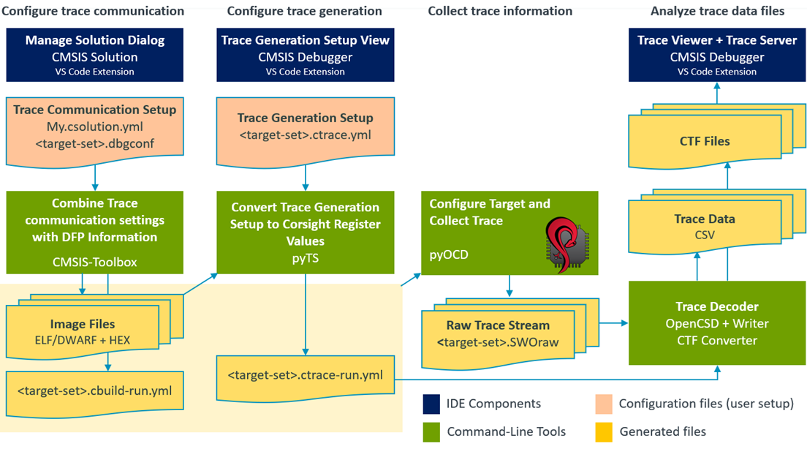
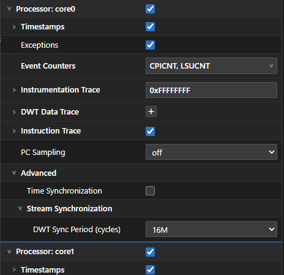

# Experimental Features

<!-- markdownlint-disable MD009 -->
<!-- markdownlint-disable MD013 -->
<!-- markdownlint-disable MD036 -->
<!-- markdownlint-disable MD032 -->

Experimental features are implemented to iterate on new functionality. Experimental features have limited test coverage and the functionality may change in future versions of the CMSIS-Toolbox without further notice.

## Resource Management

The CMSIS-Toolbox version 2.7 implements the experimental features for:
- [Resource Management](#resource-management)

Hardening and finalizing of these features is planned for a later CMSIS-Toolbox version.

In a multi-processor or multi-project application, the `target type` describes the target hardware. A solution is a collection of related projects, and the context set defines the projects that are deployed to the target hardware. A project uses a subset of resources (called regions at linker level).

The [linker script management](build-overview.md#linker-script-management) is extended for multi-processor or multi-project applications with the following features:

- When [`resources:`](#resources) node is specified in one of the `*.cproject.yml` or `*.clayer.yml` files of a *csolution project*:
    - The file `.\cmsis\<solution-name>+<target-name>.regions.h` is generated. This file contains the global region settings of a solution for one target type.
    - The file `.\cmsis\<solution-name>+<target-name>.regions.h` replaces the `regions_<device_or_board>.h` that is  located in the directory `./RTE/Device/<device>`. The `regions_<device_or_board>.h` is no longer generated.

- A `define: <project-name>_cproject` is always added to the linker script pre-processor (also when no `resources:` node is used).

The following picture explains the extended linker script management for multi-project applications.



### `resources:`

The `resources:` node specifies the resources required by a project. It is used at the level of `project:`, `setup:`, or `layer:`. The `resources:` node is additive; when multiple `resources:` nodes specify the same region, the size is added.

!!! Note
    In a next iteration, the linker script may be generated by the CMSIS-Toolbox and [features from uVision to allocate source modules to specific regions](https://developer.arm.com/documentation/101407/0541/Creating-Applications/Tips-and-Tricks/File-and-Group-Specific-Options) may get added. Therefore the `resources:` node is forward-looking in the way heap and stack are specified.

```yml
  resources:
    regions:
      - region: __ROM0    # region name pre-defined in script template: __ROM0..3
        size: 0x10000     # specifies region size
#       name: ITCM_Flash  - maps to physical memory name(s), if missing use PDSC default memory
#       address:          - absolution address of region; not in scope for 2.7
#       startup:          - locate startup/vectors to this region; not in scope for 2.7
#       align:            - alignment restrictions of the regions; not in scope for 2.7

      - region: __RAM0    # region name pre-defined in script template: __RAM0..3
        size:  0x8000     # specifies region size
        heap:  0x2000     # heap size (only permitted region __RAM0)
        stack: 0x4000     # stack size (only permitted in region __RAM0)
#       name:             - maps to physical memory name(s), if missing use PDSC default memory
#         - SRAM1
#         - SRAM2
#       address:          - absolution address of region; not in scope for 2.7
#       align:            - alignment restrictions of the regions; not in scope for 2.7
#       sections:         - potentially locate sections (requires linker script generation); not in scope for 2.7
#         - .text.function
```

### Example `<solution-name>+<target-name>.regions.h` file

```c
#ifndef USBD_STM32F746G_DISCO_REGIONS_H
#define USBD_STM32F746G_DISCO_REGIONS_H

// *** DO NOT MODIFY THIS FILE! ***
//
// Generated by csolution 2.7.0 based on packs and csolution project resources
// Device Family Pack (DFP):   Keil::STM32F7xx_DFP@3.0.0
// Board Support Pack (BSP):   Keil::STM32F746G-DISCO_BSP@1.0.0

// Available Physical Memory Resources
// rx ROM:   Name: ITCM_Flash (from DFP)  BASE: 0x00200000  SIZE: 0x00100000
// rx ROM:   Name: Flash (from DFP)       BASE: 0x08000000  SIZE: 0x00100000 (default)
// rwx RAM:  Name: DTCM (from DFP)        BASE: 0x20000000  SIZE: 0x00010000
// rwx RAM:  Name: SRAM1 (from DFP)       BASE: 0x20010000  SIZE: 0x00020000 (default)
// rwx RAM:  Name: SRAM2 (from DFP)       BASE: 0x20030000  SIZE: 0x00020000 (default)
// rwx RAM:  Name: BKP_SRAM (from DFP)    BASE: 0x40024000  SIZE: 0x00001000
// rwx RAM:  Name: ITCM (from DFP)        BASE: 0x00000000  SIZE: 0x00004000

//--------------------------------------
#ifdef A_cproject
// Resources allocated in A.cproject.yml

#define __ROM0_BASE  0x08000000      /* Memory Name: Flash */
#define __ROM0_SIZE  0x00010000

#define __RAM0_BASE  0x20010000      /* Memory Name: SRAM1 */
#define __RAM0_SIZE  0x00008000

#define __STACK_SIZE 0x00004000
#define __HEAP_SIZE  0x00002000

#endif /* A_cproject */

//--------------------------------------
#ifdef B_cproject
// Resources allocated in B.cproject.yml

#define __ROM0_BASE  0x08010000      /* Memory Name: Flash */
#define __ROM0_SIZE  0x00030000

#define __RAM0_BASE  0x20018000      /* Memory Name: SRAM1+SRAM2 */
#define __RAM0_SIZE  0x00020000

#define __STACK_SIZE 0x00000200
#define __HEAP_SIZE  0x00000000

#endif  /* B_cproject */

#endif /* USBD_STM32F746G_DISCO_REGIONS_H */
```

### Question

- Should the `<solution-name>+<target-name>.regions.h` file contain also `#define` symbols for the overall available memory, i.e. for a boot loader?

## Server Mode

The `csolution` tool supports the command line argument `rpc` to initiate a server mode. With this mode [rpc commands](https://github.com/Open-CMSIS-Pack/csolution-rpc/blob/main/api/csolution-openapi.yml) can be initiated. The first set of commands will be used by the VS Code CMSIS Solution extension to select components and packs for projects and layers.

Refer to [github.com/Open-CMSIS-Pack/csolution-rpc](https://github.com/Open-CMSIS-Pack/csolution-rpc) for more information.

## Zephyr Module Export

This is work in progress and the intended usage is initially for ML models generated for ExecuTorch. However the concept is flexible enough so that it can extend to other software components. 

The CMSIS-Toolbox 2.14 allows to export a software layer (defined in `*.clayer.yml`) into a Zephyr module so that software delivered as CMSIS-Packs can be integrated in Zephyr builds.

A layer is converted to a Zephyr module with the standard Zephyr entry points:

- `zephyr/module.yml` to declare the module and connect it to CMake/Kconfig integration.
- `Kconfig` options that expose the available CMSIS-Pack components and allow enabling/disabling them via `CONFIG_...` defines.
- `CMakeLists.txt` / `sources.cmake` that map the selected CMSIS-Pack sources and include paths into the Zephyr build.
- Generated compatibility headers (for example `RTE_Components.h` / `Pre_Include_Global.h`) to bridge CMSIS component configuration into the consuming build.

The exported module can then be consumed by a Zephyr application by adding the module path to `ZEPHYR_EXTRA_MODULES` (or through a west manifest) and enabling the desired `CONFIG_...` symbols in `prj.conf`.

Example: the [cmsis-to-zephyr-concept `ml_inference` example](https://github.com/brondani/cmsis-to-zephyr-concept/tree/main/ml_inference) shows a minimal end-to-end flow: exporting a layer as a Zephyr module and consuming it from a Zephyr application.

## Trace

Target execution data is captured through trace stream channels. The overall process has these steps:

1. Configure trace communication (how trace leaves the MCU) with the `target-set:` in `*.csolution.yml` (and optional settings in `*.dbgconf`).
2. Configure trace generation (what the MCU produces: ITM, DWT, etc.) with the `*.ctrace.yml` file.
3. Collect trace information (debugger receives and records the stream) into raw data files.
4. Analyze trace data files (host tools interpret the collected raw trace data files) and generate CSV and CTF files.

This section uses `<solution-set>` as the combined name of the `solution`, `target-type`, and `target-set` name, for example `SDS+AppKit-E8@HIL`.

!!! Note
    - Trace does not include SEGGER RTT, SystemView, or STDIO UART output. These features use separate data output paths.

### Trace Stream Channels

The trace stream channels are configured using the [`trace:`](pyOCD-Debugger.md#trace) node in `target-set:` of the `*.csolution.yml` project file. The following trace stream `<channels>` may be used:

`<channel>`   | Description
:-------------|:------------------------
SWO           | Serial-Wire Output: one-pin interface that sends trace information using [UART](pyOCD-Debugger.md#swo-uart) or Manchester mode (tbd).
TB            | [Embedded Trace Buffer or Micro Trace Buffer](pyOCD-Debugger.md#trace-buffer) that stores trace information in memory.
ER            | Event Recorder: uses code annotations that store program events in memory.

For `TB`, the trace buffer name is appended to the channel name when present. For example, a trace buffer named `MTB` uses the `TB_MTB` channel.

#### Selecting Trace Buffers

The optional `trace-buffer:` node under `trace:` in the [`debugger:`](YML-Input-Format.md#debugger) configuration selects a trace buffer. When multiple trace buffers are available, its value must match the name of the selected trace buffer. The [`trace-sinks:`](YML-CBuild-Format.md#debug-topology) node under `debug-topology:` in `*.cbuild-run.yml` lists PDSC `tracebuffer` elements and their names. The name value may be omitted when exactly one trace buffer is listed without a name.

For example, the following selects the `MTB` trace buffer:

```yml
debug-topology:
  trace-sinks:
    - serialwire:
    - tracebuffer: MTB
    - tracebuffer: ETB_0
```

```yml
debugger:
  trace:
    - trace-buffer: MTB
```

This selection lets DFP debug sequences use `TraceBufferSelected("MTB")`, and lets a `TraceFlush` sequence direct `BufferStreamOut` to the selected named trace buffer in the debugger.

### Directory and File Structure

Trace-related files are stored relative to the directory that contains the `*.csolution.yml` file.

Directory or File                      | Created by                | Description
:--------------------------------------|:--------------------------|:------------------------------------
`.`                                    | User                      | Contains the `*.csolution.yml` project file.
`.cmsis/<solution-set>.ctrace.yml`     | CMSIS-Debugger            | User trace intent and "solution-set specific" trace capture configuration.
`.trace/<solution-set>.ctrace-run.yml` | [pyTS](#pyts-utility)     | Generated trace run information, including resolved symbols and register values.
`.trace/<solution-set>.<channel>.raw`  | pyOCD                     | Raw trace data files, specific to a `<channel>` (`SWO`, `TB`, or `ER`).
`.trace/<solution-set>.<channel>.csv`  | [ctrace](#ctrace-utility) | CSV files that represent raw trace data files.
`.trace/<solution-set>.ctf/`           | [ctrace](#ctrace-utility) | Directory for CTF files such as `metadata`, `stream_0`, and `stream_1`.

The file `.cmsis/<solution-set>.ctrace.yml` configures the trace generation. It is created or updated by the user interface of the CMSIS-Debugger Trace View.

The [`pyTS`](#pyts-utility) utility resolves symbol-based settings in `*.ctrace.yml` against the ELF/DWARF information of the active `<solution-set>` and generates the register setup for the hardware configuration. The output is the file `.trace/<solution-set>.ctrace-run.yml` which is used by the debugger for register setup in target hardware. During trace analysis the information of this file connects the raw trace data back to the `*.ctrace.yml` configuration.

Raw trace streams are stored as binary files, for example `.trace/<solution-set>.SWO.raw`. The [`ctrace`](#ctrace-utility) utility converts raw trace data files into [CSV](#csv-format) and [CTF](#ctf-format) for viewers and analysis tools.

### Name Conventions

#### Location

Locations can be symbols or numeric addresses. An additional project or path to an image file may be specified.

Location Form                         | Description
:-------------------------------------|:------------------------------------
`symbol`                              | Finds matching symbols in all available symbol files.
`"sourcefile"::symbol`                | Finds matching symbols in a source file across all available symbol files.
`project\|symbol`                     | Finds matching symbols in symbol files from a specific project.
`project\|"sourcefile"::symbol`       | Finds matching symbols in a source file from a specific project.
`file-path\|symbol`                   | Finds matching symbols in symbol files from a specific image file.
`file-path\|"sourcefile"::symbol`     | Finds matching symbols in a source file from a specific image file.

ToDo: examples

#### References

References identify a node in the `ctrace.yml` that generated information in `ctrace-run.yml`. These nodes are used for diagnostics and for linking trace analysis results back to the trace setup.

**Examples:**

```yml
ctrace-ref: <pname>/data#2        # refers to pname section, `data:` node, list node #2
ctrace-ref: data#2                # `data:` node, list node #2
ctrace-ref: instruction:start#0   # `instruction:` node, `start:` node, list node #0
```

### Tools and Extensions

The trace workflow is split across the command-line tools and VS Code extensions as shown below.



Tool or Extension              | Input                                         | Output                         | Description
:------------------------------|:----------------------------------------------|:-------------------------------|:------------------------------------
[Arm CMSIS Solution](https://marketplace.visualstudio.com/items?itemName=Arm.cmsis-csolution) | `*.csolution.yml`, optional `.cmsis/*.dbgconf` | `*.cbuild-run.yml` | Generates the run and debug information consumed by debuggers.
[Arm CMSIS Debugger](https://marketplace.visualstudio.com/items?itemName=Arm.vscode-cmsis-debugger)<br/>Trace Generation Setup View | `.cmsis/*.ctrace.yml` | Updated `.cmsis/*.ctrace.yml` | Configures trace capture.
[pyTS](#pyts-utility)          | `.cmsis/*.ctrace.yml`, ELF/DWARF symbols       | `.trace/*.ctrace-run.yml`      | Resolves symbols and generates CoreSight trace register values.
[pyOCD](pyOCD-Debugger.md)     | `*.cbuild-run.yml`, `.trace/*.ctrace-run.yml`  | Raw trace data files in `.trace/` | Programs trace registers and captures trace streams during the debug session.
[`ctrace`](#ctrace-utility)    | Raw trace data files, `.trace/*.ctrace-run.yml` | CSV, CTF files, Trace Compass XML Analysis file | Generates CSV files (human readable) and CTF files
[Trace Viewer for VS Code](https://marketplace.visualstudio.com/items?itemName=eclipse-cdt.vscode-trace-extension) and<br/> [VS Code Trace Server](https://marketplace.visualstudio.com/items?itemName=eclipse-cdt.vscode-trace-server) | CTF files, Trace Compass XML Analysis file | Trace viewer panes | Visualizes the CTF output in VS Code.

**Interactive Debug Workflow:**

It is possible to change the **Trace Generation Setup** during debugging. For this workflow:

- pyTS generates a new `*.ctrace-run.yml` file.
- pyOCD reloads this `*.ctrace-run.yml` file and deletes existing **Raw Trace Stream** files when changes are detected and a new trace collection is started.

**CI Workflow:**

CI requires a prepared `.cmsis/<solution-set>.ctrace.yml` file. This file may be under source control or maintained manually.

### Configuration Files

Trace setup is split between target infrastructure configuration and capture configuration.

Configuration File             | Description
:------------------------------|:------------------------------------
`*.csolution.yml`              | Selects the solution-set and debug adapter. It may also reference solution-set specific debugger configuration files.
`.cmsis/*.dbgconf`             | Optional solution-set specific debugger configuration, for example trace clock, trace pins, ETB setup, and related hardware setup.
`.cmsis/<solution-set>.ctrace.yml` | User trace generation setup. This file defines which data, events, ITM channels, PC samples, or instruction trace streams are enabled.
`.trace/<solution-set>.ctrace-run.yml` | Generated trace run configuration. This file contains resolved symbols and ordered register accesses for pyOCD or other debug tools.

The trace run configuration (in `.trace/<solution-set>.ctrace-run.yml`) is written to target trace resources such as `DWT`, `ITM`, `ETM`, `MTB`, or `PMU` registers. The generated register accesses are loaded by pyOCD when the debug session starts. When pyOCD detects an updated `*.ctrace-run.yml` file, it updates the target trace registers and deletes previous raw trace data files.

Based on these settings pyOCD captures raw trace data files in the [directory `.trace`](#directory-and-file-structure). These raw trace data files are converted by the `ctrace` utility.

In a later step, a preprocessing tool may generate `.trace/README.md` with setup instructions and code snippets that can be inserted in the application code.

### File Structure of `*.ctrace.yml`

The `*.ctrace.yml` file starts with the node `ctrace:` and contains the trace capture settings for one solution-set.

!!! Note
    Cortex-M processors and the DWT, ITM, ETM, MTB, and PMU implementations differ in ways that affect the available configuration options. The pyTS tool uses the `*.cbuild-run.yml` file to discover the processor and implemented capabilities and rejects incompatible settings.

`ctrace:`                                               |             | Content
:-------------------------------------------------------|:------------|:------------------------------------
&nbsp;&nbsp;&nbsp; `generated-by:`                      |  Optional   | Tool and version that generated or last updated the file.
&nbsp;&nbsp;&nbsp; `setup:`                             |  Required   | Setup for each processor.

`setup:`                                                  |             | Content
:---------------------------------------------------------|:------------|:---------------------------------------                                      
`- pname:`                                                |  Optional   | Section applies to a processor name (required for multi-processor systems).
&nbsp;&nbsp;&nbsp; `disable:`                             |  Optional   | When set, this list node is ignored; useful for testing.
&nbsp;&nbsp;&nbsp; [`timestamps:`](#timestamps)           |  Optional   | Enables timestamps in the emitted trace streams.
&nbsp;&nbsp;&nbsp; [`timesync:`](#timesync)               |  Optional   | Enables time synchronization between trace streams.
&nbsp;&nbsp;&nbsp; [`data:`](#data)                       |  Optional   | DWT data trace configuration.
&nbsp;&nbsp;&nbsp; [`exceptions:`](#exceptions)           |  Optional   | DWT exception trace configuration.
&nbsp;&nbsp;&nbsp; [`events:`](#events)                   |  Optional   | DWT or PMU event trace configuration.
&nbsp;&nbsp;&nbsp; [`itm:`](#itm)                         |  Optional   | ITM channel configuration.
&nbsp;&nbsp;&nbsp; [`instructions:`](#instructions)       |  Optional   | ETM or MTB instruction trace configuration.
&nbsp;&nbsp;&nbsp; [`pcsampling:`](#pcsampling)           |  Optional   | DWT PC sampling configuration.
&nbsp;&nbsp;&nbsp; [`synchronization:`](#synchronization) |  Optional   | Trace synchronization packet period configuration.
&nbsp;&nbsp;&nbsp; [`tracehalt:`](#tracehalt)             |  Future     | Trace sink or formatter halt trigger configuration.

**Example:**

```yml
ctrace:
  created-by: CMSIS-Debugger v1.4.0
  setup:
    - pname: 
#     disable:    # disables trace without need to remove settings
      timestamps:
        clock: 24000000
      timesync:

      data:
        - location: mysimple

        - location: App|0x20001000
          access: RW
          size: 0x100
          output: PC

        - location: App|"main.c"::sample_counter
          access: R
          output: PC
          match:
            value: 0x00001234
            size: 4

      exceptions:
      events:
        - event: CPICNT
        - event: LSUCNT

      itm:
        enable: 0x0000000F
        privileged: 0x0
```

#### `timestamps:`

When `timestamps:` is present, timestamp generation is enabled in the trace stream. ITM uses local timestamps with a synchronous timestamp source.

`timestamps:`                                            |             | Content
:--------------------------------------------------------|:------------|:------------------------------------
&nbsp;&nbsp;&nbsp; `clock:`                              |  Optional   | Timestamp clock frequency in Hz.
&nbsp;&nbsp;&nbsp; `itm-prescaler:`                      |  Optional   | ITM timestamp prescaler: `1` (default), `4`, `16`, `64`.

The timestamp `clock` typically is the processor clock.

#### `timesync:`

When `timesync:` is present, time synchronization between streams is enabled, for example between ITM and ETM by global timestamps.

#### `data:`

The `data:` node configures DWT data trace. DWT comparator resources are limited and shared with data access breakpoints, trigger conditions, and trace start/stop logic.

`data:`                                                  |             | Content
:--------------------------------------------------------|:------------|:------------------------------------
`- location:`                                            |**Required** | Symbol or numeric address [location](#location) to trace.
&nbsp;&nbsp;&nbsp; `label:`                              |  Optional   | User-defined short label for Trace Compass.
&nbsp;&nbsp;&nbsp; `access:`                             |  Optional   | Access type: `W`, `R`, or `RW`. Default: `W`.
&nbsp;&nbsp;&nbsp; `size:`                               |  Optional   | Number of bytes in the traced range. Default: `sizeof(symbol)`, `4` for numeric addresses.
&nbsp;&nbsp;&nbsp; `output:`                             |  Optional   | Trace output mode (see table below). Default: `value`.
&nbsp;&nbsp;&nbsp; `match:`                              |  Optional   | Value match condition. When present, trace is emitted only for matching accesses.

`match:`                                                 |             | Content
:--------------------------------------------------------|:------------|:------------------------------------
&nbsp;&nbsp;&nbsp;&nbsp;&nbsp;&nbsp; `value:`            |**Required** | Value to match.
&nbsp;&nbsp;&nbsp;&nbsp;&nbsp;&nbsp; `size:`             |  Optional   | Number of bytes to compare. Allowed values: `1`, `2`, `4`. Default: `4`.

`output:`       | Description
:---------------|:------------------------------------
`value`         | Emits the value of the access.
`offset`        | Emits the address offset. This is useful when tracing an address range.
`PC`            | Emits the PC value that caused the access.
`match`         | Emits only the comparator ID of a match. This requires Armv8-M and saves trace bandwidth.
`PC+value`      | Emits PC and value.
`offset+value`  | Emits address offset and value.
`PC+offset`     | Emits PC and address offset. This requires Armv8-M.

!!! Note
    `size:` values greater than `4` may require two DWT comparators, depending on the DWT architecture. A `match:` condition can also require two DWT comparators.

#### `exceptions:`

The `exceptions:` node enables DWT exception trace. This does not enable ETM exception trace.

#### `events:`

The `events:` node enables DWT or PMU event trace for all processors or for a specific processor.

`events:`                             |             | Content
:-------------------------------------|:------------|:------------------------------------
`- event:`                            |**Required** | Event selector.

Supported DWT event selectors include `CYCCNT`, `CPICNT`, `EXCCNT`, `SLEEPCNT`, `LSUCNT`, and `FOLDCNT`.

**Example:**

```yml
events:
  - event: CPICNT
  - event: FOLDCNT
  - event: LSUCNT
```

#### `itm:`

The `itm:` node enables ITM channels.

`itm:`                                |             | Content
:-------------------------------------|:------------|:------------------------------------
`- enable:`                           |**Required** | ITM channel bit mask.
&nbsp;&nbsp;&nbsp; `privileged:`      |  Optional   | Privileged access only mask by blocks of eight channels. Default: `0`.

Each bit in `enable:` represents one ITM channel.  
Each bit in `privileged:` represents a block of eight channels, i.e. value `0x2` configures that access to ITM channles 8-15 must be privileged.

!!! Note
    ITM channel 0 is often used for `printf` output. This output should be routed to an output window or debug console instead of the trace analysis components.

#### `pcsampling:`

The `pcsampling:` node enables DWT PC sampling.

`pcsampling:`                         |             | Content
:-------------------------------------|:------------|:------------------------------------
`period:`                             |  Optional   | Sampling period in CPU cycles.

Supported values for `period:` `0` (off), `64`, `128`, `256`, ..., `16384`. Default: `0`.

#### `synchronization:`

The `synchronization:` node specifies the frequency of the DWT synchronization packet.

`synchronization:`                    |             | Content
:-------------------------------------|:------------|:------------------------------------
`DWT:`                                |  Optional   | Frequency `off`, `16M`, `64M`, `256M` processor cycles. Default: `256M`.

**Example:**

```yml
synchronization:
  DWT: 16M
```

#### `instructions:`

The `instructions:` node is reserved for ETM and MTB instruction trace. It is not required for the initial implementation.

`instructions:`                       |             | Content
:-------------------------------------|:------------|:------------------------------------
&nbsp;&nbsp;&nbsp; `start:`           |  Optional   | Conditions that start instruction trace.
&nbsp;&nbsp;&nbsp; `stop:`            |  Optional   | Conditions that stop instruction trace.

`start:` and `stop:` contain [condition](#conditions) entries. These entries define when instruction trace starts or stops; they do not define trace output.

#### `tracehalt:`

The `tracehalt:` node contains [condition](#conditions) entries that halt a trace sink or formatter by a trace trigger. It affects all trace streams that use the sink. Support to combine two conditions by logic operators may be added in the future.

#### Conditions

The nodes `start:`, `stop:`, and `tracehalt:` may contain a condition list that is logically OR-combined. They have the following form.

`start:`, `stop:`, `tracehalt:`                        |             | Content
:------------------------------------------------------|:------------|:------------------------------------
`- location:`                                          |**Required** | Code symbol, data symbol, or numeric address [location](#location) used as the trace condition.
&nbsp;&nbsp;&nbsp; `access:`                           |  Optional   | Access type: `X`, `R`, `W`, or `RW`. Defaults to `X` for code symbols, and to `W` for data symbols or numeric addresses
&nbsp;&nbsp;&nbsp; `size:`                             |  Optional   | Number of bytes in the condition range. Defaults to `sizeof(symbol)` for symbols and `4` for numeric addresses.
&nbsp;&nbsp;&nbsp; `match:`                            |  Optional   | Value match condition for data symbols or numeric addresses.

`match:`                                               |             | Content
:------------------------------------------------------|:------------|:------------------------------------
&nbsp;&nbsp;&nbsp;&nbsp;&nbsp;&nbsp; `value:`          |**Required** | Value to match.
&nbsp;&nbsp;&nbsp;&nbsp;&nbsp;&nbsp; `size:`           |  Optional   | Number of bytes to compare. Allowed values: `1`, `2`, `4`. Default: `4`.

### File Structure of `*.ctrace-run.yml`

The `*.ctrace-run.yml` file starts with the node `ctrace-run:`. It is generated from `*.ctrace.yml`, `*.cbuild-run.yml`, and ELF/DWARF symbol information. This file is a generated artifact and should not be edited manually.

`ctrace-run:`                                            |             | Content
:--------------------------------------------------------|:------------|:------------------------------------
&nbsp;&nbsp;&nbsp; `generated-by:`                       |  Optional   | Tool and version that generated the file.
&nbsp;&nbsp;&nbsp; `ctrace-setup:`                       |  Optional   | Copy of [`setup`](#file-structure-of-ctraceyml) node in the `*.ctrace.yml` file.
&nbsp;&nbsp;&nbsp; `ctrace-refs:`                        |**Required** | List of [references](#references) in the `*.ctrace.yml` file.

The `ctrace-setup` node uses the same format as the [`setup`](#file-structure-of-ctraceyml) node in the `*.ctrace.yml` file and preserves the original user input for consumers of the `*.ctrace-run.yml` file. This includes settings that do not resolve to a `ctrace-ref` but are required for higher-level output formats such as CTF. For example the `timestamps:clock` node.

`ctrace-refs:`                                           |             | Content
:--------------------------------------------------------|:------------|:------------------------------------
`- ctrace-ref:`                                          |**Required** | [Reference](#references) to a node in the `*.ctrace.yml` file that generated the register setup.
&nbsp;&nbsp;&nbsp; `type:`                               |**Required** | Trace source type.
&nbsp;&nbsp;&nbsp; `pname:`                              |  Optional   | Processor name the reference resolves to for multi-core systems.
&nbsp;&nbsp;&nbsp; `info:`                               |  Optional   | Additional information (for example alignment extension).
&nbsp;&nbsp;&nbsp; `warning:`                            |  Optional   | Warning message.
&nbsp;&nbsp;&nbsp; `error:`                              |  Optional   | Error message when setup cannot be completed.
&nbsp;&nbsp;&nbsp; `label:`                              |  Optional   | User-defined short label for Trace Compass
&nbsp;&nbsp;&nbsp; `address:`                            |  Optional   | Resolved address for the setting. May be resolved from a symbol.
&nbsp;&nbsp;&nbsp; `size:`                               |  Optional   | Size, in bytes, of the capture data. May be extracted from symbol information.
&nbsp;&nbsp;&nbsp; `symbol-file:`                        |  Optional   | Absolute path to the symbol file used in this reference.
&nbsp;&nbsp;&nbsp; `data-type:`                          |  Optional   | Type of displayed data: `unsigned`, `signed`, or `float`. Default: `unsigned`.
&nbsp;&nbsp;&nbsp; `stream:`                             |  Optional   | Stream ID (CoreSight ATB ID).
&nbsp;&nbsp;&nbsp; `source:`                             |  Optional   | Source ID.
&nbsp;&nbsp;&nbsp; `regs:`                               |  Optional   | Register setup.

The trace source types are: `dwt`, `event`, `exception`, `itm`, `pmu`, `overflow`, `pcsample`, `global_ts`.

Multiple `ctrace-ref` entries may reference the same configuration node when it generates setups for multiple streams. The combination of `ctrace-ref` and `stream` identifies each generated setup.

The `data-type` in combination with `size` provides a hint for the display format. Other information required for generating CTF data can be extracted from the referenced setting node in the `ctrace-setup:` section.

`size` can be extracted from symbol information or provided in the `ctrace` file. If both are present, user input takes precedence.

The use of `source:` depends on the combination of `type:` and the setting referenced by `ctrace-ref:`.

`type:` | `ctrace-ref:` setting | Usage of `source:`
:-------|:----------------------|:-------------------
`dwt`   | `data:` | Number or array of DWT comparators allocated for the data-trace entry.
`dwt`   | `instructions:start:`, `instructions:stop:`, or `tracehalt:` | Number or array of DWT comparators allocated for the condition.
`itm`   | `itm:` | Number or array of enabled ITM channels.

`regs:`                                                  |             | Content
:--------------------------------------------------------|:------------|:------------------------------------
`- name:`                                                |**Required** | Symbolic name of the register.
&nbsp;&nbsp;&nbsp; `value:`                              |**Required** | Value to write in this register.
&nbsp;&nbsp;&nbsp; `mask:`                               | Optional    | Bit mask for value write (default: `0xFFFFFFFF`).

**Example:**

```yml
ctrace-run:
  generated-by: pyTS v0.0
  ctrace-refs:
  - ctrace-ref: core0/itm
    pname: core0
    type: itm            # packet types
    stream: 1            # stream id
    source: 0            # ITM channel #0
    regs:
      - name: ITM_TER0
        value: 0x00000001
      - name: ITM_TPR
        value: 0x00000001
        mask: 0x0000000f
      - name: ITM_TCR
        value: 0x00010000
        mask: 0x007f0000

  - ctrace-ref: data#0
    type: dwt
    stream: 1            # stream id
    error: cannot find symbol

  - ctrace-ref: data#1   # symbol location
    type: dwt
    address: <symbol address>
    size: <symbol size>
    symbol-file: <symbol file used>
    data-type: unsigned
    stream: 1            # stream id
    source: [0, 1]       # allocated DWT comparators #0 and #1
    regs:
      - name: DWT_COMP0
        value: 1
        mask:  0xFF
      - name: DWT_COMP1
        value: 2

  - ctrace-ref: core0/timestamps
    type: itm
    pname: core0
    stream: 1
    regs:
      - name: ITM_TCR
        value: 0x00000002
        mask: 0x00000002

  # - ctrace-ref: core0/timestamps
  #   type: etm            # etm not yet supported, for demonstration purposes only
  #   pname: core0
  #   stream: 2
  #   regs:
  #     - name: TRCCONFIGR
  #       value: 0x00000010
  #       mask: 0x00000010
  #     - name: TRCCCCTLR
  #       value: 0x4
```

!!! Note
    The processor `itm` reference configures the ITM ATB stream ID. It may be generated even when no ITM channels are enabled.


#### Register Accesses

The `ctrace-run.yml` file contains the register values that are required for trace generation. It does not include enable sequences required by the Arm processor to access these registers. The debugger (pyOCD) has knowledge about architecturally defined trace components (listed in the table below) and therefore generates the right sequences, potentially with timeouts.

Trace Component | Base Address | Description
:---------------|:------------:|:------------------------------------
`ITM`           | `0xE0000000` | Instrumentation Trace Macrocell.
`DWT`           | `0xE0001000` | Data Watchpoint and Trace unit.
`PMU`           | `0xE0003000` | Performance Monitoring Unit.
`ETM`           | `0xE0041000` | Embedded Trace Macrocell.

The `ctrace-ref:` node references the trace generation configuration in the file `*.ctrace.yml` and contains register values that represent the setup for trace sources.
A single-core system has no `pname:` value; a multi-processor always includes a `pname:` value in the `ctrace-ref:` node.

### Initial Implementation

The initial implementation focuses on pyOCD with SWO UART and interactive operation in CMSIS-Debugger.

Subsequent releases may extend this initial solution to:

- Instruction trace using ETM or MTB.
- Event Recorder.
- CI workflow automation.

### Remaining Design Questions

- Cross-trigger functionality will be represented later (potentially in `*.ctrace.yml`)
- What are system wide settings? How are they represented? What trace component is configured with such settings?

### Out-of-Scope

- SEGGER RTT, SystemView, and STDIO UART output are not part of trace capture and use separate output paths.
- ITM channel 0 `printf` output should not be routed to trace analysis components. It should be shown in an output window or debug console.

## Configure Trace Generation

The file [`.cmsis/<solution-set>.ctrace.yml`](#file-structure-of-ctraceyml) is the user-facing configuration file for the trace generation. The CMSIS-Debugger implements a graphical user interface that is shown below. Each processor has a separate configuration section.



The available options in the user interface depend on the Cortex-M processor and on the selected [trace stream channel](#trace-stream-channels) that is used to obtain trace. Depending on the processor implemention, option setting may get rejected at the level of pyTS or pyOCD.

Option                 | M0 | M0+, M23 | M3, M4, M7, M33 | M52, M55 | M85
:----------------------|:--:|:--------:|:---------------:|:--------:|:------:
Timestamps             | -  | -        | yes             | yes      | yes
Exceptions             | -  | -        | yes             | yes      | yes
Event Counters         | -  | -        | yes             | yes      | yes
PMU Event              | -  | -        | no              | yes      | yes
Instrumentation Trace  | -  | -        | yes             | yes      | yes
DWT Data Trace         | -  | -        | 4 comparators   | 8 comparators | 8 comparators
Instruction Trace      | -  | with TB  | with TB         | with TB  | with TB
Start, Stop, Halt      | -  | 2 comparators | 4 comparators | 8 comparators | 8 comparators
PC Sampling            | -  | -        | yes             | yes      | yes
Time Synchronization   | -  | -        | yes             | yes      | yes
Stream Synchronization | -  | -        | yes             | yes      | yes

!!! Note
    - The available Event Counters depend on the Cortex-M processor.
    - The DWT comparators available for `DWT Data Trace` and `Start, Stop, Halt` are shared, so the total number of available comparators is not the sum of the values in the two rows.
    - M52, M55, M85 use the first 4 DWT comparators for data trace.

## `pyTS` Utility

The `pyTS` utility generates the file `.trace/<solution-set>.ctrace-run.yml`. It performs the following steps:

- Reads the file `<name>.cbuild-run.yml` to provide the solution set, processor names, and ELF output files.
- Converts symbolic names in the file `.cmsis/<solution-set>.ctrace.yml` to physical addresses by using the corresponding ELF output files.
- Uses processor information and implementation details to map the trace generation setup into CoreSight trace register values. See [Processor-Specific Trace Features](#processor-specific-trace-features)
- Rejects incompatible configuration settings with user-oriented messages (`info:`, `warning:`, or `error:`) in the `ctrace-ref:` node of the file `*.ctrace-run.yml`

The final trace generation setup is written to the file `.trace/<solution-set>.ctrace-run.yml`.

This utility will be part of pyOCD.

```txt
Usage:
  pyts <name>.cbuild-run.yml
```

## `ctrace` Utility

The `ctrace` utility reads the raw trace data files in the [directory `.trace`](#directory-and-file-structure). It can check the raw data trace files for consistency or convert the files into CSV and CTF format.

`ctrace` is based on the open source trace decoder [github.com/linaro/opencsd](https://github.com/linaro/opencsd) and adds a CSV and CTF converter. This utility will be part of CMSIS-Toolbox.

```txt
Usage:
  ctrace <trace-dir> [options]

Options:
      --csv                Generate only CSV files (default: generate CSV and CTF)
      --ctf                Generate only CTF files (default: generate CSV and CTF)
  -a  --all                Generate both CSV and CTF files
      --type sel [...]     Filter output for specific packet types (default: all packet types)
      --stream sel [...]   Filter output for specific streams (default: all streams)
  -t, --target arg         Specify <solution-set> (default: process all solution sets in trace-dir)
  -V, --version            Print version
```

`ctrace` processes files in the specified `<trace-dir>`. If this directory contains more than one `<solution-set>`, each solution set is processed separately.
CSV and CTF output files are written to the `<trace-dir>` as explained under [directory and file structure](#directory-and-file-structure).
When no option for generating files is specified, the raw trace data files are validated.

### `--type` option

The `--type` option is applied to the decoded packet type for both CSV and CTF files. Only the specified packet types are contained in the generated files.

Accepted packet types are: `itm`, `dwt`, `event`, `pmu`, `exception`, `pcsample`, `global_ts`, `overflow`, `error`.

**Example:**

Output only the packet types `dwt` and `event` to the generated CSV and CTF files.

```bash
ctrace .trace --all --type dwt event
```

### CSV Format

The CSV output file uses these columns:

Column         | Description
:--------------|:------------------------------------
`cycles`       | Timestamp in CPU clock cycles, if available.
`stream`       | Stream ID (CoreSight ATB ID) of the trace packet. Empty if no formatting.
`type`         | Packet type: `itm`, `dwt`, `event`, `pmu`, `exception`, `pcsample`, `global_ts`, `overflow`, `error`.
`source`       | Source ID: ITM channel, DWT comparator, exception number, or hardware discriminator.
`value`        | Value in hexadecimal form. Payload width is represented by the number of hex digits: 1 byte: `0x00`, 2 bytes: `0x0000`, 4 bytes: `0x00000000`. For packet type `exception` state transition: `0x1` enter, `0x2` exit, `0x3` return.
`pc`           | Program counter for packet types `dwt` and `pcsample` (hexadecimal format, example `0x08001234`).
`offset`       | Data address offset for packet type `dwt` (hexadecimal format, example `0xfdf9`).
`note`         | Additional details, used for error notification.

The following table contains details about the packet type. Information is empty when not provided by the trace packet.

`type`      | Description
:-----------|:------------------------------------
`itm`       | `source` = ITM channel.
`dwt`       | `source` = DWT comparator, `value` = data value, `offset` = data address offset, `pc` = program counter.
`event`     | Reserved for profiling/event-counter rows. Detailed semantics will be specified in a future version.
`pmu`       | Reserved for PMU counter rows. Detailed semantics will be specified in a future version.
`exception` | `source` = exception number. `value` = exception state transition.
`pcsample`  | `pc` = program counter.
`global_ts` | Global timestamp for synchronization between streams.
`overflow`  | Marks an overflow, reason can be an overflow packet or an internal decoder overflow.
`error`     | Decode error, for example unexpected trace byte values. `note` field carries details.

!!! Note
    The timestamp packet type information is provided in the `cycles` column.

**Exception State Transition:**

Value | State    | Meaning
:-----|:---------|:------------------------------------
`0x0` | reserved | Causes a decode error.
`0x1` | `enter`  | The exception became the active processor context.
`0x2` | `exit`   | The exception context was left or completed; consumers usually close that exception lane.
`0x3` | `return` | Execution returned to, or resumed, the named exception context after another exception.

**Example:**

```csv
cycles,stream,type,source,value,pc,offset,note
2518192,,itm,0,0x53,,,
2518404,,itm,0,0x54,,,
2518616,,itm,0,0x4d,,,
949338400,,dwt,2,0xfffffdf9,0x08001234,0xfdf9,
949338400,,dwt,3,0x0000006c,0x08001240,0x006c,
949338400,,dwt,0,0x00,,,
949339000,,pcsample,,,0x08000100,,
949338400,,exception,0,0x3,,,
949338400,,overflow,,,,,
950364820,,exception,11,0x1,,,
950389420,,exception,0,0x3,,,
```

cycles    | stream | type      | source | value      | pc         | offset  | note
:---------|:-------|:----------|:-------|:-----------|:-----------|:--------|:-----
2518192   |        | itm       | 0      | 0x53       |            |         |
2518404   |        | itm       | 0      | 0x54       |            |         |
2518616   |        | itm       | 0      | 0x4d       |            |         |
949338400 |        | dwt       | 2      | 0xfffffdf9 | 0x08001234 | 0xfdf9  |
949338400 |        | dwt       | 3      | 0x0000006c | 0x08001240 | 0x006c  |
949338400 |        | dwt       | 0      | 0x00       |            |         |
949339000 |        | pcsample  |        |            | 0x08000100 |         |
949338400 |        | exception | 0      | 0x3        |            |         |
949338400 |        | overflow  |        |            |            |         |
950364820 |        | exception | 11     | 0x1        |            |         |
950389420 |        | exception | 0      | 0x3        |            |         |

### CTF Format

The generated [Common Trace Format (CTF) v1.8.3](https://diamon.org/ctf/v1.8.3/) is compatible with [Trace Compass](https://eclipse.dev/tracecompass/) and is used by [Trace Viewer for VS Code](https://marketplace.visualstudio.com/items?itemName=eclipse-cdt.vscode-trace-extension). It uses the following files that are generated by `ctrace` in the directory `.trace/<solution-set>.ctf/`.

File           | Description
:--------------|:------------------------
`metadata`     | Metadata information for Trace Compass.
`stream_<n>`   | Trace data stream.

## Processor-Specific Trace Features

TODO: Discard most of the following chapters. Condensed in table further above.

### DWT Data Trace

DWT comparator functions vary between architectures and implementations.

- Armv7-M DWT implementations generally require comparator pairing for data-value matching.
- Armv8-M adds linked comparator functions and compact match packets.
- The `match` output mode is Armv8-M-specific.
- The `PC+offset` output mode is Armv8-M-specific.
- Address range support, address masks, access sizes, data-value matching, linked comparators, and emitted packet types must be checked for each comparator through `DWT_FUNCTIONn`.
- Some comparator numbers can support fewer functions than other comparators in the same DWT.

A requested range can require:

- One comparator using an address mask.
- Two linked comparators.
- Multiple comparators when the range is not naturally aligned.

A value match can also require more than one comparator. Comparator allocation therefore depends on the DWT architecture, requested function, alignment, and range. The statement that a size greater than four bytes "may require two comparators" is not sufficient as a complete allocation rule.

### Instruction Trace Start and Stop

The generic `start:` and `stop:` condition syntax cannot always map directly to every trace component.

- Cortex-M3, Cortex-M4, and Cortex-M23 ETMv3 implementations and Cortex-M7, Cortex-M33, Cortex-M52, Cortex-M55, and Cortex-M85 ETMv4 implementations use DWT or processor comparator inputs for stateful start/stop control. ETMv4 can additionally use resource selectors for event-based trace filtering; single-shot control is needed only when a transient comparator match must be latched.
- Cortex-M7 instruction-and-data ETM additionally provides local address comparators, data-value comparators, counters, and a sequencer.
- Cortex-M0+ MTB uses `TSTART` and `TSTOP` integration inputs. These can be driven by optional MTB_DWT comparators in an SoC implementation.
- Cortex-M23 and Cortex-M33 MTB implementations can use DWT comparator matches for start and stop control.
- Available start and stop conditions are constrained by DWT comparators shared with watchpoints and data trace.

The requested `X`, `R`, `W`, `RW`, value-match, and range conditions are not supported by every ETM or MTB trigger path. The resolver should report when a condition is syntactically valid but cannot be represented by the selected component.

### Timestamps

ITM local timestamps, ETM timestamp packets, and ETM cycle-count timing are distinct facilities. ETM timestamp packets can carry values derived from a shared system or global timestamp source.

- ITM timestamp prescaler values `1`, `4`, `16`, and `64` are architectural.
- ITM timestamps require ITM and a functioning cycle counter.
- ETM timestamp packets correlate trace with the shared system timestamp domain, while ETM cycle counts report elapsed processor cycles within the instruction trace. The system timestamp generator and its distribution infrastructure are optional.

### Related

- [v8-M Architecture Reference Manual](https://developer.arm.com/documentation/ddi0553/latest/)
    - The Instrumentation Trace Macrocell (B14.1)
    - The Data Watchpoint and Trace unit (B14.2)
    - The Performance Monitors Extension (B15)
    - ITM and DWT Packet Protocol Specification (F1)
- [v7-M Architecture Reference Manual](https://developer.arm.com/documentation/ddi0403/latest/)
    - The Instrumentation Trace Macrocell (C1.7)
    - The Data Watchpoint and Trace unit (C1.8)
    - Debug ITM and DWT Packet Protocol (D4)
- [v6-M Architecture Reference Manual](https://developer.arm.com/documentation/ddi0419/latest/)
    - The Data Watchpoint and Trace Unit (C1.7)

- [Cortex-M55 PMU](https://developer.arm.com/documentation/101051/0101/Performance-Monitoring-Unit-Extension)
- [Cortex-M85 PMU](https://developer.arm.com/documentation/101924/0101/Performance-Monitoring-Unit-Extension)

## Appendix - Trace Sequence Snippets


The following snippets describe reusable CoreSight trace components. Each relevant component provides the three life-cycle sequences `Configure`, `Capture`, and `Flush`, plus `ReadBuffer` where a component stores trace data locally. The snippets also provide `debugvars` that simplify retargeting to a specific SoC and user configuration. The variables cover values such as component addresses, access ports, and component-specific options.

Function | What it is | Usually called from
:--------|:-----------|:-------------------
`Configure` | Sets up trace, for example after reset or debug-connection recovery. | `TraceStart`
`Capture` | Runs immediately before capture starts; it may configure trace trigger delays or a trace-sink formatter. | `TraceCapture`
`Flush` | Flushes the trace bus after capture stops. It may also run before capture to start from a freshly flushed trace system. | `TraceFlush`; optionally `TraceCapture`
`ReadBuffer` | Reads a trace buffer and forwards its data to the debugger. | `TraceFlush`, after `Flush`

Some components support different operating modes and therefore provide sequence variants in addition to the base life-cycle function. Variant names use an underscore between the function and variant, for example `Configure_HWFIFO` and `Capture_CircularBuffer`.

The snippets currently contain instance-index placeholders for replacement by template engines. Where sensible, the `debugvars` provide best-guess default addresses; for example, TPIU uses the typical single-core-system base address and assumes an ADIv5-based AHB-AP index for single-core Cortex-M SoCs. The sequences are development quality and require further hardening and validation on real devices.

The [Full Trace Scaffold](#full-trace-scaffold) is a template that can be used as the starting point for a complete sequence implementation.

!!! Note
    The examples use `__ap` for access-port selection. They apply equally when using `__apid`.

Component | Default AP | Default Base Address | Sequence Snippets | PDSC (XML) | `*.cbuild-run.yml`
:---------|:-----------|:---------------------|:------------------|:-----------|:-------------------
Trace Port Interface Unit (TPIU) | `0` | `0xE0040000` | `Configure`, `Capture`, `Flush` | [TPIU](#trace-port-interface-unit-tpiu) | [TPIU](#trace-port-interface-unit-tpiu-cbuild-runyml)
Serial Wire Output (SWO) | `0` | `0xE0040000` | `Configure` | [SWO](#serial-wire-output-swo) | [SWO](#serial-wire-output-swo-cbuild-runyml)
Embedded Trace Buffer (ETB) | `0` | `0xE0042000` | `Configure`, `Capture`, `Flush`, `Read_Buffer` | [ETB](#embedded-trace-buffer-etb) | [ETB](#embedded-trace-buffer-etb-cbuild-runyml)
Embedded Trace FIFO (ETF) | `0` | `0xE0042000` | `Configure_HWFIFO`, `Configure_CircularBuffer`, `Capture_CircularBuffer`, `Flush`, `Read_CircularBuffer` | [ETF](#embedded-trace-fifo-etf) | [ETF](#embedded-trace-fifo-etf-cbuild-runyml)
Trace Funnel | `0` | `0xE0043000` | `Configure` | [Trace Funnel](#trace-funnel) | [Trace Funnel](#trace-funnel-cbuild-runyml)
Trace Replicator | `0` | `0x00000000` | `Configure` | [Trace Replicator](#trace-replicator) | [Trace Replicator](#trace-replicator-cbuild-runyml)
Embedded Trace Router (ETR) | `0` | `0x00000000` | `Configure_CircularBuffer`, `Capture_CircularBuffer`, `Flush`, `Read_CircularBuffer` | [ETR](#embedded-trace-router-etr) | [ETR](#embedded-trace-router-etr-cbuild-runyml)
CoreSight Address Translation Unit (CATU) | `0` | `0x00000000` | `Configure`, `Capture`, `Flush` | [CATU](#coresight-address-translation-unit-catu) | [CATU](#coresight-address-translation-unit-catu-cbuild-runyml)

### PDSC (XML) Implementations

!!! Note
    XML code snippets should be moved to https://github.com/Open-CMSIS-Pack/Open-CMSIS-Pack-Spec once this experimental feature gets merged with the main specs.

#### Trace Port Interface Unit (TPIU)

~~~xml
<!-- CMSIS-Pack TPIU template. Replace __INSTANCE_INDEX__ with the stable numeric instance suffix. -->
<cmsis-pack-trace-snippet component="TPIU">
  <debugvars>
    // TPIU
    __var TPIU___INSTANCE_INDEX___ADDRESS     = 0xE0040000;  // Default TPIU Location for single-core systems
    __var TPIU___INSTANCE_INDEX___AP          = 0x00000000;
    __var TPIU___INSTANCE_INDEX___PRESCALER   = 0x00000000;  // Zero derives the prescaler from the trace clocks
  </debugvars>

  <sequence name="CS_TPIU___INSTANCE_INDEX___Configure">
    <block>
      __var swoTrace    = __traceout &amp; 0x1;
      __var syncTrace   = __traceout &amp; 0x2;
      __var bufferTrace = __traceout &amp; 0x4;
      __var tracePortWidth = (__traceout &gt;&gt; 16) &amp; 0x3F;       // Parallel trace port size
      __var clockRatio  = __traceclockout / __traceclockin &gt;= 1 ? (__traceclockout / __traceclockin) : 1;
      __var prescaler   = TPIU___INSTANCE_INDEX___PRESCALER &gt; 0 ? TPIU___INSTANCE_INDEX___PRESCALER : clockRatio - 1;

      // Helper variables
      __var ffcrValue = 0x00000000;
      __var LAR_KEY   = 0xC5ACCE55;
      __var savedAP = __ap;

      Message(0, "Begin CS_TPIU___INSTANCE_INDEX_____INSTANCE_INDEX___Configure @0x%08X, AP 0x%08X", TPIU___INSTANCE_INDEX___ADDRESS, TPIU___INSTANCE_INDEX___AP);

      __ap = TPIU___INSTANCE_INDEX___AP;                                // Set AP
    </block>
    <control if="swoTrace != 0">
      <block>
        Write32(TPIU___INSTANCE_INDEX___ADDRESS + 0xFB0, LAR_KEY);      // TPIU Lock Access Register: Unlock TPIU
        Write32(TPIU___INSTANCE_INDEX___ADDRESS + 0x010, prescaler);    // TPIU Asynchronous Clock Prescaler Register: No prescaling
        Write32(TPIU___INSTANCE_INDEX___ADDRESS + 0x0F0, 0x00000002);   // TPIU Selected Pin Protocol Register: Select SWO
      </block>
    </control>
    <control if="syncTrace != 0">
      <block>
        Write32(TPIU___INSTANCE_INDEX___ADDRESS + 0xFB0, LAR_KEY);      // TPIU Lock Access Register: Unlock TPIU
        Write32(TPIU___INSTANCE_INDEX___ADDRESS + 0x010, 2*prescaler);  // TPIU Asynchronous Clock Prescaler Register: No prescaling
        Write32(TPIU___INSTANCE_INDEX___ADDRESS + 0x004, 1 &lt;&lt; (tracePortWidth - 1));  // TPIU Current Synchronous Port Width
        Write32(TPIU___INSTANCE_INDEX___ADDRESS + 0x0F0, 0x00000000);   // TPIU Selected Pin Protocol Register: Select Sync Trace Port
        ffcrValue  = Read32(TPIU___INSTANCE_INDEX___ADDRESS + 0x304);
        ffcrValue |= 0x00000002;                                        // Enable formatter
        Write32(TPIU___INSTANCE_INDEX___ADDRESS + 0x304, ffcrValue);    // TPIU FFCR
      </block>
    </control>
    <block>
      __ap = savedAP;
      Message(0, "End CS_TPIU___INSTANCE_INDEX_____INSTANCE_INDEX___Configure @0x%08X, AP 0x%08X", TPIU___INSTANCE_INDEX___ADDRESS, TPIU___INSTANCE_INDEX___AP);
    </block>
  </sequence>

  <sequence name="CS_TPIU___INSTANCE_INDEX___Capture">
    <block>
      // Helper variables
      __var LAR_KEY   = 0xC5ACCE55;
      __var savedAP = __ap;
      __var ffcrValue = 0x00000000;

      Message(0, "Begin CS_TPIU___INSTANCE_INDEX_____INSTANCE_INDEX___Capture @0x%08X, AP 0x%08X", TPIU___INSTANCE_INDEX___ADDRESS, TPIU___INSTANCE_INDEX___AP);

      // Configure TPIU if needed and enable formatter
      __ap = TPIU___INSTANCE_INDEX___AP;                            // Set AP
      ffcrValue  = Read32(TPIU___INSTANCE_INDEX___ADDRESS + 0x304);
      ffcrValue |= 0x00000002;                                      // Enable formatter
      Write32(TPIU___INSTANCE_INDEX___ADDRESS + 0x304, ffcrValue);  // TPIU FFCR
      __ap = savedAP;
      Message(0, "End CS_TPIU___INSTANCE_INDEX_____INSTANCE_INDEX___Capture @0x%08X, AP 0x%08X", TPIU___INSTANCE_INDEX___ADDRESS, TPIU___INSTANCE_INDEX___AP);
    </block>
  </sequence>

  <sequence name="CS_TPIU___INSTANCE_INDEX___Flush">
    <block>
      // Helper variables
      __var savedAP     = __ap;
      __var ffcrValue   = 0x00000000;
      __var ffsrValue   = 0x00000000;

      Message(0, "Begin CS_TPIU___INSTANCE_INDEX_____INSTANCE_INDEX___Flush @0x%08X, AP 0x%08X", TPIU___INSTANCE_INDEX___ADDRESS, TPIU___INSTANCE_INDEX___AP);

      __ap = TPIU___INSTANCE_INDEX___AP;  // Set AP
    </block>
    <block>
      // Configure "local" TPIU for Sync Trace
      ffsrValue = Read32(TPIU___INSTANCE_INDEX___ADDRESS + 0x300);
    </block>
    <control if="ffsrValue &amp; 0x2 == 0" info="Formatter not stopped, do it now">
      <block>
        // Flush the TPIU formatter so pending packets leave the trace port.
        ffcrValue = Read32(TPIU___INSTANCE_INDEX___ADDRESS + 0x304);
        ffcrValue &amp;= ~(0x00001040);   // Clear StopOnFlush and FlushOnManual
        ffcrValue |= 0x00001000;          // Stop after the manual flush completes
        Write32(TPIU___INSTANCE_INDEX___ADDRESS + 0x304, ffcrValue);
        ffcrValue |= 0x00000040;          // Trigger manual flush
        Write32(TPIU___INSTANCE_INDEX___ADDRESS + 0x304, ffcrValue);
      </block>
      <block>
        ffcrValue = Read32(TPIU___INSTANCE_INDEX___ADDRESS + 0x304);
      </block>
      <control while="(ffcrValue &amp; 0x40) != 0" info="Wait for TPIU manual flush to complete" timeout="100">
        <block>
          ffcrValue = Read32(TPIU___INSTANCE_INDEX___ADDRESS + 0x304);
        </block>
      </control>
      <block>
        ffsrValue = Read32(TPIU___INSTANCE_INDEX___ADDRESS + 0x300);
      </block>
      <control while="(ffsrValue &amp; 0x1) != 0" info="Wait for TPIU flush in progress to clear" timeout="100">
        <block>
          ffsrValue = Read32(TPIU___INSTANCE_INDEX___ADDRESS + 0x300);
        </block>
      </control>
    </control>
    <block>
      __ap = savedAP;
      Message(0, "End CS_TPIU___INSTANCE_INDEX_____INSTANCE_INDEX___Flush @0x%08X, AP 0x%08X", TPIU___INSTANCE_INDEX___ADDRESS, TPIU___INSTANCE_INDEX___AP);
    </block>
  </sequence>
</cmsis-pack-trace-snippet>
~~~

#### Serial Wire Output (SWO)

~~~xml
<!-- CMSIS-Pack SWO template. Replace __INSTANCE_INDEX__ with the stable numeric instance suffix. -->
<cmsis-pack-trace-snippet component="SWO">
  <debugvars>
    // SWO
    __var SWO___INSTANCE_INDEX___ADDRESS     = 0xE0040000;  // Default TPIU Location for single-core systems
    __var SWO___INSTANCE_INDEX___AP          = 0x00000000;
  </debugvars>

  <sequence name="CS_SWO___INSTANCE_INDEX___Configure">
    <block>
      // Helper variables
      __var savedAP   = __ap;
      __var prescaler =    0;
      __var swoMode   =    2;                                      // Fixed SWO-UART for now

      Message(0, "Begin CS_SWO___INSTANCE_INDEX_____INSTANCE_INDEX___Configure @0x%08X, AP 0x%08X", SWO___INSTANCE_INDEX___ADDRESS, SWO___INSTANCE_INDEX___AP);
    </block>
    <control if="__traceclockout != 0">
      <control if="__traceclockin &lt; __traceclockout">
        <block>
          Message(2, "Error: __traceclockin (0x%08X) is less than __traceclockout (0x%08X)", __traceclockin, __traceclockout);
        </block>
      </control>
      <block>
        // Calculate SWO prescaler value based on provided trace clock frequencies.
        prescaler = (__traceclockin / __traceclockout) - 1;
        Message(0, "Calculated SWO prescaler value: %d", prescaler);
      </block>
    </control>
    <block>
      __ap = SWO___INSTANCE_INDEX___AP;
      Write32(SWO___INSTANCE_INDEX___ADDRESS + 0x010, prescaler);  // Prescaler
      Write32(SWO___INSTANCE_INDEX___ADDRESS + 0x0F0, swoMode);    // Enable SWO-UART
      __ap = savedAP;
      Message(0, "End CS_SWO___INSTANCE_INDEX_____INSTANCE_INDEX___Configure @0x%08X, AP 0x%08X", SWO___INSTANCE_INDEX___ADDRESS, SWO___INSTANCE_INDEX___AP);
    </block>
  </sequence>
</cmsis-pack-trace-snippet>
~~~

#### Embedded Trace Buffer (ETB)

~~~xml
<!-- CMSIS-Pack ETB template. Replace __INSTANCE_INDEX__ with the stable numeric instance suffix. -->
<cmsis-pack-trace-snippet component="ETB">
  <debugvars>
    // ETB
    __var ETB___INSTANCE_INDEX___ADDRESS       = 0xE0042000;
    __var ETB___INSTANCE_INDEX___AP            = 0x00000000;
    __var ETB___INSTANCE_INDEX___TRIGGER_COUNT = 0x0;
  </debugvars>

  <sequence name="CS_ETB___INSTANCE_INDEX___Configure">
    <block>
      // Helper variables
      __var savedAP = __ap;
      __var ffcrValue = 0x00000000;
      __var etbStatus = 0x00000000;

      Message(0, "Begin CS_ETB___INSTANCE_INDEX_____INSTANCE_INDEX___Configure @0x%08X, AP 0x%08X", ETB___INSTANCE_INDEX___ADDRESS, ETB___INSTANCE_INDEX___AP);
      __ap = ETB___INSTANCE_INDEX___AP;                             // Set AP

      // Configure ETB
      Write32(ETB___INSTANCE_INDEX___ADDRESS + 0x020, 0x00000000);  // Disable ETB before configuring
      etbStatus = Read32(ETB___INSTANCE_INDEX___ADDRESS + 0x00C);
    </block>
    <control while="(etbStatus &amp; 0x4) == 0" info="Wait for AcqComp" timeout="100">
      <block>
        etbStatus = Read32(ETB___INSTANCE_INDEX___ADDRESS + 0x00C);
      </block>
    </control>
    <block>
      // Configure
      Write32(ETB___INSTANCE_INDEX___ADDRESS + 0x304, 0x00000003);  // FFCR: Enable Formatter and Trigger Insertion
      Write32(ETB___INSTANCE_INDEX___ADDRESS + 0x01C, ETB___INSTANCE_INDEX___TRIGGER_COUNT); // TRG: Number of words to capture after trigger
      Write32(ETB___INSTANCE_INDEX___ADDRESS + 0x018, 0x00000000);  // Init RwP
      Write32(ETB___INSTANCE_INDEX___ADDRESS + 0x014, 0x00000000);  // Init RRP

      Write32(ETB___INSTANCE_INDEX___ADDRESS + 0x020, 0x00000001);  // Enable ETB
    </block>
    <block>
      __ap = savedAP;
      Message(0, "End CS_ETB___INSTANCE_INDEX_____INSTANCE_INDEX___Configure @0x%08X, AP 0x%08X", ETB___INSTANCE_INDEX___ADDRESS, ETB___INSTANCE_INDEX___AP);
    </block>
  </sequence>

  <sequence name="CS_ETB___INSTANCE_INDEX___Capture">
    <block>
      // Helper variables
      __var ffcrValue = 0x00000000;
      __var savedAP = __ap;

      Message(0, "Begin CS_ETB___INSTANCE_INDEX_____INSTANCE_INDEX___Capture @0x%08X, AP 0x%08X", ETB___INSTANCE_INDEX___ADDRESS, ETB___INSTANCE_INDEX___AP);

      __ap = ETB___INSTANCE_INDEX___AP;                             // Set AP
      ffcrValue  = Read32(ETB___INSTANCE_INDEX___ADDRESS + 0x304);
      ffcrValue |= 0x00000002;                                      // FFCR: Enable Formatter
      Write32(ETB___INSTANCE_INDEX___ADDRESS + 0x304, ffcrValue);
      Write32(ETB___INSTANCE_INDEX___ADDRESS + 0x01C, ETB___INSTANCE_INDEX___TRIGGER_COUNT); // TRG: Number of words to capture after trigger
      Write32(ETB___INSTANCE_INDEX___ADDRESS + 0x018, 0x00000000);  // Init RwP
      Write32(ETB___INSTANCE_INDEX___ADDRESS + 0x014, 0x00000000);  // Init RRP
      Write32(ETB___INSTANCE_INDEX___ADDRESS + 0x020, 0x00000001);  // Enable ETB
      __ap = savedAP;

      Message(0, "End CS_ETB___INSTANCE_INDEX_____INSTANCE_INDEX___Capture @0x%08X, AP 0x%08X", ETB___INSTANCE_INDEX___ADDRESS, ETB___INSTANCE_INDEX___AP);
    </block>
  </sequence>

  <sequence name="CS_ETB___INSTANCE_INDEX___Flush">
    <block>
      // Helper variables
      __var savedAP     = __ap;
      __var ffcrValue   = 0x00000000;
      __var etbStatus   = 0x00000000;

      Message(0, "Begin CS_ETB___INSTANCE_INDEX_____INSTANCE_INDEX___Flush @0x%08X, AP 0x%08X", ETB___INSTANCE_INDEX___ADDRESS, ETB___INSTANCE_INDEX___AP);

      __ap = ETB___INSTANCE_INDEX___AP;  // Set AP
    </block>
    <block>
      // Flush ETB first
      ffcrValue = Read32(ETB___INSTANCE_INDEX___ADDRESS + 0x304);
      ffcrValue &amp;= ~(0x00001040);    // Clear StopOnFlush and FlushOnManual
      ffcrValue |= 0x00001000;           // Stop after the manual flush completes
      Write32(ETB___INSTANCE_INDEX___ADDRESS + 0x304, ffcrValue);
      ffcrValue |= 0x00000040;           // Trigger manual flush
      Write32(ETB___INSTANCE_INDEX___ADDRESS + 0x304, ffcrValue);
    </block>
    <block>
      ffcrValue = Read32(ETB___INSTANCE_INDEX___ADDRESS + 0x304);
    </block>
    <control while="(ffcrValue &amp; 0x40) != 0" info="Wait for ETB manual flush to complete" timeout="100">
      <block>
        ffcrValue = Read32(ETB___INSTANCE_INDEX___ADDRESS + 0x304);
      </block>
    </control>
    <block>
      etbStatus = Read32(ETB___INSTANCE_INDEX___ADDRESS + 0x00C);
    </block>
    <control while="(etbStatus &amp; 0x4) == 0" info="Wait for ETB to become ready" timeout="100">
      <block>
        etbStatus = Read32(ETB___INSTANCE_INDEX___ADDRESS + 0x00C);
      </block>
    </control>
    <block>
      // Disable ETB after flush until next run/step
      Write32(ETB___INSTANCE_INDEX___ADDRESS + 0x020, 0x00000000);
      etbStatus = Read32(ETB___INSTANCE_INDEX___ADDRESS + 0x00C);
    </block>
    <control while="(etbStatus &amp; 0x4) == 0" info="Wait for AcqComp" timeout="100">
      <block>
        etbStatus = Read32(ETB___INSTANCE_INDEX___ADDRESS + 0x00C);
      </block>
    </control>
    <block>
      __ap = savedAP;
      Message(0, "End CS_ETB___INSTANCE_INDEX_____INSTANCE_INDEX___Flush @0x%08X, AP 0x%08X", ETB___INSTANCE_INDEX___ADDRESS, ETB___INSTANCE_INDEX___AP);
    </block>
  </sequence>

  <sequence name="CS_ETB___INSTANCE_INDEX___Read_Buffer">
    <block>
      // Helper variables
      __var savedAP       = __ap;
      __var etbStatus     = 0x00000000;
      __var bufferWords   = 0x00000000;
      __var readPointer   = 0x00000000;
      __var writePointer  = 0x00000000;
      __var wordsToRead   = 0x00000000;
      __var bytesToRead   = 0x00000000;
      __var bytesStreamed = 0x00000000;

      Message(0, "Begin CS_ETB___INSTANCE_INDEX_____INSTANCE_INDEX___Read_Buffer @0x%08X, AP 0x%08X", ETB___INSTANCE_INDEX___ADDRESS, ETB___INSTANCE_INDEX___AP);

      __ap = ETB___INSTANCE_INDEX___AP; // Set AP

      // The legacy ETB RDP, RRP, and RWP registers use trace-RAM word counts.
      bufferWords  = Read32(ETB___INSTANCE_INDEX___ADDRESS + 0x004);
      etbStatus    = Read32(ETB___INSTANCE_INDEX___ADDRESS + 0x00C);
      readPointer  = Read32(ETB___INSTANCE_INDEX___ADDRESS + 0x014);
      writePointer = Read32(ETB___INSTANCE_INDEX___ADDRESS + 0x018);
    </block>
    <control if="bufferWords != 0">
      <control if="(etbStatus &amp; 0x00000001) != 0">
        <block>
          // STS.Full distinguishes a wrapped/full buffer from an empty buffer
          // when the read and write pointers are equal.
          wordsToRead = bufferWords;
          // RWP identifies the oldest retained trace after the buffer wraps.
          Write32(ETB___INSTANCE_INDEX___ADDRESS + 0x014, writePointer); // Rebase RRP for chronological output
        </block>
      </control>
      <control if="(etbStatus &amp; 0x00000001) == 0">
        <control if="writePointer &gt;= readPointer">
          <block>
            wordsToRead = writePointer - readPointer;
          </block>
        </control>
        <control if="writePointer &lt; readPointer">
          <block>
            wordsToRead = (bufferWords - readPointer) + writePointer;
          </block>
        </control>
      </control>
      <block>
        bytesToRead = wordsToRead * 4;
      </block>
      <control if="bytesToRead != 0">
        <block>
          // RRD reads 32-bit trace-RAM words and advances the ETB RRP register.
          BufferRead(0, 0, ETB___INSTANCE_INDEX___ADDRESS + 0x010, bytesToRead, 32);
          bytesStreamed = BufferStreamOut(0, 0, bytesToRead, ".trace/TraceBufferOutput.TB.raw", 0, 0);
          Message(0, "Streamed %d of %d ETB trace bytes", bytesStreamed, bytesToRead);
        </block>
      </control>
      <control if="bytesToRead == 0">
        <block>
          Message(1, "ETB trace buffer is empty");
        </block>
      </control>
    </control>
    <block>
      __ap = savedAP;
      Message(0, "End CS_ETB___INSTANCE_INDEX_____INSTANCE_INDEX___Read_Buffer @0x%08X, AP 0x%08X", ETB___INSTANCE_INDEX___ADDRESS, ETB___INSTANCE_INDEX___AP);
    </block>
  </sequence>
</cmsis-pack-trace-snippet>
~~~

#### Embedded Trace FIFO (ETF)

~~~xml
<!-- CMSIS-Pack ETF template. Replace __INSTANCE_INDEX__ with the stable numeric instance suffix. -->
<cmsis-pack-trace-snippet component="ETF">
  <debugvars>
    // ETF
    __var ETF___INSTANCE_INDEX___ADDRESS       = 0xE0042000;
    __var ETF___INSTANCE_INDEX___AP            = 0x00000000;
  </debugvars>

  <sequence name="CS_ETF___INSTANCE_INDEX___Configure_HWFIFO">
    <block>
      // Helper variables
      __var savedAP = __ap;
      __var ffcrValue = 0x00000000;
      __var etfStatus = 0x00000000;

      Message(0, "Begin CS_ETF___INSTANCE_INDEX_____INSTANCE_INDEX___Configure_HWFIFO @0x%08X, AP 0x%08X", ETF___INSTANCE_INDEX___ADDRESS, ETF___INSTANCE_INDEX___AP);
      __ap = ETF___INSTANCE_INDEX___AP;                             // Set AP

      // Configure ETF to HW FIFO for Sync Trace
      Write32(ETF___INSTANCE_INDEX___ADDRESS + 0x020, 0x00000000);  // Disable ETF before configuring
      etfStatus = Read32(ETF___INSTANCE_INDEX___ADDRESS + 0x00C);
    </block>
    <control while="(etfStatus &amp; 0x4) == 0" info="Wait for TMCReady" timeout="100">
      <block>
        etfStatus = Read32(ETF___INSTANCE_INDEX___ADDRESS + 0x00C);
      </block>
    </control>
    <block>
      // Configure
      Write32(ETF___INSTANCE_INDEX___ADDRESS + 0x028, 0x00000002);  // Set HW FIFO Mode
      Write32(ETF___INSTANCE_INDEX___ADDRESS + 0x034, 0x00000000);  // Watermark: Set threshold vacancy to 0 to use full buffer
      Write32(ETF___INSTANCE_INDEX___ADDRESS + 0x304, 0x00000003);  // FFCR: Enable Formatter and Trigger Insertion
      Write32(ETF___INSTANCE_INDEX___ADDRESS + 0x308, 0x00000000);  // Clear PSCR, use other components for periodic sync requests

      Write32(ETF___INSTANCE_INDEX___ADDRESS + 0x020, 0x00000001);  // Enable ETF
    </block>
    <block>
      __ap = savedAP;
      Message(0, "End CS_ETF___INSTANCE_INDEX_____INSTANCE_INDEX___Configure_HWFIFO @0x%08X, AP 0x%08X", ETF___INSTANCE_INDEX___ADDRESS, ETF___INSTANCE_INDEX___AP);
    </block>
  </sequence>

  <sequence name="CS_ETF___INSTANCE_INDEX___Configure_CircularBuffer">
    <block>
      // Helper variables
      __var savedAP = __ap;
      __var ffcrValue = 0x00000000;
      __var etfStatus = 0x00000000;
      __var traceBufferSyncCnt = 0xA;

      Message(0, "Begin CS_ETF___INSTANCE_INDEX_____INSTANCE_INDEX___Configure_CircularBuffer @0x%08X, AP 0x%08X", ETF___INSTANCE_INDEX___ADDRESS, ETF___INSTANCE_INDEX___AP);
      __ap = ETF___INSTANCE_INDEX___AP;                                     // Set AP

      // Configure ETF to HW FIFO for Sync Trace
      Write32(ETF___INSTANCE_INDEX___ADDRESS + 0x020, 0x00000000);          // Disable ETF before configuring
      etfStatus = Read32(ETF___INSTANCE_INDEX___ADDRESS + 0x00C);
    </block>
    <control while="(etfStatus &amp; 0x4) == 0" info="Wait for TMCReady" timeout="100">
      <block>
        etfStatus = Read32(ETF___INSTANCE_INDEX___ADDRESS + 0x00C);
      </block>
    </control>
    <block>
      // Configure
      Write32(ETF___INSTANCE_INDEX___ADDRESS + 0x028, 0x00000000);          // Set Circular Buffer mode
      Write32(ETF___INSTANCE_INDEX___ADDRESS + 0x034, 0x00000000);          // Watermark: Set threshold vacancy to 0 to use full buffer
      Write32(ETF___INSTANCE_INDEX___ADDRESS + 0x304, 0x00000003);          // FFCR: Enable Formatter and Trigger Insertion
      Write32(ETF___INSTANCE_INDEX___ADDRESS + 0x308, traceBufferSyncCnt);  // Set PSCR
      Write32(ETF___INSTANCE_INDEX___ADDRESS + 0x018, 0x00000000);          // Init RwP
      Write32(ETF___INSTANCE_INDEX___ADDRESS + 0x014, 0x00000000);          // Init RRP

      Write32(ETF___INSTANCE_INDEX___ADDRESS + 0x020, 0x00000001);          // Enable ETF
    </block>
    <block>
      __ap = savedAP;
      Message(0, "End CS_ETF___INSTANCE_INDEX_____INSTANCE_INDEX___Configure_CircularBuffer @0x%08X, AP 0x%08X", ETF___INSTANCE_INDEX___ADDRESS, ETF___INSTANCE_INDEX___AP);
    </block>
  </sequence>

  <sequence name="CS_ETF___INSTANCE_INDEX___Capture_CircularBuffer">
    <block>
      // Helper variables
      __var ffcrValue = 0x00000000;
      __var savedAP = __ap;
      __var traceBufferSyncCnt = 0xA;

      Message(0, "Begin CS_ETF___INSTANCE_INDEX_____INSTANCE_INDEX___Capture_CircularBuffer @0x%08X, AP 0x%08X", ETF___INSTANCE_INDEX___ADDRESS, ETF___INSTANCE_INDEX___AP);

      __ap = ETF___INSTANCE_INDEX___AP;                                     // Set AP
      ffcrValue  = Read32(ETF___INSTANCE_INDEX___ADDRESS + 0x304);
      ffcrValue |= 0x00000002;                                              // FFCR: Enable Formatter
      Write32(ETF___INSTANCE_INDEX___ADDRESS + 0x304, ffcrValue);
      Write32(ETF___INSTANCE_INDEX___ADDRESS + 0x308, traceBufferSyncCnt);  // Set PSCR
      Write32(ETF___INSTANCE_INDEX___ADDRESS + 0x018, 0x00000000);          // Init RwP
      Write32(ETF___INSTANCE_INDEX___ADDRESS + 0x014, 0x00000000);          // Init RRP
      Write32(ETF___INSTANCE_INDEX___ADDRESS + 0x020, 0x00000001);          // Enable ETF
      __ap = savedAP;

      Message(0, "End CS_ETF___INSTANCE_INDEX_____INSTANCE_INDEX___Capture_CircularBuffer @0x%08X, AP 0x%08X", ETF___INSTANCE_INDEX___ADDRESS, ETF___INSTANCE_INDEX___AP);
    </block>
  </sequence>

  <sequence name="CS_ETF___INSTANCE_INDEX___Flush">
    <block>
      // Helper variables
      __var savedAP     = __ap;
      __var ffcrValue   = 0x00000000;
      __var etfStatus   = 0x00000000;

      Message(0, "Begin CS_ETF___INSTANCE_INDEX_____INSTANCE_INDEX___Flush @0x%08X, AP 0x%08X", ETF___INSTANCE_INDEX___ADDRESS, ETF___INSTANCE_INDEX___AP);

      __ap = ETF___INSTANCE_INDEX___AP;  // Set AP
    </block>
    <block>
      // Flush ETF first so the HW FIFO drains towards the TPIU.
      ffcrValue = Read32(ETF___INSTANCE_INDEX___ADDRESS + 0x304);
      ffcrValue &amp;= ~(0x00001040);    // Clear StopOnFlush and FlushOnManual
      ffcrValue |= 0x00001000;           // Stop after the manual flush completes
      Write32(ETF___INSTANCE_INDEX___ADDRESS + 0x304, ffcrValue);
      ffcrValue |= 0x00000040;           // Trigger manual flush
      Write32(ETF___INSTANCE_INDEX___ADDRESS + 0x304, ffcrValue);
    </block>
    <block>
      ffcrValue = Read32(ETF___INSTANCE_INDEX___ADDRESS + 0x304);
    </block>
    <control while="(ffcrValue &amp; 0x40) != 0" info="Wait for ETF manual flush to complete" timeout="100">
      <block>
        ffcrValue = Read32(ETF___INSTANCE_INDEX___ADDRESS + 0x304);
      </block>
    </control>
    <block>
      etfStatus = Read32(ETF___INSTANCE_INDEX___ADDRESS + 0x00C);
    </block>
    <control while="(etfStatus &amp; 0x4) == 0" info="Wait for ETF to become ready" timeout="100">
      <block>
        etfStatus = Read32(ETF___INSTANCE_INDEX___ADDRESS + 0x00C);
      </block>
    </control>
    <block>
      // Disable ETF after flush until next run/step
      Write32(ETF___INSTANCE_INDEX___ADDRESS + 0x020, 0x00000000);
      etfStatus = Read32(ETF___INSTANCE_INDEX___ADDRESS + 0x00C);
    </block>
    <control while="(etfStatus &amp; 0x4) == 0" info="Wait for TMCReady" timeout="100">
      <block>
        etfStatus = Read32(ETF___INSTANCE_INDEX___ADDRESS + 0x00C);
      </block>
    </control>
    <block>
      __ap = savedAP;
      Message(0, "End CS_ETF___INSTANCE_INDEX_____INSTANCE_INDEX___Flush @0x%08X, AP 0x%08X", ETF___INSTANCE_INDEX___ADDRESS, ETF___INSTANCE_INDEX___AP);
    </block>
  </sequence>

  <sequence name="CS_ETF___INSTANCE_INDEX___Read_CircularBuffer">
    <block>
      // Helper variables
      __var savedAP       = __ap;
      __var etfStatus     = 0x00000000;
      __var bufferSize    = 0x00000000;
      __var readPointer   = 0x00000000;
      __var writePointer  = 0x00000000;
      __var bytesToRead   = 0x00000000;
      __var bytesStreamed = 0x00000000;

      Message(0, "Begin CS_ETF___INSTANCE_INDEX_____INSTANCE_INDEX___Read_CircularBuffer @0x%08X, AP 0x%08X", ETF___INSTANCE_INDEX___ADDRESS, ETF___INSTANCE_INDEX___AP);

      __ap = ETF___INSTANCE_INDEX___AP; // Set AP

      // TMC RSZ is expressed in 32-bit words. RRP and RWP are byte offsets.
      bufferSize   = Read32(ETF___INSTANCE_INDEX___ADDRESS + 0x004) * 4;
      etfStatus    = Read32(ETF___INSTANCE_INDEX___ADDRESS + 0x00C);
      readPointer  = Read32(ETF___INSTANCE_INDEX___ADDRESS + 0x014);
      writePointer = Read32(ETF___INSTANCE_INDEX___ADDRESS + 0x018);
    </block>
    <control if="bufferSize != 0">
      <control if="(etfStatus &amp; 0x00000001) != 0">
        <block>
          // STS.Full distinguishes a wrapped/full buffer from an empty buffer
          // when the read and write pointers are equal.
          bytesToRead = bufferSize;
          // RWP identifies the oldest retained trace after the buffer wraps.
          Write32(ETF___INSTANCE_INDEX___ADDRESS + 0x014, writePointer); // Rebase RRP for chronological output
        </block>
      </control>
      <control if="(etfStatus &amp; 0x00000001) == 0">
        <control if="writePointer &gt;= readPointer">
          <block>
            bytesToRead = writePointer - readPointer;
          </block>
        </control>
        <control if="writePointer &lt; readPointer">
          <block>
            bytesToRead = (bufferSize - readPointer) + writePointer;
          </block>
        </control>
      </control>
      <control if="bytesToRead != 0">
        <block>
          // Read repeatedly from the TMC RRD register. The TMC advances RRP.
          BufferRead(0, 0, ETF___INSTANCE_INDEX___ADDRESS + 0x010, bytesToRead, 32);
          bytesStreamed = BufferStreamOut(0, 0, bytesToRead, ".trace/TraceBufferOutput.TB.raw", 0, 0);
          Message(0, "Streamed %d of %d ETF trace bytes", bytesStreamed, bytesToRead);
        </block>
      </control>
      <control if="bytesToRead == 0">
        <block>
          Message(1, "ETF trace buffer is empty");
        </block>
      </control>
    </control>
    <block>
      __ap = savedAP;
      Message(0, "End CS_ETF___INSTANCE_INDEX_____INSTANCE_INDEX___Read_CircularBuffer @0x%08X, AP 0x%08X", ETF___INSTANCE_INDEX___ADDRESS, ETF___INSTANCE_INDEX___AP);
    </block>
  </sequence>
</cmsis-pack-trace-snippet>
~~~

#### Trace Funnel

~~~xml
<!-- CMSIS-Pack TraceFunnel template. Replace __INSTANCE_INDEX__ with the stable numeric instance suffix. -->
<cmsis-pack-trace-snippet component="TraceFunnel">
  <debugvars>
    // Funnel
    __var FUNNEL___INSTANCE_INDEX___ADDRESS    = 0xE0043000;
    __var FUNNEL___INSTANCE_INDEX___AP         = 0x00000000;
    __var FUNNEL___INSTANCE_INDEX___INPUT_MASK = 0x00000003; // Mask of trace inputs connected to funnel, enable all valid inputs by default.
  </debugvars>

  <sequence name="CS_FUNNEL___INSTANCE_INDEX___Configure">
    <block>
      __var swoTrace    = __traceout &amp; 0x1;
      __var syncTrace   = __traceout &amp; 0x2;
      __var bufferTrace = __traceout &amp; 0x4;

      // Helper variables
      __var savedAP    = __ap;
      __var funnelMask = 0x00000000;
      __var value      = 0x00000000;

      Message(0, "Begin ConfigureFunnel @0x%08X, AP 0x%08X", FUNNEL___INSTANCE_INDEX___ADDRESS, FUNNEL___INSTANCE_INDEX___AP);
    </block>
    <control if="syncTrace != 0 || bufferTrace != 0">
      <block>
        funnelMask = FUNNEL___INSTANCE_INDEX___INPUT_MASK;
      </block>
    </control>
    <block>
      __ap = FUNNEL___INSTANCE_INDEX___AP;                        // Set AP

      value = Read32(FUNNEL___INSTANCE_INDEX___ADDRESS + 0x000);
      value &amp;= ~0xFF;                                         // Clear existing funnel input enables, keep hold time
      value |= funnelMask;                                        // Keep hold time as is for now, could be made configurable if needed
    </block>
    <block>
      Write32(FUNNEL___INSTANCE_INDEX___ADDRESS + 0x000, value);  // Configure CoreSight Trace Funnel to enable selected trace sources

      __ap = savedAP;
      Message(0, "End CS_FUNNEL___INSTANCE_INDEX_____INSTANCE_INDEX___Configure @0x%08X, AP 0x%08X", FUNNEL___INSTANCE_INDEX___ADDRESS, FUNNEL___INSTANCE_INDEX___AP);
    </block>
  </sequence>
</cmsis-pack-trace-snippet>
~~~

#### Trace Replicator

~~~xml
<!-- CMSIS-Pack TraceReplicator template. Replace __INSTANCE_INDEX__ with the stable numeric instance suffix. -->
<cmsis-pack-trace-snippet component="TraceReplicator">
  <debugvars>
    // Replicator
    __var REPLICATOR___INSTANCE_INDEX___ADDRESS    = 0x00000000;
    __var REPLICATOR___INSTANCE_INDEX___AP         = 0x00000000;
    __var REPLICATOR___INSTANCE_INDEX___ID_FILTER0 = 0x00000000; // Default: all pass to output 0
    __var REPLICATOR___INSTANCE_INDEX___ID_FILTER1 = 0x00000000; // Default: all pass to output 1
  </debugvars>

  <sequence name="CS_REPLICATOR___INSTANCE_INDEX___Configure">
    <block>
      // Helper variables
      __var savedAP    = __ap;
      __var value      = 0x00000000;

      Message(0, "Begin CS_REPLICATOR___INSTANCE_INDEX_____INSTANCE_INDEX___Configure @0x%08X, AP 0x%08X", REPLICATOR___INSTANCE_INDEX___ADDRESS, REPLICATOR___INSTANCE_INDEX___AP);

      __ap = REPLICATOR___INSTANCE_INDEX___AP; // Set AP

      Write32(REPLICATOR___INSTANCE_INDEX___ADDRESS + 0x000, REPLICATOR___INSTANCE_INDEX___ID_FILTER0);
      Write32(REPLICATOR___INSTANCE_INDEX___ADDRESS + 0x004, REPLICATOR___INSTANCE_INDEX___ID_FILTER1);

      __ap = savedAP;
      Message(0, "End CS_REPLICATOR___INSTANCE_INDEX_____INSTANCE_INDEX___Configure @0x%08X, AP 0x%08X", REPLICATOR___INSTANCE_INDEX___ADDRESS, REPLICATOR___INSTANCE_INDEX___AP);
    </block>
  </sequence>
</cmsis-pack-trace-snippet>
~~~

#### Embedded Trace Router (ETR)

~~~xml
<!-- CMSIS-Pack ETR template. Replace __INSTANCE_INDEX__ with the stable numeric instance suffix. -->
<cmsis-pack-trace-snippet component="ETR">
  <debugvars>
    // ETR
    __var ETR___INSTANCE_INDEX___ADDRESS           = 0x00000000;
    __var ETR___INSTANCE_INDEX___AP                = 0x00000000;
    __var ETR___INSTANCE_INDEX___SYNCCNT           = 0xA;
    __var ETR___INSTANCE_INDEX___TRIGGER_COUNT     = 0x0;
    __var ETR___INSTANCE_INDEX___BUFFER_ADDRESS    = 0x00000000;
    __var ETR___INSTANCE_INDEX___BUFFER_ADDRESS_HI = 0x00000000;
    __var ETR___INSTANCE_INDEX___BUFFER_SIZE       = 0x00000000;
    __var ETR___INSTANCE_INDEX___AXI_CTL           = 0x00000000; // [19:16]: RCACHE encoding
                                              // [11:8]: WrBurstLen
                                              // [5:2]: WCACHE encoding
                                              // [1]: Secure Access
                                              // [0]: Privileged Access
    __var ETR___INSTANCE_INDEX___AXI_CTL1          = 0x00020000; // [27:16]: tlbXlateSlots
                                              // [7:6]: stashMode
                                              // [4:0]: tlbLimit

  </debugvars>

  <sequence name="CS_ETR___INSTANCE_INDEX___Configure_CircularBuffer">
    <block>
      // Helper variables
      __var savedAP = __ap;
      __var ffcrValue = 0x00000000;
      __var etrStatus = 0x00000000;

      Message(0, "Begin CS_ETR___INSTANCE_INDEX___Configure_CircularBuffer @0x%08X, AP 0x%08X", ETR___INSTANCE_INDEX___ADDRESS, ETR___INSTANCE_INDEX___AP);
      __ap = ETR___INSTANCE_INDEX___AP;                                                           // Set AP

      // Configure ETR to HW FIFO for Sync Trace
      Write32(ETR___INSTANCE_INDEX___ADDRESS + 0x020, 0x00000000);                                // Disable ETR before configuring
      etrStatus = Read32(ETR___INSTANCE_INDEX___ADDRESS + 0x00C);
    </block>
    <control while="(etrStatus &amp; 0x4) == 0" info="Wait for TMCReady" timeout="100">
      <block>
        etrStatus = Read32(ETR___INSTANCE_INDEX___ADDRESS + 0x00C);
      </block>
    </control>
    <block>
      // Configure
      Write32(ETR___INSTANCE_INDEX___ADDRESS + 0x028, 0x00000000);                                // Set Circular Buffer mode
      Write32(ETR___INSTANCE_INDEX___ADDRESS + 0x034, 0x00000000);                                // Watermark: Set threshold vacancy to 0 to use full buffer
      Write32(ETR___INSTANCE_INDEX___ADDRESS + 0x304, 0x00000003);                                // FFCR: Enable Formatter and Trigger Insertion
      Write32(ETR___INSTANCE_INDEX___ADDRESS + 0x01C, ETR___INSTANCE_INDEX___TRIGGER_COUNT);      // TRG: Number of words to capture after trigger
      Write32(ETR___INSTANCE_INDEX___ADDRESS + 0x308, ETR___INSTANCE_INDEX___SYNCCNT);            // Set PSCR
      Write32(ETR___INSTANCE_INDEX___ADDRESS + 0x018, ETR___INSTANCE_INDEX___BUFFER_ADDRESS);     // Init RwP
      Write32(ETR___INSTANCE_INDEX___ADDRESS + 0x014, ETR___INSTANCE_INDEX___BUFFER_ADDRESS);     // Init RRP
      Write32(ETR___INSTANCE_INDEX___ADDRESS + 0x11C, ETR___INSTANCE_INDEX___BUFFER_ADDRESS_HI);  // Init DBAHI
      Write32(ETR___INSTANCE_INDEX___ADDRESS + 0x118, ETR___INSTANCE_INDEX___BUFFER_ADDRESS);     // Init DBALO
      Write32(ETR___INSTANCE_INDEX___ADDRESS + 0x004, ETR___INSTANCE_INDEX___BUFFER_SIZE);        // Init RSZ
      Write32(ETR___INSTANCE_INDEX___ADDRESS + 0x110, ETR___INSTANCE_INDEX___AXI_CTL);            // Init AXICTL
      Write32(ETR___INSTANCE_INDEX___ADDRESS + 0xED0, ETR___INSTANCE_INDEX___AXI_CTL1);           // Init AXICTL1
      Write32(ETR___INSTANCE_INDEX___ADDRESS + 0x03C, ETR___INSTANCE_INDEX___BUFFER_ADDRESS_HI);  // Init RWPHI
      Write32(ETR___INSTANCE_INDEX___ADDRESS + 0x038, ETR___INSTANCE_INDEX___BUFFER_ADDRESS_HI);  // Init RRPHI
      Write32(ETR___INSTANCE_INDEX___ADDRESS + 0x020, 0x00000001);                                // Enable ETR
    </block>
    <block>
      __ap = savedAP;
      Message(0, "End CS_ETR___INSTANCE_INDEX___Configure_CircularBuffer @0x%08X, AP 0x%08X", ETR___INSTANCE_INDEX___ADDRESS, ETR___INSTANCE_INDEX___AP);
    </block>
  </sequence>

  <sequence name="CS_ETR___INSTANCE_INDEX___Capture_CircularBuffer">
    <block>
      // Helper variables
      __var ffcrValue = 0x00000000;
      __var savedAP = __ap;

      Message(0, "Begin CS_ETR___INSTANCE_INDEX___Capture_CircularBuffer @0x%08X, AP 0x%08X", ETR___INSTANCE_INDEX___ADDRESS, ETR___INSTANCE_INDEX___AP);

      __ap = ETR___INSTANCE_INDEX___AP;                                                           // Set AP
      ffcrValue  = Read32(ETR___INSTANCE_INDEX___ADDRESS + 0x304);
      ffcrValue |= 0x00000002;                                                                    // FFCR: Enable Formatter
      Write32(ETR___INSTANCE_INDEX___ADDRESS + 0x304, ffcrValue);
      Write32(ETR___INSTANCE_INDEX___ADDRESS + 0x01C, ETR___INSTANCE_INDEX___TRIGGER_COUNT);      // TRG: Number of words to capture after trigger
      Write32(ETR___INSTANCE_INDEX___ADDRESS + 0x308, ETR___INSTANCE_INDEX___SYNCCNT);            // Set PSCR
      Write32(ETR___INSTANCE_INDEX___ADDRESS + 0x018, ETR___INSTANCE_INDEX___BUFFER_ADDRESS);     // Init RwP
      Write32(ETR___INSTANCE_INDEX___ADDRESS + 0x014, ETR___INSTANCE_INDEX___BUFFER_ADDRESS);     // Init RRP
      Write32(ETR___INSTANCE_INDEX___ADDRESS + 0x11C, ETR___INSTANCE_INDEX___BUFFER_ADDRESS_HI);  // Init DBAHI
      Write32(ETR___INSTANCE_INDEX___ADDRESS + 0x118, ETR___INSTANCE_INDEX___BUFFER_ADDRESS);     // Init DBALO
      Write32(ETR___INSTANCE_INDEX___ADDRESS + 0x004, ETR___INSTANCE_INDEX___BUFFER_SIZE);        // Init RSZ
      Write32(ETR___INSTANCE_INDEX___ADDRESS + 0x110, ETR___INSTANCE_INDEX___AXI_CTL);            // Init AXICTL
      Write32(ETR___INSTANCE_INDEX___ADDRESS + 0xED0, ETR___INSTANCE_INDEX___AXI_CTL1);           // Init AXICTL1
      Write32(ETR___INSTANCE_INDEX___ADDRESS + 0x03C, ETR___INSTANCE_INDEX___BUFFER_ADDRESS_HI);  // Init RWPHI
      Write32(ETR___INSTANCE_INDEX___ADDRESS + 0x038, ETR___INSTANCE_INDEX___BUFFER_ADDRESS_HI);  // Init RRPHI
      Write32(ETR___INSTANCE_INDEX___ADDRESS + 0x020, 0x00000001);                                // Enable ETR
      __ap = savedAP;

      Message(0, "End CS_ETR___INSTANCE_INDEX___Capture_CircularBuffer @0x%08X, AP 0x%08X", ETR___INSTANCE_INDEX___ADDRESS, ETR___INSTANCE_INDEX___AP);
    </block>
  </sequence>

  <sequence name="CS_ETR___INSTANCE_INDEX___Flush">
    <block>
      // Helper variables
      __var savedAP     = __ap;
      __var ffcrValue   = 0x00000000;
      __var etrStatus   = 0x00000000;

      Message(0, "Begin CS_ETR___INSTANCE_INDEX___Flush @0x%08X, AP 0x%08X", ETR___INSTANCE_INDEX___ADDRESS, ETR___INSTANCE_INDEX___AP);

      __ap = ETR___INSTANCE_INDEX___AP;  // Set AP
    </block>
    <block>
      // Flush ETR first so the HW FIFO drains towards the TPIU.
      ffcrValue = Read32(ETR___INSTANCE_INDEX___ADDRESS + 0x304);
      ffcrValue &amp;= ~(0x00001040);    // Clear StopOnFlush and FlushOnManual
      ffcrValue |= 0x00001000;           // Stop after the manual flush completes
      Write32(ETR___INSTANCE_INDEX___ADDRESS + 0x304, ffcrValue);
      ffcrValue |= 0x00000040;           // Trigger manual flush
      Write32(ETR___INSTANCE_INDEX___ADDRESS + 0x304, ffcrValue);
    </block>
    <block>
      ffcrValue = Read32(ETR___INSTANCE_INDEX___ADDRESS + 0x304);
    </block>
    <control while="(ffcrValue &amp; 0x40) != 0" info="Wait for ETR manual flush to complete" timeout="100">
      <block>
        ffcrValue = Read32(ETR___INSTANCE_INDEX___ADDRESS + 0x304);
      </block>
    </control>
    <block>
      etrStatus = Read32(ETR___INSTANCE_INDEX___ADDRESS + 0x00C);
    </block>
    <control while="(etrStatus &amp; 0x4) == 0" info="Wait for ETR to become ready" timeout="100">
      <block>
        etrStatus = Read32(ETR___INSTANCE_INDEX___ADDRESS + 0x00C);
      </block>
    </control>
    <block>
      // Disable ETR after flush until next run/step
      Write32(ETR___INSTANCE_INDEX___ADDRESS + 0x020, 0x00000000);
      etrStatus = Read32(ETR___INSTANCE_INDEX___ADDRESS + 0x00C);
    </block>
    <control while="(etrStatus &amp; 0x4) == 0" info="Wait for TMCReady" timeout="100">
      <block>
        etrStatus = Read32(ETR___INSTANCE_INDEX___ADDRESS + 0x00C);
      </block>
    </control>
    <block>
      __ap = savedAP;
      Message(0, "End CS_ETR___INSTANCE_INDEX___Flush @0x%08X, AP 0x%08X", ETR___INSTANCE_INDEX___ADDRESS, ETR___INSTANCE_INDEX___AP);
    </block>
  </sequence>

  <sequence name="CS_ETR___INSTANCE_INDEX___Read_CircularBuffer">
    <block>
      // Helper variables
      __var savedAP       = __ap;
      __var etrStatus     = 0x00000000;
      __var bufferSize    = 0x00000000;
      __var readPointer   = 0x0000000000000000;
      __var writePointer  = 0x0000000000000000;
      __var bytesToRead   = 0x00000000;
      __var bytesStreamed = 0x00000000;

      Message(0, "Begin CS_ETR___INSTANCE_INDEX___Read_CircularBuffer @0x%08X, AP 0x%08X", ETR___INSTANCE_INDEX___ADDRESS, ETR___INSTANCE_INDEX___AP);
      __ap = ETR___INSTANCE_INDEX___AP; // Set AP

      // ETR RSZ is expressed in 32-bit words. RRP and RWP identify the valid capture range.
      bufferSize   = Read32(ETR___INSTANCE_INDEX___ADDRESS + 0x004) * 4;
      etrStatus    = Read32(ETR___INSTANCE_INDEX___ADDRESS + 0x00C);
      readPointer  = Read32(ETR___INSTANCE_INDEX___ADDRESS + 0x014) | (Read32(ETR___INSTANCE_INDEX___ADDRESS + 0x038) &lt;&lt; 32);
      writePointer = Read32(ETR___INSTANCE_INDEX___ADDRESS + 0x018) | (Read32(ETR___INSTANCE_INDEX___ADDRESS + 0x03C) &lt;&lt; 32);
    </block>
    <control if="bufferSize != 0">
      <control if="(etrStatus &amp; 0x00000001) != 0">
        <block>
          // STS.Full indicates that the circular buffer contains a complete capture.
          bytesToRead = bufferSize;
          // RWP identifies the oldest retained trace after the buffer wraps.
          Write32(ETR___INSTANCE_INDEX___ADDRESS + 0x014, Read32(ETR___INSTANCE_INDEX___ADDRESS + 0x018)); // Rebase RRP for chronological output
          Write32(ETR___INSTANCE_INDEX___ADDRESS + 0x038, Read32(ETR___INSTANCE_INDEX___ADDRESS + 0x03C)); // Rebase RRPHI for chronological output
        </block>
      </control>
      <control if="(etrStatus &amp; 0x00000001) == 0">
        <block>
          bytesToRead = writePointer - readPointer;
        </block>
      </control>
      <control if="bytesToRead != 0">
        <block>
          // Read through RRD, which advances RRP through the ETR trace memory.
          BufferRead(0, 0, ETR___INSTANCE_INDEX___ADDRESS + 0x010, bytesToRead, 32);
          bytesStreamed = BufferStreamOut(0, 0, bytesToRead, ".trace/TraceBufferOutput.TB.raw", 0, 0);
          Message(0, "Streamed %d of %d ETR trace bytes", bytesStreamed, bytesToRead);
        </block>
      </control>
      <control if="bytesToRead == 0">
        <block>
          Message(1, "ETR trace buffer is empty");
        </block>
      </control>
    </control>
    <block>
      __ap = savedAP;
      Message(0, "End CS_ETR___INSTANCE_INDEX___Read_CircularBuffer @0x%08X, AP 0x%08X", ETR___INSTANCE_INDEX___ADDRESS, ETR___INSTANCE_INDEX___AP);
    </block>
  </sequence>
</cmsis-pack-trace-snippet>
~~~

#### CoreSight Address Translation Unit (CATU)

~~~xml
<!-- CMSIS-Pack CATU template. Replace __INSTANCE_INDEX__ with the stable numeric instance suffix. -->
<cmsis-pack-trace-snippet component="CATU">
  <debugvars>
    // CATU
    // Additional settings if CATU implemented
    __var CATU___INSTANCE_INDEX___ADDRESS             = 0x00000000;
    __var CATU___INSTANCE_INDEX___AP                  = 0x00000000;
    __var CATU___INSTANCE_INDEX___MODE                = 0x00000000;            // [0]: 1- Translate, 0 - Pass-through
    __var CATU___INSTANCE_INDEX___SCATTERLIST_ADDR    = 0x00000000;            // Lookup table in RAM for translation
    __var CATU___INSTANCE_INDEX___SCATTERLIST_ADDR_HI = 0x00000000;
    __var CATU___INSTANCE_INDEX___INPUT_ADDR          = ETR___INSTANCE_INDEX___BUFFER_ADDRESS;    // Virtual base address
    __var CATU___INSTANCE_INDEX___INPUT_ADDR_HI       = ETR___INSTANCE_INDEX___BUFFER_ADDRESS_HI;
    __var CATU___INSTANCE_INDEX___AXI_CTRL = (((ETR___INSTANCE_INDEX___AXI_CTL &gt;&gt; 16) &amp; 0xF) &lt;&lt; 4) | (ETR___INSTANCE_INDEX___AXI_CTL &amp; 0x3); // [7:4]: ARCACHE, [1:0]: ARPROT (Secure|Privileged)
    __var CATU___INSTANCE_INDEX___IRQEN               = 0x00000000;            // [0]: Enable/Disable
  </debugvars>

  <sequence name="CS_CATU___INSTANCE_INDEX___Configure" info="Scatterlist expected to be programmed separately, too complex">
    <block>
      // Helper variables
      __var savedAP = __ap;
      __var status = 0x00000000;

      Message(0, "Begin CS_CATU___INSTANCE_INDEX___Configure @0x%08X, AP 0x%08X", CATU___INSTANCE_INDEX___ADDRESS, CATU___INSTANCE_INDEX___AP);

      __ap = CATU___INSTANCE_INDEX___AP;                                                              // Set AP

      // Disable CATU before configuration
      Write32(CATU___INSTANCE_INDEX___ADDRESS + 0x000, 0x00000000);

      status = Read32(CATU___INSTANCE_INDEX___ADDRESS + 0x100);
    </block>
    <control while="(status &amp; 0x0100) == 0" info="Wait for READY" timeout="100">
      <block>
        status = Read32(CATU___INSTANCE_INDEX___ADDRESS + 0x100);
      </block>
    </control>
    <block>
      // Configure
      Write32(CATU___INSTANCE_INDEX___ADDRESS + 0x004, CATU___INSTANCE_INDEX___MODE);                 // Set MODE
      Write32(CATU___INSTANCE_INDEX___ADDRESS + 0x008, CATU___INSTANCE_INDEX___AXI_CTRL);             // Set AXICTRL
      Write32(CATU___INSTANCE_INDEX___ADDRESS + 0x00C, CATU___INSTANCE_INDEX___IRQEN);                // Set IRQEN
      Write32(CATU___INSTANCE_INDEX___ADDRESS + 0x020, CATU___INSTANCE_INDEX___SCATTERLIST_ADDR);     // Set SLADDRLO
      Write32(CATU___INSTANCE_INDEX___ADDRESS + 0x024, CATU___INSTANCE_INDEX___SCATTERLIST_ADDR_HI);  // Set SLADDRHI
      Write32(CATU___INSTANCE_INDEX___ADDRESS + 0x028, CATU___INSTANCE_INDEX___INPUT_ADDR);           // Set INADDRLO
      Write32(CATU___INSTANCE_INDEX___ADDRESS + 0x02C, CATU___INSTANCE_INDEX___INPUT_ADDR_HI);        // Set INADDRHI

      // Enable CATU after configuration
      Write32(CATU___INSTANCE_INDEX___ADDRESS + 0x000, 0x00000001);
        status = Read32(CATU___INSTANCE_INDEX___ADDRESS + 0x100);
    </block>
    <control while="(status &amp; 0x0100) != 0" info="Wait for READY cleared" timeout="100">
      <block>
        status = Read32(CATU___INSTANCE_INDEX___ADDRESS + 0x100);
      </block>
    </control>
    <block>
      __ap = savedAP;
      Message(0, "End CS_CATU___INSTANCE_INDEX___Configure @0x%08X, AP 0x%08X", CATU___INSTANCE_INDEX___ADDRESS, CATU___INSTANCE_INDEX___AP);
    </block>
  </sequence>

  <sequence name="CS_CATU___INSTANCE_INDEX___Capture" info="Restart address translation unit">
    <block>
      // Helper variables
      __var savedAP = __ap;
      __var status = 0x00000000;

      Message(0, "Begin CS_CATU___INSTANCE_INDEX___Capture @0x%08X, AP 0x%08X", CATU___INSTANCE_INDEX___ADDRESS, CATU___INSTANCE_INDEX___AP);

      __ap = CATU___INSTANCE_INDEX___AP; // Set AP

      // Keep initial values and re-enable CATU before next capture.
      // Clears any remaning error bits.
      Write32(CATU___INSTANCE_INDEX___ADDRESS + 0x000, 0x00000001);

      status = Read32(CATU___INSTANCE_INDEX___ADDRESS + 0x100);
    </block>
    <control while="(status &amp; 0x0100) != 0" info="Wait for READY cleared" timeout="100">
      <block>
        status = Read32(CATU___INSTANCE_INDEX___ADDRESS + 0x100);
      </block>
    </control>
    <block>
      __ap = savedAP;
      Message(0, "End CS_CATU___INSTANCE_INDEX___Capture @0x%08X, AP 0x%08X", CATU___INSTANCE_INDEX___ADDRESS, CATU___INSTANCE_INDEX___AP);
    </block>
  </sequence>

  <sequence name="CS_CATU___INSTANCE_INDEX___Flush" info="Flush any outstanding memory transactions">
    <block>
      // Helper variables
      __var savedAP = __ap;
      __var status = 0x00000000;

      Message(0, "Begin CS_CATU___INSTANCE_INDEX___Flush @0x%08X, AP 0x%08X", CATU___INSTANCE_INDEX___ADDRESS, CATU___INSTANCE_INDEX___AP);
      __ap = CATU___INSTANCE_INDEX___AP; // Set AP

      // Disable CATU before configuration
      Write32(CATU___INSTANCE_INDEX___ADDRESS + 0x000, 0x00000000);

      status = Read32(CATU___INSTANCE_INDEX___ADDRESS + 0x100);
    </block>
    <control while="(status &amp; 0x0100) == 0" info="Wait for READY" timeout="100">
      <block>
        status = Read32(CATU___INSTANCE_INDEX___ADDRESS + 0x100);
      </block>
    </control>
    <block>
      __ap = savedAP;
      Message(0, "End CS_CATU___INSTANCE_INDEX___Flush @0x%08X, AP 0x%08X", CATU___INSTANCE_INDEX___ADDRESS, CATU___INSTANCE_INDEX___AP);
    </block>
  </sequence>

</cmsis-pack-trace-snippet>
~~~

#### Full Trace Scaffold

~~~xml
<cmsis-pack-trace-scaffold use-case="full-trace">
  <sequences traceSetup="full">
    <sequence name="TraceStart">
      <block>
        __var swoTrace = __traceout &amp; 0x1;
        __var syncTrace = __traceout &amp; 0x2;
        __var bufferTrace = __traceout &amp; 0x4;
      </block>
      <!-- CMSIS-PACK-TRACE: ADD-DEVICE-SPECIFIC-HERE BEGIN -->
      <!-- Add verified device-specific setup here, including migrated legacy setup when applicable. -->
      <!-- CMSIS-PACK-TRACE: ADD-DEVICE-SPECIFIC-HERE END -->
      <control if="swoTrace">
        <block>
          Sequence("DoTraceStart_SWO");
        </block>
      </control>
      <control if="syncTrace">
        <block>
          Sequence("DoTraceStart_Sync");
        </block>
      </control>
      <control if="bufferTrace">
        <block>
          Sequence("DoTraceStart_Buffer");
        </block>
      </control>
    </sequence>
    <sequence name="TraceCapture">
      <block>
        __var swoTrace = __traceout &amp; 0x1;
        __var syncTrace = __traceout &amp; 0x2;
        __var bufferTrace = __traceout &amp; 0x4;

        // Flush the active trace route before preparing any components for the next capture.
        Sequence("DoTraceFlush");
      </block>
      <!-- CMSIS-PACK-TRACE: ADD-DEVICE-SPECIFIC-HERE BEGIN -->
      <!-- Add verified device-specific capture work here, including migrated legacy setup when applicable. -->
      <!-- CMSIS-PACK-TRACE: ADD-DEVICE-SPECIFIC-HERE END -->
      <control if="swoTrace">
        <block>
          Sequence("DoTraceCapture_SWO");
        </block>
      </control>
      <control if="syncTrace">
        <block>
          Sequence("DoTraceCapture_Sync");
        </block>
      </control>
      <control if="bufferTrace">
        <block>
          Sequence("DoTraceCapture_Buffer");
        </block>
      </control>
    </sequence>
    <sequence name="DoTraceFlush">
      <block>
        __var swoTrace = __traceout &amp; 0x1;
        __var syncTrace = __traceout &amp; 0x2;
        __var bufferTrace = __traceout &amp; 0x4;
      </block>
      <control if="swoTrace">
        <block>
          Sequence("DoTraceFlush_SWO");
        </block>
      </control>
      <control if="syncTrace">
        <block>
          Sequence("DoTraceFlush_Sync");
        </block>
      </control>
      <control if="bufferTrace">
        <block>
          Sequence("DoTraceFlush_Buffer");
        </block>
      </control>
    </sequence>
    <sequence name="TraceFlush">
      <block>
        __var swoTrace = __traceout &amp; 0x1;
        __var syncTrace = __traceout &amp; 0x2;
        __var bufferTrace = __traceout &amp; 0x4;
      </block>
      <block>
        Sequence("DoTraceFlush");
      </block>
      <control if="bufferTrace">
        <block>
          Sequence("DoTraceRead_Buffer");
        </block>
      </control>
      <!-- CMSIS-PACK-TRACE: ADD-DEVICE-SPECIFIC-HERE BEGIN -->
      <!-- Add verified device-specific post-flush work here, including migrated legacy setup when applicable. -->
      <!-- CMSIS-PACK-TRACE: ADD-DEVICE-SPECIFIC-HERE END -->
    </sequence>
    <sequence name="TraceStop">
      <block>
        __var swoTrace = __traceout &amp; 0x1;
        __var syncTrace = __traceout &amp; 0x2;
        __var bufferTrace = __traceout &amp; 0x4;
      </block>
      <control if="swoTrace">
        <block>
          Sequence("DoTraceStop_SWO");
        </block>
      </control>
      <control if="syncTrace">
        <block>
          Sequence("DoTraceStop_Sync");
        </block>
      </control>
      <control if="bufferTrace">
        <block>
          Sequence("DoTraceStop_Buffer");
        </block>
      </control>
      <!-- CMSIS-PACK-TRACE: ADD-DEVICE-SPECIFIC-HERE BEGIN -->
      <!-- Add verified device-specific shutdown work here, including migrated legacy setup when applicable. -->
      <!-- CMSIS-PACK-TRACE: ADD-DEVICE-SPECIFIC-HERE END -->
    </sequence>
    <sequence name="DoTraceStart_SWO">
      <block>
        __var swoTrace = __traceout &amp; 0x1;
        __var syncTrace = __traceout &amp; 0x2;
        __var bufferTrace = __traceout &amp; 0x4;
      </block>
      <!-- CMSIS-PACK-TRACE: INSERT-CORESIGHT-SNIPPET-CALLS-HERE -->
    </sequence>
    <sequence name="DoTraceStart_Sync">
      <block>
        __var swoTrace = __traceout &amp; 0x1;
        __var syncTrace = __traceout &amp; 0x2;
        __var bufferTrace = __traceout &amp; 0x4;
      </block>
      <!-- CMSIS-PACK-TRACE: INSERT-CORESIGHT-SNIPPET-CALLS-HERE -->
    </sequence>
    <sequence name="DoTraceStart_Buffer">
      <block>
        __var swoTrace = __traceout &amp; 0x1;
        __var syncTrace = __traceout &amp; 0x2;
        __var bufferTrace = __traceout &amp; 0x4;
      </block>
      <!-- CMSIS-PACK-TRACE: INSERT-CORESIGHT-SNIPPET-CALLS-HERE -->
    </sequence>
    <sequence name="DoTraceCapture_SWO">
      <block>
        __var swoTrace = __traceout &amp; 0x1;
        __var syncTrace = __traceout &amp; 0x2;
        __var bufferTrace = __traceout &amp; 0x4;
      </block>
      <!-- No trace operation is required for this mode. -->
      <!-- CMSIS-PACK-TRACE: INSERT-CORESIGHT-SNIPPET-CALLS-HERE -->
    </sequence>
    <sequence name="DoTraceCapture_Sync">
      <block>
        __var swoTrace = __traceout &amp; 0x1;
        __var syncTrace = __traceout &amp; 0x2;
        __var bufferTrace = __traceout &amp; 0x4;
      </block>
      <!-- CMSIS-PACK-TRACE: INSERT-CORESIGHT-SNIPPET-CALLS-HERE -->
    </sequence>
    <sequence name="DoTraceCapture_Buffer">
      <block>
        __var swoTrace = __traceout &amp; 0x1;
        __var syncTrace = __traceout &amp; 0x2;
        __var bufferTrace = __traceout &amp; 0x4;
      </block>
      <!-- CMSIS-PACK-TRACE: INSERT-CORESIGHT-SNIPPET-CALLS-HERE -->
    </sequence>
    <sequence name="DoTraceFlush_SWO">
      <block>
        __var swoTrace = __traceout &amp; 0x1;
        __var syncTrace = __traceout &amp; 0x2;
        __var bufferTrace = __traceout &amp; 0x4;
      </block>
      <!-- No trace operation is required for this mode. -->
      <!-- CMSIS-PACK-TRACE: INSERT-CORESIGHT-SNIPPET-CALLS-HERE -->
    </sequence>
    <sequence name="DoTraceFlush_Sync">
      <block>
        __var swoTrace = __traceout &amp; 0x1;
        __var syncTrace = __traceout &amp; 0x2;
        __var bufferTrace = __traceout &amp; 0x4;
      </block>
      <!-- CMSIS-PACK-TRACE: INSERT-CORESIGHT-SNIPPET-CALLS-HERE -->
      <!-- Actual component flush calls only. Do not read a trace buffer here. -->
    </sequence>
    <sequence name="DoTraceFlush_Buffer">
      <block>
        __var swoTrace = __traceout &amp; 0x1;
        __var syncTrace = __traceout &amp; 0x2;
        __var bufferTrace = __traceout &amp; 0x4;
      </block>
      <!-- CMSIS-PACK-TRACE: INSERT-CORESIGHT-SNIPPET-CALLS-HERE -->
      <!-- Actual component flush calls only. Do not read a trace buffer here. -->
    </sequence>
    <sequence name="DoTraceRead_Buffer">
      <block>
        __var swoTrace = __traceout &amp; 0x1;
        __var syncTrace = __traceout &amp; 0x2;
        __var bufferTrace = __traceout &amp; 0x4;
      </block>
      <!-- CMSIS-PACK-TRACE: INSERT-CORESIGHT-SNIPPET-CALLS-HERE -->
    </sequence>
    <sequence name="DoTraceStop_SWO">
      <block>
        __var swoTrace = __traceout &amp; 0x1;
        __var syncTrace = __traceout &amp; 0x2;
        __var bufferTrace = __traceout &amp; 0x4;
      </block>
      <!-- No trace operation is required for this mode. -->
      <!-- CMSIS-PACK-TRACE: INSERT-CORESIGHT-SNIPPET-CALLS-HERE -->
    </sequence>
    <sequence name="DoTraceStop_Sync">
      <block>
        __var swoTrace = __traceout &amp; 0x1;
        __var syncTrace = __traceout &amp; 0x2;
        __var bufferTrace = __traceout &amp; 0x4;
      </block>
      <!-- No trace operation is required for this mode. -->
      <!-- CMSIS-PACK-TRACE: INSERT-CORESIGHT-SNIPPET-CALLS-HERE -->
    </sequence>
    <sequence name="DoTraceStop_Buffer">
      <block>
        __var swoTrace = __traceout &amp; 0x1;
        __var syncTrace = __traceout &amp; 0x2;
        __var bufferTrace = __traceout &amp; 0x4;
      </block>
      <!-- No trace operation is required for this mode. -->
      <!-- CMSIS-PACK-TRACE: INSERT-CORESIGHT-SNIPPET-CALLS-HERE -->
    </sequence>
  </sequences>
</cmsis-pack-trace-scaffold>
~~~

### `*.cbuild-run.yml` Implementations

The following snippets express the same default variables and trace sequences using the `cbuild-run:` structure. Add the applicable `debug-vars:` and `debug-sequences:` entries to the generated `*.cbuild-run.yml` configuration.

#### Trace Port Interface Unit (TPIU) `*.cbuild-run.yml`

~~~yml
cbuild-run:

  debug-vars:
    vars: |
      // TPIU
      __var TPIU___INSTANCE_INDEX___ADDRESS     = 0xE0040000;  // Default TPIU Location for single-core systems
      __var TPIU___INSTANCE_INDEX___AP          = 0x00000000;
      __var TPIU___INSTANCE_INDEX___PRESCALER   = 0x00000000;  // Zero derives the prescaler from the trace clocks

  debug-sequences:

    - name: CS_TPIU___INSTANCE_INDEX___Configure
      blocks:
        - execute: |
            __var swoTrace    = __traceout & 0x1;
            __var syncTrace   = __traceout & 0x2;
            __var bufferTrace = __traceout & 0x4;
            __var tracePortWidth = (__traceout >> 16) & 0x3F;  // Parallel trace port size
            __var clockRatio  = __traceclockout / __traceclockin >= 1 ? (__traceclockout / __traceclockin) : 1;
            __var prescaler   = TPIU___INSTANCE_INDEX___PRESCALER > 0 ? TPIU___INSTANCE_INDEX___PRESCALER : clockRatio - 1;
            
            // Helper variables
            __var ffcrValue = 0x00000000;
            __var LAR_KEY   = 0xC5ACCE55;
            __var savedAP = __ap;
            
            Message(0, "Begin CS_TPIU___INSTANCE_INDEX_____INSTANCE_INDEX___Configure @0x%08X, AP 0x%08X", TPIU___INSTANCE_INDEX___ADDRESS, TPIU___INSTANCE_INDEX___AP);
            
            __ap = TPIU___INSTANCE_INDEX___AP;                                // Set AP
        - if: 'swoTrace != 0'
          blocks:
            - execute: |
                Write32(TPIU___INSTANCE_INDEX___ADDRESS + 0xFB0, LAR_KEY);     // TPIU Lock Access Register: Unlock TPIU
                Write32(TPIU___INSTANCE_INDEX___ADDRESS + 0x010, prescaler);   // TPIU Asynchronous Clock Prescaler Register: No prescaling
                Write32(TPIU___INSTANCE_INDEX___ADDRESS + 0x0F0, 0x00000002);  // TPIU Selected Pin Protocol Register: Select SWO
        - if: 'syncTrace != 0'
          blocks:
            - execute: |
                Write32(TPIU___INSTANCE_INDEX___ADDRESS + 0xFB0, LAR_KEY);                    // TPIU Lock Access Register: Unlock TPIU
                Write32(TPIU___INSTANCE_INDEX___ADDRESS + 0x010, 2*prescaler);                // TPIU Asynchronous Clock Prescaler Register: No prescaling
                Write32(TPIU___INSTANCE_INDEX___ADDRESS + 0x004, 1 << (tracePortWidth - 1));  // TPIU Current Synchronous Port Width
                Write32(TPIU___INSTANCE_INDEX___ADDRESS + 0x0F0, 0x00000000);                 // TPIU Selected Pin Protocol Register: Select Sync Trace Port
                ffcrValue  = Read32(TPIU___INSTANCE_INDEX___ADDRESS + 0x304);
                ffcrValue |= 0x00000002;                                                      // Enable formatter
                Write32(TPIU___INSTANCE_INDEX___ADDRESS + 0x304, ffcrValue);                  // TPIU FFCR
        - execute: |
            __ap = savedAP;
            Message(0, "End CS_TPIU___INSTANCE_INDEX_____INSTANCE_INDEX___Configure @0x%08X, AP 0x%08X", TPIU___INSTANCE_INDEX___ADDRESS, TPIU___INSTANCE_INDEX___AP);

    - name: CS_TPIU___INSTANCE_INDEX___Capture
      blocks:
        - execute: |
            // Helper variables
            __var LAR_KEY   = 0xC5ACCE55;
            __var savedAP = __ap;
            __var ffcrValue = 0x00000000;
            
            Message(0, "Begin CS_TPIU___INSTANCE_INDEX_____INSTANCE_INDEX___Capture @0x%08X, AP 0x%08X", TPIU___INSTANCE_INDEX___ADDRESS, TPIU___INSTANCE_INDEX___AP);
            
            // Configure TPIU if needed and enable formatter
            __ap = TPIU___INSTANCE_INDEX___AP;                            // Set AP
            ffcrValue  = Read32(TPIU___INSTANCE_INDEX___ADDRESS + 0x304);
            ffcrValue |= 0x00000002;                                      // Enable formatter
            Write32(TPIU___INSTANCE_INDEX___ADDRESS + 0x304, ffcrValue);  // TPIU FFCR
            __ap = savedAP;
            Message(0, "End CS_TPIU___INSTANCE_INDEX_____INSTANCE_INDEX___Capture @0x%08X, AP 0x%08X", TPIU___INSTANCE_INDEX___ADDRESS, TPIU___INSTANCE_INDEX___AP);

    - name: CS_TPIU___INSTANCE_INDEX___Flush
      blocks:
        - execute: |
            // Helper variables
            __var savedAP     = __ap;
            __var ffcrValue   = 0x00000000;
            __var ffsrValue   = 0x00000000;
            
            Message(0, "Begin CS_TPIU___INSTANCE_INDEX_____INSTANCE_INDEX___Flush @0x%08X, AP 0x%08X", TPIU___INSTANCE_INDEX___ADDRESS, TPIU___INSTANCE_INDEX___AP);
            
            __ap = TPIU___INSTANCE_INDEX___AP;  // Set AP
        - execute: |
            // Configure "local" TPIU for Sync Trace
            ffsrValue = Read32(TPIU___INSTANCE_INDEX___ADDRESS + 0x300);
        - if: 'ffsrValue & 0x2 == 0'
          info: 'Formatter not stopped, do it now'
          blocks:
            - execute: |
                // Flush the TPIU formatter so pending packets leave the trace port.
                ffcrValue = Read32(TPIU___INSTANCE_INDEX___ADDRESS + 0x304);
                ffcrValue &= ~(0x00001040);  // Clear StopOnFlush and FlushOnManual
                ffcrValue |= 0x00001000;     // Stop after the manual flush completes
                Write32(TPIU___INSTANCE_INDEX___ADDRESS + 0x304, ffcrValue);
                ffcrValue |= 0x00000040;     // Trigger manual flush
                Write32(TPIU___INSTANCE_INDEX___ADDRESS + 0x304, ffcrValue);
            - execute: |
                ffcrValue = Read32(TPIU___INSTANCE_INDEX___ADDRESS + 0x304);
            - while: '(ffcrValue & 0x40) != 0'
              info: 'Wait for TPIU manual flush to complete'
              timeout: 100
              blocks:
                - execute: |
                    ffcrValue = Read32(TPIU___INSTANCE_INDEX___ADDRESS + 0x304);
            - execute: |
                ffsrValue = Read32(TPIU___INSTANCE_INDEX___ADDRESS + 0x300);
            - while: '(ffsrValue & 0x1) != 0'
              info: 'Wait for TPIU flush in progress to clear'
              timeout: 100
              blocks:
                - execute: |
                    ffsrValue = Read32(TPIU___INSTANCE_INDEX___ADDRESS + 0x300);
        - execute: |
            __ap = savedAP;
            Message(0, "End CS_TPIU___INSTANCE_INDEX_____INSTANCE_INDEX___Flush @0x%08X, AP 0x%08X", TPIU___INSTANCE_INDEX___ADDRESS, TPIU___INSTANCE_INDEX___AP);
~~~

#### Serial Wire Output (SWO) `*.cbuild-run.yml`

~~~yml
cbuild-run:

  debug-vars:
    vars: |
      // SWO
      __var SWO___INSTANCE_INDEX___ADDRESS     = 0xE0040000;  // Default TPIU Location for single-core systems
      __var SWO___INSTANCE_INDEX___AP          = 0x00000000;

  debug-sequences:

    - name: CS_SWO___INSTANCE_INDEX___Configure
      blocks:
        - execute: |
            // Helper variables
            __var savedAP   = __ap;
            __var prescaler =    0;
            __var swoMode   =    2;                                      // Fixed SWO-UART for now
            
            Message(0, "Begin CS_SWO___INSTANCE_INDEX_____INSTANCE_INDEX___Configure @0x%08X, AP 0x%08X", SWO___INSTANCE_INDEX___ADDRESS, SWO___INSTANCE_INDEX___AP);
        - if: '__traceclockout != 0'
          blocks:
            - if: '__traceclockin < __traceclockout'
              blocks:
                - execute: |
                    Message(2, "Error: __traceclockin (0x%08X) is less than __traceclockout (0x%08X)", __traceclockin, __traceclockout);
            - execute: |
                // Calculate SWO prescaler value based on provided trace clock frequencies.
                prescaler = (__traceclockin / __traceclockout) - 1;
                Message(0, "Calculated SWO prescaler value: %d", prescaler);
        - execute: |
            __ap = SWO___INSTANCE_INDEX___AP;
            Write32(SWO___INSTANCE_INDEX___ADDRESS + 0x010, prescaler);  // Prescaler
            Write32(SWO___INSTANCE_INDEX___ADDRESS + 0x0F0, swoMode);    // Enable SWO-UART
            __ap = savedAP;
            Message(0, "End CS_SWO___INSTANCE_INDEX_____INSTANCE_INDEX___Configure @0x%08X, AP 0x%08X", SWO___INSTANCE_INDEX___ADDRESS, SWO___INSTANCE_INDEX___AP);
~~~

#### Embedded Trace Buffer (ETB) `*.cbuild-run.yml`

~~~yml
cbuild-run:

  debug-vars:
    vars: |
      // ETB
      __var ETB___INSTANCE_INDEX___ADDRESS       = 0xE0042000;
      __var ETB___INSTANCE_INDEX___AP            = 0x00000000;
      __var ETB___INSTANCE_INDEX___TRIGGER_COUNT = 0x0;

  debug-sequences:

    - name: CS_ETB___INSTANCE_INDEX___Configure
      blocks:
        - execute: |
            // Helper variables
            __var savedAP = __ap;
            __var ffcrValue = 0x00000000;
            __var etbStatus = 0x00000000;
            
            Message(0, "Begin CS_ETB___INSTANCE_INDEX_____INSTANCE_INDEX___Configure @0x%08X, AP 0x%08X", ETB___INSTANCE_INDEX___ADDRESS, ETB___INSTANCE_INDEX___AP);
            __ap = ETB___INSTANCE_INDEX___AP;                             // Set AP
            
            // Configure ETB
            Write32(ETB___INSTANCE_INDEX___ADDRESS + 0x020, 0x00000000);  // Disable ETB before configuring
            etbStatus = Read32(ETB___INSTANCE_INDEX___ADDRESS + 0x00C);
        - while: '(etbStatus & 0x4) == 0'
          info: 'Wait for AcqComp'
          timeout: 100
          blocks:
            - execute: |
                etbStatus = Read32(ETB___INSTANCE_INDEX___ADDRESS + 0x00C);
        - execute: |
            // Configure
            Write32(ETB___INSTANCE_INDEX___ADDRESS + 0x304, 0x00000003);  // FFCR: Enable Formatter and Trigger Insertion
            Write32(ETB___INSTANCE_INDEX___ADDRESS + 0x01C, ETB___INSTANCE_INDEX___TRIGGER_COUNT); // TRG: Number of words to capture after trigger
            Write32(ETB___INSTANCE_INDEX___ADDRESS + 0x018, 0x00000000);  // Init RwP
            Write32(ETB___INSTANCE_INDEX___ADDRESS + 0x014, 0x00000000);  // Init RRP
            
            Write32(ETB___INSTANCE_INDEX___ADDRESS + 0x020, 0x00000001);  // Enable ETB
        - execute: |
            __ap = savedAP;
            Message(0, "End CS_ETB___INSTANCE_INDEX_____INSTANCE_INDEX___Configure @0x%08X, AP 0x%08X", ETB___INSTANCE_INDEX___ADDRESS, ETB___INSTANCE_INDEX___AP);

    - name: CS_ETB___INSTANCE_INDEX___Capture
      blocks:
        - execute: |
            // Helper variables
            __var ffcrValue = 0x00000000;
            __var savedAP = __ap;
            
            Message(0, "Begin CS_ETB___INSTANCE_INDEX_____INSTANCE_INDEX___Capture @0x%08X, AP 0x%08X", ETB___INSTANCE_INDEX___ADDRESS, ETB___INSTANCE_INDEX___AP);
            
            __ap = ETB___INSTANCE_INDEX___AP;                             // Set AP
            ffcrValue  = Read32(ETB___INSTANCE_INDEX___ADDRESS + 0x304);
            ffcrValue |= 0x00000002;                                      // FFCR: Enable Formatter
            Write32(ETB___INSTANCE_INDEX___ADDRESS + 0x304, ffcrValue);
            Write32(ETB___INSTANCE_INDEX___ADDRESS + 0x01C, ETB___INSTANCE_INDEX___TRIGGER_COUNT); // TRG: Number of words to capture after trigger
            Write32(ETB___INSTANCE_INDEX___ADDRESS + 0x018, 0x00000000);  // Init RwP
            Write32(ETB___INSTANCE_INDEX___ADDRESS + 0x014, 0x00000000);  // Init RRP
            Write32(ETB___INSTANCE_INDEX___ADDRESS + 0x020, 0x00000001);  // Enable ETB
            __ap = savedAP;
            
            Message(0, "End CS_ETB___INSTANCE_INDEX_____INSTANCE_INDEX___Capture @0x%08X, AP 0x%08X", ETB___INSTANCE_INDEX___ADDRESS, ETB___INSTANCE_INDEX___AP);

    - name: CS_ETB___INSTANCE_INDEX___Flush
      blocks:
        - execute: |
            // Helper variables
            __var savedAP     = __ap;
            __var ffcrValue   = 0x00000000;
            __var etbStatus   = 0x00000000;
            
            Message(0, "Begin CS_ETB___INSTANCE_INDEX_____INSTANCE_INDEX___Flush @0x%08X, AP 0x%08X", ETB___INSTANCE_INDEX___ADDRESS, ETB___INSTANCE_INDEX___AP);
            
            __ap = ETB___INSTANCE_INDEX___AP;  // Set AP
        - execute: |
            // Flush ETB first
            ffcrValue = Read32(ETB___INSTANCE_INDEX___ADDRESS + 0x304);
            ffcrValue &= ~(0x00001040);  // Clear StopOnFlush and FlushOnManual
            ffcrValue |= 0x00001000;     // Stop after the manual flush completes
            Write32(ETB___INSTANCE_INDEX___ADDRESS + 0x304, ffcrValue);
            ffcrValue |= 0x00000040;     // Trigger manual flush
            Write32(ETB___INSTANCE_INDEX___ADDRESS + 0x304, ffcrValue);
        - execute: |
            ffcrValue = Read32(ETB___INSTANCE_INDEX___ADDRESS + 0x304);
        - while: '(ffcrValue & 0x40) != 0'
          info: 'Wait for ETB manual flush to complete'
          timeout: 100
          blocks:
            - execute: |
                ffcrValue = Read32(ETB___INSTANCE_INDEX___ADDRESS + 0x304);
        - execute: |
            etbStatus = Read32(ETB___INSTANCE_INDEX___ADDRESS + 0x00C);
        - while: '(etbStatus & 0x4) == 0'
          info: 'Wait for ETB to become ready'
          timeout: 100
          blocks:
            - execute: |
                etbStatus = Read32(ETB___INSTANCE_INDEX___ADDRESS + 0x00C);
        - execute: |
            // Disable ETB after flush until next run/step
            Write32(ETB___INSTANCE_INDEX___ADDRESS + 0x020, 0x00000000);
            etbStatus = Read32(ETB___INSTANCE_INDEX___ADDRESS + 0x00C);
        - while: '(etbStatus & 0x4) == 0'
          info: 'Wait for AcqComp'
          timeout: 100
          blocks:
            - execute: |
                etbStatus = Read32(ETB___INSTANCE_INDEX___ADDRESS + 0x00C);
        - execute: |
            __ap = savedAP;
            Message(0, "End CS_ETB___INSTANCE_INDEX_____INSTANCE_INDEX___Flush @0x%08X, AP 0x%08X", ETB___INSTANCE_INDEX___ADDRESS, ETB___INSTANCE_INDEX___AP);

    - name: CS_ETB___INSTANCE_INDEX___Read_Buffer
      blocks:
        - execute: |
            // Helper variables
            __var savedAP       = __ap;
            __var etbStatus     = 0x00000000;
            __var bufferWords   = 0x00000000;
            __var readPointer   = 0x00000000;
            __var writePointer  = 0x00000000;
            __var wordsToRead   = 0x00000000;
            __var bytesToRead   = 0x00000000;
            __var bytesStreamed = 0x00000000;

            Message(0, "Begin CS_ETB___INSTANCE_INDEX_____INSTANCE_INDEX___Read_Buffer @0x%08X, AP 0x%08X", ETB___INSTANCE_INDEX___ADDRESS, ETB___INSTANCE_INDEX___AP);

            __ap = ETB___INSTANCE_INDEX___AP; // Set AP

            // The legacy ETB RDP, RRP, and RWP registers use trace-RAM word counts.
            bufferWords  = Read32(ETB___INSTANCE_INDEX___ADDRESS + 0x004);
            etbStatus    = Read32(ETB___INSTANCE_INDEX___ADDRESS + 0x00C);
            readPointer  = Read32(ETB___INSTANCE_INDEX___ADDRESS + 0x014);
            writePointer = Read32(ETB___INSTANCE_INDEX___ADDRESS + 0x018);
        - if: 'bufferWords != 0'
          blocks:
            - if: '(etbStatus & 0x00000001) != 0'
              blocks:
                - execute: |
                    // STS.Full distinguishes a wrapped/full buffer from an empty buffer
                    // when the read and write pointers are equal.
                    wordsToRead = bufferWords;
                    // RWP identifies the oldest retained trace after the buffer wraps.
                    Write32(ETB___INSTANCE_INDEX___ADDRESS + 0x014, writePointer); // Rebase RRP for chronological output
            - if: '(etbStatus & 0x00000001) == 0'
              blocks:
                - if: 'writePointer >= readPointer'
                  blocks:
                    - execute: |
                        wordsToRead = writePointer - readPointer;
                - if: 'writePointer < readPointer'
                  blocks:
                    - execute: |
                        wordsToRead = (bufferWords - readPointer) + writePointer;
            - execute: |
                bytesToRead = wordsToRead * 4;
            - if: 'bytesToRead != 0'
              blocks:
                - execute: |
                    // RRD reads 32-bit trace-RAM words and advances the ETB RRP register.
                    BufferRead(0, 0, ETB___INSTANCE_INDEX___ADDRESS + 0x010, bytesToRead, 32);
                    bytesStreamed = BufferStreamOut(0, 0, bytesToRead, ".trace/TraceBufferOutput.TB.raw", 0, 0);
                    Message(0, "Streamed %d of %d ETB trace bytes", bytesStreamed, bytesToRead);
            - if: 'bytesToRead == 0'
              blocks:
                - execute: |
                    Message(1, "ETB trace buffer is empty");
        - execute: |
            __ap = savedAP;
            Message(0, "End CS_ETB___INSTANCE_INDEX_____INSTANCE_INDEX___Read_Buffer @0x%08X, AP 0x%08X", ETB___INSTANCE_INDEX___ADDRESS, ETB___INSTANCE_INDEX___AP);
~~~

#### Embedded Trace FIFO (ETF) `*.cbuild-run.yml`

~~~yml
cbuild-run:

  debug-vars:
    vars: |
      // ETF
      __var ETF___INSTANCE_INDEX___ADDRESS       = 0xE0042000;
      __var ETF___INSTANCE_INDEX___AP            = 0x00000000;

  debug-sequences:

    - name: CS_ETF___INSTANCE_INDEX___Configure_HWFIFO
      blocks:
        - execute: |
            // Helper variables
            __var savedAP = __ap;
            __var ffcrValue = 0x00000000;
            __var etfStatus = 0x00000000;
            
            Message(0, "Begin CS_ETF___INSTANCE_INDEX_____INSTANCE_INDEX___Configure_HWFIFO @0x%08X, AP 0x%08X", ETF___INSTANCE_INDEX___ADDRESS, ETF___INSTANCE_INDEX___AP);
            __ap = ETF___INSTANCE_INDEX___AP;                             // Set AP
            
            // Configure ETF to HW FIFO for Sync Trace
            Write32(ETF___INSTANCE_INDEX___ADDRESS + 0x020, 0x00000000);  // Disable ETF before configuring
            etfStatus = Read32(ETF___INSTANCE_INDEX___ADDRESS + 0x00C);
        - while: '(etfStatus & 0x4) == 0'
          info: 'Wait for TMCReady'
          timeout: 100
          blocks:
            - execute: |
                etfStatus = Read32(ETF___INSTANCE_INDEX___ADDRESS + 0x00C);
        - execute: |
            // Configure
            Write32(ETF___INSTANCE_INDEX___ADDRESS + 0x028, 0x00000002);  // Set HW FIFO Mode
            Write32(ETF___INSTANCE_INDEX___ADDRESS + 0x034, 0x00000000);  // Watermark: Set threshold vacancy to 0 to use full buffer
            Write32(ETF___INSTANCE_INDEX___ADDRESS + 0x304, 0x00000003);  // FFCR: Enable Formatter and Trigger Insertion
            Write32(ETF___INSTANCE_INDEX___ADDRESS + 0x308, 0x00000000);  // Clear PSCR, use other components for periodic sync requests
            
            Write32(ETF___INSTANCE_INDEX___ADDRESS + 0x020, 0x00000001);  // Enable ETF
        - execute: |
            __ap = savedAP;
            Message(0, "End CS_ETF___INSTANCE_INDEX_____INSTANCE_INDEX___Configure_HWFIFO @0x%08X, AP 0x%08X", ETF___INSTANCE_INDEX___ADDRESS, ETF___INSTANCE_INDEX___AP);

    - name: CS_ETF___INSTANCE_INDEX___Configure_CircularBuffer
      blocks:
        - execute: |
            // Helper variables
            __var savedAP = __ap;
            __var ffcrValue = 0x00000000;
            __var etfStatus = 0x00000000;
            __var traceBufferSyncCnt = 0xA;
            
            Message(0, "Begin CS_ETF___INSTANCE_INDEX_____INSTANCE_INDEX___Configure_CircularBuffer @0x%08X, AP 0x%08X", ETF___INSTANCE_INDEX___ADDRESS, ETF___INSTANCE_INDEX___AP);
            __ap = ETF___INSTANCE_INDEX___AP;                             // Set AP
            
            // Configure ETF to HW FIFO for Sync Trace
            Write32(ETF___INSTANCE_INDEX___ADDRESS + 0x020, 0x00000000);  // Disable ETF before configuring
            etfStatus = Read32(ETF___INSTANCE_INDEX___ADDRESS + 0x00C);
        - while: '(etfStatus & 0x4) == 0'
          info: 'Wait for TMCReady'
          timeout: 100
          blocks:
            - execute: |
                etfStatus = Read32(ETF___INSTANCE_INDEX___ADDRESS + 0x00C);
        - execute: |
            // Configure
            Write32(ETF___INSTANCE_INDEX___ADDRESS + 0x028, 0x00000000);          // Set Circular Buffer mode
            Write32(ETF___INSTANCE_INDEX___ADDRESS + 0x034, 0x00000000);          // Watermark: Set threshold vacancy to 0 to use full buffer
            Write32(ETF___INSTANCE_INDEX___ADDRESS + 0x304, 0x00000003);          // FFCR: Enable Formatter and Trigger Insertion
            Write32(ETF___INSTANCE_INDEX___ADDRESS + 0x308, traceBufferSyncCnt);  // Set PSCR
            Write32(ETF___INSTANCE_INDEX___ADDRESS + 0x018, 0x00000000);          // Init RwP
            Write32(ETF___INSTANCE_INDEX___ADDRESS + 0x014, 0x00000000);          // Init RRP
            
            Write32(ETF___INSTANCE_INDEX___ADDRESS + 0x020, 0x00000001);          // Enable ETF
        - execute: |
            __ap = savedAP;
            Message(0, "End CS_ETF___INSTANCE_INDEX_____INSTANCE_INDEX___Configure_CircularBuffer @0x%08X, AP 0x%08X", ETF___INSTANCE_INDEX___ADDRESS, ETF___INSTANCE_INDEX___AP);

    - name: CS_ETF___INSTANCE_INDEX___Capture_CircularBuffer
      blocks:
        - execute: |
            // Helper variables
            __var ffcrValue = 0x00000000;
            __var savedAP = __ap;
            __var traceBufferSyncCnt = 0xA;
            
            Message(0, "Begin CS_ETF___INSTANCE_INDEX_____INSTANCE_INDEX___Capture_CircularBuffer @0x%08X, AP 0x%08X", ETF___INSTANCE_INDEX___ADDRESS, ETF___INSTANCE_INDEX___AP);
            
            __ap = ETF___INSTANCE_INDEX___AP;                                     // Set AP
            ffcrValue  = Read32(ETF___INSTANCE_INDEX___ADDRESS + 0x304);
            ffcrValue |= 0x00000002;                                              // FFCR: Enable Formatter
            Write32(ETF___INSTANCE_INDEX___ADDRESS + 0x304, ffcrValue);
            Write32(ETF___INSTANCE_INDEX___ADDRESS + 0x308, traceBufferSyncCnt);  // Set PSCR
            Write32(ETF___INSTANCE_INDEX___ADDRESS + 0x018, 0x00000000);          // Init RwP
            Write32(ETF___INSTANCE_INDEX___ADDRESS + 0x014, 0x00000000);          // Init RRP
            Write32(ETF___INSTANCE_INDEX___ADDRESS + 0x020, 0x00000001);          // Enable ETF
            __ap = savedAP;
            
            Message(0, "End CS_ETF___INSTANCE_INDEX_____INSTANCE_INDEX___Capture_CircularBuffer @0x%08X, AP 0x%08X", ETF___INSTANCE_INDEX___ADDRESS, ETF___INSTANCE_INDEX___AP);

    - name: CS_ETF___INSTANCE_INDEX___Flush
      blocks:
        - execute: |
            // Helper variables
            __var savedAP     = __ap;
            __var ffcrValue   = 0x00000000;
            __var etfStatus   = 0x00000000;
            
            Message(0, "Begin CS_ETF___INSTANCE_INDEX_____INSTANCE_INDEX___Flush @0x%08X, AP 0x%08X", ETF___INSTANCE_INDEX___ADDRESS, ETF___INSTANCE_INDEX___AP);
            
            __ap = ETF___INSTANCE_INDEX___AP;  // Set AP
        - execute: |
            // Flush ETF first so the HW FIFO drains towards the TPIU.
            ffcrValue = Read32(ETF___INSTANCE_INDEX___ADDRESS + 0x304);
            ffcrValue &= ~(0x00001040);  // Clear StopOnFlush and FlushOnManual
            ffcrValue |= 0x00001000;     // Stop after the manual flush completes
            Write32(ETF___INSTANCE_INDEX___ADDRESS + 0x304, ffcrValue);
            ffcrValue |= 0x00000040;     // Trigger manual flush
            Write32(ETF___INSTANCE_INDEX___ADDRESS + 0x304, ffcrValue);
        - execute: |
            ffcrValue = Read32(ETF___INSTANCE_INDEX___ADDRESS + 0x304);
        - while: '(ffcrValue & 0x40) != 0'
          info: 'Wait for ETF manual flush to complete'
          timeout: 100
          blocks:
            - execute: |
                ffcrValue = Read32(ETF___INSTANCE_INDEX___ADDRESS + 0x304);
        - execute: |
            etfStatus = Read32(ETF___INSTANCE_INDEX___ADDRESS + 0x00C);
        - while: '(etfStatus & 0x4) == 0'
          info: 'Wait for ETF to become ready'
          timeout: 100
          blocks:
            - execute: |
                etfStatus = Read32(ETF___INSTANCE_INDEX___ADDRESS + 0x00C);
        - execute: |
            // Disable ETF after flush until next run/step
            Write32(ETF___INSTANCE_INDEX___ADDRESS + 0x020, 0x00000000);
            etfStatus = Read32(ETF___INSTANCE_INDEX___ADDRESS + 0x00C);
        - while: '(etfStatus & 0x4) == 0'
          info: 'Wait for TMCReady'
          timeout: 100
          blocks:
            - execute: |
                etfStatus = Read32(ETF___INSTANCE_INDEX___ADDRESS + 0x00C);
        - execute: |
            __ap = savedAP;
            Message(0, "End CS_ETF___INSTANCE_INDEX_____INSTANCE_INDEX___Flush @0x%08X, AP 0x%08X", ETF___INSTANCE_INDEX___ADDRESS, ETF___INSTANCE_INDEX___AP);

    - name: CS_ETF___INSTANCE_INDEX___Read_CircularBuffer
      blocks:
        - execute: |
            // Helper variables
            __var savedAP       = __ap;
            __var etfStatus     = 0x00000000;
            __var bufferSize    = 0x00000000;
            __var readPointer   = 0x00000000;
            __var writePointer  = 0x00000000;
            __var bytesToRead   = 0x00000000;
            __var bytesStreamed = 0x00000000;
            
            Message(0, "Begin CS_ETF___INSTANCE_INDEX_____INSTANCE_INDEX___Read_CircularBuffer @0x%08X, AP 0x%08X", ETF___INSTANCE_INDEX___ADDRESS, ETF___INSTANCE_INDEX___AP);
            
            __ap = ETF___INSTANCE_INDEX___AP; // Set AP
            
            // TMC RSZ is expressed in 32-bit words. RRP and RWP are byte offsets.
            bufferSize   = Read32(ETF___INSTANCE_INDEX___ADDRESS + 0x004) * 4;
            etfStatus    = Read32(ETF___INSTANCE_INDEX___ADDRESS + 0x00C);
            readPointer  = Read32(ETF___INSTANCE_INDEX___ADDRESS + 0x014);
            writePointer = Read32(ETF___INSTANCE_INDEX___ADDRESS + 0x018);
        - if: 'bufferSize != 0'
          blocks:
            - if: '(etfStatus & 0x00000001) != 0'
              blocks:
                - execute: |
                    // STS.Full distinguishes a wrapped/full buffer from an empty buffer
                    // when the read and write pointers are equal.
                    bytesToRead = bufferSize;
                    // RWP identifies the oldest retained trace after the buffer wraps.
                    Write32(ETF___INSTANCE_INDEX___ADDRESS + 0x014, writePointer); // Rebase RRP for chronological output
            - if: '(etfStatus & 0x00000001) == 0'
              blocks:
                - if: 'writePointer >= readPointer'
                  blocks:
                    - execute: |
                        bytesToRead = writePointer - readPointer;
                - if: 'writePointer < readPointer'
                  blocks:
                    - execute: |
                        bytesToRead = (bufferSize - readPointer) + writePointer;
            - if: 'bytesToRead != 0'
              blocks:
                - execute: |
                    // Read repeatedly from the TMC RRD register. The TMC advances RRP.
                    BufferRead(0, 0, ETF___INSTANCE_INDEX___ADDRESS + 0x010, bytesToRead, 32);
                    bytesStreamed = BufferStreamOut(0, 0, bytesToRead, ".trace/TraceBufferOutput.TB.raw", 0, 0);
                    Message(0, "Streamed %d of %d ETF trace bytes", bytesStreamed, bytesToRead);
            - if: 'bytesToRead == 0'
              blocks:
                - execute: |
                    Message(1, "ETF trace buffer is empty");
        - execute: |
            __ap = savedAP;
            Message(0, "End CS_ETF___INSTANCE_INDEX_____INSTANCE_INDEX___Read_CircularBuffer @0x%08X, AP 0x%08X", ETF___INSTANCE_INDEX___ADDRESS, ETF___INSTANCE_INDEX___AP);
~~~

#### Trace Funnel `*.cbuild-run.yml`

~~~yml
cbuild-run:

  debug-vars:
    vars: |
      // Funnel
      __var FUNNEL___INSTANCE_INDEX___ADDRESS    = 0xE0043000;
      __var FUNNEL___INSTANCE_INDEX___AP         = 0x00000000;
      __var FUNNEL___INSTANCE_INDEX___INPUT_MASK = 0x00000003; // Mask of trace inputs connected to funnel, enable all valid inputs by default.

  debug-sequences:

    - name: CS_FUNNEL___INSTANCE_INDEX___Configure
      blocks:
        - execute: |
            __var swoTrace    = __traceout & 0x1;
            __var syncTrace   = __traceout & 0x2;
            __var bufferTrace = __traceout & 0x4;
            
            // Helper variables
            __var savedAP    = __ap;
            __var funnelMask = 0x00000000;
            __var value      = 0x00000000;
            
            Message(0, "Begin CS_FUNNEL___INSTANCE_INDEX_____INSTANCE_INDEX___Configure @0x%08X, AP 0x%08X", FUNNEL___INSTANCE_INDEX___ADDRESS, FUNNEL___INSTANCE_INDEX___AP);
        - if: 'syncTrace != 0 || bufferTrace != 0'
          blocks:
            - execute: |
                funnelMask = FUNNEL___INSTANCE_INDEX___INPUT_MASK;
        - execute: |
            __ap = FUNNEL___INSTANCE_INDEX___AP;            // Set AP
            
            value = Read32(FUNNEL___INSTANCE_INDEX___ADDRESS + 0x000);
            value &= ~0xFF;                                 // Clear existing funnel input enables, keep hold time
            value |= funnelMask;                            // Keep hold time as is for now, could be made configurable if needed
        - execute: |
            Write32(FUNNEL___INSTANCE_INDEX___ADDRESS + 0x000, value);  // Configure CoreSight Trace Funnel to enable selected trace sources
            
            __ap = savedAP;
            Message(0, "End CS_FUNNEL___INSTANCE_INDEX_____INSTANCE_INDEX___Configure @0x%08X, AP 0x%08X", FUNNEL___INSTANCE_INDEX___ADDRESS, FUNNEL___INSTANCE_INDEX___AP);
~~~

#### Trace Replicator `*.cbuild-run.yml`

~~~yml
cbuild-run:

  debug-vars:
    vars: |
      // Replicator
      __var REPLICATOR___INSTANCE_INDEX___ADDRESS    = 0x00000000;
      __var REPLICATOR___INSTANCE_INDEX___AP         = 0x00000000;
      __var REPLICATOR___INSTANCE_INDEX___ID_FILTER0 = 0x00000000;  // Default: all pass to output 0
      __var REPLICATOR___INSTANCE_INDEX___ID_FILTER1 = 0x00000000;  // Default: all pass to output 1

  debug-sequences:

    - name: CS_REPLICATOR___INSTANCE_INDEX___Configure
      blocks:
        - execute: |
            // Helper variables
            __var savedAP    = __ap;
            __var value      = 0x00000000;
            
            Message(0, "Begin CS_REPLICATOR___INSTANCE_INDEX_____INSTANCE_INDEX___Configure @0x%08X, AP 0x%08X", REPLICATOR___INSTANCE_INDEX___ADDRESS, REPLICATOR___INSTANCE_INDEX___AP);
            
            __ap = REPLICATOR___INSTANCE_INDEX___AP; // Set AP
            
            Write32(REPLICATOR___INSTANCE_INDEX___ADDRESS + 0x000, REPLICATOR___INSTANCE_INDEX___ID_FILTER0);
            Write32(REPLICATOR___INSTANCE_INDEX___ADDRESS + 0x004, REPLICATOR___INSTANCE_INDEX___ID_FILTER1);
            
            __ap = savedAP;
            Message(0, "End CS_REPLICATOR___INSTANCE_INDEX_____INSTANCE_INDEX___Configure @0x%08X, AP 0x%08X", REPLICATOR___INSTANCE_INDEX___ADDRESS, REPLICATOR___INSTANCE_INDEX___AP);
~~~

#### Embedded Trace Router (ETR) `*.cbuild-run.yml`

~~~yml
cbuild-run:

  debug-vars:
    vars: |
      // ETR
      __var ETR___INSTANCE_INDEX___ADDRESS           = 0x00000000;
      __var ETR___INSTANCE_INDEX___AP                = 0x00000000;
      __var ETR___INSTANCE_INDEX___SYNCCNT           = 0xA;
      __var ETR___INSTANCE_INDEX___TRIGGER_COUNT     = 0x0;
      __var ETR___INSTANCE_INDEX___BUFFER_ADDRESS    = 0x00000000;
      __var ETR___INSTANCE_INDEX___BUFFER_ADDRESS_HI = 0x00000000;
      __var ETR___INSTANCE_INDEX___BUFFER_SIZE       = 0x00000000;
      __var ETR___INSTANCE_INDEX___AXI_CTL           = 0x00000000;     // [19:16]: RCACHE encoding
                                                // [11:8]: WrBurstLen
                                                // [5:2]: WCACHE encoding
                                                // [1]: Secure Access
                                                // [0]: Privileged Access
      __var ETR___INSTANCE_INDEX___AXI_CTL1          = 0x00020000;     // [27:16]: tlbXlateSlots
                                                // [7:6]: stashMode
                                                // [4:0]: tlbLimit


  debug-sequences:

    - name: CS_ETR___INSTANCE_INDEX___Configure_CircularBuffer
      blocks:
        - execute: |
            // Helper variables
            __var savedAP = __ap;
            __var ffcrValue = 0x00000000;
            __var etrStatus = 0x00000000;

            Message(0, "Begin CS_ETR___INSTANCE_INDEX___Configure_CircularBuffer @0x%08X, AP 0x%08X", ETR___INSTANCE_INDEX___ADDRESS, ETR___INSTANCE_INDEX___AP);
            __ap = ETR___INSTANCE_INDEX___AP;                                                           // Set AP

            // Configure ETR to HW FIFO for Sync Trace
            Write32(ETR___INSTANCE_INDEX___ADDRESS + 0x020, 0x00000000);                                // Disable ETR before configuring
            etrStatus = Read32(ETR___INSTANCE_INDEX___ADDRESS + 0x00C);
        - while: '(etrStatus & 0x4) == 0'
          info: 'Wait for TMCReady'
          timeout: 100
          blocks:
            - execute: |
                etrStatus = Read32(ETR___INSTANCE_INDEX___ADDRESS + 0x00C);
        - execute: |
            // Configure
            Write32(ETR___INSTANCE_INDEX___ADDRESS + 0x028, 0x00000000);                                // Set Circular Buffer mode
            Write32(ETR___INSTANCE_INDEX___ADDRESS + 0x034, 0x00000000);                                // Watermark: Set threshold vacancy to 0 to use full buffer
            Write32(ETR___INSTANCE_INDEX___ADDRESS + 0x304, 0x00000003);                                // FFCR: Enable Formatter and Trigger Insertion
            Write32(ETR___INSTANCE_INDEX___ADDRESS + 0x01C, ETR___INSTANCE_INDEX___TRIGGER_COUNT);      // TRG: Number of words to capture after trigger
            Write32(ETR___INSTANCE_INDEX___ADDRESS + 0x308, ETR___INSTANCE_INDEX___SYNCCNT);            // Set PSCR
            Write32(ETR___INSTANCE_INDEX___ADDRESS + 0x018, ETR___INSTANCE_INDEX___BUFFER_ADDRESS);     // Init RwP
            Write32(ETR___INSTANCE_INDEX___ADDRESS + 0x014, ETR___INSTANCE_INDEX___BUFFER_ADDRESS);     // Init RRP
            Write32(ETR___INSTANCE_INDEX___ADDRESS + 0x11C, ETR___INSTANCE_INDEX___BUFFER_ADDRESS_HI);  // Init DBAHI
            Write32(ETR___INSTANCE_INDEX___ADDRESS + 0x118, ETR___INSTANCE_INDEX___BUFFER_ADDRESS);     // Init DBALO
            Write32(ETR___INSTANCE_INDEX___ADDRESS + 0x004, ETR___INSTANCE_INDEX___BUFFER_SIZE);        // Init RSZ
            Write32(ETR___INSTANCE_INDEX___ADDRESS + 0x110, ETR___INSTANCE_INDEX___AXI_CTL);            // Init AXICTL
            Write32(ETR___INSTANCE_INDEX___ADDRESS + 0xED0, ETR___INSTANCE_INDEX___AXI_CTL1);           // Init AXICTL1
            Write32(ETR___INSTANCE_INDEX___ADDRESS + 0x03C, ETR___INSTANCE_INDEX___BUFFER_ADDRESS_HI);  // Init RWPHI
            Write32(ETR___INSTANCE_INDEX___ADDRESS + 0x038, ETR___INSTANCE_INDEX___BUFFER_ADDRESS_HI);  // Init RRPHI
            Write32(ETR___INSTANCE_INDEX___ADDRESS + 0x020, 0x00000001);                                // Enable ETR
        - execute: |
            __ap = savedAP;
            Message(0, "End CS_ETR___INSTANCE_INDEX___Configure_CircularBuffer @0x%08X, AP 0x%08X", ETR___INSTANCE_INDEX___ADDRESS, ETR___INSTANCE_INDEX___AP);


    - name: CS_ETR___INSTANCE_INDEX___Capture_CircularBuffer
      blocks:
        - execute: |
            // Helper variables
            __var ffcrValue = 0x00000000;
            __var savedAP = __ap;

            Message(0, "Begin CS_ETR___INSTANCE_INDEX___Capture_CircularBuffer @0x%08X, AP 0x%08X", ETR___INSTANCE_INDEX___ADDRESS, ETR___INSTANCE_INDEX___AP);

            __ap = ETR___INSTANCE_INDEX___AP;                                                           // Set AP
            ffcrValue  = Read32(ETR___INSTANCE_INDEX___ADDRESS + 0x304);
            ffcrValue |= 0x00000002;                                                                    // FFCR: Enable Formatter
            Write32(ETR___INSTANCE_INDEX___ADDRESS + 0x304, ffcrValue);
            Write32(ETR___INSTANCE_INDEX___ADDRESS + 0x01C, ETR___INSTANCE_INDEX___TRIGGER_COUNT);      // TRG: Number of words to capture after trigger
            Write32(ETR___INSTANCE_INDEX___ADDRESS + 0x308, ETR___INSTANCE_INDEX___SYNCCNT);            // Set PSCR
            Write32(ETR___INSTANCE_INDEX___ADDRESS + 0x018, ETR___INSTANCE_INDEX___BUFFER_ADDRESS);     // Init RwP
            Write32(ETR___INSTANCE_INDEX___ADDRESS + 0x014, ETR___INSTANCE_INDEX___BUFFER_ADDRESS);     // Init RRP
            Write32(ETR___INSTANCE_INDEX___ADDRESS + 0x11C, ETR___INSTANCE_INDEX___BUFFER_ADDRESS_HI);  // Init DBAHI
            Write32(ETR___INSTANCE_INDEX___ADDRESS + 0x118, ETR___INSTANCE_INDEX___BUFFER_ADDRESS);     // Init DBALO
            Write32(ETR___INSTANCE_INDEX___ADDRESS + 0x004, ETR___INSTANCE_INDEX___BUFFER_SIZE);        // Init RSZ
            Write32(ETR___INSTANCE_INDEX___ADDRESS + 0x110, ETR___INSTANCE_INDEX___AXI_CTL);            // Init AXICTL
            Write32(ETR___INSTANCE_INDEX___ADDRESS + 0xED0, ETR___INSTANCE_INDEX___AXI_CTL1);           // Init AXICTL1
            Write32(ETR___INSTANCE_INDEX___ADDRESS + 0x03C, ETR___INSTANCE_INDEX___BUFFER_ADDRESS_HI);  // Init RWPHI
            Write32(ETR___INSTANCE_INDEX___ADDRESS + 0x038, ETR___INSTANCE_INDEX___BUFFER_ADDRESS_HI);  // Init RRPHI
            Write32(ETR___INSTANCE_INDEX___ADDRESS + 0x020, 0x00000001);                                // Enable ETR
            __ap = savedAP;

            Message(0, "End CS_ETR___INSTANCE_INDEX___Capture_CircularBuffer @0x%08X, AP 0x%08X", ETR___INSTANCE_INDEX___ADDRESS, ETR___INSTANCE_INDEX___AP);


    - name: CS_ETR___INSTANCE_INDEX___Flush
      blocks:
        - execute: |
            // Helper variables
            __var savedAP     = __ap;
            __var ffcrValue   = 0x00000000;
            __var etrStatus   = 0x00000000;

            Message(0, "Begin CS_ETR___INSTANCE_INDEX___Flush @0x%08X, AP 0x%08X", ETR___INSTANCE_INDEX___ADDRESS, ETR___INSTANCE_INDEX___AP);

            __ap = ETR___INSTANCE_INDEX___AP;  // Set AP
        - execute: |
            // Flush ETR first so the HW FIFO drains towards the TPIU.
            ffcrValue = Read32(ETR___INSTANCE_INDEX___ADDRESS + 0x304);
            ffcrValue &= ~(0x00001040);  // Clear StopOnFlush and FlushOnManual
            ffcrValue |= 0x00001000;     // Stop after the manual flush completes
            Write32(ETR___INSTANCE_INDEX___ADDRESS + 0x304, ffcrValue);
            ffcrValue |= 0x00000040;     // Trigger manual flush
            Write32(ETR___INSTANCE_INDEX___ADDRESS + 0x304, ffcrValue);
        - execute: |
            ffcrValue = Read32(ETR___INSTANCE_INDEX___ADDRESS + 0x304);
        - while: '(ffcrValue & 0x40) != 0'
          info: 'Wait for ETR manual flush to complete'
          timeout: 100
          blocks:
            - execute: |
                ffcrValue = Read32(ETR___INSTANCE_INDEX___ADDRESS + 0x304);
        - execute: |
            etrStatus = Read32(ETR___INSTANCE_INDEX___ADDRESS + 0x00C);
        - while: '(etrStatus & 0x4) == 0'
          info: 'Wait for ETR to become ready'
          timeout: 100
          blocks:
            - execute: |
                etrStatus = Read32(ETR___INSTANCE_INDEX___ADDRESS + 0x00C);
        - execute: |
            // Disable ETR after flush until next run/step
            Write32(ETR___INSTANCE_INDEX___ADDRESS + 0x020, 0x00000000);
            etrStatus = Read32(ETR___INSTANCE_INDEX___ADDRESS + 0x00C);
        - while: '(etrStatus & 0x4) == 0'
          info: 'Wait for TMCReady'
          timeout: 100
          blocks:
            - execute: |
                etrStatus = Read32(ETR___INSTANCE_INDEX___ADDRESS + 0x00C);
        - execute: |
            __ap = savedAP;
            Message(0, "End CS_ETR___INSTANCE_INDEX___Flush @0x%08X, AP 0x%08X", ETR___INSTANCE_INDEX___ADDRESS, ETR___INSTANCE_INDEX___AP);

    - name: CS_ETR___INSTANCE_INDEX___Read_CircularBuffer
      blocks:
        - execute: |
            // Helper variables
            __var savedAP       = __ap;
            __var etrStatus     = 0x00000000;
            __var bufferSize    = 0x00000000;
            __var readPointer   = 0x0000000000000000;
            __var writePointer  = 0x0000000000000000;
            __var bytesToRead   = 0x00000000;
            __var bytesStreamed = 0x00000000;

            Message(0, "Begin CS_ETR___INSTANCE_INDEX___Read_CircularBuffer @0x%08X, AP 0x%08X", ETR___INSTANCE_INDEX___ADDRESS, ETR___INSTANCE_INDEX___AP);
            __ap = ETR___INSTANCE_INDEX___AP; // Set AP

            // ETR RSZ is expressed in 32-bit words. RRP and RWP identify the valid capture range.
            bufferSize   = Read32(ETR___INSTANCE_INDEX___ADDRESS + 0x004) * 4;
            etrStatus    = Read32(ETR___INSTANCE_INDEX___ADDRESS + 0x00C);
            readPointer  = Read32(ETR___INSTANCE_INDEX___ADDRESS + 0x014) | (Read32(ETR___INSTANCE_INDEX___ADDRESS + 0x038) << 32);
            writePointer = Read32(ETR___INSTANCE_INDEX___ADDRESS + 0x018) | (Read32(ETR___INSTANCE_INDEX___ADDRESS + 0x03C) << 32);
        - if: 'bufferSize != 0'
          blocks:
            - if: '(etrStatus & 0x00000001) != 0'
              blocks:
                - execute: |
                    // STS.Full indicates that the circular buffer contains a complete capture.
                    bytesToRead = bufferSize;
                    // RWP identifies the oldest retained trace after the buffer wraps.
                    Write32(ETR___INSTANCE_INDEX___ADDRESS + 0x014, Read32(ETR___INSTANCE_INDEX___ADDRESS + 0x018)); // Rebase RRP for chronological output
                    Write32(ETR___INSTANCE_INDEX___ADDRESS + 0x038, Read32(ETR___INSTANCE_INDEX___ADDRESS + 0x03C)); // Rebase RRPHI for chronological output
            - if: '(etrStatus & 0x00000001) == 0'
              blocks:
                - execute: |
                    bytesToRead = writePointer - readPointer;
            - if: 'bytesToRead != 0'
              blocks:
                - execute: |
                    // Read through RRD, which advances RRP through the ETR trace memory.
                    BufferRead(0, 0, ETR___INSTANCE_INDEX___ADDRESS + 0x010, bytesToRead, 32);
                    bytesStreamed = BufferStreamOut(0, 0, bytesToRead, ".trace/TraceBufferOutput.TB.raw", 0, 0);
                    Message(0, "Streamed %d of %d ETR trace bytes", bytesStreamed, bytesToRead);
            - if: 'bytesToRead == 0'
              blocks:
                - execute: |
                    Message(1, "ETR trace buffer is empty");
        - execute: |
            __ap = savedAP;
            Message(0, "End CS_ETR___INSTANCE_INDEX___Read_CircularBuffer @0x%08X, AP 0x%08X", ETR___INSTANCE_INDEX___ADDRESS, ETR___INSTANCE_INDEX___AP);

~~~

#### CoreSight Address Translation Unit (CATU) `*.cbuild-run.yml`

~~~yml
cbuild-run:

  debug-vars:
    vars: |
      // CATU
      // Additional settings if CATU implemented
      __var CATU___INSTANCE_INDEX___ADDRESS             = 0x00000000;
      __var CATU___INSTANCE_INDEX___AP                  = 0x00000000;
      __var CATU___INSTANCE_INDEX___MODE                = 0x00000000;  // [0]: 1- Translate, 0 - Pass-through
      __var CATU___INSTANCE_INDEX___SCATTERLIST_ADDR    = 0x00000000;  // Lookup table in RAM for translation
      __var CATU___INSTANCE_INDEX___SCATTERLIST_ADDR_HI = 0x00000000;
      __var CATU___INSTANCE_INDEX___INPUT_ADDR          = ETR___INSTANCE_INDEX___BUFFER_ADDRESS;    // Virtual base address
      __var CATU___INSTANCE_INDEX___INPUT_ADDR_HI       = ETR___INSTANCE_INDEX___BUFFER_ADDRESS_HI;
      __var CATU___INSTANCE_INDEX___AXI_CTRL = (((ETR___INSTANCE_INDEX___AXI_CTL >> 16) & 0xF) << 4) | (ETR___INSTANCE_INDEX___AXI_CTL & 0x3); // [7:4]: ARCACHE, [1:0]: ARPROT (Secure|Privileged)
      __var CATU___INSTANCE_INDEX___IRQEN               = 0x00000000;  // [0]: Enable/Disable

  debug-sequences:

    - name: CS_CATU___INSTANCE_INDEX___Configure
      blocks:
        - execute: |
            // Helper variables
            __var savedAP = __ap;
            __var status = 0x00000000;

            Message(0, "Begin CS_CATU___INSTANCE_INDEX___Configure @0x%08X, AP 0x%08X", CATU___INSTANCE_INDEX___ADDRESS, CATU___INSTANCE_INDEX___AP);

            __ap = CATU___INSTANCE_INDEX___AP;                                                              // Set AP

            // Disable CATU before configuration
            Write32(CATU___INSTANCE_INDEX___ADDRESS + 0x000, 0x00000000);

            status = Read32(CATU___INSTANCE_INDEX___ADDRESS + 0x100);
        - while: '(status & 0x0100) == 0'
          info: 'Wait for READY'
          timeout: 100
          blocks:
            - execute: |
                status = Read32(CATU___INSTANCE_INDEX___ADDRESS + 0x100);
        - execute: |
            // Configure
            Write32(CATU___INSTANCE_INDEX___ADDRESS + 0x004, CATU___INSTANCE_INDEX___MODE);                 // Set MODE
            Write32(CATU___INSTANCE_INDEX___ADDRESS + 0x008, CATU___INSTANCE_INDEX___AXI_CTRL);             // Set AXICTRL
            Write32(CATU___INSTANCE_INDEX___ADDRESS + 0x00C, CATU___INSTANCE_INDEX___IRQEN);                // Set IRQEN
            Write32(CATU___INSTANCE_INDEX___ADDRESS + 0x020, CATU___INSTANCE_INDEX___SCATTERLIST_ADDR);     // Set SLADDRLO
            Write32(CATU___INSTANCE_INDEX___ADDRESS + 0x024, CATU___INSTANCE_INDEX___SCATTERLIST_ADDR_HI);  // Set SLADDRHI
            Write32(CATU___INSTANCE_INDEX___ADDRESS + 0x028, CATU___INSTANCE_INDEX___INPUT_ADDR);           // Set INADDRLO
            Write32(CATU___INSTANCE_INDEX___ADDRESS + 0x02C, CATU___INSTANCE_INDEX___INPUT_ADDR_HI);        // Set INADDRHI

            // Enable CATU after configuration
            Write32(CATU___INSTANCE_INDEX___ADDRESS + 0x000, 0x00000001);
              status = Read32(CATU___INSTANCE_INDEX___ADDRESS + 0x100);
        - while: '(status & 0x0100) != 0'
          info: 'Wait for READY cleared'
          timeout: 100
          blocks:
            - execute: |
                status = Read32(CATU___INSTANCE_INDEX___ADDRESS + 0x100);
        - execute: |
            __ap = savedAP;
            Message(0, "End CS_CATU___INSTANCE_INDEX___Configure @0x%08X, AP 0x%08X", CATU___INSTANCE_INDEX___ADDRESS, CATU___INSTANCE_INDEX___AP);


    - name: CS_CATU___INSTANCE_INDEX___Capture
      blocks:
        - execute: |
            // Helper variables
            __var savedAP = __ap;
            __var status = 0x00000000;

            Message(0, "Begin CS_CATU___INSTANCE_INDEX___Capture @0x%08X, AP 0x%08X", CATU___INSTANCE_INDEX___ADDRESS, CATU___INSTANCE_INDEX___AP);

            __ap = CATU___INSTANCE_INDEX___AP; // Set AP

            // Keep initial values and re-enable CATU before next capture.
            // Clears any remaning error bits.
            Write32(CATU___INSTANCE_INDEX___ADDRESS + 0x000, 0x00000001);

            status = Read32(CATU___INSTANCE_INDEX___ADDRESS + 0x100);
        - while: '(status & 0x0100) != 0'
          info: 'Wait for READY cleared'
          timeout: 100
          blocks:
            - execute: |
                status = Read32(CATU___INSTANCE_INDEX___ADDRESS + 0x100);
        - execute: |
            __ap = savedAP;
            Message(0, "End CS_CATU___INSTANCE_INDEX___Capture @0x%08X, AP 0x%08X", CATU___INSTANCE_INDEX___ADDRESS, CATU___INSTANCE_INDEX___AP);

    - name: CS_CATU___INSTANCE_INDEX___Flush
      blocks:
        - execute: |
            // Helper variables
            __var savedAP = __ap;
            __var status = 0x00000000;

            Message(0, "Begin CS_CATU___INSTANCE_INDEX___Flush @0x%08X, AP 0x%08X", CATU___INSTANCE_INDEX___ADDRESS, CATU___INSTANCE_INDEX___AP);
            __ap = CATU___INSTANCE_INDEX___AP; // Set AP

            // Disable CATU before configuration
            Write32(CATU___INSTANCE_INDEX___ADDRESS + 0x000, 0x00000000);

            status = Read32(CATU___INSTANCE_INDEX___ADDRESS + 0x100);
        - while: '(status & 0x0100) == 0'
          info: 'Wait for READY'
          timeout: 100
          blocks:
            - execute: |
                status = Read32(CATU___INSTANCE_INDEX___ADDRESS + 0x100);
        - execute: |
            __ap = savedAP;
            Message(0, "End CS_CATU___INSTANCE_INDEX___Flush @0x%08X, AP 0x%08X", CATU___INSTANCE_INDEX___ADDRESS, CATU___INSTANCE_INDEX___AP);


~~~

#### Full Trace Scaffold `*.cbuild-run.yml`

~~~yml
cbuild-run:

  debug-sequences:

    - name: TraceStart
      blocks:
        - execute: |
            __var swoTrace = __traceout & 0x1;
            __var syncTrace = __traceout & 0x2;
            __var bufferTrace = __traceout & 0x4;
        - if: 'swoTrace'
          blocks:
            - execute: |
                Sequence("DoTraceStart_SWO");
        - if: 'syncTrace'
          blocks:
            - execute: |
                Sequence("DoTraceStart_Sync");
        - if: 'bufferTrace'
          blocks:
            - execute: |
                Sequence("DoTraceStart_Buffer");

    - name: TraceCapture
      blocks:
        - execute: |
            __var swoTrace = __traceout & 0x1;
            __var syncTrace = __traceout & 0x2;
            __var bufferTrace = __traceout & 0x4;

            // Flush the active trace route before preparing any components for the next capture.
            Sequence("DoTraceFlush");
        - if: 'swoTrace'
          blocks:
            - execute: |
                Sequence("DoTraceCapture_SWO");
        - if: 'syncTrace'
          blocks:
            - execute: |
                Sequence("DoTraceCapture_Sync");
        - if: 'bufferTrace'
          blocks:
            - execute: |
                Sequence("DoTraceCapture_Buffer");

    - name: DoTraceFlush
      blocks:
        - execute: |
            __var swoTrace = __traceout & 0x1;
            __var syncTrace = __traceout & 0x2;
            __var bufferTrace = __traceout & 0x4;
        - if: 'swoTrace'
          blocks:
            - execute: |
                Sequence("DoTraceFlush_SWO");
        - if: 'syncTrace'
          blocks:
            - execute: |
                Sequence("DoTraceFlush_Sync");
        - if: 'bufferTrace'
          blocks:
            - execute: |
                Sequence("DoTraceFlush_Buffer");

    - name: TraceFlush
      blocks:
        - execute: |
            __var swoTrace = __traceout & 0x1;
            __var syncTrace = __traceout & 0x2;
            __var bufferTrace = __traceout & 0x4;
        - execute: |
            Sequence("DoTraceFlush");
        - if: 'bufferTrace'
          blocks:
            - execute: |
                Sequence("DoTraceRead_Buffer");

    - name: TraceStop
      blocks:
        - execute: |
            __var swoTrace = __traceout & 0x1;
            __var syncTrace = __traceout & 0x2;
            __var bufferTrace = __traceout & 0x4;
        - if: 'swoTrace'
          blocks:
            - execute: |
                Sequence("DoTraceStop_SWO");
        - if: 'syncTrace'
          blocks:
            - execute: |
                Sequence("DoTraceStop_Sync");
        - if: 'bufferTrace'
          blocks:
            - execute: |
                Sequence("DoTraceStop_Buffer");

    - name: DoTraceStart_SWO
      blocks:
        - execute: |
            __var swoTrace = __traceout & 0x1;
            __var syncTrace = __traceout & 0x2;
            __var bufferTrace = __traceout & 0x4;

    - name: DoTraceStart_Sync
      blocks:
        - execute: |
            __var swoTrace = __traceout & 0x1;
            __var syncTrace = __traceout & 0x2;
            __var bufferTrace = __traceout & 0x4;

    - name: DoTraceStart_Buffer
      blocks:
        - execute: |
            __var swoTrace = __traceout & 0x1;
            __var syncTrace = __traceout & 0x2;
            __var bufferTrace = __traceout & 0x4;

    - name: DoTraceCapture_SWO
      blocks:
        - execute: |
            __var swoTrace = __traceout & 0x1;
            __var syncTrace = __traceout & 0x2;
            __var bufferTrace = __traceout & 0x4;

    - name: DoTraceCapture_Sync
      blocks:
        - execute: |
            __var swoTrace = __traceout & 0x1;
            __var syncTrace = __traceout & 0x2;
            __var bufferTrace = __traceout & 0x4;

    - name: DoTraceCapture_Buffer
      blocks:
        - execute: |
            __var swoTrace = __traceout & 0x1;
            __var syncTrace = __traceout & 0x2;
            __var bufferTrace = __traceout & 0x4;

    - name: DoTraceFlush_SWO
      blocks:
        - execute: |
            __var swoTrace = __traceout & 0x1;
            __var syncTrace = __traceout & 0x2;
            __var bufferTrace = __traceout & 0x4;

    - name: DoTraceFlush_Sync
      blocks:
        - execute: |
            __var swoTrace = __traceout & 0x1;
            __var syncTrace = __traceout & 0x2;
            __var bufferTrace = __traceout & 0x4;

    - name: DoTraceFlush_Buffer
      blocks:
        - execute: |
            __var swoTrace = __traceout & 0x1;
            __var syncTrace = __traceout & 0x2;
            __var bufferTrace = __traceout & 0x4;

    - name: DoTraceRead_Buffer
      blocks:
        - execute: |
            __var swoTrace = __traceout & 0x1;
            __var syncTrace = __traceout & 0x2;
            __var bufferTrace = __traceout & 0x4;

    - name: DoTraceStop_SWO
      blocks:
        - execute: |
            __var swoTrace = __traceout & 0x1;
            __var syncTrace = __traceout & 0x2;
            __var bufferTrace = __traceout & 0x4;

    - name: DoTraceStop_Sync
      blocks:
        - execute: |
            __var swoTrace = __traceout & 0x1;
            __var syncTrace = __traceout & 0x2;
            __var bufferTrace = __traceout & 0x4;

    - name: DoTraceStop_Buffer
      blocks:
        - execute: |
            __var swoTrace = __traceout & 0x1;
            __var syncTrace = __traceout & 0x2;
            __var bufferTrace = __traceout & 0x4;
~~~
