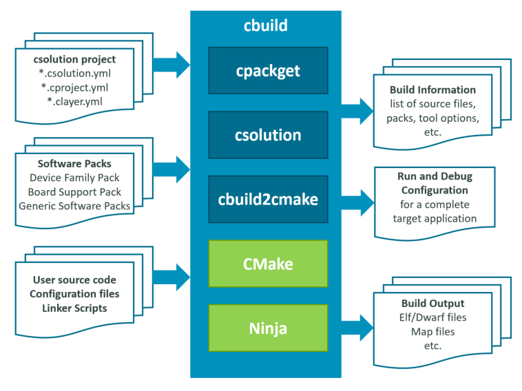

# CMSIS-Toolbox

Thank you for using the **CMSIS-Toolbox** that provides command-line tools for:

- Project creation and build of embedded applications that utilize [*software packs*](https://www.keil.arm.com/packs/). Various compilation tools are supported.
- Pack creation, maintenance, and distribution of *software packs* in [Open-CMSIS-Pack format](https://open-cmsis-pack.github.io/Open-CMSIS-Pack-Spec/main/html/index.html).

## Manual Chapters

- [**Overview**](#content-of-overview-chapter) of the CMSIS-Toolbox (this chapter).

- [**Installation**](installation.md) explains the setup of the CMSIS-Toolbox along with a build environment for embedded applications that are based on Arm Cortex-M processors.

- [**Build Overview**](build-overview.md): describes the overall concept, outlines the *csolution project files* that describes the software application, and contains references to examples and project templates.

- [**Build Tools**](build-tools.md) contains command line descriptions for `cbuild` (build projects), `csolution` (transform *csolution project files*), and `cpackget` (manage software packs).

- [**CMSIS Solution Project File Format**](YML-Input-Format.md) is a detailed description of the *csolution project files* that define the software application in YAML format.

- [**Create Applications**](CreateApplications.md) explains how to start projects using software packs. It covers also linker script creation, software pack structure, and project maintenance with pack upgrades.

- [**Reference Applications**](ReferenceApplications.md) explains how to use and create examples that show middleware usage on on many different evaluation boards including custom hardware.

- [**Configure STM32 Devices with CubeMX**](CubeMX.md) explains how to use [STM32CubeMX](https://www.st.com/en/development-tools/stm32cubemx.html) to manage device and board configuration.
  
- [**Build Information Files**](YML-CBuild-Format.md) details the build information generated by the `csolution` tool.

- [**Build Operation**](build-operation.md) contains for advanced users further details about build process, CMake backend configuration, and generator integration.

- [**Pack Creation**](pack-tools.md) describes how to create software packs and explains the pack creation tools `packchk` (software pack verification) and `svdconv` (SVD file converter).

## Content of Overview Chapter

- [CMSIS-Toolbox](#cmsis-toolbox)
  - [Manual Chapters](#manual-chapters)
  - [Content of Overview Chapter](#content-of-overview-chapter)
  - [Target Audience](#target-audience)
  - [Overall Workflow](#overall-workflow)
  - [Command Line and IDE Usage](#command-line-and-ide-usage)
  - [Benefits](#benefits)
  - [Revision History](#revision-history)

## Target Audience

This user's guide assumes some top-level knowledge about Cortex-M software development. It is written for embedded developers that want to utilize microcontroller devices that incorporate Cortex-M processors, Ethos-U NPUs, and work with C/C++ compiler toolchains. The CMSIS-Toolbox supports currently:

- [Arm Compiler for Embedded](https://developer.arm.com/Tools%20and%20Software/Arm%20Compiler%20for%20Embedded) version 6.18 or higher
  - Arm FuSa Compiler for Embedded version 6.16.2 or higher is also supported
- [Arm GNU Toolchain (GCC)](https://developer.arm.com/Tools%20and%20Software/GNU%20Toolchain) version 10.3.1 or higher
- [IAR Compiler](https://www.iar.com/products/architectures/arm/) version 9.32.1 or higher
- [CLANG Compiler version 17.0.1](https://github.com/ARM-software/LLVM-embedded-toolchain-for-Arm/releases) or higher based on LLVM technology

## Overall Workflow

The CMSIS-Toolbox uses Software Packs for device/board support and access reusable software components.  The operation is controlled via intuitive [*csolution project files* in YAML format](YML-Input-Format.md). The overall application is defined in the `*.csolution.yml` file and contains one or more projects that can utilize pre-configured software layers. The build engine CMake/Ninja calls the C/C++ compiler toolchain that generates the Build Output.

The [**cbuild: Build Invocation**](build-tools.md#cbuild-invocation) command orchestrates the overall build steps. This command calls individual command line tools to generate the application as outlined in the following diagram.

The build steps are:

1. [**cpackget**](build-tools.md#cpackget-invocation) downloads Software Packs that are required for `*.csolution.yml` when using the option `--pack`.
2. [**csolution**](build-tools.md#csolution-invocation) processes the User Input and the Software Packs to generate the overall Build Information. Refer to [Overview of Operation](build-overview.md#overview-of-operation) for details.
3. **cbuild2cmake** converts this Build Information into CMake format.
4. **CMake/Ninja** call the C/C++ compiler toolchain to translate the source files into the application image.

> **Note:**
>
> The CMSIS-Toolbox build system does not use the CMake compiler and linker flags specified by environment variables [CFLAGS, LDFLAGS](https://cmake.org/cmake/help/latest/envvar/CFLAGS.html).
> Refer to the chapter [Build Operation](build-operation.md) for further details of the build process.

## Command Line and IDE Usage

The CMSIS-Toolbox is a set of command line tools that are designed for stand-alone usage and integration into IDEs or DevOps systems for Continuous Integration (CI) workflows.

The [VS Code](https://marketplace.visualstudio.com/items?itemName=Arm.keil-studio-pack) IDE integration available from Arm is a viewer to the [*csolution project files*](YML-Input-Format.md) and provides graphical ways to modify the content. Refer to [DevOps Usage](build-tools.md#devops-usage) for more information on integration into CI workflows.

## Benefits

The overall benefits of the CMSIS-Toolbox are:

- Flexible command line tools that can be used stand-alone or integrated into [VS Code](https://marketplace.visualstudio.com/items?itemName=Arm.keil-studio-pack) or [DevOps systems for Continuous Integration (CI)](build-tools.md#devops-usage).
- Stand-alone tools are available [for all host platforms](https://artifacts.keil.arm.com/cmsis-toolbox/) (Windows, Mac, Linux) for flexible deployment.
- [Software Packs](https://www.keil.arm.com/packs/) simplify tool setup with `device:` or `board:` selection and project creation with access to reusable software components.
- Organize solutions with projects that are independently managed simplifies a wide range of use cases including  multi-processor applications or unit testing.
- Integrates with domain specific [generators](build-overview.md#use-a-generator) (i.e. CubeMX) that simplify configuration of devices/boards and complex software stacks such as motor control.
- Provisions for product lifecycle management (PLM) with versioned software packs that are easy to update and management for configuration files.
- Software layers enable code reuse across similar applications with a pre-configured set of source files and software components.
- Target types allow application deployment to different hardware (test board, production hardware, virtual hardware, etc.).
- Build types support software testing and verification (debug build, test build, release build, ect.).
- Support for multiple toolchains, even within the same set of *project files* and command line options to select different toolchains during verification.
- [Linker Script Management](build-overview.md#linker-script-management) utilizes device and board information to define the  available memory and allows flexible control of the linker operation.
- [Generator Support](build-overview.md#generator-support) for utilizing tools such as CubeMX or MCUxpresso Config Tools to configure devices or software stacks.
- Uses a CMake backend for the build process that integrates with other tools such as VS Code intellisense.

## Revision History

Version            | Description
:------------------|:-------------------------
2.6.0              | CMSIS-Toolbox [2.6.0](https://github.com/Open-CMSIS-Pack/cmsis-toolbox/releases/tag/2.6.0); adds for [trustzone: secure-only](YML-Input-Format.md#processor) for projects without secure entries, adds [API](YML-CBuild-Format.md#apis) and [messages](YML-CBuild-Format.md#cbuilds) information to cbuild.yml, fixes several minor issues.
2.5.0              | CMSIS-Toolbox [2.5.0](https://github.com/Open-CMSIS-Pack/cmsis-toolbox/releases/tag/2.5.0); direct CMake interface is now default, [`tmpdir:`](YML-Input-Format.md#output-dirs) controls location of interim files, adds [`add-path-asm:`](YML-Input-Format.md#add-path-asm), adds [`define-asm`](YML-Input-Format.md#define-asm), adds [regular expression](YML-Input-Format.md#regular-expressions) search to `for-context:`/`not-for-context`, and contains several corrections.
2.4.0              | CMSIS-Toolbox [2.4.0](https://github.com/Open-CMSIS-Pack/cmsis-toolbox/releases/tag/2.4.0); adds [CubeMX integration](CubeMX.md), [pre/post-build steps](YML-Input-Format.md#prepost-build-steps), simplifies the [generator integration](build-operation.md#generator-integration), and contains several corrections.
2.3.0              | CMSIS-Toolbox [2.3.0](https://github.com/Open-CMSIS-Pack/cmsis-toolbox/releases/tag/2.3.0) adds in the csolution project files [component instances](YML-Input-Format.md#instances) and [optimize: debug](YML-Input-Format.md#optimize). Tools are extended with [cbuild setup command](build-operation.md#details-of-the-setup-mode), [--frozen-pack option](build-overview.md#reproducible-builds). Refer to [release information](https://github.com/Open-CMSIS-Pack/cmsis-toolbox/releases/tag/2.3.0) for more details.
2.2.0              | CMSIS-Toolbox [2.2.0](https://github.com/Open-CMSIS-Pack/cmsis-toolbox/releases/tag/2.2.0) adds [generator integration](build-operation.md#generator-integration), extends [translation controls](YML-Input-Format.md#translation-control), adds [context set](build-overview.md#working-with-context-set), adds [pack locking](YML-CBuild-Format.md#pack-locking), and improves [linker script management](build-overview.md#linker-script-management). Refer to [release information](https://github.com/Open-CMSIS-Pack/cmsis-toolbox/releases/tag/2.2.0) for more details.
2.0.0              | Initial release for CMSIS-Toolbox [2.0.0](https://github.com/Open-CMSIS-Pack/cmsis-toolbox/releases/tag/2.0.0)
