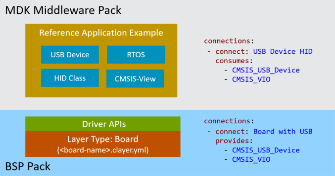
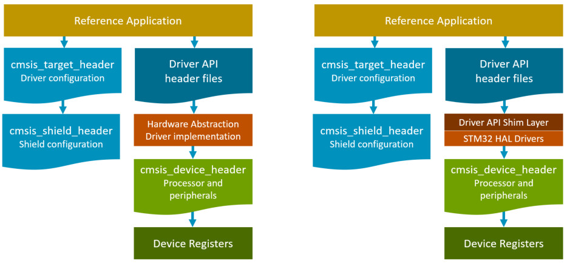
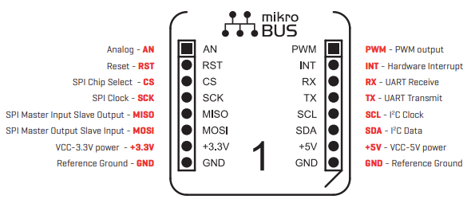

# Reference Applications

<!-- markdownlint-disable MD009 -->
<!-- markdownlint-disable MD013 -->
<!-- markdownlint-disable MD036 -->

This chapter explains how to work with *Reference Applications* that can run on several evaluation boards.

## Introduction

The CMSIS-Pack format supports different types of project examples:

- *Template Projects* are [stub projects](https://github.com/Open-CMSIS-Pack/csolution-examples/tree/main/Templates) that help getting started. Some software packs may contain device-specific templates.
- *Examples* are created for a specific hardware or evaluation board. These are typically complete projects that directly interface with board and device peripherals.
- *Reference Applications* use defined interfaces (APIs) and are therefore hardware agnostic. These project examples show the usage of middleware components and require additional [software layers](build-overview.md#software-layers) with API drivers for the specific target hardware, typically an evaluation board.

The following sections explain the usage, structure, and creation of *Reference Applications* that can target many different evaluation boards.

Refer to [Pack Creation s&raquo; Project Examples](pack-tools.md#project-examples) for information on how to publish project examples as part of software packs.

## Types of Reference Applications

*Reference Applications* may show the usage of middleware, software libraries, and custom code that can run on many different target hardware boards. Such software uses [application programming interfaces (APIs)](https://en.wikipedia.org/wiki/API) to interface with hardware interfaces or other software components.

### MDK-Middleware Reference Applications

The [MDK-Middleware](https://www.keil.arm.com/packs/mdk-middleware-keil) provides software components for IPv4/IPv6 networking, USB Host/Device communication, and a variety of file systems for data storage.

The MDK-Middleware software pack contains Reference Applications that show how to use these software components. These examples are hardware agnostic; adding a board layer that provides the required APIs allows running the example project on specific target hardware.



The picture above shows how a USB HID example connects to a board-specific software layer.
The *Reference Application* does not specify a target hardware. For execution on target hardware, a software layer is required that provides the hardware-specific APIs. These board-specific layers are provided in BSP packs, which allows the example to run on many different hardware targets.

The Reference example uses [`connections:`](YML-Input-Format.md#connections) to list the consumed (required) APIs. The board layer in the BSP pack provides these [`connections:`](YML-Input-Format.md#connections) and may offer several additional `connections:`, making the layer suitable for a wide range of Reference Applications.

As the *Reference Application* is not hardware-specific, it does not define a target type. Also, it does not add the board-specific software layer. It requires two steps to configure the `*.csolution.yml` file of such an example for an evaluation board. Refer to the [Usage](#usage) section for more information.

***Reference Application* `*.csolution.yml` file**

```yml
solution:
  cdefault:
  compiler: AC6
  :
  packs:
# Step 1: Specify DFP and BSP for the device and board, for example with:
#   - pack: Keil::STM32U5xx_DFP
#   - pack: Keil::B-U585I-IOT02A_BSP

  target-types:
# Step 1: Specify your board, for example with:
#   - type: STM32U585
#     board: B-U585I-IOT02A
# Step 2: Run `cbuild setup` and use cbuild-idx.yml to identify variables, for example:
#     variables:
#       - Board-Layer:  $SolutionDir()$/Board/B-U585I-IOT02A/Board.clayer.yml
```

### Sensor Reference Applications

The overall concept of *Reference Applications* and the same board-specific software layers can be used for a wide range of software stacks. For example, a sensor SDK pack may provide *Reference Applications* that show the usage of a MEMS sensor. This MEMS sensor is additional hardware that could be provided by a widely supported Arduino UNO shield.

The sensor SDK with the related Arduino shield can be structured to work with a wide range of evaluation boards that offer a compatible board-specific software layer.

The overall structure of a sensor example project is shown in the picture below. It is composed of:

- The *Reference Application* with sensor-specific middleware that shows the usage of a MEMS sensor.
- `Layer type: Board` contains the hardware-specific setup of an evaluation board with a Cortex-M processor along with drivers, i.e. for SPI or I2C that connect to the pins of the Arduino shield.
- `Layer type: Shield` defines the pin routing of the Arduino UNO shield, which adds the MEMS sensor to the evaluation board.


!!! Note
    As the `connections:` for the MEMS sensor are specific to the sensor itself, the same *Reference Application* also works with an evaluation board that integrates the MEMS sensor (and, therefore, requires no Shield layer). In this case, the board-specific software layer adds the sensor-specific `connections:`.

### Targeting Custom Hardware

A *Reference Application* may serve as a starting point for user applications that target custom hardware.

It is required to provide:

- A software layer with a compatible set of APIs (`connections:`) consumed by the *Reference Application*. This software layer can be added along with the target type (in the `*.csolution.yml` file) that defines the custom hardware.

!!! Note
    It is not required to define `connections:` as this information is only used to identify compatible layers.

- A header file that replaces the `CMSIS_target_header`. Refer to [Header File Structure](#header-file-structure) for more information.

**Example `*.csolution.yml` file for custom hardware**

```yml
solution:
  cdefault:
  compiler: AC6
  :
  target-types:
    - type: MyHardware
      device: STM32U585AIIx      # custom hardware uses only a device definition
      variables:
        - Board-Layer:  $SolutionDir()$/MyTarget/MyHardware.clayer.yml
```

**Example MyHardware.clayer.yml**

You may use a `*.clayer.yml` file for implementing the HAL drivers for the application and define the `CMSIS_target_header` as shown below:

```yml
layer:
  :
  define:
    - CMSIS_target_header: "\"MyHardware.h\""
```

## Usage

A *Reference Application* is an incomplete `*.csolution.yml` project file that requires additional intervention.

The following steps explain how to compile the project:

### Step 1: Add DFP and BSP

In the `*.csolution.yml` file under the `packs:` node, add the DFP (for the device) and the BSP (for the board). Under `target-types:`, add your board.

```yml
solution:
  cdefault:
  :
  packs:
    - pack: Keil::STM32U5xx_DFP
    - pack: Keil::B-U585I-IOT02A_BSP
  target-types:
    - type: MyBoard
      board: B-U585I-IOT02A         # name of a target board
```

### Step 2: Run `cbuild setup`

Run `cbuild setup` with the `*.csolution.yml` file. This identifies compatible layers that are part of the software packs listed in the `*.csolution.yml` file with an output similar to:

```txt
>cbuild setup xxx.csolution.yml
error csolution: undefined variables in xxx.csolution.yml:
  - $Board-Layer$
To resolve undefined variables, copy the settings from cbuild-idx.yml to csolution.yml
```

The related `*.cbuild-idx.yml` should contain information similar to this:

```yml
build-idx:
  generated-by: csolution version 2.4.0
  cdefault: cdefault.yml
  csolution: xxx.csolution.yml
  configurations:
    - target-type: B-U585I-IOT02A
      target-configurations:
        - configuration:
          variables:
            - Board-Layer: ${CMSIS_PACK_ROOT}/Keil/B-U585I-IOT02A_BSP/2.0.0/Layers/IoT/Board.clayer.yml
              description: B-U585I-IOT02A Board setup for IoT
              path: ${CMSIS_PACK_ROOT}/Keil/B-U585I-IOT02A_BSP/2.0.0/Layers/IoT
              file: Board.clayer.yml
              copy-to: .Board/U585
```

As a user, you have now two choices to work with the identified software layer:

### Refer layers in ${CMSIS_PACK_ROOT}

This is useful when there is no plan to modify the software layer, for example, in the early phase of adoption.

```yml
solution:
  cdefault:
  :
  target-types:
    - type: B-U585I-IOT02A
      board: B-U585I-IOT02A         # name of a target board
      variables:
        - Board-Layer: ${CMSIS_PACK_ROOT}/Keil/B-U585I-IOT02A_BSP/2.0.0/Layers/IoT/Board.clayer.yml
```

### Copy layers to csolution project

This allows the modification of the layer, for example, adding or removing drivers or changing device settings.

It requires these steps:

1. Copy all files from `path`, i.e. `${CMSIS_PACK_ROOT}/Keil/B-U585I-IOT02A_BSP/2.0.0/Layers/IoT` to the local csolution project directory.
2. If set, remove the R/O attribute from the copied files.
3. Under `variables:`, add the path to the `*.clayer.yml` file. Use `$SolutionDir()` as base path to make the project portable.

```yml
solution:
  cdefault:
  :
  target-types:
    - type: B-U585I-IOT02A
      board: B-U585I-IOT02A         # name of a target board
      variables:
        - Board-Layer: $SolutionDir()$/Board/B-U585I-IOT02A/Board.clayer.yml
```

!!! Note
    The copy step is executed for you by some IDEs during the *Create New Project* workflow.

## Structure

The following section describes the overall file structure of *Reference Applications*.

### Project Files

A `*.csolution.yml` project file containing software layers for two different evaluation boards should look like the one shown below. This project contains three examples that show the different features of USB device middleware.

The actual example project (HID, MSC, or CDC1) is selected using a [context set](build-overview.md#working-with-context-set); the compiler is selected using the `--toolchain` option. To translate the completed *Reference Applications* use:

```bash
cbuild USB_Device.csolution.yml --context-set --toolchain AC6
```

**Example `USB_Device.csolution.yml` file for two boards with three projects**

```yml
solution:
  created-for: CMSIS-Toolbox@2.4.0
  cdefault:

  target-types:
    - type: B-U585I-IOT02A
      board: B-U585I-IOT02A
      variables:
        - Board-Layer: $SolutionDir()$\Board\B-U585I-IOT02A\Board.clayer.yml

    - type: LPC55S69-EVK            # type name identical with board name?
      board: LPC55S69-EVK
      variables:
        - Board-Layer: $SolutionDir()$\Board\LPC55S69-EVK\Board.clayer.yml

  build-types:
    - type: Debug
      debug: on
      optimize: debug
    - type: Release
      debug: off
      optimize: balanced

  projects:
    - project: HID/HID.cproject.yml
    - project: MSC/MassStorage.cproject.yml
    - project: CDC1/VirtualCOM.cproject.yml
```

### Typical Directory Structure

The table below shows the typical directory structure of the above example from the programmer's point of view. The software layer in the directory `./Board` is copied from the BSP of the related board.

Directory Content                   | Content
:-----------------------------------|:---------------
`USB_Device.csolution.yml`          | Overall CMSIS solution project file.
`./HID/`                            | HID example project from MDK-Middleware pack.
`./MSC/`                            | MSC example project from MDK-Middleware pack.
`./CDC1/`                           | CDC1 example project from MDK-Middleware pack.
`./Board/B-U585I-IOT02A`            | Board software layer from B-U585I-IOT02A BSP.
`./Board/LPC55S69-EVK`              | Board software layer from LPC55S69-EVK BSP.

### Header File Structure

The interfaces between the software layers are defined in header files. Thus, is it possible to reuse the various software blocks with other build systems that are not CMSIS aware. The following diagram shows the overall header file structure.



The *Reference Application* has no direct access to hardware. Therefore, it does not use the [`CMSIS_device_header`](https://arm-software.github.io/CMSIS_6/latest/Core/using_pg.html#using_packs) provided by the CMSIS-Core that defines the registers and interrupt mapping.

To access target hardware, these header files are used by the *Reference Application*:

- Standardized `Driver API header files` are used for communication with device peripherals. Header files of CMSIS-Drivers are provided by the [CMSIS base software pack](https://arm-software.github.io/CMSIS_6/latest/General/index.html).
- The configuration of the driver interfaces is defined by the `CMSIS_target_header`. This header therefore specifies the available resources of the target hardware that can be used by the *Reference Application*. The [Header File Example](#header-file-example) shows a typical structure of the `CMSIS_target_header`.
- When a shield is applied to an evaluation board, the `CMSIS_shield_header` extends the resource configuration of the `CMSIS_target_header`.

!!! Note
    The driver implementation of the hardware abstraction might use *shim layer* as shown on the right side of above diagram. For example, the [driver implementation for STM32 devices](https://github.com/Open-CMSIS-Pack/CMSIS-Driver_STM32) uses the STM32 HAL.

### Application Program Start

A *Reference Application* starts with the C function `app_main` as shown below.

```c
#include CMSIS_target_header    // board resource definitions

// reference application of a middleware component
int app_main (void)  {

};
```

The application may use an RTOS kernel or run a simple `while` loop. Additional software components such as [CMSIS-View](https://www.keil.arm.com/packs/cmsis-view-arm), [CMSIS-DSP](https://www.keil.arm.com/packs/cmsis-dsp-arm), or [MbedTLS](https://www.keil.arm.com/packs/mbedtls-arm/) are added directly to the *Reference Application*. In general, the `connections:` that are consumed should be minimized, allowing the example to be run on many different target boards.

### Board Layer

The board layer provides system startup, board/device hardware initialization, and transfers control to the application. It also exposes various drivers and interfaces.

**Typical Features:**

- System startup, including clock and memory configuration.
- Device/Board hardware initialization.
- Calls the application startup function.
- Drivers for board peripherals \[optional].
- Interfaces to LEDs and switches \[optional].
- STDIO re-targeting to debug interfaces \[optional].
- Shield setup and drivers for Arduino interfaces \[optional].
- Heap and Stack configuration \[optional].

**Files:**

- CMSIS startup and system file for device initialization.
- `main.c` source module that implements the function `main`.
- Optional drivers and interfaces (CMSIS-Drivers, GPIO, STDIO).
- Files that relate to the device and/or board configuration (i.e. generated by MCUXpresso or STM32CubeMX)
- Linker script definition for boards that require specific memory configurations.

The configuration parameters of the available APIs are defined in `CMSIS_target_header`.

**Generator Usage:**

The board-specific software layer is used in many different projects. When a board configuration is generated by tools, such as MCUXpresso or STM32CubeMX, for example, [configure the generator output directory](build-overview.md#configure-generator-output) and import file using the [`generators:`](YML-Input-Format.md#generators) node in the `*.clayer.yml` file as shown below:

```yml
layer:

  generators:
    options:
      - generator: CubeMX
        path: ./CubeMX
        name: Board
```

### Shield Layer

A shield layer adds support for additional hardware via plugin shields (i.e. Arduino Uno).  Arduino shields [*consume connections*](YML-Input-Format.md#example-sensor-shield) with the prefix `ARDUINO_UNO_`. In the future, other shields may be supported as well.

Shields may feature various hardware modules such as WiFi chips or MEMS sensors. Frequently, the shield's software layer only defines a header file that redirects the Arduino-specific `connect:` to a chip-specific `connect:`, which is then used by application software.

The shield's software layer is configured from the board software layer, which calls the following function:

``` c
extern int32_t shield_setup (void);
```

## Connections

[Connections](YML-Input-Format.md#connections) are only used to identify compatible software layers. Since there are no strict rules for the **`connect` Name**, it is possible to extend it with additional namespacing, i.e., prefixing with *ST_* to denote ST-specific interfaces.

There are also no strict rules on how the different software layers consume or provide the `connect` names.  However, guidelines will be developed once reference applications mature.

Currently, the following **`connect` names** are used.

`connect` name                                               | Value                  | Description
:------------------------------------------------------------|:-----------------------|:--------------------
.                                                            |.                       | **Arduino Shield Interface**
[ARDUINO_UNO_UART](#arduino_uno_uart)                        | -                      | CMSIS-Driver USART connecting to UART on Arduino pins D0..D1
[ARDUINO_UNO_SPI](#arduino_uno_spi)                          | -                      | CMSIS-Driver SPI connecting to SPI on Arduino pins D10..D13
[ARDUINO_UNO_I2C](#arduino_uno_i2c)                          | -                      | CMSIS-Driver I2C connecting to I2C on Arduino pins D20..D21
[ARDUINO_UNO_I2C-Alt](#arduino_uno_i2c)                      | -                      | CMSIS-Driver I2C connecting to I2C on Arduino pins D18..D19
[ARDUINO_UNO_D0 .. D21](#arduino_uno_dx)                     | -                      | CMSIS-Driver GPIO connecting to Arduino pins D0..D21
.                                                            |.                       | **CMSIS Driver and RTOS Interfaces**
[CMSIS_ETH](#cmsis_eth)                                      | -                      | CMSIS-Driver ETH connected to physical board connector
[CMSIS_MCI](#cmsis_mci)                                      | -                      | CMSIS-Driver MCI connected to physical board connector
[CMSIS_USB_Device](#cmsis_usb_device)                        | -                      | CMSIS-Driver USB Device connected to physical board connector
[CMSIS_USB_Host](#cmsis_usb_host)                            | -                      | CMSIS-Driver USB Host connected to physical board connector
[CMSIS_VIO](#cmsis_vio)                                      | -                      | CMSIS-Driver VIO interface for virtual I/O
CMSIS-RTOS2                                                  | -                      | CMSIS-RTOS2 compliant RTOS
.                                                            |.                       | **mikroBUS socket Interface**
[MIKROBUS_AN](#mikrobus_an_int_pwm)                          |-                       | CMSIS-Driver GPIO connecting to mikroBUS AN
[MIKROBUS_INT](#mikrobus_an_int_pwm)                         |-                       | CMSIS-Driver GPIO connecting to mikroBUS INT
[MIKROBUS_PWM](#mikrobus_an_int_pwm)                         |-                       | CMSIS-Driver GPIO connecting to mikroBUS PWM
[MIKROBUS_I2C](#mikrobus_i2c)                                |-                       | CMSIS-Driver I2C connecting to mikroBUS I2C
[MIKROBUS_SPI](#mikrobus_spi)                                |-                       | CMSIS-Driver SPI connecting to mikroBUS SPI
[MIKROBUS_UART](#mikrobus_uart)                              |-                       | CMSIS-Driver USART connecting to mikroBUS UART
.                                                            |.                       | **I/O Retargeting**
[STDERR](#stdio)                                             | -                      | Standard Error output
[STDIN](#stdio)                                              | -                      | Standard Input
[STDOUT](#stdio)                                             | -                      | Standard Output
.                                                            |.                       | **Memory allocation**
Heap                                                         | Heap Size              | Memory heap configuration

ToDo:

- what features of CMSIS-RTOS2 are typically used by board layers?
- more information about Heap. How is it configured? Which existing Reference Applications are using it?  FreeRTOS has its own heap management; is it really required?

### ARDUINO_UNO_UART

Connects to a [CMSIS-Driver USART Interface](https://arm-software.github.io/CMSIS_6/latest/Driver/group__usart__interface__gr.html) configured in asynchronous UART mode with no modem lines.

`CMSIS_target_header` contains the driver instance number with this definition:

```c
#define ARDUINO_UNO_UART    3     // CMSIS-Driver USART instance number
```

### ARDUINO_UNO_I2C

`ARDUINO_UNO_I2C` or `ARDUINO_UNO_I2C-Alt` connects to a [CMSIS-Driver I2C Interface](https://arm-software.github.io/CMSIS_6/latest/Driver/group__i2c__interface__gr.html) configured in controller mode.

`CMSIS_target_header` contains the driver instance number with this definition:

```c
#define ARDUINO_UNO_I2C    0     // CMSIS-Driver I2C instance number
```

### ARDUINO_UNO_SPI

Connects to a [CMSIS-Driver SPI Interface](https://arm-software.github.io/CMSIS_6/latest/Driver/group__spi__interface__gr.html) configured in controller mode and CPOL/CPHA frame format (no TI or Microwire).

The Target Select (SS) pin (typically on ARDUINO_UNO_D10) is not handled by CMSIS-Driver SPI interface; it is driven by the GPIO interface.

`CMSIS_target_header` contains the driver instance number with this definition:

```c
#define ARDUINO_UNO_SPI    1     // CMSIS-Driver SPI instance number
```

### ARDUINO_UNO_Dx

The `ARDUINO_UNO_D0` .. `ARDUINO_UNO_D21` connects to a [CMSIS-Driver GPIO Interface](https://arm-software.github.io/CMSIS_6/latest/Driver/group__gpio__interface__gr.html).

`CMSIS_target_header` contains the pin mapping to the physical driver.

```c
#define ARDUINO_UNO_D0  GPIO_PORTD(9U)  /* USART3: RX */
#define ARDUINO_UNO_D1  GPIO_PORTD(8U)  /* USART3: TX */
#define ARDUINO_UNO_D2  GPIO_PORTD(15U)
#define ARDUINO_UNO_D3  GPIO_PORTB(2U)
#define ARDUINO_UNO_D4  GPIO_PORTE(7U)
#define ARDUINO_UNO_D5  GPIO_PORTE(0U)
#define ARDUINO_UNO_D6  GPIO_PORTB(6U)
#define ARDUINO_UNO_D7  GPIO_PORTF(13U)
#define ARDUINO_UNO_D8  GPIO_PORTC(1U)
#define ARDUINO_UNO_D9  GPIO_PORTA(8U)
#define ARDUINO_UNO_D10 GPIO_PORTE(12U)
#define ARDUINO_UNO_D11 GPIO_PORTE(15U) /* SPI1: MOSI */
#define ARDUINO_UNO_D12 GPIO_PORTE(14U) /* SPI1: MISO */
#define ARDUINO_UNO_D13 GPIO_PORTE(13U) /* SPI1: SCK  */
#define ARDUINO_UNO_D14 GPIO_PORTC(0U)
#define ARDUINO_UNO_D15 GPIO_PORTC(2U)
#define ARDUINO_UNO_D16 GPIO_PORTC(4U)
#define ARDUINO_UNO_D17 GPIO_PORTC(5U)
#define ARDUINO_UNO_D18 GPIO_PORTA(7U)
#define ARDUINO_UNO_D19 GPIO_PORTB(0U)
#define ARDUINO_UNO_D20 GPIO_PORTB(8U)  /* I2C1: SDA  */
#define ARDUINO_UNO_D21 GPIO_PORTB(9U)  /* I2C1: SCL  */
```

### CMSIS_ETH

Connects to a [CMSIS-Driver Ethernet Interface](https://arm-software.github.io/CMSIS_6/latest/Driver/group__eth__interface__gr.html) that offers a physical Ethernet connector on the evaluation board.

`CMSIS_target_header` contains the pin mapping to the physical driver.

```c
#define CMSIS_DRIVER_ETH    0     // CMSIS-Driver Ethernet instance number
```

### CMSIS_MCI

Connects to a [CMSIS-Driver MCI Interface](https://arm-software.github.io/CMSIS_6/latest/Driver/group__mci__interface__gr.html) that offers a physical memory card connector on the evaluation board.

`CMSIS_target_header` contains the pin mapping to the physical driver.

```c
#define CMSIS_DRIVER_MCI    0     // CMSIS-Driver MCI instance number
```

### CMSIS_USB_Device

Connects to a [CMSIS-Driver USB Device Interface](https://arm-software.github.io/CMSIS_6/latest/Driver/group__usbd__interface__gr.html) that offers a physical USB connector on the evaluation board.

`CMSIS_target_header` contains the pin mapping to the physical driver.

```c
#define CMSIS_DRIVER_USBD   0     // CMSIS-Driver USB Device instance number
```

### CMSIS_USB_Host

Connects to a [CMSIS-Driver USB Host Interface](https://arm-software.github.io/CMSIS_6/latest/Driver/group__usbh__interface__gr.html) that offers a physical USB connector on the evaluation board.

`CMSIS_target_header` contains the pin mapping to the physical driver.

```c
#define CMSIS_DRIVER_USBH   0     // CMSIS-Driver USB Host instance number
```

### CMSIS_VIO

Connects to a [CMSIS-Driver VIO Interface](https://arm-software.github.io/CMSIS_6/latest/Driver/group__vio__interface__gr.html), a virtual I/O interface that connects on physical boards to LEDs and switches.

### MIKROBUS_AN/_INT/_PWM

The `MIKROBUS_AN, MIKROBUS_INT and MIKROBUS_PWM` connect to a [CMSIS-Driver GPIO Interface](https://arm-software.github.io/CMSIS_6/latest/Driver/group__gpio__interface__gr.html).

`CMSIS_target_header` contains the pin mapping to the physical driver.

```c
#define MIKROBUS_AN     GPIO_PORTD(0U)
#define MIKROBUS_INT    GPIO_PORTD(1U)
#define MIKROBUS_PWM    GPIO_PORTD(2U)
```

### MIKROBUS_I2C

Connects to a [CMSIS-Driver I2C Interface](https://arm-software.github.io/CMSIS_6/latest/Driver/group__i2c__interface__gr.html) configured in controller mode.

`CMSIS_target_header` contains the driver instance number with this definition:

```c
#define MIKROBUS_I2C        0     // CMSIS-Driver I2C instance number
```

### MIKROBUS_SPI

Connects to a [CMSIS-Driver SPI Interface](https://arm-software.github.io/CMSIS_6/latest/Driver/group__spi__interface__gr.html) configured in controller mode and CPOL/CPHA frame format (no TI or Microwire).

The Chip Select (CS) pin may be handled by CMSIS-Driver SPI interface or driven by the GPIO interface.

`CMSIS_target_header` contains the driver instance number with this definition:

```c
#define MIKROBUS_SPI        0     // CMSIS-Driver SPI instance number
```

### MIKROBUS_UART

Connects to a [CMSIS-Driver USART Interface](https://arm-software.github.io/CMSIS_6/latest/Driver/group__usart__interface__gr.html) configured in asynchronous UART mode with no modem lines.

`CMSIS_target_header` contains the driver instance number with this definition:

```c
#define MIKROBUS_UART       0     // CMSIS-Driver USART instance number
```

### STDIO

The `STDIN`, `STDOUT`, and `STDERR` describe the I/O redirection via the [CMSIS-Compiler](https://arm-software.github.io/CMSIS-Compiler/main/index.html) software component. Typically, the redirect is to a UART dedicated to debugging.

## Arduino Shield

The software layers [Board](#board-layer) and [Shield](#shield-layer) are currently based on Arduino UNO connectors. To combine different boards and shields a consistent pin naming is required. The standardized mapping is shown in the diagram below.


## mikroBUS Header



## Header File Example

Two header files contain I/O configuration settings for the application program:

- `CMSIS_target_header` defines the resources available by the evaluation board.
- `CMSIS_shield_header` extends this `CMSIS_target_header` with resources of a shield that is applied to an evaluation board.

Refer to [Header File Structure](#header-file-structure) for more information.

**`CMSIS_target_header`**

```c
#ifndef B_U585I_IOT02A_H_
#define B_U585I_IOT02A_H_

#include "stm32u5xx_hal.h"
#include "GPIO_STM32U5xx.h"
#include "Driver_I2C.h"
#include "Driver_SPI.h"
#include "Driver_USART.h"

// B-U585I-IOT02A Arduino Connector Pin Definitions
#define ARDUINO_UNO_D0  GPIO_PORTD(9U)  /* USART3: RX */
#define ARDUINO_UNO_D1  GPIO_PORTD(8U)  /* USART3: TX */
#define ARDUINO_UNO_D2  GPIO_PORTD(15U)
#define ARDUINO_UNO_D3  GPIO_PORTB(2U)
#define ARDUINO_UNO_D4  GPIO_PORTE(7U)
#define ARDUINO_UNO_D5  GPIO_PORTE(0U)
#define ARDUINO_UNO_D6  GPIO_PORTB(6U)
#define ARDUINO_UNO_D7  GPIO_PORTF(13U)
#define ARDUINO_UNO_D8  GPIO_PORTC(1U)
#define ARDUINO_UNO_D9  GPIO_PORTA(8U)
#define ARDUINO_UNO_D10 GPIO_PORTE(12U)
#define ARDUINO_UNO_D11 GPIO_PORTE(15U) /* SPI1: MOSI */
#define ARDUINO_UNO_D12 GPIO_PORTE(14U) /* SPI1: MISO */
#define ARDUINO_UNO_D13 GPIO_PORTE(13U) /* SPI1: SCK  */
#define ARDUINO_UNO_D14 GPIO_PORTC(0U)
#define ARDUINO_UNO_D15 GPIO_PORTC(2U)
#define ARDUINO_UNO_D16 GPIO_PORTC(4U)
#define ARDUINO_UNO_D17 GPIO_PORTC(5U)
#define ARDUINO_UNO_D18 GPIO_PORTA(7U)
#define ARDUINO_UNO_D19 GPIO_PORTB(0U)
#define ARDUINO_UNO_D20 GPIO_PORTB(8U)  /* I2C1: SDA  */
#define ARDUINO_UNO_D21 GPIO_PORTB(9U)  /* I2C1: SCL  */

// CMSIS Driver instances on Arduino connector
#define ARDUINO_UNO_I2C     1
#define ARDUINO_UNO_SPI     1
#define ARDUINO_UNO_UART    3

// CMSIS Driver instances of Board peripherals
#define CMSIS_DRIVER_USBD   0  // instance of CMSIS-Driver USB Device

// CMSIS Drivers
extern ARM_DRIVER_I2C   Driver_I2C1;
extern ARM_DRIVER_SPI   Driver_SPI1;
extern ARM_DRIVER_USART Driver_USART1;
extern ARM_DRIVER_USART Driver_USART3;

#ifdef CMSIS_shield_header
#include CMSIS_shield_header
#endif

#endif /* B_U585I_IOT02A_H_ */
```

**`CMSIS_shield_header`**

```c
#ifndef _FRDM_STBC_AGM01_SHIELD_H_
#define _FRDM_STBC_AGM01_SHIELD_H_

// FRDM-STBC-AGM01 Shield Reset
#define RESET_GPIO              ARDUINO_UNO_D17

#define SHIELD_MULTIB   0
#define SHIELD_NONE     1
#define SHIELD_AGM01    2
#define SHIELD_AGM02    3
#define SHIELD_AGMP03   4
#define SHIELD_AGM04    5
#define THIS_SHIELD     SHIELD_AGM01

// Shield Setup (default configuration)
extern int32_t shield_setup (void);

#endif /* _FRDM_STBC_AGM01_SHIELD_H_ */
```
