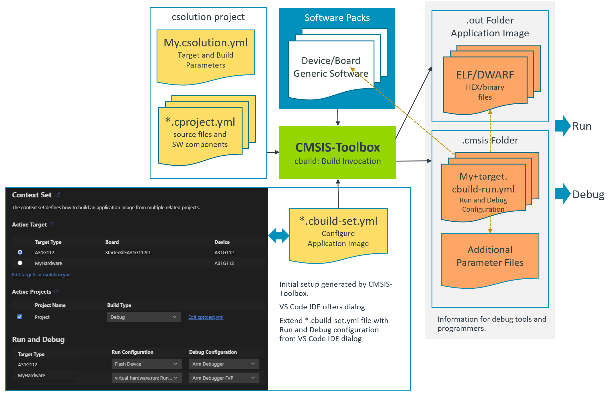
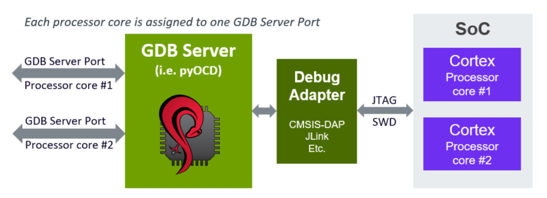

# Build Information Files
<!-- markdownlint-disable MD013 -->
<!-- markdownlint-disable MD036 -->

The following chapter explains the output files generated by the `csolution` tool. Depending on options, the files `*.cbuild-pack.yml` and `*.cbuild-set.yml` are also used as input files. The build information files are used for:

- generate CMake input files via the [cbuild2cmake](build-operation.md#cbuild2cmake-generate-cmakelists-files) tool.
- provide details for the graphical user interface in [VS Code extension Arm CMSIS Solution](https://marketplace.visualstudio.com/items?itemName=Arm.cmsis-csolution).
- obtain a list of licenses used in a project.

File                                  | Description
:-------------------------------------|:----------------------
[`*.cbuild-idx.yml`](#cbuild-idxyml)  | Index file of all `*.cbuild.yml` build descriptions; contains also overall information for the application.
[`*.cbuild.yml`](#cbuildyml)          | Build description of a single [`*.cproject.yml`](YML-Input-Format.md#project-file-structure) input file; contains all information for the build step for a specific [context](build-overview.md#context) including references to the content used from software packs.
[`*.cbuild-pack.yml`](#cbuild-packyml)| Software packs recorded for all input files ([`*.csolution.yml`](YML-Input-Format.md#project-file-structure), `cproject.yml`, and `.clayer.yml`); used as input file to ensure [reproducible builds](build-overview.md#reproducible-builds) that use the same software packs and pack versions.
[`*.cbuild-set.yml`](#cbuild-setyml)  | [Context selection](build-overview.md#working-with-context-set) for the build process, enabled with option [--context-set:](build-tools.md#use-context-set).
[`*.cbuild-run.yml`](#run-and-debug-management)  | Contains the information required to [download and debug](#run-and-debug-management) a *csolution project* to a target.

!!! Note CMSIS-Toolbox 2.11 creates the `*.cbuild.yml` and `*.cbuild-run.yml` files in the `out` directory along with the related output files.

## Directory Structure

The `csolution` based projects are portable across different host computers and use, therefore **relative file references**.

- All file references use relative paths to the base directory of the related `*.yml` file.  Files that are within the file structure of the `csolution` base directory are also referenced using relative paths, i.e. `../layers/layer1/source-file1.c`.

- Files that are located in the [CMSIS-Pack root directory](installation.md#environment-variables) are prefixed with `${CMSIS_PACK_ROOT}`.

!!! Note
    All file references to user source code should be relative paths. The prefixes `${CMSIS_PACK_ROOT}` and `${CMSIS_COMPILER_ROOT}` are used to refer to base directories of files that relate to software packs and compiler-specific files. These base directories can also be on different filesystem drives.

- Files outside of the directory structure of a `csolution` based application use absolute paths. If absolute paths are used, a `warning` is issued in the `*.cbuild-idx.yml` file.

A typical directory structure of a `csolution` based application that uses common layers source files are shown below.

```yml
📦 # csolution base directory
 ┣ myapp.csolution.yml
 ┣ myapp.cbuild-idx.yml
 ┣ myapp.cbuild-pack.yml
 ┣ myapp.cbuild-set.yml
 ┣ 📂 project1
 ┃  ┣  mypro1.cproject.yml                 # file references are relative to directory project1
 ┣ 📂 project2
 ┃  ┣  mypro2.cproject.yml                 # file references are relative to directory project
 ┣ 📂 layer
 ┃  ┣  mylayer.clayer.yml                  # file references are relative to directory layer
 ┣ 📂 out
 ┃  ┣  myapp+Target.cbuild-run.yml         # file references are relative to directory out
 ┣  ┣ 📂 mypro1\Target\Debug
 ┣  ┣  ┣  mypro1.cbuild.Debug+Target.yml   # file references are relative to directory out\mypro1\Target\Debug
 ┣  ┣ 📂 mypro2\Target\Debug
 ┣  ┣  ┣  mypro2.cbuild.Debug+Target.yml   # file references are relative to directory out\mypro2\Target\Debug
 
```

## Lock Pack Versions

A *csolution project* refers to packs in different files (`*.csolution.yml`, `*.cproject.yml` or `*.clayer.yml`). To ensure consistent pack usage during application development (for example when new `target-types` or `build-types` are introduced), the `*.cbuild-pack.yml` file records the exact pack versions.

The required packs can be specified in *csolution project files* in the following ways:

- exactly, e.g. `ARM::CMSIS@5.9.0`
- with range, e.g. `ARM::CMSIS@>=5.8.0`
- without version, e.g. `ARM::CMSIS`
- with wildcards on the pack name, e.g. `ARM::CMSI*`
- without pack name, e.g. `ARM`

The required packs are resolved to an exact pack version that is recorded in the `*.cbuild-pack.yml` file as shown below:

```yml
cbuild-pack:
  resolved-packs:
    - resolved-pack: ARM::CMSIS@5.9.0
      selected-by-pack:
        - ARM
        - ARM::CMSI*
        - ARM::CMSIS
        - ARM::CMSIS@>=5.8.0
        - ARM::CMSIS@5.9.0
```

If *csolution project files* are modified, the `selected-by-pack` information ensures that consistent pack versions are used. If a required pack is no longer used in present in the *csolution project*, the relevant entry `resolved-pack:` in  the `*.cbuild-pack.yml` file is removed.

The `*.cbuild-pack.yml` file is located in the same directory as the `*.csolution.yml` file and is used by the `csolution` for every command that uses a `*.csolution.yml` file. Examples are:

- `csolution convert` - uses **and updates** the `*.cbuild-pack.yml` file.
- `csolution list ...` - uses the `*.cbuild-pack.yml` file
- `csolution run` - uses the `*.cbuild-pack.yml` file.
- `csolution update-rte` - uses **and updates** the `*.cbuild-pack.yml` file.

The operation of the `csolution` command is as follows:

- Load the *csolution project files* (`*.csolution.yml`, `*.cproject.yml` or `*.clayer.yml`).
- Initially there is no `*.cbuild-pack.yml` file. If it exists, the `*.cbuild-pack.yml` file is loaded. The packs are aligned with the `resolved-pack:` information of the `*.cbuild-pack.yml` file in these steps:
    - *PopulateContexts*: Add `resolved-pack:` information to the *solution data model*.
    - *AddPackRequirements*: Pack version ranges and pack wildcards are matched to fully qualified versions of the *solution data model*. Pack wildcards are expanded to fully qualified packs using cbuild-pack.yml. Pack wildcards are kept for further expansion in the *solution data model*.
- Execute the `csolution` command, for example `convert`, `list`, `run`, or `update-rte`.
- Update the `*.cbuild-pack.yml` file (only if the content changes):
    - *GenerateCbuildPack*: Generate the `resolved-pack:` list of packs required by all *contexts*. The original `pack:` specification is stored under `selected-by-pack:`.

With the subsequent `csolution` command, the information of the `*.cbuild-pack.yml` file is used to load the appropriate fully qualified pack versions, matching previously used packs.

## File Format

The following sections describe the format of the *build information files*. Many nodes are identical with the [**CSolution Project Format**](YML-Input-Format.md), but optional information is fully expanded. The nodes that are different are explained below under:

- [**Nodes for Project Management**](#nodes-for-project-management)
- [**Nodes for File Management**](#nodes-for-file-management)
- [**Nodes for License Information**](#nodes-for-license-information)

### `*.cbuild-idx.yml`

The `<solution-name>.cbuild-idx.yml` file is generated for the *csolution project* and refers all *contexts* that are generated. It is structured as outlined below.

`build-idx:`                                                  | Content
:-------------------------------------------------------------|:------------------------------------
&nbsp;&nbsp;&nbsp; `generated-by:`                            | Reference to csolution tool along with version information used to generate this application.
&nbsp;&nbsp;&nbsp; `description:`                             | Brief description text copied from the [`*.csolution.yml`](YML-Input-Format.md#solution) input file used to generate this application.
&nbsp;&nbsp;&nbsp; `cdefault:`                                | Relative path and name of the [`*.cdefault.yml`](YML-Input-Format.md#cdefault) input file used to generate this application.
&nbsp;&nbsp;&nbsp; `csolution:`                               | Relative path and name of the [`*.csolution.yml`](YML-Input-Format.md#solution) input file used to generate this application.
&nbsp;&nbsp;&nbsp; [`configurations:`](#configurations)       | For reference applications with undefined layers: list of potential project configurations for a reference application with undefined layers
&nbsp;&nbsp;&nbsp; [`cprojects:`](#cprojects)                 | List of `*.cproject.yml` and `*.clayer.yml` input files used to generate this application.
&nbsp;&nbsp;&nbsp; [`cbuilds:`](#cbuilds)                     | List of `*.cbuild.yml` output files that are generated by `*.cproject.yml` files for this application.
&nbsp;&nbsp;&nbsp; [`select-compiler:`](#select-compiler)     | For projects with unspecified compiler: list of available compilers for selection

**Example:**

```yml
build-idx:
  generated-by: csolution version 2.3.0
  description: USB application examples sharing board layers.
  cdefault: cdefault.yml
  csolution: USB.csolution.yml
  configurations:
    - target-type: B-U585I-IOT02A
      target-configurations:
        - configuration:
            - variables:
                - Board-Layer: /Users/.../Arm/Packs/Keil/B-U585I-IOT02A_BSP/2.0.0-dev0/Layers/IoT/Board.clayer.yml
  cprojects:
    - cproject: Device/HID/HID.cproject.yml
      clayers:
        - clayer: $Board-Layer$
    - cproject: Device/MassStorage/MassStorage.cproject.yml
      clayers:
        - clayer: $Board-Layer$
  cbuilds:
    - cbuild: out/HID/B-U585I-IOT02A/Debug/HID.Debug+B-U585I-IOT02A.cbuild.yml
      project: HID
      configuration: .Debug+B-U585I-IOT02A
    - cbuild: out/MassStorage/B-U585I-IOT02A/Release/MassStorage.Release+B-U585I-IOT02A.cbuild.yml
      project: MassStorage
      configuration: .Release+B-U585I-IOT02A
    - cbuild: out/hello_world/B-U585I-IOT02A/Release/hello_world.Release+B-U585I-IOT02A.cbuild.yml
      west: true
      project: hello_world
      configuration: .Release+B-U585I-IOT02A

  errors: true                  # indicates error
  packs-missing:                # lists missing packs
    - pack: ARM::CMSIS-RTX      # with unspecified version
    - pack: ARM::CMSIS@6.0.0    # with specified version
```

### `*.cbuild.yml`

The `<project-name>.<build-type>+<target-type>.cbuild.yml` file contains all information for one *context*. It is structured as outlined below.

`build:`                                                 | Content
:--------------------------------------------------------|:------------------------------------
&nbsp;&nbsp;&nbsp; `generated-by:`                       | Reference to csolution tool along with version information used to generate this application.
&nbsp;&nbsp;&nbsp; `context:`                            | Project [context](YML-Input-Format.md#context-name-conventions) of this build description.
&nbsp;&nbsp;&nbsp; `compiler:`                           | [Compiler toolchain](YML-Input-Format.md#compiler) used for code generation.
&nbsp;&nbsp;&nbsp; `board:`                              | [Board name](YML-Input-Format.md#board) used for this context.
&nbsp;&nbsp;&nbsp; `board-pack:`                         | BSP that is defining the [Board name](YML-Input-Format.md#board) used for this context.
&nbsp;&nbsp;&nbsp; `board-books:`                        | List board documentation as defined in the [PDSC element `<board>`](https://open-cmsis-pack.github.io/Open-CMSIS-Pack-Spec/main/html/pdsc_boards_pg.html#element_board_book).
&nbsp;&nbsp;&nbsp; `device:`                             | [Device name](YML-Input-Format.md#device) with processor core selection used in this  project context.
&nbsp;&nbsp;&nbsp; `device-pack:`                        | DFP that is defining the [Device name](YML-Input-Format.md#device) with processor core selection used in this  project context.
&nbsp;&nbsp;&nbsp; `device-books:`                       | List device documentation as defined in the [PDSC element `<device>`](https://open-cmsis-pack.github.io/Open-CMSIS-Pack-Spec/main/html/pdsc_family_pg.html#element_book).
&nbsp;&nbsp;&nbsp; `processor:`                          | List of [processor attributes](YML-Input-Format.md#processor) used in this project context.
&nbsp;&nbsp;&nbsp; [`packs:`](#packs)                    | List of software [packs](#packs) along with path information used to generate this project context.
&nbsp;&nbsp;&nbsp; `optimize:`                           | Generic [optimize](YML-Input-Format.md#optimize) level for code generation.
&nbsp;&nbsp;&nbsp; `link-time-optimize:`                 | Enable [optimization at linker level](YML-Input-Format.md#link-time-optimize).
&nbsp;&nbsp;&nbsp; `debug:`                              | Global control the generation of [debug](YML-Input-Format.md#debug) information.
&nbsp;&nbsp;&nbsp; `warnings:`                           | Global control [warning](YML-Input-Format.md#warnings) level for compiler diagnostics.
&nbsp;&nbsp;&nbsp; `misc:`                               | Global control of [miscellaneous](YML-Input-Format.md#misc) literal tool-specific controls.
&nbsp;&nbsp;&nbsp; `define:`                             | List of global [define](YML-Input-Format.md#define) symbol settings.
&nbsp;&nbsp;&nbsp; `add-path:`                           | List of global [include path](YML-Input-Format.md#add-path) settings.
&nbsp;&nbsp;&nbsp; `output-type:`                        | Select the [output type](YML-Input-Format.md#output) (exe or lib) for this project context.
&nbsp;&nbsp;&nbsp; `output-dirs:`                        | Specifies the [directories](YML-Input-Format.md#output-dirs) used to generate the output files.
&nbsp;&nbsp;&nbsp; `linker:`                             | Specifies the [linker script processing](#linker) used to generate the output files.
&nbsp;&nbsp;&nbsp; [`components:`](#components)          | List of software components used.
&nbsp;&nbsp;&nbsp; [`apis:`](#apis)                      | List of API interfaces used.
&nbsp;&nbsp;&nbsp; [`groups:`](#groups)                  | List of source file groups along with source files.
&nbsp;&nbsp;&nbsp; [`constructed-files:`](#constructed-files) | List of files that are generated by RTE management of the `csolution` tool.
&nbsp;&nbsp;&nbsp; [`licenses:`](#licenses)              | List of licenses used by the various software components of this project context.

**Example:**

```yml
build:
  context: HelloWorld_cm0plus.Debug+FRDM-K32L3A6
  compiler: AC6
  device: K32L3A60VPJ1A:cm0plus
  processor:
    fpu: off
    endian: little
    trustzone: non-secure
  packs:
    - pack: ARM::CMSIS@5.9.0
      path: ${CMSIS_PACK_ROOT}/ARM/CMSIS/5.9.0
    - pack: NXP::K32L3A60_DFP@15.0.0
      path: ${CMSIS_PACK_ROOT}/NXP/K32L3A60_DFP/15.0.0
  optimize: none
  debug: on
  misc:
    C:
      - -std=c99
      - -fno-builtin
    CPP:
      - -fno-builtin
    Link:
      - --diag_suppress 6314
      - --entry=Reset_Handler
  define:
    - CPU_K32L3A60VPJ1A_cm0plus
    - MCMGR_HANDLE_EXCEPTIONS=1
           :
    - _RTE_
  add-path:
    - ../middleware/multicore/mcmgr/src
    - RTE/Board_Support/K32L3A60VPJ1A_cm0plus
    - RTE/_HelloWorld_cm0plus.Debug_FRDM-K32L3A6
    - ${CMSIS_PACK_ROOT}/ARM/CMSIS/5.9.0/CMSIS/Core/Include
    - ${CMSIS_PACK_ROOT}/NXP/K32L3A60_DFP/15.0.0
            :
  output-type: exe
  output-dirs:
    gendir: generated
    intdir: ../tmp/HelloWorld_cm0plus/FRDM-K32L3A6/Debug
    outdir: ../out/HelloWorld_cm0plus/FRDM-K32L3A6/Debug
    rtedir: RTE
  components:
    - component: ARM::CMSIS:CORE@5.6.0
      condition: ARMv6_7_8-M Device
      from-pack: ARM::CMSIS@5.9.0
      selected-by: ARM::CMSIS:CORE
    - component: NXP::Device:CMSIS:K32L3A60_system@1.0.0
      condition: device.K32L3A60_AND_device.K32L3A60_CMSIS
      from-pack: NXP::K32L3A60_DFP@15.0.0
      selected-by: NXP::Device:CMSIS:K32L3A60_system
      files:
        - file: ${CMSIS_PACK_ROOT}/NXP/K32L3A60_DFP/15.0.0/system_K32L3A60_cm0plus.c
          category: sourceC
    - component: NXP::Device:SDK Drivers:clock@2.2.1
      condition: device.K32L3A60_AND_driver.common
      from-pack: NXP::K32L3A60_DFP@15.0.0
      selected-by: NXP::Device:SDK Drivers:clock
      files:
        - file: ${CMSIS_PACK_ROOT}/NXP/K32L3A60_DFP/15.0.0/drivers/fsl_clock.c
          category: sourceC
    - component: NXP::Device:SDK Drivers:common@2.3.2
      condition: device.K32L3A60_AND_device.K32L3A60_CMSIS_AND_driver.clock
      from-pack: NXP::K32L3A60_DFP@15.0.0
      selected-by: NXP::Device:SDK Drivers:common
      files:
        - file: ${CMSIS_PACK_ROOT}/NXP/K32L3A60_DFP/15.0.0/drivers/fsl_common.c
          category: sourceC
        - file: ${CMSIS_PACK_ROOT}/NXP/K32L3A60_DFP/15.0.0/drivers/fsl_common_arm.c
          category: sourceC
            :
  groups:
    - group: Application
      files:
        - file: ./hello_world_core1.c
          category: sourceC
        - file: ./RTE/Device/K32L3A60VPJ1A_cm0plus/K32L3A60xxx_cm0plus_flash.scf
          category: linkerScript
    - group: Middleware
      files:
        - file: ../middleware/multicore/mcmgr/src/mcmgr.c
          category: sourceC
            :
  constructed-files:
    - file: RTE/_HelloWorld_cm0plus.Debug_FRDM-K32L3A6/RTE_Components.h
      category: header
```

### `*.cbuild-pack.yml`

The `<solution-name>.cbuild-pack.yml` file contains the [pack information](#lock-pack-versions) for the *csolution project*. It is structured as outlined below.

`cbuild-pack:`                                                     | Content
:------------------------------------------------------------------|:------------------------------------
&nbsp;&nbsp;&nbsp; `resolved-packs:`                               | List of packs used to create the project contexts.

`resolved-packs:`                                                  | Content
:------------------------------------------------------------------|:------------------------------------
`- resolved-pack:`                                                 | [pack name](YML-Input-Format.md#pack-name-conventions) used.
&nbsp;&nbsp;&nbsp; `selected-by-pack:`                             | List of [components](YML-Input-Format.md#component-name-conventions) included from the pack.

**Example:**

```yml
cbuild-pack:
  resolved-packs:
    - resolved-pack: ARM::CMSIS@5.9.0
      selected-by:
        - ARM::CMSIS
    - resolved-pack: ARM::V2M_MPS3_SSE_300_BSP@1.2.0
      selected-by:
        - ARM::V2M_MPS3_SSE_300_BSP@1.2.0
    - resolved-pack: Keil::ARM_Compiler@1.7.2
      selected-by:
        - Keil::ARM_Compiler
```

### `*.cbuild-set.yml`

The `<solution-name>.cbuild-set.yml` file selects the [context set](build-overview.md#working-with-context-set) for the *csolution project*.  The structure is outlined below.

`cbuild-set:`                                                      | Content
:------------------------------------------------------------------|:------------------------------------
&nbsp;&nbsp;&nbsp; `generated-by:`                                 | Reference to tool along with version information that generated this file.
&nbsp;&nbsp;&nbsp; `contexts:`                                     | List of [context](YML-Input-Format.md#context-name-conventions) names for the [context-set:](build-tools.md#use-context-set) option.

**Example:**

```yml
cbuild-set:
  generated-by: csolution version 2.2.0
  contexts:
    - context: CM33_s.Release+AVH
    - context: CM33_ns.Debug+AVH
```

### Nodes for Project Management

#### `configurations:`

The `configurations:` node lists possible configurations for [reference applications](ReferenceApplications.md) that have undefined variable settings.

`configurations:`                                                       | Content
:-----------------------------------------------------------------------|:------------------------------------
`- target-type:`                                                        | Name of target-type for which configurations are listed.
&nbsp;&nbsp;&nbsp;`target-configurations:`                              | List of possible configurations for the target-type.
&nbsp;&nbsp;&nbsp;- `configuration:`                                    | Possible configuration for the reference application.
&nbsp;&nbsp;&nbsp;&nbsp;&nbsp;&nbsp;`- variables:`                      | List of variable names with configuration information.
&nbsp;&nbsp;&nbsp;&nbsp;&nbsp;&nbsp;&nbsp;&nbsp;&nbsp;`<layer-name>:`   | Layer name with a value that is the path to the `clayer.yml` file.
&nbsp;&nbsp;&nbsp;&nbsp;&nbsp;&nbsp;&nbsp;&nbsp;&nbsp;`description:`    | Brief [description](YML-Input-Format.md#layer) text taken from `*.clayer.yml`.
&nbsp;&nbsp;&nbsp;&nbsp;&nbsp;&nbsp;&nbsp;&nbsp;&nbsp;`settings:`       | Usage instructions for this layer.
&nbsp;&nbsp;&nbsp;&nbsp;&nbsp;&nbsp;&nbsp;&nbsp;&nbsp;`- set:`          | Value of `set` and `info` taken from [`connect:`](YML-Input-Format.md#connect) in `*.clayer.yml`.
&nbsp;&nbsp;&nbsp;&nbsp;&nbsp;&nbsp;&nbsp;&nbsp;&nbsp;`path:`           | Path to the directory that contains the layer (from *.PDSC file).
&nbsp;&nbsp;&nbsp;&nbsp;&nbsp;&nbsp;&nbsp;&nbsp;&nbsp;`file:`           | Name of the *.clayer.yml file (optional with a relative path to the directory specified with path) (from `*.PDSC` file).
&nbsp;&nbsp;&nbsp;&nbsp;&nbsp;&nbsp;&nbsp;&nbsp;&nbsp;`copy-to:`        | Proposed directory for the layer in the *csolution project* (from *.PDSC file).

**Example:**

```yml
  configurations:
    - target-type: B-U585I-IOT02A
      target-configurations:
        - configuration:
            - variables:
              - Board-Layer: /Users/.../Arm/Packs/Keil/B-U585I-IOT02A_BSP/2.0.0-dev0/Layers/IoT/Board.clayer.yml
                description: "Configuration including FXLS8962 sensor"

    - target-type: MyBoard
        - configuration:
            - variables:
              - Board-Layer: ./layer/board/frdmk22f/frdmk22f.clayer.yml
                description: "Configuration: Ethernet, UART, and WiFi"
                settings:
                - set: set1.select1 (connect A - set 1 select 1)
                path: ./layer/board/frdmk22f
                file: frdmk22f.clayer.yml
                copy-to: board/frdmk22f
              - Shield-Layer: ./layer/shield/agmp03/agmp03.clayer.yml
                description: "Shield with FXLS8962 and FXAS21002"
                settings:
                - set: Bus.SPI (FXLS8962 SPI Bus - Jumper configuration: I2C/SPI=SPI)
                - set: Bus.SPI (FXAS21002 SPI Bus - Jumper configuration: I2C/SPI=SPI)
                path: ./layer/board/frdmk22f
                file: frdmk22f.clayer.yml
                copy-to: board/frdmk22f
```

#### `cprojects:`

The `cprojects:` node lists all `*.cproject.yml` input files along with `*.clayer.yml` files that are used to compose the application.

`cprojects:`                                                       | Content
:------------------------------------------------------------------|:------------------------------------
`- cproject:`                                                      | Relative path and name of a [`*.cproject.yml`](YML-Input-Format.md#project) input file.
&nbsp;&nbsp;&nbsp;`clayers:`                       | List of [`*.clayer.yml`](YML-Input-Format.md#layer) input files used by this `*.cproject.yml` file.

**Example:**

```yml
  cprojects:
    - cproject: AWS_MQTT_MutualAuth_SW_Framework/Demo.cproject.yml
      clayers:
        - clayer: AWS_MQTT_MutualAuth_SW_Framework/Socket/FreeRTOS+TCP/Socket.clayer.yml
        - clayer: AWS_MQTT_MutualAuth_SW_Framework/Socket/WiFi/Socket.clayer.yml
        - clayer: AWS_MQTT_MutualAuth_SW_Framework/Socket/VSocket/Socket.clayer.yml
             :
```

#### `cbuilds:`

The `cbuilds:` node lists all project context configurations that are generated with this build.

`cbuilds:`                                                         | Content
:------------------------------------------------------------------|:------------------------------------
`- cbuild:`                                                        | Build description file of a single context for a *.cproject.yml input file.
&nbsp;&nbsp;&nbsp; `project:`                                      | Project name.
&nbsp;&nbsp;&nbsp; `configuration:`                                | Context configuration for this build description file.
&nbsp;&nbsp;&nbsp; `errors:`                                       | Error indication.
&nbsp;&nbsp;&nbsp; `packs-missing:`                                | List of missing packs.
&nbsp;&nbsp;&nbsp; `packs-unused:`                                 | List of unused packs.
&nbsp;&nbsp;&nbsp; `messages:`                                     | List of `errors:`, `warnings:`, or `info:` messages.

**Example:**

```yml
  cbuilds:
    - cproject: AWS_MQTT_MutualAuth_SW_Framework/Demo.cproject.yml
      project: Demo
      configuration: .Debug+AVH
      errors: true
      messages:
        errors:
          - no compatible software layer found. Review the required connections of the project
        info:
          - test.cbuild-set.yml - file is already up-to-date
```

#### `select-compiler:`

If no compiler is specified in the *csolution project*, the [`cbuild setup` command](build-operation.md#details-of-the-setup-mode) lists the available compilers based on the [compiler registration](installation.md#compiler-registration) and `select-compiler:` node in the file [`*.csolution.yml`](YML-Input-Format.md#solution) or [`cdefault.yml`](YML-Input-Format.md#cdefault).

`select-compiler:`     | Content
:----------------------|:------------------------------------
`- compiler:`          | Name (optionally with version) of the compiler toolchain; copied from the `select-compiler:` node in the *csolution project*.

#### `packs:`

The `packs:` node is the start of a pack list that is used for the project context.

`packs:`                                              | Content
:-----------------------------------------------------|:------------------------------------
`- pack:`                                             | Explicit pack specification with exact version information used.
&nbsp;&nbsp;&nbsp;`path:`                             | Path name that stores the software pack (see note).

!!! Note
    Packs that are located in the [CMSIS-Pack root directory](installation.md#environment-variables) are prefixed with `%CMSIS_PACK_ROOT%`.

**Example:**

```yml
  packs:
    - pack: ARM::CMSIS-FreeRTOS@10.4.6
      path: ${CMSIS_PACK_ROOT}/ARM/CMSIS-FreeRTOS/10.4.6
    - pack: ARM::CMSIS@5.9.0
      path: ${CMSIS_PACK_ROOT}/ARM/CMSIS/5.9.0
       :
    - pack: MDK-Packs::IoT_Socket@1.3.1
      path: ../IoT_Socket
```

#### `generators:`

The `generators:` node contains information for calling a generator.

`generators:`                                                       | Content
:-------------------------------------------------------------------|:------------------------------------
`- generator:`                                                      | Section for a specific generator.
&nbsp;&nbsp;&nbsp; [`path:`](YML-Input-Format.md#generators)        | Path name for storing the files generated.
&nbsp;&nbsp;&nbsp; `gdpsc:`                                         | File name of the *.GDPSC file that stores the information in `path:`.
&nbsp;&nbsp;&nbsp; `command:`                                       | Section for invoking the generator on different Host operating systems.

**Example:**

```yml
  generators:
    - generator: STM32CubeMX
      path: RTE/Device
      gpdsc: RTE/Device/STM32L475VGTx/FrameworkCubeMX.gpdsc
      command:
        win:
          file: ${CMSIS_PACK_ROOT}/Keil/STM32L4xx_DFP/2.6.1/MDK/CubeMX/STM32CubeMxLauncher.exe
          arguments:
            - STM32L475VGTx
            - ../../Release+STM32L4.cprj
            - ${CMSIS_PACK_ROOT}/Keil/STM32L4xx_DFP/2.6.1
```

#### `generator:`

`generator:`                                                   | Content
:--------------------------------------------------------------|:------------------------------------
`- id:`                                                        | Generator identifier used for this component
&nbsp;&nbsp;&nbsp; `path:`                                     | File name and path to the *.cgen.yml file that is generated.

### Nodes for File Management

Keyword          | Description
:----------------|:------------------------------------
`groups:`        | Start of a list that adds source groups and files.
`components:`    | Start of a list that adds software components.

#### `linker:`

`linker:`                                         | Content
:-------------------------------------------------|:--------------------------------
`- regions:`                                      | Path and file name of `regions_<device_or_board>.h`, used to generate a Linker Script via pre-processor.
`- script:`                                       | Path and file name of the pre-processed Linker Script template.
[`- define:`](YML-Input-Format.md#define)         | Define symbol settings for the linker script file preprocessor.

#### `groups:`

`groups:`                                                      | Content
:--------------------------------------------------------------|:------------------------------------
`- group:`                                                     | Name of the group.
&nbsp;&nbsp;&nbsp; [`optimize:`](YML-Input-Format.md#optimize) | Optimize level for code generation.
&nbsp;&nbsp;&nbsp; [`debug:`](YML-Input-Format.md#debug)       | Generation of debug information.
&nbsp;&nbsp;&nbsp; [`warnings:`](YML-Input-Format.md#warnings) | Control generation of compiler diagnostics.
&nbsp;&nbsp;&nbsp; [`define:`](YML-Input-Format.md#define)     | Define symbol settings for code generation.
&nbsp;&nbsp;&nbsp; [`add-path:`](YML-Input-Format.md#add-path) | Additional include file paths.
&nbsp;&nbsp;&nbsp; [`misc:`](YML-Input-Format.md#misc)         | Literal tool-specific controls.
&nbsp;&nbsp;&nbsp; [`groups:`](#groups)                        | Start a nested list of groups.
&nbsp;&nbsp;&nbsp; [`files:`](#files-of-a-group)               | List of files that belong to a group

#### `files:` of a group

`files:`                                                       | Content
:--------------------------------------------------------------|:------------------------------------
`- file:`                                                      | Name of the file.
&nbsp;&nbsp;&nbsp; [`category:`](https://open-cmsis-pack.github.io/Open-CMSIS-Pack-Spec/main/html/pdsc_components_pg.html#FileCategoryEnum) | File category according Open-CMSIS-Pack specification
&nbsp;&nbsp;&nbsp; [`optimize:`](YML-Input-Format.md#optimize) | Optimize level for code generation.
&nbsp;&nbsp;&nbsp; [`debug:`](YML-Input-Format.md#debug)       | Generation of debug information.
&nbsp;&nbsp;&nbsp; [`warnings:`](YML-Input-Format.md#warnings) | Control generation of compiler diagnostics.
&nbsp;&nbsp;&nbsp; [`define:`](YML-Input-Format.md#define)     | Define symbol settings for code generation.
&nbsp;&nbsp;&nbsp; [`add-path:`](YML-Input-Format.md#add-path) | Additional include file paths.
&nbsp;&nbsp;&nbsp; [`misc:`](YML-Input-Format.md#misc)         | Literal tool-specific controls.

#### `apis:`

`apis:`                                                        | Content
:--------------------------------------------------------------|:------------------------------------
`- api:`                                                       | Name of the API.
&nbsp;&nbsp;&nbsp; [`condition:`](https://open-cmsis-pack.github.io/Open-CMSIS-Pack-Spec/main/html/pdsc_conditions_pg.html#element_condition) | Reference to the condition ID of the software pack that triggered the inclusion of this API.
&nbsp;&nbsp;&nbsp; `from-pack:`                                | Pack that defines this API.
&nbsp;&nbsp;&nbsp; `implemented-by:`                           | Refers to the software componeent that implements the API.
&nbsp;&nbsp;&nbsp; [`files:`](#files-of-a-component)           | List of files that belong to this API.

#### `components:`

`components:`                                                  | Content
:--------------------------------------------------------------|:------------------------------------
`- component:`                                                 | Name of the software component.
&nbsp;&nbsp;&nbsp; [`condition:`](https://open-cmsis-pack.github.io/Open-CMSIS-Pack-Spec/main/html/pdsc_conditions_pg.html#element_condition) | Reference to the condition ID of the software pack that triggered the inclusion of this component.
&nbsp;&nbsp;&nbsp; `from-pack:`                                | Pack that defines this component.
&nbsp;&nbsp;&nbsp; `selected-by:`                              | The original component name used in `cproject/clayer.YML`.
&nbsp;&nbsp;&nbsp; [`optimize:`](YML-Input-Format.md#optimize) | Optimize level for code generation.
&nbsp;&nbsp;&nbsp; [`debug:`](YML-Input-Format.md#debug)       | Generation of debug information.
&nbsp;&nbsp;&nbsp; [`warnings:`](YML-Input-Format.md#warnings) | Control generation of compiler diagnostics.
&nbsp;&nbsp;&nbsp; [`define:`](YML-Input-Format.md#define)     | Define symbol settings for code generation.
&nbsp;&nbsp;&nbsp; [`add-path:`](YML-Input-Format.md#add-path) | Additional include file paths.
&nbsp;&nbsp;&nbsp; [`misc:`](YML-Input-Format.md#misc)         | Literal tool-specific controls.
&nbsp;&nbsp;&nbsp; `instances:`                                | Number of component instances configured.
&nbsp;&nbsp;&nbsp; `maxInstances:`                             | Maximum number component instances that can be configured.
&nbsp;&nbsp;&nbsp; [`generator:`](#generator)                  | Generator information for components that are configurable via a generator.
&nbsp;&nbsp;&nbsp; `implements:`                               | Refers to the API that the component is based on.
&nbsp;&nbsp;&nbsp; [`files:`](#files-of-a-component)           | List of files that belong to this component.

#### `files:` of a component

`files:`                                                       | Content
:--------------------------------------------------------------|:------------------------------------
`- file:`                                                      | Name and path to the file.
&nbsp;&nbsp;&nbsp; [`category:`](https://open-cmsis-pack.github.io/Open-CMSIS-Pack-Spec/main/html/pdsc_components_pg.html#FileCategoryEnum) | File category according to Open-CMSIS-Pack specification
&nbsp;&nbsp;&nbsp; [`attr:`](https://open-cmsis-pack.github.io/Open-CMSIS-Pack-Spec/main/html/pdsc_components_pg.html#FileAttributeEnum) | File category according to Open-CMSIS-Pack specification; `api` refers to header files that define the api of a component.
&nbsp;&nbsp;&nbsp; [`condition:`](https://open-cmsis-pack.github.io/Open-CMSIS-Pack-Spec/main/html/pdsc_conditions_pg.html#element_condition) | Reference to the condition ID of the software pack that triggered the inclusion of this file.
&nbsp;&nbsp;&nbsp; `select:` | Selection text for user code template files and api header files.
&nbsp;&nbsp;&nbsp; [`version:`](https://open-cmsis-pack.github.io/Open-CMSIS-Pack-Spec/main/html/pdsc_components_pg.html#element_files)     | For files that belong to components the version specified in the PDSC file.
&nbsp;&nbsp;&nbsp; [`base:`](build-overview.md#plm-of-configuration-files)     | Unmodified configuration file (base file from the *software pack*) that is currently in use.
&nbsp;&nbsp;&nbsp; [`update:`](build-overview.md#plm-of-configuration-files)   | New configuration file from an updated *software pack*.
&nbsp;&nbsp;&nbsp; `status:`                                                   | Action for configuration file update: suggested, recommended, required.

#### `constructed-files:`

A list of files that are generated by the RTE management of the `csolution` tool.

`constructed-files:`                                     | Content
:--------------------------------------------------------|:------------------------------------
`- file:`                                                | Name and path to the file.
&nbsp;&nbsp;&nbsp; [`category:`](https://open-cmsis-pack.github.io/Open-CMSIS-Pack-Spec/main/html/pdsc_components_pg.html#FileCategoryEnum) | File category according Open-CMSIS-Pack specification.

### Nodes for License Information

The `*.cbuild.<build-type>+<target-type>.yml` files contain license information about each software component that is included in software packs.

#### `licenses:`

Each different license that is used in a project context has a separate section.

`licenses:`                                              | Content
:--------------------------------------------------------|:------------------------------------
`- license:`                                             | License identifier or short description.
&nbsp;&nbsp;&nbsp; `lisense-agreement:`                  | File category according Open-CMSIS-Pack specification
&nbsp;&nbsp;&nbsp; [`packs:`](#packs)                    | List of software [packs](#packs) used to generate this project context.
&nbsp;&nbsp;&nbsp; [`components:`](YML-Input-Format.md#components)   | List of software [components](YML-Input-Format.md#components) used to generate this project context.

**Example:**

```yml
  licenses:
    - license: <proprietary> END USER LICENSE AGREEMENT FOR ARM SOFTWARE DEVELOPMENT TOOLS
      license-agreement: ${CMSIS_PACK_ROOT}/Keil/MDK-Middleware/8.0.0/license_terms/license_agreement.txt
      packs:
        - pack: Keil::MDK-Middleware@8.0.0
      components:
        - component: Keil::USB&MDK:CORE@8.0.0
        - component: Keil::USB&MDK:Device:HID@8.0.0
        - component: Keil::USB&MDK:Device@8.0.0
    - license: Apache-2.0
      packs:
        - pack: ARM::CMSIS-Compiler@2.1.0
        - pack: ARM::CMSIS-Driver_STM32@1.0.0
        - pack: ARM::CMSIS-RTX@5.9.0
        :
      components:
        - component: CMSIS Driver:GPIO(API)
        - component: CMSIS Driver:I2C(API)
        - component: CMSIS Driver:SPI(API)
        :
        - component: ARM::CMSIS-Compiler:CORE@1.1.0
        - component: ARM::CMSIS-Compiler:STDERR:Custom@1.1.0
        - component: ARM::CMSIS-Compiler:STDIN:Custom@1.1.0
        :
```

#### `west:`

For each west build context a node `west:` is created in *.cbuild.yml

`west:`                                                   |              | Content
:---------------------------------------------------------|:-------------|:------------------------------------
&nbsp;&nbsp;&nbsp; `app-path:`                            | **Required** | Path to the application source directory.
&nbsp;&nbsp;&nbsp; `project-id:`                          | **Required** | Project identifier
&nbsp;&nbsp;&nbsp; `board:`                               | **Required** | Board name used for west build invocation.
&nbsp;&nbsp;&nbsp; `device:`                              |   Optional   | Specify the processor core for execution of the generated image (used in `*.cbuild-run.yml`).
&nbsp;&nbsp;&nbsp; `west-defs:`                           |   Optional   | Defines in `CMake` format. The `west-defs:` from build and target-type are added.
&nbsp;&nbsp;&nbsp; `west-opt:`                            |   Optional   | Options for the `west` tool (default: empty).

**Example:**

```yml
  west:
    project-id: hello_world
    app-path: ../../../../hello_world
    board: stm32h7b3i_dk 
    west-defs:
      - CONFIG_BUILD_OUTPUT_HEX=y
```

## Generator Information Files

The `csolution run` command generates the following build information files in the [`intdir:`](YML-Input-Format.md#output-dirs) of the related `context`. These files are the input to a generator and provide information about the *csolution project* to the generator.  The files are generated in the [`tmp` directory](build-overview.md#output-directory-structure) of the project and contain absolute paths.

File                    | Description
:-----------------------|:----------------------
`*.cbuild-gen-idx.yml`  | Index file of all `*.cbuild-gen.yml` build descriptions; contains also overall information for the application.
`*.cbuild-gen.yml`      | Build description of a single [`*.cproject.yml`](YML-Input-Format.md#project-file-structure) input file. The format is identical with the [`*.cbuild.yml`](#cbuildyml) file.

### File Structure of `*.cbuild-gen-idx.yml`

`build-gen-idx:`                                   | Content
:--------------------------------------------------|:------------------------------------
&nbsp;&nbsp;&nbsp; `generated-by:`                 | Reference to csolution tool along with version information used to generate this application.
&nbsp;&nbsp;&nbsp; `generators:`                   | List of generators that are called with the `run` command.

`generators:`                                      | Content
:--------------------------------------------------|:------------------------------------
`- id:`                                            | `generator identifier` specified with the option `--generator` in the [`csolution run`](build-tools.md#csolution-invocation) command.
&nbsp;&nbsp;&nbsp; `output:`                       | Specifies the directory for generated files.
&nbsp;&nbsp;&nbsp; `board:`                        | [Board name](YML-Input-Format.md#board) used for the generator.
&nbsp;&nbsp;&nbsp; `device:`                       | [Device name](YML-Input-Format.md#device) used for the generator.
&nbsp;&nbsp;&nbsp; `project-type:`                 | Describes the project type "single-core", "multi-core", "trustzone".
&nbsp;&nbsp;&nbsp; `cbuild-gens:`                  | List of `*.cbuild-gen.yml` files with options that are generated for the generator run.

`cbuild-gens:`                                     | Content
:--------------------------------------------------|:------------------------------------
`- cbuild-gen:`                                    | Build information file with name `<context>.cbuild-gen.yml`; structure identical with [*.cbuild.yml](#cbuildyml).
&nbsp;&nbsp;&nbsp; `project:`                      | Project name (used as a name for `*.cgen.yml` when `name:` is not specified).
&nbsp;&nbsp;&nbsp; `configuration:`                | Specifies `.build-type+target-type` of this context.
&nbsp;&nbsp;&nbsp; `name:`                         | Explicit name for the `*.cgen.yml` [generator import file](#generator-import-file) specified by [`generator options`](YML-Input-Format.md#generators-options).
&nbsp;&nbsp;&nbsp; `map:`                          | Mapping to a generator-specific run-time context name specified by [`generator options`](YML-Input-Format.md#generators-options).

**Example:**

```yml
build-gen-idx:
  generated-by: csolution version 2.3.0
  generators:
    - id: CubeMX
      output: C:/w/csolution-examples/CubeMX/STM32CubeMX/MyBoard  # output directory
      device: STM32U585AIIx
      board: B-U585I-IOT02A
      project-type: single-core
      cbuild-gens:
        - cbuild-gen: C:/w/csolution-examples/CubeMX/tmp/CubeMX/MyBoard/Debug/CubeMX.Debug+MyBoard.cbuild-gen.yml
          project: CubeMX     # user selected name of the project
          configuration: .Debug+MyBoard
          name: BoardLayer    # create BoardLayer.cgen.yml in output directory (new in CMSIS-Toolbox 2.4.0)
          map: Boot           # map to STM32CubeMX run-time context (new in CMSIS-Toolbox 2.4.0)
```

## Generator Import File

The `*.cgen.yml` file lists the generated *csolution project* part and starts with the node `generator-import:`. It is defined similarly to a [Software Layer](build-overview.md#software-layers) additional parameters, files, and components that are included in the project.

### File Structure of `*.cgen.yml`

`generator-import:`                                                             | Content
:-------------------------------------------------------------------------------|:------------------------------------
&nbsp;&nbsp;&nbsp; `generated-by:`                                              | Tool name that generated this file
&nbsp;&nbsp;&nbsp; [`for-device:`](YML-Input-Format.md#device-name-conventions) | Device information, used for consistency check (device selection is in `*.csolution.yml`).
&nbsp;&nbsp;&nbsp; [`for-board:`](YML-Input-Format.md#board-name-conventions)   | Board information, used for consistency check (board selection is in `*.csolution.yml`).
&nbsp;&nbsp;&nbsp; [`packs:`](YML-Input-Format.md#packs)                        | Defines packs that are required for this layer.
&nbsp;&nbsp;&nbsp; [`define:`](YML-Input-Format.md#define)                      | Define symbol settings for code generation.
&nbsp;&nbsp;&nbsp; [`undefine:`](YML-Input-Format.md#undefine)                  | Remove define symbol settings for code generation.
&nbsp;&nbsp;&nbsp; [`add-path:`](YML-Input-Format.md#add-path)                  | Additional include file paths.
&nbsp;&nbsp;&nbsp; [`del-path:`](YML-Input-Format.md#del-path)                  | Remove specific include file paths.
&nbsp;&nbsp;&nbsp; [`groups:`](YML-Input-Format.md#groups)                      | List of source file groups along with source files.
&nbsp;&nbsp;&nbsp; [`components:`](YML-Input-Format.md#components)              | List of software components used.

## Run and Debug Management

The CMSIS-Toolbox build system manages software packs that contain information about device, board, and software components. It controls the build output (typically ELF/DWARF files), and has provisions for HEX, BIN and post-processing. The [`target-set:`](build-overview.md#run-and-debug-configuration) node configures the application images and the debugger for a [target-type](build-overview.md#configure-related-projects).

The software packs contain information that is the basis for debug and run settings:

- [Flash algorithms](https://open-cmsis-pack.github.io/Open-CMSIS-Pack-Spec/main/html/flashAlgorithm.html) of device memory (in DFP) and board memory (in BSP).
- On-board debug adapter (a default programming/debug channel) including features.
- Available memory of device and board.
- Device parameters such as processor core(s) and clock speed.
- [Debug Access Sequences](https://open-cmsis-pack.github.io/Open-CMSIS-Pack-Spec/main/html/debug_description.html) and [System Description Files](https://open-cmsis-pack.github.io/Open-CMSIS-Pack-Spec/main/html/sdf_pg.html) that support more complex Cortex-A/R/M configurations.
- Debug Configuration files (`*.dbgconf`) that configure device properties such as trace pins.
- [CMSIS-SVD System View Description (SVD)](https://open-cmsis-pack.github.io/svd-spec/main/index.html) files for viewing device peripherals.
- [CMSIS-View Software Component Viewer Description (SCVD)](https://arm-software.github.io/CMSIS-View/latest/SCVD_Format.html) files for analysis of software components (RTOS, Middleware).

The user may add the following information in the `*.csolution.yml` file:

- [Additional memory](YML-Input-Format.md#add-memory) with flash algorithms for external memory in custom hardware using the [`memory:`](YML-Input-Format.md#memory) node.
- [Additional images](YML-Input-Format.md#images) that should be programmed or loaded using the [`images:`](YML-Input-Format.md#images) node.
- [Debugger configuration](YML-Input-Format.md#debugger-configuration) provided by packs can be adjusted using the [`debugger:`](YML-Input-Format.md#debugger) node.

!!! Note
    The information may be defined at various places. The `*.csolution.yml` file overrules the information from the BSP. The BSP overrules the information from the DFP.

The file `*.cbuild-run.yml` contains for a single `target-type` of a *csolution project* the relevant information for run and debug. The information is collected by the CMSIS-Toolbox and the file name has the format `<solution-name>+<target-type>.cbuild-run.yml` file. It is used by programmers and debuggers in command line or IDE workflows. The information is portable, i.e. from a cloud-hosted CI system to a desktop test system.



The `<solution-name>+<target-type>.cbuild-run.yml` file represents a single `target-type` of a *csolution project*.

**Example:**

```yml
cbuild-run:
  generated-by: csolution version 2.7.0
  solution: CubeMX.csolution.yml
  target-type: MyBoard_ROM
  compiler: AC6
  device: STMicroelectronics::STM32U585AIIx
  device-pack: Keil::STM32U5xx_DFP@3.0.0
  board: STMicroelectronics::B-U585I-IOT02A:Rev.C
  board-pack: Keil::B-U585I-IOT02A_BSP@2.0.0
  programming:
    - algorithm: ${CMSIS_PACK_ROOT}/Keil/STM32U5xx_DFP/3.0.0/CMSIS/Flash/STM32U5xx_2M_0800.FLM
      start: 0x08000000
      size: 0x00200000
      ram-start: 0x20000000
      ram-size: 0x00008000
    - algorithm: ${CMSIS_PACK_ROOT}/Keil/STM32U5xx_DFP/3.0.0/CMSIS/Flash/STM32U5xx_2M_0C00.FLM
      :
  system-descriptions:
    - file: ${CMSIS_PACK_ROOT}/Keil/STM32U5xx_DFP/3.0.0/CMSIS/SVD/STM32U585.svd
      type: svd
  output:
    - file: out/CubeMX/MyBoard_ROM/Debug/CubeMX.axf
      type: elf

  system-resources:
    memory:
      :

  debugger:
    - name: pyOCD@CMSIS-DAP
      :

  debug-vars:
      :

  debug-sequences:
      :

  debug-topology:
      :
```

### File Structure of `*.cbuild-run.yml`

The following describes the overall structure of the `*.cbuild-run.yml` file.  While the content of this file is generated using the `cbuild` command, it is also posssible to manually generate this file or modify content.

`cbuild-run:`                                                             |            | Content
:-------------------------------------------------------------------------|:-----------|-------------------------
&nbsp;&nbsp;&nbsp; `generated-by:`                                        |  Optional  | Tool name that generated this file.
&nbsp;&nbsp;&nbsp; `solution:`                                            |  Optional  | Name of the `*.csolution.yml` file.
&nbsp;&nbsp;&nbsp; [`target-type:`](YML-Input-Format.md#target-types)     |  Optional  | Name of the target-type that was selected.
&nbsp;&nbsp;&nbsp; [`target-set:`](YML-Input-Format.md#target-set)        |  Optional  | Name of the target-set that was selected (format `<target-type>[@<set>]`).
&nbsp;&nbsp;&nbsp; `compiler:`                                            |  Optional  | [Compiler toolchain](YML-Input-Format.md#compiler) used for code generation.
&nbsp;&nbsp;&nbsp; `board:`                                               |  Optional  | [Board name](YML-Input-Format.md#board) used for this target.
&nbsp;&nbsp;&nbsp; `board-pack:`                                          |  Optional  | BSP that is defining the [Board name](YML-Input-Format.md#board) used for this target.
&nbsp;&nbsp;&nbsp; `device:`                                              |  Optional  | [Device name](YML-Input-Format.md#device) used in this target.
&nbsp;&nbsp;&nbsp; `device-pack:`                                         |  Optional  | DFP that is defining the [Device](YML-Input-Format.md#device) used in this target.
&nbsp;&nbsp;&nbsp; [`output:`](#output)                                   |**Required**| List of the image (ELF, HEX, BIN) files generated.
&nbsp;&nbsp;&nbsp; [`system-resources:`](#system-resources)               |  Optional  | List of the system resources available in target.
&nbsp;&nbsp;&nbsp; [`system-descriptions:`](#system-descriptions)         |  Optional  | List of description files for peripherals and software components.
&nbsp;&nbsp;&nbsp; [`debugger:`](#debugger)                               |**Required**| Configuration information for the debug connection.
&nbsp;&nbsp;&nbsp; [`debug-sequences:`](#debug-sequences)                 |  Optional  | Tool actions for debugging, tracing, or programming.
&nbsp;&nbsp;&nbsp; [`programming:`](#programming)                         |  Optional  | Algorithms for flash download.
&nbsp;&nbsp;&nbsp; [`debug-topology:`](#debug-topology)                   |  Optional  | Properties of the system hardware for debug functionality.

#### `output:`

This node contains information about the images that should be loaded. The images that are generated by the *csolution project* are typically configured [using a target-set](build-overview.md#working-with-target-set). The `output:` node includes also image files that are generated with a [West Build](YML-Input-Format.md#west-build) specification.
The `output:` node also contains other required files that are added with [`images:`](YML-Input-Format.md#images) in the `*.csolution.yml` file.

`output:`                                                 |             | Content
:---------------------------------------------------------|-------------|:------------------------------------
`- file:`                                                 |**Required** | Specifies the file name.
&nbsp;&nbsp;&nbsp; [`type:`](YML-Input-Format.md#type)    |**Required** | Specifies the file type.
&nbsp;&nbsp;&nbsp; `info:`                                |  Optional   | Brief description of the file.
&nbsp;&nbsp;&nbsp; [`load:`](YML-Input-Format.md#load)    |**Required** | Load mode of the image file for programmers and debug tools.
&nbsp;&nbsp;&nbsp; `load-offset:`                         |  Optional   | Offset applied in `*.csolution.yml` when loading the image file.
&nbsp;&nbsp;&nbsp; `pname:`                               |  Optional   | Image belongs to processor in a multi-core system.

**`load:` mode**

For `image:` files that are added using the [`images:`](YML-Input-Format.md#images) node of the `*.csolution.yml` file but have no `load:` mode specified, the CMSIS-Toolbox adds an `load:` mode depending on the file type.

- Files with `type: elf` get `load: image+symbols`.
- Files with `type: lib` get `load: none`.
- All other file types get `load: image`.

For files that are the output of a `cproject.yml` project, the `output:` node lists all files that are generated. The CMSIS-Toolbox adds an `load:` mode depending on the compiler used and the file types that are generated to indicate how these files should be used by programmers and debug tools.

*For `compiler: AC6`:*

- When only a file with `type: elf` is generated, the file gets `load: image+symbols`.
- When a file with `type: elf` and a file with `type: hex` is generated, the `type: elf` file gets `load: symbols` and the `type: hex` file gets `load: image`. This allows to bypass [GNU loader issues with Arm Compiler 6](Troubleshooting.md#gnu-loader-issues-with-arm-compiler-6).
- All other file types get `load: none`.

*For any other compiler:*

- Files with `type: elf` get `load: image+symbols`.
- All other file types get `load: none`.

!!! Note
    `info: generate by <context>` indicates that an image is generated by a context of the *csolution project*.

#### `system-resources:`

The `system-resources:` node lists the resources of a target system.  It includes memory from the DFP, BSP, and `memory:` definitions from the `csolution.yml` file.

`system-resources:`                                       |             | Content
:---------------------------------------------------------|-------------|:------------------------------------
&nbsp;&nbsp;&nbsp; `memory:`                              |  Optional   | Identifies the section for memory.

`memory:`                                                 |             | Content
:---------------------------------------------------------|-------------|:------------------------------------
`- name:`                                                 |**Required** | Name of the memory region (when PDSC contains id, it uses the id as name).
&nbsp;&nbsp;&nbsp; `access:`                              |**Required** | Access attribute string for the memory (see table below).
&nbsp;&nbsp;&nbsp; `start:`                               |**Required** | Base address of the memory.
&nbsp;&nbsp;&nbsp; `size:`                                |**Required** | Size of the memory.
&nbsp;&nbsp;&nbsp; `pname:`                               |  Optional   | Only accessible by a specific processor.
&nbsp;&nbsp;&nbsp; `alias:`                               |  Optional   | Name of identical memory exposed at different address.
&nbsp;&nbsp;&nbsp; `from-pack:`                           |  Optional   | Pack that defines this memory.

The table lists the letters and their meaning for use in the access attribute string.

`access:` | Description
:--------:|:------------------
r | Readable
w | Writable
x | eXecutable
p | Peripheral area. Details described in SVD file.
s | Secure attribute
n | Non-secure attribute
c | non-secure Callable attribute

**Example:**

```yml
system-resources:
  memory:
    - name: ITCM_Flash
      access: rx
      start: 0x00200000
      size: 0x00100000
      from-pack: Keil::STM32U5xx_DFP@3.0.0
    - name: Ext-Flash
      access: rx
      start: 0x40000000
      size: 0x200000
```

#### `system-descriptions:`

List of the description files for peripherals and software components used in this project target.

`system-descriptions:`                            | Value  |   Use        | Content
:-------------------------------------------------|--------|--------------|:------------------------------------
`- file:`                                         | string | **Required** | Specifies the file name including the path.
&nbsp;&nbsp;&nbsp; `type:`                        | string | **Required** | Specifies the file type (see table below).
&nbsp;&nbsp;&nbsp; `info:`                        | string |   Optional   | Brief description of the file.
&nbsp;&nbsp;&nbsp; `pname:`                       | string |   Optional   | File is used only for a specific processor; default is for all processors.

`type:` | Description
:-------|:------------------
`svd`   | [System View Description (`*.svd`) file](https://open-cmsis-pack.github.io/svd-spec/main/index.html) specified in the [DFP](https://open-cmsis-pack.github.io/Open-CMSIS-Pack-Spec/main/html/pdsc_family_pg.html#element_debug).
`scvd`  | [Software Component Viewer Description (`*.scvd`) file](http://arm-software.github.io/CMSIS-View/latest/SCVD_Format.html) for [CMSIS-View](https://arm-software.github.io/CMSIS-View/latest/index.html).

#### `debugger:`

This node contains connection information for a debugger with inital settings coming from the board support pack (BSP) or device family pack (DFP).

`debugger:`                                               |             | Content
:---------------------------------------------------------|-------------|:------------------------------------
&nbsp;&nbsp;&nbsp; `name:`                                |**Required** | Identifies the debug configuration.
&nbsp;&nbsp;&nbsp; `info:`                                |  Optional   | Brief description from target-set.
&nbsp;&nbsp;&nbsp; `protocol:`                            |  Optional   | Selected debug protocol (jtag or swd).
&nbsp;&nbsp;&nbsp; `clock:`                               |  Optional   | Selected debug clock speed in Hz.
&nbsp;&nbsp;&nbsp; `dbgconf:`                             |  Optional   | Debugger configuration file (pinout, trace).
&nbsp;&nbsp;&nbsp; `start-pname:`                         |  Optional   | Debugger connects at start to this processor.
&nbsp;&nbsp;&nbsp; `gdbserver:`                           |  Optional   | Information for GDB server option of debugger.
&nbsp;&nbsp;&nbsp; `terminal:`                            |  Future     | Terminal port of the debugger.
&nbsp;&nbsp;&nbsp; `trace:`                               |  Future     | Trace port of the debugger.
&nbsp;&nbsp;&nbsp; `*:`                                   |  Optional   | Other debugger specific options specified under [target-set](YML-Input-Format.md#target-set).

!!! Note:
    - `protocol:` and `clock:` are required by pyOCD but optional for other debug adapters. The file [`./etc/debug-adatpers.yml`](build-operation.md#debug-adapter-integration) allows to specify default values for required options.
    - `start-pname:` is mandatory for multi-processor targets. If `start-pname:` is not configured using the [`debugger:`](YML-Input-Format.md#debugger) node in the `*.csolution.yml` file, the `pname:` of the first `*.cproject.yml` file is used.

The information for the `debugger:` node may be configured using the [`debugger:`](YML-Input-Format.md#debugger) node in the `*.csolution.yml` file. If not present the values from BSP are used; if not present DFP values. The values in the `*.csolution.yml` file overwrites values from BSP or DFP as shown in the table below.

`*.cbuild-run.yml`            | `*.csolution.yml`            | BSP                                | DFP
:-----------------------------|:-----------------------------|:-----------------------------------|:--------------------------
`debugger:`                   | [`debugger:`](YML-Input-Format.md#debugger) | [`<boards><board><debugProbe ...`](https://open-cmsis-pack.github.io/Open-CMSIS-Pack-Spec/main/html/pdsc_boards_pg.html#element_board_debugProbe) | [`<device><debugconfig ...`](https://open-cmsis-pack.github.io/Open-CMSIS-Pack-Spec/main/html/pdsc_family_pg.html#element_debugconfig)
&nbsp;&nbsp;&nbsp; `protocol:`|&nbsp;&nbsp;&nbsp; `protocol:`|&nbsp;&nbsp;&nbsp; `debugLink`      |&nbsp;&nbsp;&nbsp; `default`
&nbsp;&nbsp;&nbsp; `clock:`   |&nbsp;&nbsp;&nbsp; `clock:`   |&nbsp;&nbsp;&nbsp; `debugClock`     |&nbsp;&nbsp;&nbsp; `clock`

If no input (`*.csolution.yml`, BSP or DFP) provides debugger option values, the CMSIS-Toolbox uses the values under `defaults:` from the file [`.\ect\debug-adapters.yml`](build-operation.md#debug-adapter-integration).

**Example:**

```yml
debugger:
  name: CMSIS-DAP
  info: On-Board debugger of MCB4300
  protocol: jtag
  clock: 10000000
  dbgconf: /.cmsis/MySolution+lpc4300.dbgconf
```

#### `gdbserver:`

These are options for the pyOCD GDB server configuration (could be optionally used by other debuggers as well).

!!! Note
    The `gdbserver:` node is only generated when the file [`.\ect\debug-adapters.yml`](build-operation.md#debug-adapter-integration) contains `gdbserver:` for the selected debug adatper.

`gdbserver:`                                              |             | Content
:---------------------------------------------------------|-------------|:------------------------------------
`- port:`                                                 |**Required** | Port number of processor
&nbsp;&nbsp;&nbsp; `pname:`                               |  Optional   | Processor name of the processor (only required for multi-core systems)
&nbsp;&nbsp;&nbsp; `punit:`                               |  Future     | Identifies the procssor core in a SMP system.

**Example:**

```yml
  debugger:
    name: CMSIS-DAP
    protocol: swd
    clock: 10000000
    dbgconf: /.cmsis/MySolution+MCXN9XX.dbgconf
    gdbserver:
      - port: 3333
        pname: cm33_core1
      - port: 3334
        pname: cm33_core0
```



#### `debug-vars:`

This node contains the default value from the DFP for the [variables used in `debug-sequences:`](https://open-cmsis-pack.github.io/Open-CMSIS-Pack-Spec/main/html/pdsc_family_pg.html#element_sequence).
This initial values are overwritten by explicit settings in the `*.dbgconf` file that is provided in the [`debugger:`](#debugger) node.

`debug-vars:`                                             |              | Content
:---------------------------------------------------------|--------------|:------------------------------------
&nbsp;&nbsp;&nbsp; `vars:`                                |   Optional   | Initial values for variables used in [`debug-sequences:`](#debug-sequences).

**Example:**

```yml
debug-vars:
  vars: |
    // Default values for variables in debug sequences. Are configured with a *.dbgconf file in the user project
    __var SWO_Pin               = 0;                    // Serial Wire Output pin: 0 = PIO0_10, 1 = PIO0_8
    __var Dbg_CR                = 0x00000000;           // DBG_CR
    __var BootTime              = 10000;                // 10 milliseconds
```

#### `debug-sequences:`

This node contains the [debug sequences](https://open-cmsis-pack.github.io/Open-CMSIS-Pack-Spec/main/html/pdsc_family_pg.html#element_sequence) from the DFP for the target. Debug sequences define the activities of development tools to connect to a device using the debug channel for debugging, tracing, or flash programming. The sequence name is also used to overwrite a default sequence. A sequence that contains no `blocks` disables the default sequence.

`debug-sequences:`                                        |              | Content
:---------------------------------------------------------|--------------|:------------------------------------
`- name:`                                                 | **Required** | Name of the sequence.
&nbsp;&nbsp;&nbsp; `info:`                                |   Optional   | Descriptive text to display for example for error diagnostics.
&nbsp;&nbsp;&nbsp; `blocks:`                              |   Optional   | A list of command blocks in order of execution.
&nbsp;&nbsp;&nbsp; `pname:`                               |   Optional   | Executes sequence only for a specific processor; default is for all processors.

`blocks:`                                                 |              | Content
:---------------------------------------------------------|--------------|:------------------------------------
`- info:`                                                 |   Optional   | Descriptive text to display for example for error diagnostics.
&nbsp;&nbsp;&nbsp; `blocks:`                              |   Optional   | A list of command blocks in the order of execution.
&nbsp;&nbsp;&nbsp; `execute:`                             |   Optional   | Commands for execution.
&nbsp;&nbsp;&nbsp; `atomic:`                              |   Optional   | Atomic execution of commands; cannot be used with `blocks:`.
&nbsp;&nbsp;&nbsp; `if:`                                  |   Optional   | Only executed when expression is true.
&nbsp;&nbsp;&nbsp; `while:`                               |   Optional   | Executed in loop until while expression is true.
&nbsp;&nbsp;&nbsp; `timeout:`                             |   Optional   | Timeout value (integer) in milliseconds for while loop.

!!! Note
    - When `atomic:` is applied, sequences execute with no interrupts as fast as possible using [CMSIS-DAP Atomic Commands](https://arm-software.github.io/CMSIS-DAP/latest/group__DAP__atomic__gr.html). It has therefore restrictions and cannot be combined with `blocks:`.
    - A `blocks:` node can either contain `execute:` or `blocks:` but not both.

Example: [DebugPortSetup](https://open-cmsis-pack.github.io/Open-CMSIS-Pack-Spec/main/html/debug_description.html#debugPortSetup)

```yml
debug-sequences:
  - name: DebugPortSetup

    blocks:
    - execute:  |
        __var isSWJ      = ((__protocol &amp; 0x00010000) != 0);
        __var hasDormant = __protocol &amp; 0x00020000;
        __var protType   = __protocol &amp; 0x0000FFFF;

    - if: protType == 1
      blocks:
      - if: isSWJ
        blocks:
        - if: hasDormant
          atomic:
          execute:  |
            // Ensure current debug interface is in reset state
            DAP_SWJ_Sequence(51, 0x0007FFFFFFFFFFFF);

            // Select Dormant State (from SWD)
            DAP_SWJ_Sequence(16, 0xE3BC);

            // At least 8 cycles SWDIO/TMS HIGH
            DAP_SWJ_Sequence(8, 0xFF);

            // Alert Sequence Bits  0.. 63
            DAP_SWJ_Sequence(64, 0x86852D956209F392);

            // Alert Sequence Bits 64..127
            DAP_SWJ_Sequence(64, 0x19BC0EA2E3DDAFE9);

            // 4 cycles SWDIO/TMS LOW + 8-Bit JTAG Activation Code (0x0A)
            DAP_SWJ_Sequence(12, 0x0A0);

            // Ensure JTAG interface is reset
            DAP_SWJ_Sequence(6, 0x3F);

        - if: !hasDormant
          atomic:
          execute:   |
            // Ensure current debug interface is in reset state
            DAP_SWJ_Sequence(51, 0x0007FFFFFFFFFFFF);

            // Execute SWJ-DP Switch Sequence SWD to JTAG (0xE73C)
            // Change if SWJ-DP uses deprecated switch code (0xAEAE)
            DAP_SWJ_Sequence(16, 0xE73C);

            // Ensure JTAG interface is reset
            DAP_SWJ_Sequence(6, 0x3F);

      - atomic:
        execute: |
          // JTAG "Soft" Reset
          DAP_JTAG_Sequence(6, 1, 0x3F);
          DAP_JTAG_Sequence(1, 0, 0x01);

    - if: protType == 2
      blocks:
      - if: isSWJ
        blocks:
        - if: hasDormant
          atomic:
          execute:  |
            // Ensure current debug interface is in reset state
            DAP_SWJ_Sequence(51, 0x0007FFFFFFFFFFFF);

            // Select Dormant State (from JTAG)
            DAP_SWJ_Sequence(31, 0x33BBBBBA);

            // At least 8 cycles SWDIO/TMS HIGH
            DAP_SWJ_Sequence(8, 0xFF);

            // Alert Sequence Bits  0.. 63
            DAP_SWJ_Sequence(64, 0x86852D956209F392);

            // Alert Sequence Bits 64..127
            DAP_SWJ_Sequence(64, 0x19BC0EA2E3DDAFE9);

            // 4 cycles SWDIO/TMS LOW + 8-Bit SWD Activation Code (0x1A)
            DAP_SWJ_Sequence(12, 0x1A0);

            // Enter SWD Line Reset State
            DAP_SWJ_Sequence(51, 0x0007FFFFFFFFFFFF);  // &gt; 50 cycles SWDIO/TMS High
            DAP_SWJ_Sequence(3,  0x00);                // At least 2 idle cycles (SWDIO/TMS Low)

        - if: !hasDormant
          atomic:
          execute:  |
            // Ensure current debug interface is in reset state
            DAP_SWJ_Sequence(51, 0x0007FFFFFFFFFFFF);

            // Execute SWJ-DP Switch Sequence JTAG to SWD (0xE79E)
            // Change if SWJ-DP uses deprecated switch code (0xEDB6)
            DAP_SWJ_Sequence(16, 0xE79E);

            // Enter SWD Line Reset State
            DAP_SWJ_Sequence(51, 0x0007FFFFFFFFFFFF);  // &gt; 50 cycles SWDIO/TMS High
            DAP_SWJ_Sequence(3,  0x00);                // At least 2 idle cycles (SWDIO/TMS Low)

              // Enter SWD Line Reset State
          DAP_SWJ_Sequence(51, 0x0007FFFFFFFFFFFF);  // &gt; 50 cycles SWDIO/TMS High
          DAP_SWJ_Sequence(3,  0x00);                // At least 2 idle cycles (SWDIO/TMS Low)

    - execute:  |
      // Read DPIDR to enable SWD interface (SW-DPv1 and SW-DPv2)
      ReadDP(0x0);
```

#### `programming:`

The `programming:` node collects the [flash algorithms](https://open-cmsis-pack.github.io/Open-CMSIS-Pack-Spec/main/html/flashAlgorithm.html) of device memory (specified in DFP) and board memory (specified in BSP), and [`memory:`](YML-Input-Format.md#memory) specified the `*.csolution.yml` file.

The algorithm in the DFP and BSP must have the attribute `default="1"` set. If it specifies a `style`, only the styles "Keil" and "CMSIS" are added. Other algorithms may be add using the [`memory:`](YML-Input-Format.md#memory) node in the `*.csolution.yml` file.

`programming:`                                    |              | Content
:-------------------------------------------------|--------------|:------------------------------------
`- algorithm:`                                    | **Required** | Programming algorithm file including the path.
&nbsp;&nbsp;&nbsp; `start:`                       | **Required** | Start address of memory covered by the programming algorithm.
&nbsp;&nbsp;&nbsp; `size:`                        | **Required** | Size of memory covered by the programming algorithm.
&nbsp;&nbsp;&nbsp; `ram-start:`                   | **Required** | Start address of RAM where the algorithm will be executed from.
&nbsp;&nbsp;&nbsp; `ram-size:`                    | **Required** | Maximum size of RAM available for executing the programming algorithm.
&nbsp;&nbsp;&nbsp; `pname:`                       |   Optional   | Specifies the processor for the execution of the algorithm.

!!! Note
    When `pname:` is specified the memory can only be programmed using the specified processor.  Otherwise any processor in a multi-processor system can execute the programming algorithm.

#### `debug-topology:`

The `debug-topology:` node describes the properties of the system hardware for debug functionality. The information for this node is taken from the DFP.
The following default values for `debug-topology:` are used:

```yml
debug-topology:
  dormant: false
  swj: true
  debugports:
    - dpid: 0
      jtag:
        tapindex: 0
      swd:
        targetsel: 0
      accessports:
        - apid: 0
          index: 0
```

`debug-topology:`                                 |              | Content
:-------------------------------------------------|--------------|:------------------------------------
&nbsp;&nbsp;&nbsp; `debugports:`                  |   Optional   | Describes the CoreSight debug ports of the device and its capabilities.
&nbsp;&nbsp;&nbsp; `processors:`                  |   Optional   | Map of `pname` identifiers to access port IDs (mandatory for multi-processor devices).
&nbsp;&nbsp;&nbsp; `swj:`                         |   Optional   | Device allows switching between Serial Wire Debug (SWD) and JTAG protocols (`true` or `false`).
&nbsp;&nbsp;&nbsp; `dormant:`                     |   Optional   | Device requires the dormant state to switch debug protocols (`true` or `false`).
&nbsp;&nbsp;&nbsp; *`sdf:`*                       |   Optional   | [System Description File (`*.sdf`)](https://open-cmsis-pack.github.io/Open-CMSIS-Pack-Spec/main/html/sdf_pg.html) specified in the [DFP](https://open-cmsis-pack.github.io/Open-CMSIS-Pack-Spec/main/html/pdsc_family_pg.html#element_debugconfig).

`debugports:`                                     |              | Content
:-------------------------------------------------|--------------|:------------------------------------
`- dpid:`                                         | **Required** | Unique ID of this debug port.
&nbsp;&nbsp;&nbsp; `jtag:`                        |   Optional   | Describes JTAG Test Access Port (TAP) properties of this debug port.
&nbsp;&nbsp;&nbsp;&nbsp;&nbsp;&nbsp; `tapindex:`  |   Optional   | TAP index in the JTAG scan chain of this device from TDI to TDO (default `0`).
&nbsp;&nbsp;&nbsp; `swd:`                         |   Optional   | Describes CoreSight Serial Wire Debug Port (SW-DP) properties of this debug port.
&nbsp;&nbsp;&nbsp;&nbsp;&nbsp;&nbsp; `targetsel:` |   Optional   | SWD multi-drop target selection.
&nbsp;&nbsp;&nbsp; `accessports:`                 |   Optional   | List of CoreSight access ports (APv1/APv2) (mandatory for multi-processor devices).

`accessports:`                                    |              | Content
:-------------------------------------------------|--------------|:------------------------------------
`- apid:`                                         | **Required** | Unique ID of this access port. If only `apid` is provided, access port (APv1) with index `0` will be implicitly used.
&nbsp;&nbsp;&nbsp; `index:`                       |   Optional   | Index to select this access port (APv1) for a target access.
&nbsp;&nbsp;&nbsp; `address:`                     |   Optional   | Address to select this access port (APv2) in its parent's address space for a target access.
&nbsp;&nbsp;&nbsp; `HPROT:`                       |   Optional   | Value for HPROT (AHB Protection Control) bits.
&nbsp;&nbsp;&nbsp; `SPROT:`                       |   Optional   | Value for SPROT (Secure Protection Control) bit.
&nbsp;&nbsp;&nbsp; `datapatch:`                   |   Optional   | [List of patch values](https://open-cmsis-pack.github.io/Open-CMSIS-Pack-Spec/main/html/pdsc_family_pg.html#element_dbg_datapatch) a debugger shall apply when reading from the device.
&nbsp;&nbsp;&nbsp; *`accessports:`*               |   Optional   | Nested CoreSight access ports (APv2).

!!! Note
    `index:` and `address:` cannot be specified at the same time.

`processors:`                                     |              | Content
:-------------------------------------------------|--------------|:------------------------------------
`- pname:`                                        | **Required** | Processor identifier  (mandatory for multi-processor devices).
&nbsp;&nbsp;&nbsp; *`punits:`*                    |   Optional   | Specifies processor units in a symmetric multi-processor core (MPCore) (mandatory when more than one CPU debug block is accessible).
&nbsp;&nbsp;&nbsp; `apid:`                        |   Optional   | Access port ID to use for this processor.
&nbsp;&nbsp;&nbsp; `reset-sequence:`              |   Optional   | Name of debug sequence for reset operation (default: `ResetSystem` sequence).

`datapatch:`                                      |              | Content
:-------------------------------------------------|--------------|:------------------------------------
`- address:`                                      |**Required**  | Address for which to apply the patch.
&nbsp;&nbsp;&nbsp; `value:`                       |**Required**  | Value to overwrite from device (for example in a ROM table).
&nbsp;&nbsp;&nbsp; `mask:`                        |   Optional   | The bits to patch. Default: complete value is replaced.
&nbsp;&nbsp;&nbsp; `type:`                        |   Optional   | Type of data access to patch (see table below). Default is `Mem`.
&nbsp;&nbsp;&nbsp; `info:`                        |   Optional   | Descriptive text for diagnostics messages.

The table lists the allowed values for data patch access types.

type       | Data patch access type
:----------|:-----------------------------
AP         | CoreSight Access Port register access.
Mem        | Memory access (default when type is not specified)

*`punits:`*                                       |              | Content
:-------------------------------------------------|--------------|:------------------------------------
*`- punit:`*                                      | **Required** | Specifies a specific processor unit of a symmetric MPCore.
&nbsp;&nbsp;&nbsp; *`address:`*                   | **Required** | Specifies the base address of the CPU debug block.

!!! Note
    The nodes in *italic* are specified for future expansion, but currently not implemented.

### Usage

The `*.cbuild-run.yml` file provides all information about the application project for run and debug. It can be used with tools such as pyOCD as shown below.

Start gdbserver for debug connection:

```bash
>pyocd gdbserver --cbuild-run out\MyProject+TargetHW.cbuild-run.yml
```

Program flash with application images:

```bash
>pyocd load --cbuild-run out\MyProject+TargetHW.cbuild-run.yml
```
