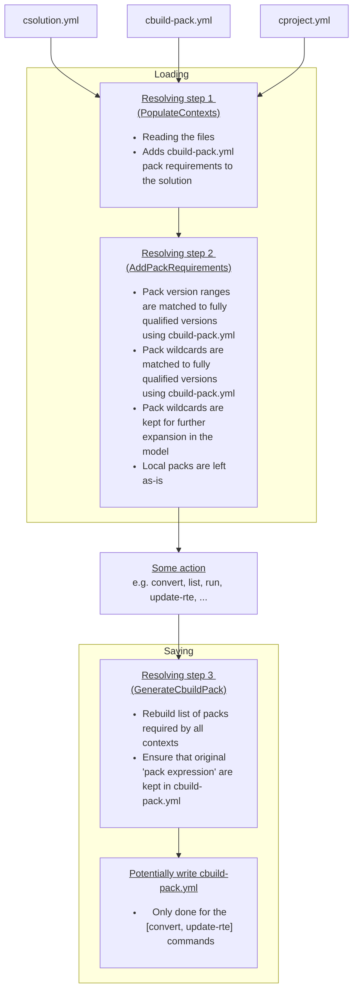

# Build Information Files
<!-- markdownlint-disable MD013 -->
<!-- markdownlint-disable MD036 -->

[**CMSIS-Toolbox**](README.md) **> Build Information Files**

The following chapter explains the YAML CBuild format that describes how to build a complete application.

**Table of Contents**

- [Build Information Files](#build-information-files)
  - [CBuild Output Files](#cbuild-output-files)
    - [Directory Structure](#directory-structure)
    - [Pack locking](#pack-locking)
    - [File Structure of `*.cbuild-idx.yml`](#file-structure-of-cbuild-idxyml)
    - [File Structure of `*.cbuild.yml`](#file-structure-of-cbuildyml)
    - [File Structure of `*.cbuild-pack.yml`](#file-structure-of-cbuild-packyml)
    - [File Structure of `*.cbuild-set.yml`](#file-structure-of-cbuild-setyml)
  - [CBuild-specific Nodes](#cbuild-specific-nodes)
    - [`configurations:`](#configurations)
    - [`cprojects:`](#cprojects)
    - [`cbuilds:`](#cbuilds)
    - [`select-compiler:`](#select-compiler)
    - [`packs:`](#packs)
    - [`generators:`](#generators)
  - [Source File Management](#source-file-management)
    - [`linker:`](#linker)
    - [`groups:`](#groups)
    - [`files:` of a group](#files-of-a-group)
    - [`components:`](#components)
    - [`apis:`](#apis)
    - [`generator:`](#generator)
    - [`files:` of a component](#files-of-a-component)
    - [`constructed-files:`](#constructed-files)
  - [`licenses:`](#licenses)
  - [Generator Information Files](#generator-information-files)
    - [File Structure of `*.cbuild-gen-idx.yml`](#file-structure-of-cbuild-gen-idxyml)
  - [Generator Import File](#generator-import-file)
    - [File Structure of `*.cgen.yml`](#file-structure-of-cgenyml)

## CBuild Output Files

The following output files are generated by the `csolution` tool. Depending on options, the files `*.cbuild-pack.yml` and `*.cbuild-set.yml` are also used as input file.

File                                                    | Description
:-------------------------------------------------------|:----------------------
[`*.cbuild-idx.yml`](#file-structure-of-cbuild-idxyml)  | Index file of all `*.cbuild.yml` build descriptions; contains also overall information for the application.
[`*.cbuild.<build-type>+<target-type>.yml`](#file-structure-of-cbuildyml)          | Build description of a single [`*.cproject.yml`](YML-Input-Format.md#project-file-structure) input file; contains all information for the build step for a specific [context](build-overview.md#context) including references to the content used from software packs.
[`*.cbuild-pack.yml`](#file-structure-of-cbuild-packyml)| Software packs recorded for the all input files ([`*.csolution.yml`](YML-Input-Format.md#project-file-structure), `cproject.yml`, and `.clayer.yml`); used as input file to ensure [reproducible builds](build-overview.md#reproducible-builds) that use the same software packs and pack versions.
[`*.cbuild-set.yml`](#file-structure-of-cbuild-setyml)  | [Context selection](build-overview.md#working-with-context-set) for the build process, enabled with option [--context-set:](build-tools.md#use-context-set).

### Directory Structure

As `csolution` based projects should be portable across different host computers, **relative file references** are used within the directory structure.

- All file references use relative paths to the base directory of the related `*.yml` file.  Files that are within the file structure of the `csolution` base directory are also referenced using relative paths, i.e. `../layers/layer1/source-file1.c`.

- Files that are located in the [CMSIS-Pack root directory](https://github.com/Open-CMSIS-Pack/cmsis-toolbox/blob/main/docs/installation.md#environment-variables) are prefixed with `${CMSIS_PACK_ROOT}`.

> **Note:**
>
> All file references to user source code should be relative paths. The prefixes `${CMSIS_PACK_ROOT}` and `${CMSIS_COMPILER_ROOT}` are used to refer to base directories of files that relate to software packs and compiler specific files. This base directories can also be on different filesystem drives.

- Files outside of the directory structure of `csolution` based application use absolute paths. If absolute paths are used, a `warning` is issued in the `*.cbuild-idx.yml` file.

A typical directory structure of a `csolution` based application that uses common layers source files is shown below.

```yml
📦 # csolution base directory
 ┣ myapp.csolution.yml
 ┣ myapp.cbuild-idx.yml
 ┣ myapp.cbuild-pack.yml
 ┣ myapp.cbuild-set.yml
 ┣ 📂 project1
 ┃  ┣  mypro1.cproject.yml
 ┃  ┣  mypro1.cbuild.yml       # file references are relative to directory project1
 ┣ 📂 project2
 ┃  ┣  mypro2.cproject.yml
 ┃  ┣  mypro2.cbuild.yml       # file references are relative to directory project2
 ┣ 📂 layer
 ┃  ┣  mylayer.clayer.yml
```

### Pack locking

An application contains a set of packs coming from different places, e.g. from the `csolution` directly, or indirectly from `cprojects` or `clayers`.
In order to have consistent pack usage in the application, as well as allowing projects to evolve and add new `target-types` or `build-types` but still remain on the same shared pack versions, the `cbuild-pack.yml` is introduced.

It works in the following way. An entire application has a set of `pack requirements`. These requirements can come from many different locations or contexts, and may be:

- specified exactly, e.g. `ARM::CMSIS@5.9.0`
- specified with range, e.g. `ARM::CMSIS@>=5.8.0`
- specified without version, e.g. `ARM::CMSIS`
- specified with wildcards on the pack name, e.g. `ARM::CMSI*`
- specified without pack name, e.g. `ARM`

All these `pack requirements` are `resolved` into exact versions in the `cbuild-pack.yml` file as a list of items on the following format:

```yml
cbuild-pack:
  resolved-packs:
    - resolved-pack: ARM::CMSIS@5.9.0
      selected-by-pack:
        - ARM
        - ARM::CMSI*
        - ARM::CMSIS
        - ARM::CMSIS@>=5.8.0
        - ARM::CMSIS@5.9.0
```

If a context is added or changed, the `selected-by` is used to ensure that the `pack requirements` are resolved to a `consistent` pack version, reducing surprising versions being selected in the entire application.
If a `pack requirement` is no longer present in the application, then the `cbuild-pack.yml` file will be *cleaned* from the relevant entries during the `cbuild-pack.yml`-generation step.

The location of the `cbuild-pack.yml` file follows the `csolution.yml` file.

- `convert` - `Uses` **and updates** cbuild-pack.yml
- `list ...` - `Uses` cbuild-pack.yml
- `run` - `Uses` cbuild-pack.yml
- `update-rte` - `Uses` **and updates** cbuild-pack.yml



This means that the cbuild-pack.yml information is used to load the appropriate fully qualified pack versions, matching previously used version ranges and pack wildcards.
Subsequent runs, and newly added contexts, can therefore use the least surprising versions.

### File Structure of `*.cbuild-idx.yml`

`build-idx:`                                                  | Content
:-------------------------------------------------------------|:------------------------------------
&nbsp;&nbsp;&nbsp; `generated-by:`                            | Reference to csolution tool along with version information used to generate this application.
&nbsp;&nbsp;&nbsp; `description:`                             | Brief description text copied from the [`*.csolution.yml`](YML-Input-Format.md#solution) input file used to generate this application.
&nbsp;&nbsp;&nbsp; `cdefault:`                                | Relative path and name of the [`*.cdefault.yml`](YML-Input-Format.md#cdefault) input file used to generate this application.
&nbsp;&nbsp;&nbsp; `csolution:`                               | Relative path and name of the [`*.csolution.yml`](YML-Input-Format.md#solution) input file used to generate this application.
&nbsp;&nbsp;&nbsp; [`configurations:`](#configurations)       | For reference applications with undefined layers: list of potential project configurations for a reference application with undefined layers
&nbsp;&nbsp;&nbsp; [`cprojects:`](#cprojects)                 | List of `*.cproject.yml` and `*.clayer.yml` input files used to generate this application.
&nbsp;&nbsp;&nbsp; [`cbuilds:`](#cbuilds)                     | List of `*.cbuild.yml` output files that are generated for this application.
&nbsp;&nbsp;&nbsp; [`select-compiler:`](#select-compiler)   | For projects with unspecified compiler: list of available compilers for selection

**Example:**

```yml  
build-idx:
  generated-by: csolution version 2.3.0
  description: USB application examples sharing board layers.
  cdefault: cdefault.yml
  csolution: USB.csolution.yml
  configurations:
    - target-type: B-U585I-IOT02A
      target-configurations:
        - configuration:
            - variables:
                - Board-Layer: /Users/.../Arm/Packs/Keil/B-U585I-IOT02A_BSP/2.0.0-dev0/Layers/IoT/Board.clayer.yml
  cprojects:
    - cproject: Device/HID/HID.cproject.yml
      clayers:
        - clayer: $Board-Layer$
    - cproject: Device/MassStorage/MassStorage.cproject.yml
      clayers:
        - clayer: $Board-Layer$
  cbuilds:
    - cbuild: Device/HID/HID.Debug+B-U585I-IOT02A.cbuild.yml
      project: HID
      configuration: .Debug+B-U585I-IOT02A
    - cbuild: Device/MassStorage/MassStorage.Release+B-U585I-IOT02A.cbuild.yml
      project: MassStorage
      configuration: .Release+B-U585I-IOT02A
  errors: true                  # indicates error
  packs-missing:                # lists missing packs 
    - pack: ARM::CMSIS-RTX      # with unspecified version
    - pack: ARM::CMSIS@6.0.0    # with specified version
```

### File Structure of `*.cbuild.yml`

The `cbuild.yml` file is structured into several sections.  The top-level structure is outlined below.

`build:`                                                 | Content
:--------------------------------------------------------|:------------------------------------
&nbsp;&nbsp;&nbsp; `generated-by:`                       | Reference to csolution tool along with version information used to generate this application.
&nbsp;&nbsp;&nbsp; `context:`                            | Project [context](YML-Input-Format.md#context-name-conventions) of this build description.
&nbsp;&nbsp;&nbsp; `compiler:`                           | [Compiler toolchain](YML-Input-Format.md#compiler) used for code generation.
&nbsp;&nbsp;&nbsp; `board:`                              | [Board name](YML-Input-Format.md#board) used for this context.
&nbsp;&nbsp;&nbsp; `board-pack:`                         | BSP that is defining the [Board name](YML-Input-Format.md#board) used for this context.
&nbsp;&nbsp;&nbsp; `device:`                             | [Device name](YML-Input-Format.md#device) with processor core selection used in this  project context.
&nbsp;&nbsp;&nbsp; `device-pack:`                        | DFP that is defining the [Device name](YML-Input-Format.md#device) with processor core selection used in this  project context.
&nbsp;&nbsp;&nbsp; `processor:`                          | List of [processor attributes](YML-Input-Format.md#processor) used in this project context.
&nbsp;&nbsp;&nbsp; [`packs:`](#packs)                    | List of software [packs](#packs) along with path information used to generate this project context.
&nbsp;&nbsp;&nbsp; `optimize:`                           | Generic [optimize](YML-Input-Format.md#optimize) level for code generation.
&nbsp;&nbsp;&nbsp; `debug:`                              | Global control the generation of [debug](YML-Input-Format.md#debug) information.
&nbsp;&nbsp;&nbsp; `warnings:`                           | Global control [warning](YML-Input-Format.md#warnings) level for compiler diagnostics.
&nbsp;&nbsp;&nbsp; `misc:`                               | Global control of [miscellaneous](YML-Input-Format.md#misc) literal tool-specific controls.
&nbsp;&nbsp;&nbsp; `define:`                             | List of global [define](YML-Input-Format.md#define) symbol settings.
&nbsp;&nbsp;&nbsp; `add-path:`                           | List of global [include path](YML-Input-Format.md#add-path) settings.
&nbsp;&nbsp;&nbsp; `output-type:`                        | Select the [output type](YML-Input-Format.md#output) (exe or lib) for this project context.
&nbsp;&nbsp;&nbsp; `output-dirs:`                        | Specifies the [directories](YML-Input-Format.md#output-dirs) used to generate the output files.
&nbsp;&nbsp;&nbsp; `linker:`                             | Specifies the [linker script processing](#linker) used to generate the output files.
&nbsp;&nbsp;&nbsp; [`components:`](#components)          | List of software components used.
&nbsp;&nbsp;&nbsp; [`apis:`](#apis)                      | List of API interfaces used.
&nbsp;&nbsp;&nbsp; [`groups:`](#groups)                  | List of source file groups along with source files.
&nbsp;&nbsp;&nbsp; [`constructed-files:`](#constructed-files) | List of files that are generated by RTE management of `csolution` tool.
&nbsp;&nbsp;&nbsp; [`licenses:`](#licenses)              | List of licenses used by the various software components of this project context.

**Example:**

```yml
build:
  context: HelloWorld_cm0plus.Debug+FRDM-K32L3A6
  compiler: AC6
  device: K32L3A60VPJ1A:cm0plus
  processor:
    fpu: off
    endian: little
    trustzone: non-secure
  packs:
    - pack: ARM::CMSIS@5.9.0
      path: ${CMSIS_PACK_ROOT}/ARM/CMSIS/5.9.0
    - pack: NXP::K32L3A60_DFP@15.0.0
      path: ${CMSIS_PACK_ROOT}/NXP/K32L3A60_DFP/15.0.0
  optimize: none
  debug: on
  misc:
    C:
      - -std=c99
      - -fno-builtin
    CPP:
      - -fno-builtin
    Link:
      - --diag_suppress 6314
      - --entry=Reset_Handler
  define:
    - CPU_K32L3A60VPJ1A_cm0plus
    - MCMGR_HANDLE_EXCEPTIONS=1
           :
    - _RTE_
  add-path:
    - ../middleware/multicore/mcmgr/src
    - RTE/Board_Support/K32L3A60VPJ1A_cm0plus
    - RTE/_HelloWorld_cm0plus.Debug_FRDM-K32L3A6
    - ${CMSIS_PACK_ROOT}/ARM/CMSIS/5.9.0/CMSIS/Core/Include
    - ${CMSIS_PACK_ROOT}/NXP/K32L3A60_DFP/15.0.0
            :
  output-type: exe
  output-dirs:
    gendir: generated
    intdir: ../tmp/HelloWorld_cm0plus/FRDM-K32L3A6/Debug
    outdir: ../out/HelloWorld_cm0plus/FRDM-K32L3A6/Debug
    rtedir: RTE
  components:
    - component: ARM::CMSIS:CORE@5.6.0
      condition: ARMv6_7_8-M Device
      from-pack: ARM::CMSIS@5.9.0
      selected-by: ARM::CMSIS:CORE
    - component: NXP::Device:CMSIS:K32L3A60_system@1.0.0
      condition: device.K32L3A60_AND_device.K32L3A60_CMSIS
      from-pack: NXP::K32L3A60_DFP@15.0.0
      selected-by: NXP::Device:CMSIS:K32L3A60_system
      files:
        - file: ${CMSIS_PACK_ROOT}/NXP/K32L3A60_DFP/15.0.0/system_K32L3A60_cm0plus.c
          category: sourceC
    - component: NXP::Device:SDK Drivers:clock@2.2.1
      condition: device.K32L3A60_AND_driver.common
      from-pack: NXP::K32L3A60_DFP@15.0.0
      selected-by: NXP::Device:SDK Drivers:clock
      files:
        - file: ${CMSIS_PACK_ROOT}/NXP/K32L3A60_DFP/15.0.0/drivers/fsl_clock.c
          category: sourceC
    - component: NXP::Device:SDK Drivers:common@2.3.2
      condition: device.K32L3A60_AND_device.K32L3A60_CMSIS_AND_driver.clock
      from-pack: NXP::K32L3A60_DFP@15.0.0
      selected-by: NXP::Device:SDK Drivers:common
      files:
        - file: ${CMSIS_PACK_ROOT}/NXP/K32L3A60_DFP/15.0.0/drivers/fsl_common.c
          category: sourceC
        - file: ${CMSIS_PACK_ROOT}/NXP/K32L3A60_DFP/15.0.0/drivers/fsl_common_arm.c
          category: sourceC
            :
  groups:
    - group: Application
      files:
        - file: ./hello_world_core1.c
          category: sourceC
        - file: ./RTE/Device/K32L3A60VPJ1A_cm0plus/K32L3A60xxx_cm0plus_flash.scf
          category: linkerScript
    - group: Middleware
      files:
        - file: ../middleware/multicore/mcmgr/src/mcmgr.c
          category: sourceC
            :
  constructed-files:
    - file: RTE/_HelloWorld_cm0plus.Debug_FRDM-K32L3A6/RTE_Components.h
      category: header
```

### File Structure of `*.cbuild-pack.yml`

The `cbuild-pack.yml` file is structured into several sections.  The top-level structure is outlined below.

`cbuild-pack:`                                                     | Content
:------------------------------------------------------------------|:------------------------------------
&nbsp;&nbsp;&nbsp; `resolved-packs:`                               | List of packs used to create the project contexts.

`resolved-packs:`                                                  | Content
:------------------------------------------------------------------|:------------------------------------
`- resolved-pack:`                                                 | [pack name](YML-Input-Format.md#pack-name-conventions) used.
&nbsp;&nbsp;&nbsp; `selected-by-pack:`                             | List of [components](YML-Input-Format.md#component-name-conventions) included from the pack.

**Example:**

```yml
cbuild-pack:
  resolved-packs:
    - resolved-pack: ARM::CMSIS@5.9.0
      selected-by:
        - ARM::CMSIS
    - resolved-pack: ARM::V2M_MPS3_SSE_300_BSP@1.2.0
      selected-by:
        - ARM::V2M_MPS3_SSE_300_BSP@1.2.0
    - resolved-pack: Keil::ARM_Compiler@1.7.2
      selected-by:
        - Keil::ARM_Compiler
```

### File Structure of `*.cbuild-set.yml`

The `cbuild-set.yml` file is structured into several sections.  The top-level structure is outlined below.

`cbuild-set:`                                                      | Content
:------------------------------------------------------------------|:------------------------------------
&nbsp;&nbsp;&nbsp; `generated-by:`                                 | Reference to tool along with version information that generated this file.
&nbsp;&nbsp;&nbsp; `contexts:`                                     | List of [context](YML-Input-Format.md#context-name-conventions) names for the [context-set:](build-tools.md#use-context-set) option.

**Example:**

```yml
cbuild-set:
  generated-by: csolution version 2.2.0
  contexts:
    - context: CM33_s.Release+AVH
    - context: CM33_ns.Debug+AVH
```

## CBuild-specific Nodes

### `configurations:`

The `configurations:` node lists possible configurations for [reference applications](ReferenceApplications.md) that have undefined variable settings.

`configurations:`                                                       | Content
:-----------------------------------------------------------------------|:------------------------------------
`- target-type:`                                                        | Name of target-type for which configurations are listed.
&nbsp;&nbsp;&nbsp;`target-configurations:`                              | List of possible configurations for the target-type.
&nbsp;&nbsp;&nbsp;- `configuration:`                                    | Possible configuration for the reference application.
&nbsp;&nbsp;&nbsp;&nbsp;&nbsp;&nbsp;`- variables:`                      | List of variable names with configuration information.
&nbsp;&nbsp;&nbsp;&nbsp;&nbsp;&nbsp;&nbsp;&nbsp;&nbsp;`<layer-name>:`   | Layer name with value that is the path to the `clayer.yml` file.
&nbsp;&nbsp;&nbsp;&nbsp;&nbsp;&nbsp;&nbsp;&nbsp;&nbsp;`description:`    | Brief [description](YML-Input-Format.md#layer) text taken from `*.clayer.yml`.
&nbsp;&nbsp;&nbsp;&nbsp;&nbsp;&nbsp;&nbsp;&nbsp;&nbsp;`settings:`       | Usage instructions for this layer.
&nbsp;&nbsp;&nbsp;&nbsp;&nbsp;&nbsp;&nbsp;&nbsp;&nbsp;`- set:`          | Value of `set` and `info` taken from [`connect:`](YML-Input-Format.md#connect) in `*.clayer.yml`.
&nbsp;&nbsp;&nbsp;&nbsp;&nbsp;&nbsp;&nbsp;&nbsp;&nbsp;`path:`           | Path to the directory that contains the layer (from *.PDSC file).
&nbsp;&nbsp;&nbsp;&nbsp;&nbsp;&nbsp;&nbsp;&nbsp;&nbsp;`file:`           | Name of the *.clayer.yml file (optional with relative path to the directory specified with path) (from `*.PDSC` file).
&nbsp;&nbsp;&nbsp;&nbsp;&nbsp;&nbsp;&nbsp;&nbsp;&nbsp;`copy-to:`        | Proposed directory for the layer in the *csolution project* (from *.PDSC file).

**Example:**

```yml
  configurations:
    - target-type: B-U585I-IOT02A
      target-configurations:
        - configuration:
            - variables:
              - Board-Layer: /Users/.../Arm/Packs/Keil/B-U585I-IOT02A_BSP/2.0.0-dev0/Layers/IoT/Board.clayer.yml
                description: "Configuration including FXLS8962 sensor"

    - target-type: MyBoard
        - configuration:
            - variables:
              - Board-Layer: ./layer/board/frdmk22f/frdmk22f.clayer.yml
                description: "Configuration: Ethernet, UART, and WiFi"
                settings:
                - set: set1.select1 (connect A - set 1 select 1)
                path: ./layer/board/frdmk22f
                file: frdmk22f.clayer.yml
                copy-to: board/frdmk22f
              - Shield-Layer: ./layer/shield/agmp03/agmp03.clayer.yml
                description: "Shield with FXLS8962 and FXAS21002"
                settings:
                - set: Bus.SPI (FXLS8962 SPI Bus - Jumper configuration: I2C/SPI=SPI)
                - set: Bus.SPI (FXAS21002 SPI Bus - Jumper configuration: I2C/SPI=SPI)
                path: ./layer/board/frdmk22f
                file: frdmk22f.clayer.yml
                copy-to: board/frdmk22f
```

### `cprojects:`

The `cprojects:` node lists all `*.cproject.yml` input files along with `*.clayer.yml` files that are used to compose the application.

`cprojects:`                                                       | Content
:------------------------------------------------------------------|:------------------------------------
`- cproject:`                                                      | Relative path and name of a [`*.cproject.yml`](YML-Input-Format.md#project) input file.
&nbsp;&nbsp;&nbsp;`clayers:`                       | List of [`*.clayer.yml`](YML-Input-Format.md#layer) input files used by this `*.cproject.yml` file.

**Example:**

```yml
  cprojects:
    - cproject: AWS_MQTT_MutualAuth_SW_Framework/Demo.cproject.yml
      clayers:
        - clayer: AWS_MQTT_MutualAuth_SW_Framework/Socket/FreeRTOS+TCP/Socket.clayer.yml
        - clayer: AWS_MQTT_MutualAuth_SW_Framework/Socket/WiFi/Socket.clayer.yml
        - clayer: AWS_MQTT_MutualAuth_SW_Framework/Socket/VSocket/Socket.clayer.yml
             :
```

### `cbuilds:`

The `cbuilds:` node lists all project context configurations that are generated with this build.

`cbuilds:`                                                         | Content
:------------------------------------------------------------------|:------------------------------------
`- cbuild:`                                                        | Build description file of a single context for a *.cproject.yml input file;
&nbsp;&nbsp;&nbsp;`project:`                                       | Project name
&nbsp;&nbsp;&nbsp;`configuration:`                                 | Context configuration for this build description file
&nbsp;&nbsp;&nbsp; `errors:`                                       | Error indication
&nbsp;&nbsp;&nbsp; `packs-missing:`                                | List of missing packs
&nbsp;&nbsp;&nbsp; `messages:`                                     | List of `errors:`, `warnings:`, or `info:` messages

**Example:**

```yml
  cbuilds:
    - cproject: AWS_MQTT_MutualAuth_SW_Framework/Demo.cproject.yml
      project: Demo
      configuration: .Debug+AVH
      errors: true
      messages:
        errors:
          - no compatible software layer found. Review required connections of the project
        info:
          - test.cbuild-set.yml - file is already up-to-date
```

### `select-compiler:`

If no compiler is specified in the *csolution project*, the [`cbuild setup` command](build-operation.md#details-of-the-setup-mode) lists the available compilers based on the [compiler registration](installation.md#compiler-registration) and `select-compiler:` node in the file [`*.csolution.yml`](YML-Input-Format.md#solution) or [`cdefault.yml`](YML-Input-Format.md#cdefault).

> **Note:** New in CMSIS-Toolbox 2.5.0

`select-compiler:`                                 | Content
:--------------------------------------------------|:------------------------------------
`- compiler:`                                      | Name (optionally with version) of the compiler toolchain; copied from the `select-compiler:` node in the *csolution project*.

### `packs:`

The `packs:` node is the start of a pack list that is used for the project context.

`packs:`                                              | Content
:-----------------------------------------------------|:------------------------------------
`- pack:`                                             | Explicit pack specification with exact version information used.
&nbsp;&nbsp;&nbsp;`path:`                             | Path name that stores the software pack (see note).

> **Note:**
>
>Packs that are located in the [CMSIS-Pack root directory](https://github.com/Open-CMSIS-Pack/cmsis-toolbox/blob/main/docs/installation.md#environment-variables) are prefixed with %CMSIS_PACK_ROOT%.

**Example:**

```yml
  packs:
    - pack: ARM::CMSIS-FreeRTOS@10.4.6
      path: ${CMSIS_PACK_ROOT}/ARM/CMSIS-FreeRTOS/10.4.6
    - pack: ARM::CMSIS@5.9.0
      path: ${CMSIS_PACK_ROOT}/ARM/CMSIS/5.9.0
       :
    - pack: MDK-Packs::IoT_Socket@1.3.1
      path: ../IoT_Socket
```

### `generators:`

The `generators:` node contains information for calling a generator.

`generators:`                                                       | Content
:-------------------------------------------------------------------|:------------------------------------
`- generator:`                                                      | Section for a specific generator.
&nbsp;&nbsp;&nbsp; [`path:`](YML-Input-Format.md#generators)        | Path name for storing the files generated.
&nbsp;&nbsp;&nbsp; `gdpsc:`                                         | File name of the *.GDPSC file that stores the information in `path:`.
&nbsp;&nbsp;&nbsp; `command:`                                       | Section for invoking the generator on different Host operating systems.

**Example:**

```yml
  generators:
    - generator: STM32CubeMX
      path: RTE/Device
      gpdsc: RTE/Device/STM32L475VGTx/FrameworkCubeMX.gpdsc
      command:
        win:
          file: ${CMSIS_PACK_ROOT}/Keil/STM32L4xx_DFP/2.6.1/MDK/CubeMX/STM32CubeMxLauncher.exe
          arguments:
            - STM32L475VGTx
            - ../../Release+STM32L4.cprj
            - ${CMSIS_PACK_ROOT}/Keil/STM32L4xx_DFP/2.6.1
```

## Source File Management

Keyword          | Description
:----------------|:------------------------------------
`groups:`        | Start of a list that adds source groups and files.
`components:`    | Start of a list that adds software components.

### `linker:`

`linker:`                                         | Content
:-------------------------------------------------|:--------------------------------
`- regions:`                                      | Path and file name of `regions_<device_or_board>.h`, used to generate a Linker Script via pre-processor.
`- script:`                                       | Path and file name of the Linker Script template that is pre-processed.
[`- define:`](YML-Input-Format.md#define)         | Define symbol settings for the linker script file preprocessor.

### `groups:`

`groups:`                                                      | Content
:--------------------------------------------------------------|:------------------------------------
`- group:`                                                     | Name of the group.
&nbsp;&nbsp;&nbsp; [`optimize:`](YML-Input-Format.md#optimize) | Optimize level for code generation.
&nbsp;&nbsp;&nbsp; [`debug:`](YML-Input-Format.md#debug)       | Generation of debug information.
&nbsp;&nbsp;&nbsp; [`warnings:`](YML-Input-Format.md#warnings) | Control generation of compiler diagnostics.
&nbsp;&nbsp;&nbsp; [`define:`](YML-Input-Format.md#define)     | Define symbol settings for code generation.
&nbsp;&nbsp;&nbsp; [`add-path:`](YML-Input-Format.md#add-path) | Additional include file paths.
&nbsp;&nbsp;&nbsp; [`misc:`](YML-Input-Format.md#misc)         | Literal tool-specific controls.
&nbsp;&nbsp;&nbsp; [`groups:`](#groups)                        | Start a nested list of groups.
&nbsp;&nbsp;&nbsp; [`files:`](#files-of-a-group)               | List of files that belong to a group

### `files:` of a group

`files:`                                                       | Content
:--------------------------------------------------------------|:------------------------------------
`- file:`                                                      | Name of the file.
&nbsp;&nbsp;&nbsp; [`category:`](https://open-cmsis-pack.github.io/Open-CMSIS-Pack-Spec/main/html/pdsc_components_pg.html#FileCategoryEnum) | File category according Open-CMSIS-Pack specification
&nbsp;&nbsp;&nbsp; [`optimize:`](YML-Input-Format.md#optimize) | Optimize level for code generation.
&nbsp;&nbsp;&nbsp; [`debug:`](YML-Input-Format.md#debug)       | Generation of debug information.
&nbsp;&nbsp;&nbsp; [`warnings:`](YML-Input-Format.md#warnings) | Control generation of compiler diagnostics.
&nbsp;&nbsp;&nbsp; [`define:`](YML-Input-Format.md#define)     | Define symbol settings for code generation.
&nbsp;&nbsp;&nbsp; [`add-path:`](YML-Input-Format.md#add-path) | Additional include file paths.
&nbsp;&nbsp;&nbsp; [`misc:`](YML-Input-Format.md#misc)         | Literal tool-specific controls.

### `components:`

`components:`                                                  | Content
:--------------------------------------------------------------|:------------------------------------
`- component:`                                                 | Name of the software component.
&nbsp;&nbsp;&nbsp; [`condition:`](https://open-cmsis-pack.github.io/Open-CMSIS-Pack-Spec/main/html/pdsc_conditions_pg.html#element_condition) | Reference to the condition ID of the software pack that triggered inclusion of this component.
&nbsp;&nbsp;&nbsp; `from-pack:`                                | Pack that defines this component.
&nbsp;&nbsp;&nbsp; `selected-by:`                              | The original component name used in `cproject/clayer.YML`.
&nbsp;&nbsp;&nbsp; [`optimize:`](YML-Input-Format.md#optimize) | Optimize level for code generation.
&nbsp;&nbsp;&nbsp; [`debug:`](YML-Input-Format.md#debug)       | Generation of debug information.
&nbsp;&nbsp;&nbsp; [`warnings:`](YML-Input-Format.md#warnings) | Control generation of compiler diagnostics.
&nbsp;&nbsp;&nbsp; [`define:`](YML-Input-Format.md#define)     | Define symbol settings for code generation.
&nbsp;&nbsp;&nbsp; [`add-path:`](YML-Input-Format.md#add-path) | Additional include file paths.
&nbsp;&nbsp;&nbsp; [`misc:`](YML-Input-Format.md#misc)         | Literal tool-specific controls.
&nbsp;&nbsp;&nbsp; `instances:`                                | Number of component instances configured.
&nbsp;&nbsp;&nbsp; [`generator:`](#generator)                  | Generator information for components that are configurable via a generator.
&nbsp;&nbsp;&nbsp; `implements:`                               | Refers to the API that the component is based on.
&nbsp;&nbsp;&nbsp; [`files:`](#files-of-a-component)           | List of files that belong to this component.

### `apis:`

`apis:`                                                        | Content
:--------------------------------------------------------------|:------------------------------------
`- api:`                                                       | Name of the API.
&nbsp;&nbsp;&nbsp; [`condition:`](https://open-cmsis-pack.github.io/Open-CMSIS-Pack-Spec/main/html/pdsc_conditions_pg.html#element_condition) | Reference to the condition ID of the software pack that triggered inclusion of this API.
&nbsp;&nbsp;&nbsp; `from-pack:`                                | Pack that defines this API.
&nbsp;&nbsp;&nbsp; `implemented-by:`                           | Refers to the software componeent that implements the API.
&nbsp;&nbsp;&nbsp; [`files:`](#files-of-a-component)           | List of files that belong to this API.

### `generator:`

`generator:`                                                   | Content
:--------------------------------------------------------------|:------------------------------------
`- id:`                                                        | Generator identifier used for this component
&nbsp;&nbsp;&nbsp; `path:`                                     | File name and path to the *.cgen.yml file that is generated.

### `files:` of a component

`files:`                                                       | Content
:--------------------------------------------------------------|:------------------------------------
`- file:`                                                      | Name and path to the file.
&nbsp;&nbsp;&nbsp; [`category:`](https://open-cmsis-pack.github.io/Open-CMSIS-Pack-Spec/main/html/pdsc_components_pg.html#FileCategoryEnum) | File category according Open-CMSIS-Pack specification
&nbsp;&nbsp;&nbsp; [`attr:`](https://open-cmsis-pack.github.io/Open-CMSIS-Pack-Spec/main/html/pdsc_components_pg.html#FileAttributeEnum) | File category according Open-CMSIS-Pack specification; `api` refers to header files that define the api of a component.
&nbsp;&nbsp;&nbsp; [`condition:`](https://open-cmsis-pack.github.io/Open-CMSIS-Pack-Spec/main/html/pdsc_conditions_pg.html#element_condition) | Reference to the condition ID of the software pack that triggered inclusion of this file.
&nbsp;&nbsp;&nbsp; `select:` | Selection text for user code template files and api header files.
&nbsp;&nbsp;&nbsp; [`version:`](https://open-cmsis-pack.github.io/Open-CMSIS-Pack-Spec/main/html/pdsc_components_pg.html#element_files)     | For files that belong to components the version specified in the PDSC file.
&nbsp;&nbsp;&nbsp; [`base:`](build-overview.md#plm-of-configuration-files)     | Unmodified configuration file (base file from the *software pack*) that is currently in use.
&nbsp;&nbsp;&nbsp; [`update:`](build-overview.md#plm-of-configuration-files)   | New configuration file from an updated *software pack*.
&nbsp;&nbsp;&nbsp; `status:`                                                   | Action for configuration file update: suggested, recommended, required.

### `constructed-files:`

A list of files that are generated by the RTE management of the `csolution` tool.

`constructed-files:`                                     | Content
:--------------------------------------------------------|:------------------------------------
`- file:`                                                | Name and path to the file.
&nbsp;&nbsp;&nbsp; [`category:`](https://open-cmsis-pack.github.io/Open-CMSIS-Pack-Spec/main/html/pdsc_components_pg.html#FileCategoryEnum) | File category according Open-CMSIS-Pack specification

## `licenses:`

The `*.cbuild.yml` files contains license information about each software component that is included from software packs.
Each different license that is used in an a project context has a sepearate section.

`licenses:`                                              | Content
:--------------------------------------------------------|:------------------------------------
`- license:`                                             | License identifier or short description.
&nbsp;&nbsp;&nbsp; `lisense-agreement:`                  | File category according Open-CMSIS-Pack specification
&nbsp;&nbsp;&nbsp; [`packs:`](#packs)                    | List of software [packs](#packs) used to generate this project context.
&nbsp;&nbsp;&nbsp; [`components:`](YML-Input-Format.md#components)   | List of software [components](YML-Input-Format.md#components) used to generate this project context.

**Example:**

```yml
  licenses:
    - license: <proprietary> END USER LICENSE AGREEMENT FOR ARM SOFTWARE DEVELOPMENT TOOLS
      license-agreement: ${CMSIS_PACK_ROOT}/Keil/MDK-Middleware/8.0.0/license_terms/license_agreement.txt
      packs:
        - pack: Keil::MDK-Middleware@8.0.0
      components:
        - component: Keil::USB&MDK:CORE@8.0.0
        - component: Keil::USB&MDK:Device:HID@8.0.0
        - component: Keil::USB&MDK:Device@8.0.0
    - license: Apache-2.0
      packs:
        - pack: ARM::CMSIS-Compiler@2.1.0
        - pack: ARM::CMSIS-Driver_STM32@1.0.0
        - pack: ARM::CMSIS-RTX@5.9.0
        :
      components:
        - component: CMSIS Driver:GPIO(API)
        - component: CMSIS Driver:I2C(API)
        - component: CMSIS Driver:SPI(API)
        :
        - component: ARM::CMSIS-Compiler:CORE@1.1.0
        - component: ARM::CMSIS-Compiler:STDERR:Custom@1.1.0
        - component: ARM::CMSIS-Compiler:STDIN:Custom@1.1.0
        :
```

## Generator Information Files

The `run` command of the `csolution` tool generates the following build information files in the [`intdir:`](YML-Input-Format.md#output-dirs) of the related `context`. These files are the input to a generator and provide the information about the *csolution project* to the generator.  The files are generated in the [`tmp` directory](build-overview.md#output-directory-structure) of the project and contain absolute paths.

File                    | Description
:-----------------------|:----------------------
`*.cbuild-gen-idx.yml`  | Index file of all `*.cbuild-gen.yml` build descriptions; contains also overall information for the application.
`*.cbuild-gen.yml`      | Build description of a single [`*.cproject.yml`](YML-Input-Format.md#project-file-structure) input file. The format is identical with the [`*.cbuild.yml`](#file-structure-of-cbuildyml) file.

### File Structure of `*.cbuild-gen-idx.yml`

`build-gen-idx:`                                   | Content
:--------------------------------------------------|:------------------------------------
&nbsp;&nbsp;&nbsp; `generated-by:`                 | Reference to csolution tool along with version information used to generate this application.
&nbsp;&nbsp;&nbsp; `generators:`                   | List of generators that are called with the `run` command

`generators:`                                      | Content
:--------------------------------------------------|:------------------------------------
`- id:`                                            | `generator identifier` specified with the option `--generator` in the [`csolution run`](build-tools.md#csolution-invocation) command.
&nbsp;&nbsp;&nbsp; `output:`                       | Specifies the directory for generated files
&nbsp;&nbsp;&nbsp; `board:`                        | [Board name](YML-Input-Format.md#board) used for the generator
&nbsp;&nbsp;&nbsp; `device:`                       | [Device name](YML-Input-Format.md#device) used for the generator
&nbsp;&nbsp;&nbsp; `project-type:`                 | Describes the project type "single-core", "multi-core", "trustzone"
&nbsp;&nbsp;&nbsp; `cbuild-gens:`                  | List of `*.cbuild-gen.yml` files with options that are generated for the generator run

`cbuild-gens:`                                     | Content
:--------------------------------------------------|:------------------------------------
`- cbuild-gen:`                                    | Build information file with name `<context>.cbuild-gen.yml`; structure identical with [*.cbuild.yml](#file-structure-of-cbuildyml).
&nbsp;&nbsp;&nbsp; `project:`                      | Project name (used as name for `*.cgen.yml` when `name:` is not specified)
&nbsp;&nbsp;&nbsp; `configuration:`                | Specifies `.build-type+target-type` of this context.
&nbsp;&nbsp;&nbsp; `name:`                         | Explicit name for the `*.cgen.yml` [generator import file](#generator-import-file) specified by [`generator options`](YML-Input-Format.md#generators---options).
&nbsp;&nbsp;&nbsp; `map:`                          | Mapping to a generator specific run-time context name specified by [`generator options`](YML-Input-Format.md#generators---options).

**Example:**

```yml
build-gen-idx:
  generated-by: csolution version 2.3.0
  generators:
    - id: CubeMX
      output: C:/w/csolution-examples/CubeMX/STM32CubeMX/MyBoard  # output directory
      device: STM32U585AIIx
      board: B-U585I-IOT02A
      project-type: single-core
      cbuild-gens:
        - cbuild-gen: C:/w/csolution-examples/CubeMX/tmp/CubeMX/MyBoard/Debug/CubeMX.Debug+MyBoard.cbuild-gen.yml
          project: CubeMX     # user selected name of the project
          configuration: .Debug+MyBoard
          name: BoardLayer    # create BoardLayer.cgen.yml in output directory (new in CMSIS-Toolbox 2.4.0)
          map: Boot           # map to STM32CubeMX run-time context (new in CMSIS-Toolbox 2.4.0)
```

## Generator Import File

The `*.cgen.yml` file is lists the generated *csolution project* part and starts with the node `generator-import:`. It defines similar to a [Software Layer](./build-overview.md#software-layers) additional parameters, files, and components that are included in the project.

### File Structure of `*.cgen.yml`

`generator-import:`                                                             | Content
:-------------------------------------------------------------------------------|:------------------------------------
&nbsp;&nbsp;&nbsp; `generated-by:`                                              | Tool name that generated this file
&nbsp;&nbsp;&nbsp; [`for-device:`](YML-Input-Format.md#device-name-conventions) | Device information, used for consistency check (device selection is in `*.csolution.yml`).
&nbsp;&nbsp;&nbsp; [`for-board:`](YML-Input-Format.md#board-name-conventions)   | Board information, used for consistency check (board selection is in `*.csolution.yml`).
&nbsp;&nbsp;&nbsp; [`packs:`](YML-Input-Format.md#packs)                        | Defines packs that are required for this layer.
&nbsp;&nbsp;&nbsp; [`define:`](YML-Input-Format.md#define)                      | Define symbol settings for code generation.
&nbsp;&nbsp;&nbsp; [`undefine:`](YML-Input-Format.md#undefine)                  | Remove define symbol settings for code generation.
&nbsp;&nbsp;&nbsp; [`add-path:`](YML-Input-Format.md#add-path)                  | Additional include file paths.
&nbsp;&nbsp;&nbsp; [`del-path:`](YML-Input-Format.md#del-path)                  | Remove specific include file paths.
&nbsp;&nbsp;&nbsp; [`groups:`](YML-Input-Format.md#groups)                      | List of source file groups along with source files.
&nbsp;&nbsp;&nbsp; [`components:`](YML-Input-Format.md#components)              | List of software components used.
