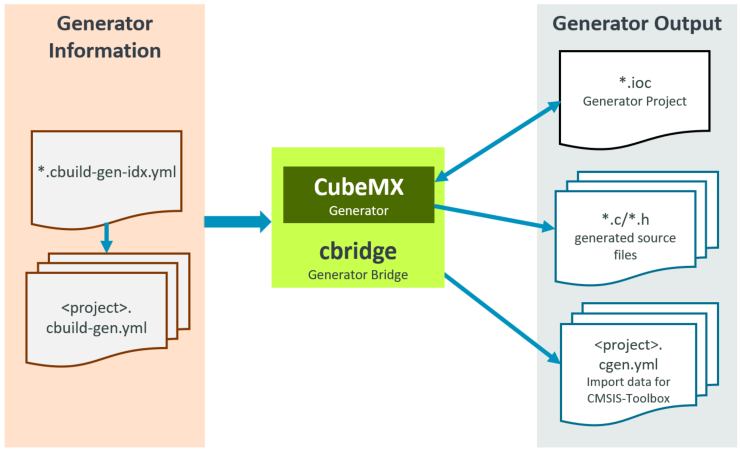

# Build Operation

<!-- markdownlint-disable MD009 -->
<!-- markdownlint-disable MD013 -->
<!-- markdownlint-disable MD036 -->

This chapter explains the overall build process of the CMSIS-Toolbox and how to add a new compiler toolchain.

## Build Process Overview

This section contains details of the build process. For a high-level description, refer to [Overall Workflow](overview.md#overall-workflow).

!!! Note
    - The tool options `--verbose` and `--debug` enable detailed output about the build process for analysis.
    - Refer to the chapter [Build Tools](build-tools.md) for more information on the command line syntax.

### `cbuild` Build Invocation

The `cbuild` utility controls the overall build process. It has two operating modes:

- **build mode** generates the application and is the default command (no explicit command required).
- **setup mode** generates the setup information for an IDE to populate dialogues, IntelliSense, and project outline views.

#### Details of the build mode

Without a specific `cbuild` command, the application is built. The typical invocation is:

```bash
cbuild <name>.csolution.yml [--packs] [--context-set] [--update-rte] [--frozen-packs]
```

It generates the application program that is described with the `<name>.csolution.yml` project.

- When option `--packs` is used, it downloads missing *software packs* using [`cpackget`](build-tools.md#cpackget-invocation).
- It calls [`csolution`](build-tools.md#csolution-invocation) to process the the `<name>.csolution.yml` project.
    - With option `--update-rte` new configuration files from *software packs* are updated and the [`RTE_Components.h`](build-overview.md#rte_componentsh) file is recreated.
    - With option `--context-set` the file `*.cbuild-set.yml` specifies the [context](build-overview.md#context) configuration of the application.
    - With option `--frozen-packs` the file `*.cbuild-pack.yml` is used as input to issue an error when a pack version changes.
- The output are [build information files](YML-CBuild-Format.md) with all relevant project information for the build process.
- The option `--toolchain` can be used to explicitly select a compiler.

!!! Note
    By default, the `cbuild` invocation does not update or change configuration files in the [**RTE Directory**](build-overview.md#rte-directory-structure). Use the option `--update-rte` if this is required.

#### Details of the setup mode

The `cbuild setup` command prepares the data for an IDE environment. This command is called at the start of an IDE or whenever a *csolution project* file is modified. The typical invocation is:

```bash
cbuild setup <name>.csolution.yml [--packs] [--context-set] [--update-rte] [--frozen-packs]
```

Typical IDE environments use a `--context-set` that specifies the [context](build-overview.md#context) configuration of the application. For an application described by a `<name>.csolution.yml` file, these steps are executed:

- Check YML file syntax against schema for all files specified by `<name>.csolution.yml`.
- Check the correctness of all files specified by `<name>.csolution.yml`.
- Evaluate the potential [software layers](YML-CBuild-Format.md#configurations) for [Reference Applications](ReferenceApplications.md) using `variables:` to refer to layers (if the value is undefined). All projects are considered in this step.
- Evaluate the [selectable compiler toolchains](YML-CBuild-Format.md#select-compiler) when the *csolution project* does not contain a `compiler:` selection or the `--toolchain` option is not applied. The available toolchains are based on the [compiler registration](installation.md#compiler-registration) and the `select-compiler:` node in the file [`<name>.csolution.yml`](YML-Input-Format.md#solution) or [`cdefault.yml`](YML-Input-Format.md#cdefault).
- Create the file `compile_commands.json` in the [output directory](build-overview.md#output-directory-structure) for the context defined in [`*.cbuild-set.yml`](YML-CBuild-Format.md).

!!! Note
    The file `compile_commands.json` is generated by `CMake` with the option `--target <context>-database` and contains all source files of the `context` along with compiler options. It is used by the [IntelliSense](https://code.visualstudio.com/docs/editor/intellisense) system of an IDE.

The operation is further controlled by options: 

- The option `--packs` downloads missing software packs.
- The option `--context-set` restricts the operation to the [`context-set`](build-overview.md#working-with-context-set) selected by the file [`<name>.cbuild-set.yml`](YML-CBuild-Format.md). If this file is missing a file `<name>.cbuild-set.yml` with a selection of the first `target-type`, the first `build-type`, and the first `project` that is specified in the file `<name>.csolution.yml` is created. 
- The option [`--update-rte`](build-overview.md#rte-directory-structure) updates the configuration files of the application.
- With the option `--frozen-packs` the file `*.cbuild-pack.yml` is used as input. An error is issued when a pack version changes.
- The option `--toolchain` can be used to explicitly select a compiler.

### `csolution` Project Manager

[`csolution`](build-overview.md) processes the [*csolution project files* (in YAML format)](YML-Input-Format.md) and the `*.pdsc` metadata files of *software packs* and performs the following operations:

- In the [**Project Area**](build-overview.md#project-area):
    - Generate [build information files](YML-CBuild-Format.md) `*.cbuild-idx.yml` and `*.cbuild.yml` with all relevant project information for the build process.
- In the [**RTE Directory**](build-overview.md#rte-directory-structure):
    - Generate for each [context](YML-Input-Format.md#context) the [RTE_components.h](build-overview.md#rte_componentsh) file and pre-include files from the software pack (`*.pdsc`)  metadata.
    - [Copy the configuration files](build-overview.md#plm-of-configuration-files) from selected software componentsand provide [PLM](build-overview.md#plm-of-configuration-files) information.
- In the [**base directory of the solution**](build-overview.md#project-area):
    - Generate the file `*.cbuild-pack.yml` that records all used *software packs*. With the option `--frozen-packs`, this file is used as input.
    - With the option `--context-set` the file `*.cbuild-set.yml` specifies the [context](build-overview.md#context) configuration of the application. When `--context` names are specified this file is updated with this selection.

The picture below outlines the operation.


### `cbuild2cmake` Generate CMakeLists Files

`cbuild2cmake` reads the [build information files](YML-CBuild-Format.md) `*.cbuild-idx.yml` and `*.cbuild.yml` to get all relevant project information for the build process. It generates the following output files for `CMake` build system:

Output Directory/File                    | Description
:----------------------------------------|:----------------
`./<tmp-dir>/CMakeList.txt`              | Describes the overall application build process with the current [context](build-overview.md#context) configuration.
`./<tmp-dir>/<context>`                  | Each context has a separate sub-directory with the following files:
`./<tmp-dir>/<context>/CMakeList.txt`    | Describes the build process for this context.
`./<tmp-dir>/<context>/toolchain.cmake`  | Describes the toolchain used for this context.
`./<tmp-dir>/<context>/groups.cmake`     | Contains all definitions and source files that are related to file [groups](YML-Input-Format.md#groups).
`./<tmp-dir>/<context>/components.cmake` | Contains all definitions and source files that are related to [components](YML-Input-Format.md#components).

### `CMake` Invocation

The CMake build system is invoked with the following commands:

- CMake configuration command defines the build generator, source, and build directory with:

  `cmake -G Ninja -S <tmpdir> -B <tmpdir> -Wnodev`

- CMake build command to build the application program for each [context](build-overview.md#context) with:

  `cmake --build <tmpdir> -j <n> --target <context>`

- CMake build command to generate the IntelliSense `compile_commands.json` (used by the command `cbuild setup`) for each [context](build-overview.md#context) with:

  `cmake --build <tmpdir> -j <n> --target <context>-database`

## Adding a Toolchain to CMSIS-Toolbox

The following section explains how to add a compiler toolchain to the CMSIS-Toolbox.

### Steps

The section below describes the steps to add a new compiler toolchain to the CMSIS-Toolbox. 

1. Define a `compiler_name` for the new compiler toolchain, i.e. `CLang`.
2. Add this `compiler_name` to the `"CompilerType":` in the schema file [`./tools/projmgr/schemas/common.schema.json`](https://github.com/Open-CMSIS-Pack/devtools/blob/main/tools/projmgr/schemas/common.schema.json).
3. Create a new CMake file in [`./tools/buildmgr/cbuildgen/config`](https://github.com/Open-CMSIS-Pack/devtools/tree/main/tools/buildmgr/cbuildgen/config) with the naming convention `compiler_name.<version>.cmake`.
4. Map with the file `compiler_name.<version>.cmake`. the **CMake** input variables to the **CMake** toolchain variables.
   - Use an existing `*.cmake` file, i.e. `GCC.<version>.cmake` as a reference.
 
### CMake Variables

The `CMakeLists.txt` file sets the following **CMake** input variables that should be processed by `compiler_name.<version>.cmake`.

CMake Variable                                   | Possible Values           | Description
:------------------------------------------------|:--------------------------|:-----------------------
`BYTE_ORDER`                                     | Little-endian, Big-endian | [Endian processor configuration](https://open-cmsis-pack.github.io/Open-CMSIS-Pack-Spec/main/html/pdsc_family_pg.html#Dendian)
`CPU`                                            | [DCoreEnum](https://open-cmsis-pack.github.io/Open-CMSIS-Pack-Spec/main/html/pdsc_family_pg.html#DcoreEnum)      | Processor core selection
`FPU`                                            | [DfpuEnum](https://open-cmsis-pack.github.io/Open-CMSIS-Pack-Spec/main/html/pdsc_family_pg.html#DfpuEnum)        | Floating point unit support
`DSP`                                            | [DdspEnum](https://open-cmsis-pack.github.io/Open-CMSIS-Pack-Spec/main/html/pdsc_family_pg.html#DdspEnum)        | DSP instruction set support
`TZ`                                             | [DtzEnum](https://open-cmsis-pack.github.io/Open-CMSIS-Pack-Spec/main/html/pdsc_family_pg.html#DtzEnum)          | TrustZone support
`SECURE`                                         | [DsecureEnum](https://open-cmsis-pack.github.io/Open-CMSIS-Pack-Spec/main/html/pdsc_family_pg.html#DsecureEnum)  | Software model selection
`MVE`                                            | [DmveEnum](https://open-cmsis-pack.github.io/Open-CMSIS-Pack-Spec/main/html/pdsc_family_pg.html#DmveEnum)        | MVE instruction set support
`BRANCHPROT`                                     | [`BRANCHPROT` values](#branchprot-values)  | [Branch protection
`OPTIMIZE`                                       | [Optimize values](YML-Input-Format.md#optimize)  | Generic optimize levels for code generation
`WARNINGS`                                       | [Warnings values](YML-Input-Format.md#warnings)  | Control warning level for compiler diagnostic
`DEBUG`                                          | [Debug values](YML-Input-Format.md#debug)        | Control the generation of debug information
`DEFINES`                                        | [Define symbols](YML-Input-Format.md#define)     | List of symbol #define statements

#### `BRANCHPROT` Values

The following table lists the possible values for the CMake variable `BRANCHPROT`.

Values        | Description
--------------|------------------------------
NO_BRANCHPROT | Branch protection not used
BTI           | Using BTI (Branch Target ID)
BTI_SIGNRET   | Using BTI + Sign Return

The `compiler_name.<version>.cmake` sets the following **CMake** variables to specify the toolchain and select toolchain options.

CMake Variable                                   | Description
:------------------------------------------------|:-----------------------
`ASM_CPU`, `CC_CPU`, `CXX_CPU`                   | Device selection set according to the combination of device attributes (`CPU`, `FPU`, `DSP`, `MVE`, etc.)
`AS_LEG_CPU`, `AS_ARM_CPU`, `AS_GNU_CPU`         | Similar to the previous item but for assembly dialect variants (if applicable)
`ASM_FLAGS`, `CC_FLAGS`, `CXX_FLAGS`, `LD_FLAGS` | Flags applicable to all modules of the given language
`CC_SECURE`, `LD_SECURE`                         | Flags applicable only for secure projects
`_PI`                                            | Pre-include option
`_ISYS`                                          | system include option
`LIB_PREFIX`                                     | Generated library name prefix
`LIB_SUFFIX`                                     | Generated library name suffix
`EXE_SUFFIX`                                     | Generated executable name suffix
`ELF2HEX`                                        | Flags for ELF to HEX conversion
`ELF2BIN`                                        | Flags for ELF to BIN conversion
`CMAKE_C_COMPILER_ID`                            | CMake compiler identifier
`CMAKE_C_COMPILER_VERSION`                       | CMake compiler version

## CMake Integration

The [`executes:`](YML-Input-Format.md#executes) node in the *csolution project* files allows the integration of other CMake projects or scripts.

### Example

The following `CMakeLists.txt` file integrates the [FCARM file converter](https://arm-software.github.io/MDK-Middleware/latest/Network/group__nw__sw__util__fcarm.html) that is part of the MDK-Middleware. The FCARM file converter reformats all web files into a single C-file which is then included and compiled into the project. 

```cmake
# CMakeLists.txt for calling FCARM
# Find input files in the input base directory and in its subfolders using recursive scanning
# Format arguments and generate a steering command file, overcoming any command line length limitation
# Call FCARM using the steering command file, generating the source file in the expected output  
#
# Configuration Step: ${CMAKE_COMMAND} -G <generator> -S <source directory> -B <build directory> -DINPUT_DIRECTORY=<input base directory> -DOUTPUT=<output source file>
# Build Step: ${CMAKE_COMMAND} --build <build directory>
#
# <generator>: underlying generator build system, e.g. Ninja
# <source directory>: directory where this CMakeLists.txt resides
# <build directory>: directory for temp files
# <input base directory>: directory where input data is located
# <output source file>: path and filename of source file to be generated

cmake_minimum_required(VERSION 3.22)
include(ExternalProject)

project("FCARM" NONE)

file(GLOB_RECURSE INPUT ${INPUT_DIRECTORY}/*)

foreach(ITEM ${INPUT})
  cmake_path(RELATIVE_PATH ITEM BASE_DIRECTORY ${INPUT_DIRECTORY} OUTPUT_VARIABLE FILE)
  list(APPEND FILES ${FILE})
endforeach()
string(REPLACE ";" ",\n" FILES "${FILES}")

cmake_path(RELATIVE_PATH OUTPUT BASE_DIRECTORY ${INPUT_DIRECTORY} OUTPUT_VARIABLE RELATIVE_OUTPUT)
cmake_path(GET INPUT_DIRECTORY FILENAME INPUT_DIRECTORY_NAME)
cmake_path(GET INPUT_DIRECTORY PARENT_PATH WORKING_DIRECTORY)

set(COMMAND_FILE "${CMAKE_CURRENT_BINARY_DIR}/Auto_FcArm_Cmd.inp")
file(WRITE ${COMMAND_FILE} "${FILES}\nTO ${RELATIVE_OUTPUT} RTE NOPRINT ROOT(${INPUT_DIRECTORY_NAME})\n")

add_custom_target(FCARM ALL DEPENDS ${OUTPUT})
add_custom_command(OUTPUT ${OUTPUT} DEPENDS ${INPUT}
  COMMAND fcarm @${COMMAND_FILE} 
  WORKING_DIRECTORY ${WORKING_DIRECTORY}
)
```

Integration in a *csolution project*. In this case, it is part of the `*.csolution.yml`, but it may also be part of the `*.cproject.yml` file that uses the source file `Web.c` as input. The CMake build system checks for project dependencies and schedules the overall build process.

```yml
solution:
  :

  executes:
    - execute: Run-FCARM
      run: ${CMAKE_COMMAND} -G Ninja -S ${INPUT_0} -B ${CMAKE_CURRENT_BINARY_DIR}/fcarm-cmake -DINPUT_DIRECTORY=${INPUT_1} -DOUTPUT=${OUTPUT} && ${CMAKE_COMMAND} --build ${CMAKE_CURRENT_BINARY_DIR}/fcarm-cmake -- --quiet
      always:
      input:
        - fcarm-cmake    # CMake script directory
        - Web            # Input directory with "web files" for FCARM
      output:
        - project/Web.c  # Output file for FCARM
```

## Generator Integration

The diagram below shows how the STM32CubeMX generator is integrated into the CMSIS build process. The data flow is exemplified on STM32CubeMX (Generator ID for this example is `CubeMX`). The information about the project is delivered to the generator using the [Generator Information](YML-CBuild-Format.md#generator-information-files) files (`<solution-name>.cbuild-gen-idx.yml` and `<context>.cbuild-gen.yml`). This information provides `CubeMX` with the project context, such as the selected board or device, and CPU mode, such as TrustZone, disabled/enabled.



The utility [`cbridge`](https://github.com/Open-CMSIS-Pack/generator-bridge) gets as parameter the `<solution-name>.cbuild-gen-idx.yml` and calls the generator. For the `CubeMX` generator example, these files are created:

- `*.ioc` CubeMX project file with current project settings
- `*.c/.h` source files, i.e. for interfacing with drivers
- `<project-name>.cgen.yml` (created by `cbridge`) provides the data for project import into the csolution build process.

!!! Note
    The NXP MCUXpresso generator has a direct interface to the csolution project format. The [utility `cbridge`](https://github.com/Open-CMSIS-Pack/generator-bridge) is in this case not required as the  [build information files](YML-CBuild-Format.md) are the input and the `<project-name>.cgen.yml` is directly generated.

### Generator Start via `component`

A [`<component>`](https://open-cmsis-pack.github.io/Open-CMSIS-Pack-Spec/main/html/pdsc_components_pg.html#element_component) element with a `generator` attribute in a `*.PDSC` file is used to start the generator. Typically this component is provided in a Device Family Pack (DFP) or a Board Support Pack (BSP).

**Example component for CubeMX in DFP:**

```xml
  <component generator="CubeMX" Cclass="Device" Cgroup="CubeMX" Cversion="0.9.0">
      <description>Configure device or board with STM32CubeMX</description>
  </component>
```

!!! Note
    No `<generator>` element in the *.PDSC file is required when the [Global Generator Registry File](#global-generator-registry-file) is used. The `generator="id"` attribute of the `<component>` element in the `*.PDSC` file is the reference to the `- id:` list node in the `global.generator.yml` file.

### Global Generator Registry File

For generators with no `<generator>` element in the *.PDSC file, the `global.generator.yml` in the CMSIS-Toolbox `./etc` directory contains is used. The `generator:` node in this YAML file registers the supported generators with the following keys:

`generator:`                                         |            | Content
:----------------------------------------------------|:-----------|:------------------------------------
`- id:`                                              |**Required**| `<generator-id>` referred in the `*.PDSC` file
&nbsp;&nbsp;&nbsp; `download-url:`                   |  Optional  | URL for downloading the generator
&nbsp;&nbsp;&nbsp; `run:`                            |**Required**| Name and location of the utility that starts the generator
&nbsp;&nbsp;&nbsp; `path:`                           |**Required**| Output directory of the generator. Contains the file `*.cgen.yml`.

```yml
generator:
  - id: CubeMX
    download-url: https://www.st.com/en/development-tools/stm32cubemx.html#st-get-software
    run: ../bin/cbridge
    path: $SolutionDir()$/STM32CubeMX/$TargetType$
```

!!! Note
    The only argument to the `run:` command is the path to the [Generator Information Index File](YML-CBuild-Format.md#generator-information-files). There are no configurable parameters for this utility. The invocation is:  
    `cbrige <csolution-name>.cbuild-gen-idx.yml`

### Add Configuration Generator

The following steps add a new generator to the CMSIS-Toolbox:

1. Add a [Generator Start Component](#generator-start-via-component) to a software pack (for device configuration typically the DFP).
2. Add the configuration utility to the [Global Generator Registry File](#global-generator-registry-file) with  a pull request to the [devtools repository](https://github.com/Open-CMSIS-Pack/devtools/blob/main/tools/projmgr/templates/global.generator.yml).
3. The generator tool specified with `run:` is called with the [`*.cbuild-gen-idx.yml` file](YML-CBuild-Format.md#generator-import-file) as command line parameter. This file also specifies the output directory for the generated files.
4. The generator tool should generate a [*.cgen.yml file and other source files](https://open-cmsis-pack.github.io/cmsis-toolbox/YML-CBuild-Format/#file-structure-of-cgenyml) that are included in the project.

An example project where you can explore this process is [CubeMX](https://github.com/Open-CMSIS-Pack/csolution-examples/tree/main/CubeMX). It contains an example for a [*.cgen.yml file](https://github.com/Open-CMSIS-Pack/csolution-examples/blob/main/CubeMX/STM32CubeMX/MyBoard_ROM/CubeMX.cgen.yml).
