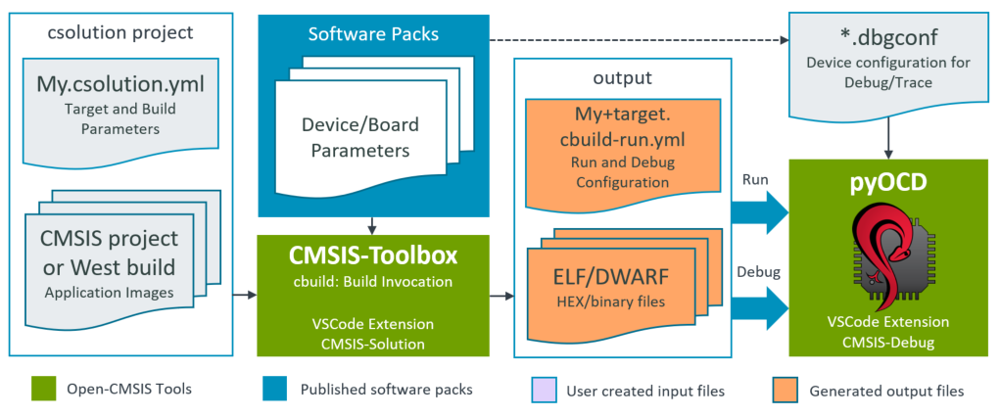

# CSolution Project Structure

<!-- markdownlint-disable MD013 -->
<!-- markdownlint-disable MD036 -->

This chapter outlines the structure of *csolution project files* that contain the build information of the software application.

- [Project Examples](#project-examples) and project templates help to get started with the tools.
- [Software Layers](#software-layers) provide reusable configurations  and give projects a better structure.
- [Directory Structure](#directory-structure) describes the overall directory structure of projects.
- [Linker Script Management](#linker-script-management) defines the  available memory and controls the linker operation.
- [Generator Support](#generator-support) integrates configuration tools such as STM32CubeMX or MCUXpresso Config.
- [Run and Debug Configuration](#run-and-debug-configuration) explains how to configure debug adapters such as CMSIS-DAP or J-Link.
- [West Build System Integration](#west-build-system-integration) allows to manage Zephyr applications in context with a *csolution project*.

## Overview of Operation

The diagram below outlines the operation of the `csolution` command `convert` that processes the *csolution project* with one or more [`context`](YML-Input-Format.md#context) configurations for an application.

!!! Tip
    - [Project Examples](#project-examples) show different project types and provide templates for user projects.
    - [Build Process Overview](build-operation.md#build-process-overview) explains the complete end-to-end build process.


Input Files              | Description
:------------------------|:---------------------------------
[Generic Software Packs](https://www.keil.arm.com/packs/?q=&pack-search=&contents=software_only) | Provide re-usable software components that are typically configurable  towards a user application.
[DFP Software Pack](https://www.keil.arm.com/devices)   | Device-related information (including memory sizes) for the tool configuration.
[BSP Software Pack](https://www.keil.arm.com/boards)    | Board specific configuration (i.e. additional memory resources).
[cdefault.yml](YML-Input-Format.md#cdefault)            | When enabled with [`cdefault:`](YML-Input-Format.md#solution), setup of toolchain specific controls and pre-defined toolchains.
[*.csolution.yml](YML-Input-Format.md#solution)         | Complete scope of the application with sub-projects. Defines [target](YML-Input-Format.md#target-types) and [build](YML-Input-Format.md#build-types) types.
[*.cproject.yml](YML-Input-Format.md#project)           | Content of an independent build step (linker or library archiver run).
[*.clayer.yml](YML-Input-Format.md#layer)               | Set of source files along with pre-configured components for reuse in different applications.

Input/Output Files       | Description
:------------------------|:---------------------------------
[*.cbuild-pack.yml](YML-CBuild-Format.md#cbuild-packyml)  | Exact list of the packs that are used by the application; enables [reproducible builds](#reproducible-builds) as it locks the pack versions.
[*.cbuild-set.yml](YML-CBuild-Format.md#cbuild-setyml)    | Specifies the [context set](#working-with-context-set) of projects, target-types, and build-types that are used to generate the application image.

Output Files             | Description
:------------------------|:---------------------------------
[*.cbuild-idx.yml](YML-CBuild-Format.md#cbuild-idxyml)  | Index file of all `*.cbuild.yml` build descriptions; contains also overall information for the application.
[*.cbuild.yml](YML-CBuild-Format.md#cbuild-idxyml)      | Build description of a single [`*.cproject.yml`](YML-Input-Format.md#project-file-structure) input file for each context.
[*.cbuild-run.yml](YML-CBuild-Format.md#run-and-debug-management)      | Configuration file of a *csolution project* to run and debug an application on a target.
[Run-Time Environment (RTE)](#rte-directory-structure) | Contains the user-configured files of a project along with the `RTE_Components.h` inventory file.
[Linker Script Files](#automatic-linker-script-generation) | Header file that describes the memory resources.

To generate the build information of an application project, the `csolution` command `convert` executes the following steps:

1. Read Input Files (*csolution project* and *Software Packs*)

2. Process each project context (defined by a [target-set](#working-with-target-set) or the option: `--context`):
    - Apply [`pack:`](YML-Input-Format.md#pack), [`device:`](YML-Input-Format.md#device), [`board:`](YML-Input-Format.md#board), and [`compiler:`](YML-Input-Format.md#compiler) to filter the content of software packs.
    - From [`groups:`](YML-Input-Format.md#groups) add the list of user source files.
    - From [`components:`](YML-Input-Format.md#components) add the list of component source files.

3. Generate *Output Files*:
    - Update [configuration files](#plm-of-configuration-files) in RTE directory (disable with option: `--no-update-rte`).
    - Print results of software component dependency validation.

### Source Code of Software Packs

Software packs and the related [components:](#software-components) allow you to share and reuse code. The content of a software pack is, therefore, *read-only* (with the exception of [configuration files](#configuration-settings) that are copied to the [RTE directory](#rte-directory-structure)) as these source code files should not be modified by a user.

The **benefit** is a clean project directory that only contains the user code and [configuration files](#configuration-settings) for [components:](#software-components). This keeps a [repository](#repository-contents) small and makes it easy to upgrade to a [new pack version](#plm-of-configuration-files).

!!! Note
    - During the development of a software pack, you may [install a repository](build-tools.md#install-a-repository), which contains the source of the software pack.
    - You may copy the content of a software pack to your project workspace and provide a [path to the pack](YML-Input-Format.md#pack).

## Project Examples

### GitHub repositories

The following repositories provide several working examples:

Repository            | Description
:---------------------|:-------------------------------------
[csolution-examples](https://github.com/Open-CMSIS-Pack/csolution-examples) | Contains several getting started examples that show single-core, multi-core, and TrustZone setup as well as how to use a generator (CubeMX).
[github.com/Arm-Examples](https://github.com/Arm-Examples) | Contains many examples that include CMSIS-Toolbox setup.

The section below explains the overall concepts considered by the **`csolution` Project Manager** based on examples.

### Template Projects

The following `*.csolution.yml` templates may be used to create embedded applications.

Template    | Description
:-----------|:------------------------------
[Simple](https://github.com/Open-CMSIS-Pack/csolution-examples/tree/main/Templates/Simple)        | A csolution.yml template with a single `*.cproject.yml`.
[Multicore](https://github.com/Open-CMSIS-Pack/csolution-examples/tree/main/Templates/Multicore)  | A csolution.yml template with multiple `*.cproject.yml` files, each targeting one processor of a multicore device.
[TrustZone](https://github.com/Open-CMSIS-Pack/csolution-examples/tree/main/Templates/TrustZone)  | A csolution.yml template with a non-secure `*.cproject.yml` and an optional secure `*.cproject.yml` file.
[UnitTest](https://github.com/Open-CMSIS-Pack/csolution-examples/tree/main/Templates/UnitTest)    | A csolution.yml template that shares one HAL `*.clayer.yml` with multiple `*.cproject.yml` files for unit testing.

To use these templates, copy the content of the folder to your own application folder. Then adapt the names accordingly and add missing information.

Refer to [CMSIS-Toolbox Templates](https://github.com/Open-CMSIS-Pack/csolution-examples/tree/main/Templates) for more details.

### Minimal Project Setup

A minimal application requires two files:

- `Sample.csolution.yml` that defines a [target type](YML-Input-Format.md#target-types) with [board](YML-Input-Format.md#board) or [device](YML-Input-Format.md#device). It includes a [project](YML-Input-Format.md#projects) and selects a [compiler](YML-Input-Format.md#compiler).

- `Sample.cproject.yml` defines the files and software components that are translated into an image or library archive.

!!! Note
    When no [`packs:`](YML-Input-Format.md#packs) are specified in *csolution project files*, the tools use the latest version of the installed packs.

**Simple Project: `Sample.csolution.yml`**

```yml
solution:
  cdefault:                                   # use default setup for toolchains
  compiler: AC6                               # select the compiler to use

  packs:                                      # explicit pack selection may be omitted
    - pack: NXP::K32L3A60_DFP@16.0.0          # specify DFP
    - pack: NXP::FRDM-K32L3A6_BSP@16.0.0

  target-types:
    - type: FRDM-K32L3A6
      board: FRDM-K32L3A6

  build-types:                                # defines toolchain options for 'debug' and 'release'
    - type: Debug
      debug: on
      optimize: debug

    - type: Release
      debug: off
      optimize: balanced

  projects:
    - project: ./Sample.cproject.yml
```

**Simple Project: `Sample.cproject.yml`**

```yml
project:
  packs:
    - pack: ARM::CMSIS                        # specify additional packs

  groups:
    - group: App
      files:
        - file: ./main.c

  components:
    - component: CMSIS:CORE
    - component: Device:Startup
```

### Context

A [context](YML-Input-Format.md#context-name-conventions) is defined in the `*.csolution.yml` file by `projects:`, `target-types:`, and `build-types:`. It identifies a configuration with `project-name`, `build-type`, and `target-type` and is used on various places in the CMSIS-Toolbox.

The following [context](YML-Input-Format.md#context-name-conventions) refers to the example above and selects the `project: Sample.cproject.yml` with `build-type: Debug` and `target-type: FRDM-K32L3A6`:

```txt
Sample.Debug+FRDM-K32L3A6
```

The [context](YML-Input-Format.md#context-name-conventions) allows you to refer to each possible build combination that, by default, uses a different [output directory](#output-directory-structure). A context may be partly specified in many places.

The [context-set](#working-with-context-set) defines a combination of projects and is useful when an application is composed of [multiple related projects](#configure-related-projects).

### Toolchain Agnostic Project

Generic [**Translation Control**](YML-Input-Format.md#translation-control) settings enable projects that work across the range of supported compilers (AC6, GCC, IAR, CLANG). The [**Translation Control**](YML-Input-Format.md#translation-control) settings are mapped to specify compiler controls by the build tools.

#### cdefault.yml

The `cdefault.yml` file contains a common set of compiler-specific settings that select reasonable defaults with [`misc:`](YML-Input-Format.md#misc) controls for each compiler. The [`cdefault:`](YML-Input-Format.md#cdefault) node in the `*.csolution.yml` file enables the usage of this file. The directory [`<cmsis-toolbox-installation-dir>/etc`](installation.md) contains a `cdefault.yml` file that is used when no local copy of the `cdefault.yml` file is provided.

!!! Note
    It is recommended that a local copy of the `cdefault.yml` file be provided in the same directory that stores the `*.csolution.yml` file.

**Example:**

```yml
default:

  misc:
    - for-compiler: AC6
      C-CPP:
        - -Wno-macro-redefined
        - -Wno-pragma-pack
        - -Wno-parentheses-equality
        - -Wno-license-management
      C:
        - -std=gnu11
      ASM:
        - -masm=auto
      Link:
        - --entry=Reset_Handler
        - --map
        - --info summarysizes
        - --summary_stderr
        - --diag_suppress=L6314W

    - for-compiler: GCC
      C-CPP:
        - -masm-syntax-unified
        - -fomit-frame-pointer
        - -ffunction-sections
        - -fdata-sections
      C:
        - -std=gnu11
      Link:
        - --specs=nano.specs
        - --specs=nosys.specs
        - -Wl,-Map=$elf()$.map
        - -Wl,--gc-sections
        - -Wl,--no-warn-rwx-segments   # suppress incorrect linker warning

    - for-compiler: CLANG
      C-CPP:
        - -fomit-frame-pointer
        - -ffunction-sections
        - -fdata-sections
      C:
        - -std=gnu11
      Link:
        - -lcrt0
        - -Wl,-Map=$elf()$.map
        - -Wl,--gc-sections

    - for-compiler: IAR
      C-CPP:
        - --dlib_config DLib_Config_Full.h
      Link:
        - --map=$elf()$.map
```

#### Compiler Selection

There are two ways to select a toolchain:

- An explicit [`compiler:`](YML-Input-Format.md#compiler) selection in the `*.csolution.yml` project file:

```yml
solution:
  cdefault:           # use the cdefault.yml file with toolchain specific controls
  compiler: AC6       # select Arm Compiler
  :
```

- The command line option `--toolchain` of the `cbuild` or `csolution` tool overwrites any `compiler:` definition in the csolution project files.

```shell
cbuild Hello.csolution.yml --toolchain GCC
```

!!! Tip
    - [Toolchain agnostic example projects](pack-tools.md#project-examples) do not contain a [`compiler:`](YML-Input-Format.md#compiler) selection in the [`*.csolution.yml`](YML-Input-Format.md#solution) project file.
    - Instead the [`select-compiler:`](YML-Input-Format.md#select-compiler) node list the compilers that this *csolution project* is tested with. The [VS Code extension Arm CMSIS Solution](https://marketplace.visualstudio.com/items?itemName=Arm.cmsis-csolution) adds the [`compiler:`](YML-Input-Format.md#compiler) node based on the installed compiler in your environment.

### Reproducible builds

Reproducible builds are supported by the [*.cbuild-pack.yml](YML-CBuild-Format.md#cbuild-packyml) file that is created and read by the **csolution** project manager. This file:

- Records the exact list of the pack versions used during the creation of an application.
- Ensures that pack versions do not change during development, even when new packs are installed on the host computer, for example, to develop other applications.

!!! Note
    - The [*.cbuild-pack.yml](YML-CBuild-Format.md#cbuild-packyml) file should be committed to a repository to ensure reproducible builds.
    - The `cbuild` option `--frozen-packs` checks that the [*.cbuild-pack.yml](YML-CBuild-Format.md#cbuild-packyml) file exists and reports an error if any pack is changed or not available.
    - To update a pack to a new version, delete the file [*.cbuild-pack.yml](YML-CBuild-Format.md#cbuild-packyml) or remove the information about a specific pack in this file.

#### Repository Contents

To support reproducible builds, the following files should be committed to a repository of a version control system.

- All user source code files.
- All *csolution project files* (`cdefault.yml`, `*.csolution.yml`, `*.cproject.yml`, etc.).
- All files in the RTE directory
    - Ensure that there are no files with the extension *.update@* as this indicates that configuration files are not up-to-date due to updated software packs.
- The file `*.cbuild-pack.yml` to allow [reproducible builds](#reproducible-builds).
Optionally, the file `*.cbuild-set.yml` defines the application's context set that should be generated.

!!! Note
    If the file `*.cbuild-set.yml` file is missing, the `setup` command creates a `*.cbuild-set` file with a selection of the first `target-type` and the first `build-type`.

### Configure Related Projects

A solution is the software view of the complete system. It combines projects that can be generated independently and
therefore, manages related projects. It may also be deployed to different targets during development as described in section [Software Layers](#software-layers).

The picture below shows a system that is composed of:

- Project A that implements a time-critical control algorithm running on an independent processor #2.
- Project B is a cloud-connected IoT application with Machine Learning (ML) functionality.
- Project C is the separate data model of the ML algorithm, allowing independent updates.
- Project D implements the device security (for example, with TF-M that runs with TrustZone in secure mode).

In addition, such systems may have a boot-loader that can also be implemented as another independent project.


At the level of the `*.csolution.yml` file, the `target-types:` and `build-types:` are managed so that a common set is available across all `*.cproject.yml` files in the system.

- `target-types:` typically describe a different hardware target system.

- `build-types:` typically describe a build variant of the same hardware target system.

Both types are used for peripherals and the same hardware configuration but may compile a different variant (i.e. with test I/O enabled) of an application.

**Related Projects: `iot-product.csolution.yml`**

```yml
solution:
   :                            # setup not shown

  target-types:
    - type: Board
      board: NUCLEO-L552ZE-Q    # uses device defined by the board

    - type: Production-HW
      device: STM32U5X          # specifies device

  build-types:
    - type: Debug
      optimize: none
      debug: on

    - type: Release
      optimize: balanced
      debug: on

    - type: Test
      optimize: size
      debug: on

  projects:
    - project: ./security/TFM.cproject.yml           # Project D: Only generated for build type: Release
      for-context: .Release
    - project: ./application/MQTT_AWS.cproject.yml   # Project B
    - project: ./mldata/Model.cproject.yml           # Project C
    - project: ./bootloader/Bootloader.cproject.yml  # Not generated for target type: Board
      not-for-context: +Board
    - project: ./processor2/Control.cproject.yml     # Project A
```

### Working with target-set

A [`target-set:`](YML-Input-Format.md#target-set) specifies the [context](#context) types and additional [images](YML-Input-Format.md#images) that are combined into an application. The following example defines the [Run and Debug configurations](#run-and-debug-configuration) for the `iot-product.csolution.yml` application that is shown above using the [`target-set:`](YML-Input-Format.md#target-set) node.

!!! Note
    [Run and Debug Configuration](#run-and-debug-configuration) shows how a  [`debugger:`](YML-Input-Format.md#debugger) is specified for a build variant that is defined with [`target-set:`](YML-Input-Format.md#target-set).

```yml
solution:
   :                            # setup not shown

  target-types:
    - type: Board
      board: NUCLEO-L552ZE-Q    # uses device defined by the board
      target-set:
        - set:                  # default set for this target
          images:
            - project-context: MQTT_AWS.Debug
            - project-context: Control.Debug
        
    - type: Production-HW
      device: STM32U5X          # specifies device
        - set:                  # default set for this target
          images:               # all projects as release version
            - project-context: Bootloader.Release
            - project-context: TFM.Release
            - project-context: MQTT_AWS.Release
            - project-context: Model.Release
            - project-context: Control.Release
        - set: Debug            # alternative set for debugging on Production-HW
          images:               # projects and images required for debugging
            - image: Bootloader_Dummy.hex           # use an dummy image
            - project-context: TFM.Release
            - project-context: MQTT_AWS.Debug       # load debug build
            - image: Model_Test.hex                 # use a test Model
```

Using the [Build Tools](build-tools.md) option `--active` (or `-a`) generates the different build variants:

```bash
cbuild iot-product.csolution.yml -a Board                   # target-type Board with default set
cbuild iot-product.csolution.yml -a Production-HW           # target-type Production-HW with default set
cbuild iot-product.csolution.yml -a Production-HW@Debug     # target-type Production-HW with Debug set
```

### Working with context-set

!!! Note
    With CMSIS-Toolbox version 2.9 or higher the [`target-set:`](YML-Input-Format.md#target-set) is introduced. It is recommended to use [`target-set:`](YML-Input-Format.md#target-set) instead of the `--context-set` option as the `--context-set` option may be deprecated.

Frequently, it is required to build applications with different [context](#context) types. The following command line example generates the `iot-product.csolution.yml` with build type `Debug` for the project `MQTT_AWS.cproject.yml`, while the other projects use the build type `Release`. When using the option `-S` or `--context-set`, this selection is saved to the file `iot-product.cbuild-set.yml` located in the same directory as the `*.csolution.yml` file. Refer to [File Structure of `*.cbuild-set.yml`](YML-CBuild-Format.md#cbuild-setyml) for details.

```txt
cbuild iot-product.csolution.yml -c TFM.Release+Board -c MQTT_AWS.Debug+Board -c Bootloader.Release+Board -S
```

The saved context-set (`iot-product.cbuild-set.yml`) is used when the option `-S` or `--context-set` is used without option `--context` or `-c`.

```txt
cbuild iot-product.csolution.yml -S
```

**Rules for context-set**

- The same [target-type](#context) must be selected for all projects.
- Only one [build-type](#context)  can be selected for a project.
- Projects that are not required can be excluded.

!!! Note
    The [VS Code extension Arm CMSIS Solution](https://marketplace.visualstudio.com/items?itemName=Arm.cmsis-csolution) always uses a `context-set` that is selected in the Manage Solution view.

### External Tools and Build Order

The [`executes:`](YML-Input-Format.md#executes) node integrates [CMake](build-operation.md#cmake-integration) scripts, projects, and external tools. The `input:` and  `output:` list typically refers to files and therefore define the build order of projects:

- When `input:` contains files that are the [output](YML-Input-Format.md#output) of a `cproject.yml`, this project part is built first.
- When `output:` contains files that are the input of a `cproject.yml`, the `execute:` node is built first.

**Example:**

The `KeyGenerator` tool builds the file `keys.c`, which is added as a source [file:](YML-Input-Format.md#files) for other projects. Using `cbuild My.csolution.yml [--context-set]` starts the build process of the application and runs the `KeyGenerator` before building projects that use the source file `keys.c` as input.

!!! Note
    Using `cbuild` with the option `--context` does not run `execute:` nodes as it triggers project builds only. The option `--context-set` must be used.

```yml
solution:
    :
  executes:
    - execute: GenKeys                      # is a CMake target name
      run: KeyGenerator -k $input(0)$ -p $input(1)$ -o $output$
      input:
        - $SolutionDir()$/keyfile.txt       # input(0) contains key in text format
        - $SolutionDir()$/passcode.txt      # input(1) contains passcode in text format
      output:
        - $SolutionDir()$/keys.c            # output keys source file (input to other projects)
```

#### Project Dependency

An [access sequence](YML-Input-Format.md#access-sequences) that refers to the output of another project also impacts the build order.

**Example:**

The [access sequence](YML-Input-Format.md#access-sequences) `$cmse-lib(Project_S)$` includes the secure entry library of `Project_S`. Hence, `Project_S` is built before the non-secure project part of the application.

```yml
project:                                 # Non-secure project
    :
  groups:
    - group: CMSE Library
      files:
        - file: $cmse-lib(Project_S)$    # Secure part of an application
```

## Software Layers

Software layers collect source files and software components along with configuration files for reuse in different projects. Software Layers gives projects a better structure and simplifies:

- Development flows with evaluation boards and production hardware.
- Evaluation of middleware and hardware modules across different microcontroller boards.
- Code reuse across projects, i.e. board support for test-case deployment.
- Test-driven software development on simulation model and hardware.

**Simple Example:**

This example uses a layer to include an RTOS kernel. The file `MyProject.cproject.yml` includes the file `RTOS.clayer.yml` using the [`layers:`](YML-Input-Format.md#linker) node:

```yml
project:
  groups:
    - group: App
      files:
        - file: ./main.c

  components:
    - component: CMSIS:CORE
    - component: Device:Startup

  layers:
    - layer: ../Layer/RTOS.clayer.yml    # Add RTOS kernel
```

The `RTOS.clayer.yml` file defines the kernel along with configuration settings.

```yml
layer:
  description: RTX RTOS with configuration settings

  packs:
    - pack: ARM:CMSIS-RTX

  components:
    - component: CMSIS:RTOS2:Keil RTX5&Source
```

The diagram below shows two different scenarios, which are explained in the following sections.


### Target Production Hardware

Software development frequently starts on evaluation boards. Using a board layer simplifies re-targeting to  production hardware. The following `*.csolution.yml` file exemplifies the concept. A software developer starts with a board layer for the evaluation board in the folder `MyBoard`. Once the production hardware is available, this layer is copied to a different folder (i.e. `MyHardware`). As both layers are independently managed, the configuration of the `MyHardware` layer can be modified, for example, to target different devices, pin layout, or peripheral configurations.

In the `*.csolution.yml` project, the layer is defined using a [variable](YML-Input-Format.md#variables). By changing the `target-type` during the build process, the software developer can continue to use the evaluation board or target the production hardware.

```yml
solution:
  cdefault:
  compiler: AC6

  target-types:
    - type: EvalBoard
      board: STMicroelectronics::B-U585I-IOT02A:Rev.C
      device: STMicroelectronics::STM32U585AIIx
      variables:
        - Board-Layer: $SolutionDir()$/MyBoard/Board.clayer.yml

    - type: ProductionHW
      device: STMicroelectronics::STM32U575AIIx    # uses a different device
      variables:
        - Board-Layer: $SolutionDir()$/MyHardware/Board.clayer.yml

  build-types:
    - type: Debug
      debug: on
      optimize: debug
    - type: Release
      debug: off
      optimize: balanced

  projects:
    - project: HID/HID.cproject.yml
```

!!! Tip
    - The [MDK-Middleware examples](https://arm-software.github.io/MDK-Middleware/latest/General/working_with_examples.html) are structured in this way. Start with a board layer that is provided in several [Board Support Packs](https://github.com/Open-CMSIS-Pack#stm32-packs-with-generator-support).
    - Another project that extends this concept to hardware shields is the [Sensor-SDK-Example](https://github.com/Open-CMSIS-Pack/Sensor-SDK-Example).

### Test Case Project

Modern software design mandates for [test-driven development](https://en.wikipedia.org/wiki/Test-driven_development) that utilize DevOps or CI principals. Simulation models such as the [Arm Virtual Hardware (AVH) FVP](https://arm-software.github.io/AVH/main/overview/html/index.html) allow test automation without target hardware.

However, in some cases, tests should also be performed on physical hardware. A test case project may, therefore, contain targets for simulation and physical hardware. The *csolution project* format allows multiple test projects to be combined to validate different parts of the application.

```yml
solution:
  cdefault:
  compiler: GCC
    :                              # pack definition not shown

  target-types:
    - type: Board
      board: NUCLEO-L552ZE-Q
      variables:
        - Board-Layer: ./Board/NUCLEO-L552ZE-Q/Board.clayer.yml

    - type: Virtual
      board: VHT-Corstone-300      # Virtual Hardware platform (appears as a board)
      variables:
        - Board-Layer: ./Board/Corstone-300/AVH.clayer.yml

  projects:
    - project: ./TestSuite1/TestCases.cproject.yml
    - project: ./TestSuite2/TestCases.cproject.yml
    - project: ./TestSuite3/TestCases.cproject.yml
```

!!! Tip
    - Several [examples for Arm Virtual Hardware (AVH) FVP simulation models](https://github.com/Arm-Examples#avh-fvp-examples) show usage of *csolution projects* in CI workflows.
    - The project [AVH-MLOps-Main](https://github.com/ARM-software/AVH-MLOps/tree/main/AVH-MLOps-main) is a test project that shows retargeting to different processors using a layer.
    - The project [AWS_MQTT_Demo](https://github.com/Arm-Examples/AWS_MQTT_Demo) extends this concept with retargeting of an IP communication to virtual or physical hardware.

### Configuration Settings

A software layer is a set of source files and pre-configured software components or source code that can be shared across multiple projects. To achieve this, the configuration files of a [`layer`](YML-Input-Format.md#layer) are stored within the directory structure of the software layer. This separate [RTE Directory Structure](#rte-directory-structure) allows that projects
can share a `layer` with common configuration settings.

!!! Note
    When using a generator, such as CubeMX or MCUxpresso, the output should be redirected as described under [Configure Generator Output](#configure-generator-output).

### Software Layers in Packs

Software layers for [*reference applications*](ReferenceApplications.md) may be published in software packs. For more information, refer to [Pack Creation &raquo; Layers](pack-tools.md#layers).

## Directory Structure

This section describes how the `csolution` based project files should be organized to allow the scenarios described above. This section also gives guidelines for a directory structure.

Refer to [Directory Control](./YML-Input-Format.md#directory-control) for information about configuring these directories.

### Working Areas

The table below explains the different working area sections of an application project.

Working Area                                                      | Access | Description
:-----------------------------------------------------------------|:------:|:------------------
[Project Area](#project-area)                                     | RW     | Contains user source code files managed by the user along with the  project files (see next item).
[Project files](./YML-Input-Format.md#project-file-structure)     | RW     | Created by a user or an IDE to describe the application project.
Component source code                                             | RO     | Content of software packs; the location is specified by the environment variable [`CMSIS_PACK_ROOT`](installation.md#environment-variables) or the node [`pack: path`](./YML-Input-Format.md#pack) in project files.
[Component Configuration​](#rte-directory-structure)               | RW     | User-editable config files of software components that are copied to the RTE directory.
Generator artifacts​                                               | RO (see note) | Managed by domain-specific configuration tools such as STM32CubeMX or MCUXpresso.
[Build artifacts](./YML-Input-Format.md#directory-control)        | RW     | Created during the build process for example by a compiler.

!!! Note
    Some generators allow user modification of the generated files. For example, STM32CubeMX allows modification of source code between `/* USER CODE BEGIN */` and `/* USER CODE END */` and preserves this modification even when the STM32CubeMX regenerates the files.

### Project Area

There are no strict rules on how to organize the project area that stores the user source code. However, the following guidelines apply:

- Each [solution](#project-examples) should have a distinct base directory. This directory contains the file `*.csolution.yml` which refers to the independent projects defined with `*.cproject.yml` files.

Each project should have a distinct base directory. This directory contains the file `*.cproject.yml`, which defines the project's content. The project's source code might be grouped in subdirectories that are typically stored in this base directory. The [configuration files](#rte-directory-structure) of the software components are typically stored in a subdirectory with the name `./RTE`.

- A `*.cproject.yml` may refer to one or more [software layers](#software-layers) with `*.clayer.yml` files. Each software layer should have a distinct base directory with a similar structure as a project. This base directory contains the file `*.clayer.yml` that defines the content of the software layer. It also contains the user source code (optionally organized in sub-directories) and the [configuration​ files](#rte-directory-structure) of software components that belong to this layer, typically stored in a sub-directory with the name `./RTE`.

### RTE Directory Structure

The table below summarizes the overall directory structure and further details the `./RTE` directory. The `./RTE` directory contains the configuration information for software components and is managed by the **`csolution` Project Manager**. It contains:

- Configuration files of the software components. These files have `attr="config"` in the PDSC-file of the software packs.  Refer to [PLM of Configuration Files](#plm-of-configuration-files) for more information.
- The file [`RTE_components.h`](#rte_componentsh) and pre-include files are generated based on the software packs' PDSC file information.

!!! Note
    The `./RTE` directory structure is maintained by tools. You should not modify its structure. However, the complete directory should be committed to a repository of a version control system.

Directory Structure                 | Content
:-----------------------------------|:---------------
`<csolution>`                       | Base directory that contains one or more `*.csolution.yml` files.
`<project>`                         | Each project has its own directory; this base directory contains the `*.cproject.yml` file.
`<project>/RTE/<Cclass>`            | Configurable files for each component `Cclass` have a common directory.
`<project>/RTE/<Cclass>/<device>`   | Configurable files for components that have a condition to a `device` are in a separate directory.
`<project>/RTE/<context-dir>`       | Directory for `RTE_components.h` and pre-include files that are generated by the **`csolution` Project Manager**.
`<layer>`                           | Each layer has its own base directory; this directory contains the `*.clayer.yml` file.
`<layer>/RTE/<Cclass>`              | Configurable files for each component `Cclass` have a common directory below the layer base directory.
`<layer>/RTE/<Cclass>/<device>`     | Configurable files for components that have a condition to a `device` are in a separate directory below the layer base directory.

The `<context-dir>` has the following format: `_<build-type>_<target-type>`.

!!! Note
    `cbuild` no longer generates the `<context-dir>` by default. It is, therefore, required to align the naming of `<context-dir>` with other tools (MDK, CMSIS-Pack-Eclipse, etc.) that support the CMSIS-Pack system.

### Output Directory Structure

By default, the following output directories are used. Use [`cbuild`](build-tools.md#build-a-project) to generate the content of these output directories.

Output                                        | Content
:---------------------------------------------|:---------------
`./out/<project>/<target>/<build>`            | Contains the final binary and symbol files of a project context.

### Software Components

[Software components](CreateApplications.md#software-components) are re-usable library or source files that do not require modification in the user application.
Optionally, configurable source and header files are provided to allow the setting of parameters for the software component.

- Configurable source and header files are copied to the project using the directory structure explained above.
- Libraries, source, and header files that are not configurable (and need no modification) are stored in the directory
  of the software component (typically part of CMSIS_Pack_ROOT) and get included directly from this location into the
  project.
- An include path to the header files of the software component is added to the C/C++ Compiler control string.

!!! Notes
    - The `csolution` command `convert` provides the option `--no-update-rte` that disables the generation of files in the `./RTE` directory and, therefore the management of configuration files and the `RTE_Components.h` file.
    - The `csolution` command `update-rte` only updates the configuration files in the `RTE` directory.
    - Using the option `--verbose` outputs additional version details.

### PLM of Configuration Files

Configurable source and header files have a piece of version information that is required during Project Lifetime Management
(PLM) of a project. The version number is important when the underlying software pack changes and provides a newer
configuration file version.

Depending on the PLM status of the application, `csolution` performs the following operation for configuration files:

1. **Add** a software component for the first time.
2. **Upgrade** (or downgrade) a software component.

#### **Add**

When adding a software component for the first time, the related config file is copied twice into the related `RTE`
project directory. The first copy can be modified by the user with the parameters for the user application. The
second copy is an unmodified  backup file with the format `<configfile>.<ext>.base@version`.

**Example:** A configuration file `ConfigFile.h` at version `1.2.0` is copied:

```c
./RTE/component_class/ConfigFile.h                  // user editable configuration file
./RTE/component_class/ConfigFile.h.base@1.2.0       // current unmodified configuration file with version
                                                    // information; used as a base for version comparison
```

`csolution` shows a user notification to indicate that files have been added:

```text
./RTE/component_class/ConfigFile.h -  info: component 'name' added configuration file version '1.2.0'
```

!!! Note
    The unmodified files with `@version` information should be committed to the repository of the version control system as these files are used to upgrade configuration information using merge utilities.

#### **Upgrade**

When upgrading (or downgrading) a software component, the version information of the configuration file is considered.

- If the version of the unmodified backup file is identical, no operation is performed.
- If the version differs, the new configuration file is copied with the format `<configfile>.<ext>.update@version`.

**Example:** after updating the configuration file `ConfigFile.h` to version `1.3.0`, the directory contains these files:

```c
./RTE/component_class/ConfigFile.h                  // user editable configuration file (based on the current version)
./RTE/component_class/ConfigFile.h.update@1.3.0     // new configuration file; used to start a 3-way merge
./RTE/component_class/ConfigFile.h.base@1.2.0       // current unmodified configuration file with version
                                                    // information; used as a base for version comparison
```

`csolution` displays a user notification to indicate that configuration files have changed:

```text
./RTE/component_class/ConfigFile.h - warning: component 'name' upgrade for configuration file version '1.3.0'
                                              added, but file inactive
```

**User action to complete upgrade**

The user now has several options (outside of `csolution`) to merge the configuration file information. A potential way could be to use a 3-way merge utility. After merging the configuration file, the original `base@version` file should be deleted, and the new unmodified version should become the new `base@version`. The previous configuration file may be stored as a backup, as shown below.

```c
./RTE/component_class/ConfigFile.h                  // new configuration file with merge configuration
./RTE/component_class/ConfigFile.h.bak              // previous configuration file stored as backup
./RTE/component_class/ConfigFile.h.base@1.3.0       // current unmodified configuration file with version
                                                    // information; used as a base for version comparison
```

#### Multiple Instances of Configuration files

The system is also capable of handling multiple instances of configuration files as explained in the CMSIS-Pack specification under [Component Instances](https://open-cmsis-pack.github.io/Open-CMSIS-Pack-Spec/main/html/pdsc_components_pg.html#Component_Instances). In this case, the instance %placeholder% is expanded as shown below.

```c
./RTE/component_class/ConfigFile_0.h
./RTE/component_class/ConfigFile_0.h.base@1.2.0
./RTE/component_class/ConfigFile_1.h
./RTE/component_class/ConfigFile_1.h.base@1.2.0
```

### RTE_Components.h

The file `./RTE/RTE_Components.h` is created by the CMSIS Project Manager when the option `--update-rte` is used. This option is the default for the `csolution convert` command. For each selected software component, it contains `#define` statements required by the component. These statements are defined in the `*.PDSC` file for that component. The following example shows a sample content of a RTE_Components.h file:

```c
/* Auto generated Run-Time-Environment Component Configuration File *** Do not modify ! *** */

#ifndef RTE_COMPONENTS_H
#define RTE_COMPONENTS_H

/* Define the Device Header File: */
#define CMSIS_device_header "stm32f10x.h"

#define RTE_Network_Interface_ETH_0     /* Network Interface ETH 0 */
#define RTE_Network_Socket_BSD          /* Network Socket BSD */
#define RTE_Network_Socket_TCP          /* Network Socket TCP */
#define RTE_Network_Socket_UDP          /* Network Socket UDP */

#endif /* RTE_COMPONENTS_H */
```

The `RTE_Components.h` file is typically used in other header files to control the inclusion of files related to other components of the same software pack.

```c
#include "RTE_Components.h"
#include  CMSIS_device_header

#ifdef  RTE_Network_Interface_ETH_0     // if component Network Interface ETH 0 is included
#include "Net_Config_ETH_0.h"           // add the related configuration file for this component
#endif
```

### CMSIS_device_header

The preprocessor symbol `CMSIS_device_header` represents the [device header file](https://arm-software.github.io/CMSIS_6/latest/Core/using_pg.html#using_packs) provided by the CMSIS-Core. It defines the registers and interrupt mapping of the device that is used. Refer to [Reference Applications > Header File Structure](ReferenceApplications.md#header-file-structure) for more information.

### \_RTE\_ Preprocessor Symbol

The preprocessor symbol `_RTE_` is added to the compiler invocation when a CMSIS build system manages the file `RTE_Components.h`. This symbol can be used as follows:

```c
#ifdef _RTE_                           // Is a CMSIS build system used?
#include "RTE_Components.h"            // Include Run-Time-Environment symbols
#else                                  // Otherwise, use different ways to supply required symbols
#define CMSIS_device_header "stm32f10x.h"
#endif
```

## Linker Script Management

A Linker Script contains a series of Linker directives that specify the available memory and how it should be used in a project. The Linker directives reflect exactly the available memory resources and memory map for the project context.

This section describes the Linker Script management of the **`csolution` Project Manager**:

1. The [`linker:`](YML-Input-Format.md#linker) node specifies an explicit Linker Script and/or memory regions header file. This overrules Linker Scripts that are part of software components or specified using the `file:` notation.

2. The [`linker:`](YML-Input-Format.md#linker) `auto:` enables the [automatic Linker Script generation](#automatic-linker-script-generation).

3. If no [`linker:`](YML-Input-Format.md#linker) node is used, a Linker Script file can be provided as part of software components. The extensions `.sct`, `.scf`, `.ld`, and `.icf` are recognized as Linker Script files.

4. If no Linker Script is found, the [automatic Linker Script generation](#automatic-linker-script-generation) is used.

### Linker Script Preprocessing


A standard C preprocessor is used for the Linker Script file when:

- the linker script file extension is `*.src`.
- the [`linker:`](YML-Input-Format.md#linker) node contains a `regions:` header file or a `define:`.

Otherwise, no preprocessor is used, and the Linker Script file is directly passed to the linker.

### Automatic Linker Script generation

The automatic Linker Script generation uses a Linker Script template and generates a `<regions>.h` file based on information from the software packs using the:

- [`<device>` - `<memory>` element in the DFP](https://open-cmsis-pack.github.io/Open-CMSIS-Pack-Spec/main/html/pdsc_boards_pg.html#element_board_memory)
- [`<board>` - `<memory>` element in the BSP](https://open-cmsis-pack.github.io/Open-CMSIS-Pack-Spec/main/html/pdsc_family_pg.html#element_memory)

Both files, the Linker Script template and the `<regions>.h` are located in the [RTE directory](build-overview.md#rte-directory-structure) path `\RTE\Device\<device>`. The `<regions>.h` file name is extended with:

- `Bname` when the project context uses a [`board:`](YML-Input-Format.md#board-name-conventions) specification, i.e. `regions_IMXRT1050-EVKB.h`
- `Dname` when the project context only uses a [`device:`](YML-Input-Format.md#device-name-conventions) specification, i.e. `regions_stm32u585xx.h`.

Both files, the Linker Script template and the `<regions>.h` can be modified by the user as it might be required to adjust the memory regions or give additional attributes (such as `noinit`).

!!! Note
    For more information, refer to [Create Applications—Configure Linker Scripts](CreateApplications.md#configure-linker-scripts).

#### Linker Script Templates

The following compiler-specific Linker Script template files are copied to the `\RTE\Device\<device>` directory when no Linker Script exists. The files are located in the directory [`<cmsis-toolbox-installation-dir>/etc`](installation.md) of the CMSIS-Toolbox.

Linker Script Template       | Linker control file for ...
:----------------------------|:-----------------------------
`ac6_linker_script.sct.src`  | Arm Compiler
`gcc_linker_script.ld.src`   | GCC Compiler
`iar_linker_script.icf.src`  | IAR Compiler
`clang_linker_script.ld.src` | CLANG Compiler (LLVM)

## Generator Support

*Generators*, such as STM32CubeMX or MCUXpresso Config Tools, simplify the configuration for devices and boards. The CMSIS-Toolbox implements a [generic interface for generators](build-operation.md#generator-integration). *Generators* may be used to:

- Configure device and/or board settings, such as clock configuration or pinout.
- Add and configure software drivers, for example, for UART, SPI, or I/O ports.
- Configure parameters of an algorithm, such as DSP filter design or motor control parameters.

The steps for creating a `*.csolution.yml` application with a *Generator* are:

1. Create the `*.csolution.yml` container that refers to the projects and selects `device:` or `board:`  (by using `target-types:`)
2. Create `*.cproject.yml` files that are referred to by the `*.csolution.yml` container.
3. Add `components:` to the `*.cproject.yml` file.
4. For components that have a `<generator-id>`, run the related generator.

The *Generator* can add files, components, and settings to a project using the [*Generator* import file (`*.cgen.yml`)](YML-CBuild-Format.md#generator-import-file). The format of this file is similar to a [software layer](#software-layers).

### Use a Generator

An example that uses STM32CubeMX is provided in [github.com/Open-CMSIS-Pack/csolution-examples](https://github.com/Open-CMSIS-Pack/csolution-examples). The `./CubeMX` example is used below.

To list the *Generator* configuration of a `*.csolution.yml` use:

```bash
csolution CubeMX.csolution.yml list generators --verbose
CubeMX (Global Registered Generator)                 # Name of the Generator
  base-dir: STM32CubeMX/MyBoard                      # Generator output directory for contexts listed below
    cgen-file: STM32CubeMX/MyBoard/CubeMX.cgen.yml   # Generator import file for contexts listed below
      context: CubeMX.Debug+MyBoard
      context: CubeMX.Release+MyBoard
```

To run the generator (in this case CubeMX) use:

```bash
csolution CubeMX.csolution.yml run --generator CubeMX
```

### Configure Generator Output

The *Generator* output directory and the name of the [*Generator* import file (`*.cgen.yml`)](YML-CBuild-Format.md#generator-import-file) can be configured using the node [`generators:`](YML-Input-Format.md#generators) as shown below.

```yml
  generators:
    options:
    - generator: CubeMX
      path: ../STM32CubeMX
      name: MyConfig
```

A Generator output configuration is useful for:

- Using a [board layer](#software-layers) that is shareable across multiple projects.
- Using different configurations across a `*.csolution.yml` project.

### Detailed Usage Instructions

These chapters explain how to manage device and board configuration in more detail:

- [Configure STM32 Devices with CubeMX](CubeMX.md)
- [Configure NXP Devices with MCUXpresso Config Tools](MCUXpressoConfig.md)

## Run and Debug Configuration

The CMSIS-Toolbox uses the information from the DFP and BSP to simplify the debugger configuration.  It generates the file `<solution-name>+<target-type>.cbuild-run.yml` that contains for one target of a *csolution project* all information for run and debug. This file is used by [pyOCD](https://pyocd.io/) and the [CMSIS Solution extension for VS Code](https://marketplace.visualstudio.com/items?itemName=Arm.cmsis-csolution) to configure debug and programming features of the [supported debug adapters](build-operation.md#debug-adapter-integration).

An application can be composed of [various project contexts](#configure-related-projects) and [additional images](YML-Input-Format.md#images). In addition the [debugger](YML-Input-Format.md#debugger) along with parameters are specified in the `*.csolution.yml` file using the [`target-set:`](YML-Input-Format.md#target-set) node.

!!! Note
    Refer to [Run and Debug Management](YML-CBuild-Format.md#run-and-debug-management) for further details.

**Examples:**

The following example configures the ST-LINK debugger for the project  `MyProject` with build-type `Debug`:

```yml
  target-types:
    - type: MyBoard
      board: B-U585I-IOT02A                   # Board name
      target-set:
        - set:
          debugger:
            name: ST-LINK
          images:
            -  project-context: MyProject.Debug
```

The following example uses a CMSIS-DAP debugger with JTAG protocol and configures a multi-core application with two projects. The project `core0` uses the build-type `Debug`. The project `core1` uses the build-type `Release`.

```yml
  target-types:
    - type: Alif_AppKitE7
      board: Alif Semiconductor::AppKit-E7
      target-set:
        - set:
          debugger:
            name: CMSIS-DAP
            protocol: jtag

          images:
            - project-context: core0.Debug
            - project-context: core1.Release
```

### Using pyOCD

A *csolution project* that uses `target-set:` to configure the debugger should be build using the option `--active` to select the target-type.  The `cbuild` command creates then a corresponding `*.build-run.yml` file that can be used with [pyOCD version 0.37.0](https://pyocd.io/) or higher. This `*.build-run.yml` file contains all information to [program and debug the application](YML-CBuild-Format.md#run-and-debug-management).

**Example:**

```shell
cbuild MyApplication.csolution.yml --active MyBoard                       # build application
pyOCD load --cbuild-run MyApplication+MyBoard.cbuild-run.yml              # download image to target
pyOCD gdbserver --cbuild-run MyApplication+MyBoard.cbuild-run.yml         # start GDB remote server
```

### Using VS Code

With the VS Code extension [CMSIS Solution](https://marketplace.visualstudio.com/items?itemName=Arm.cmsis-csolution) version 1.54 or higher use the **Manage Solution** view to configure the debugger. You may then use the [CMSIS Debugger](https://marketplace.visualstudio.com/items?itemName=Arm.vscode-cmsis-debugger) extension for interactive debug or [pyOCD](https://pyocd.io) in command line mode.

### Device Configuration

Several DFP contain `*.dbgconf` files that configure device-specific debug and trace parameters. The CMSIS-Toolbox provides this configuration information in the `*.build-run.yml` file for [debuggers with Debug Access Sequence support](YML-CBuild-Format.md#run-and-debug-management).

The `.cmsis` directory in the *csolution project* directory contains for each target a default `*.dbgconf` configuration file. For example: `.\.cmsis\MyApplication+MyBoard`.
This file can be configured to reflect user settings.

An explict `*.dbgconf` configuration file can be specified using the [`debugger:` node](YML-Input-Format.md#debugger) in the `*.csolution.yml` file.

## West Build System Integration

The West build system is a project management system used primarily in the [Zephyr](https://www.zephyrproject.org/) ecosystem. The integration in the CMSIS-Toolbox acts as a "build orchestration wrapper" around CMake.
The CMSIS-Toolbox connects the `west build` command with the information of the CMSIS-Pack system as shown in the diagram below. For the [selected compiler](#compiler-selection) the related [environment variables for the west build system](build-operation.md#west-integration) are set. When combined with the [VS Code CMSIS Solution](https://marketplace.visualstudio.com/items?itemName=Arm.cmsis-csolution) extension, features such as project outline in the CMSIS View or "go-to-definition" with `clangd` are available.



West projects are specified using the [`west:`](YML-Input-Format.md#west) node under `projects:` in the `*.csolution.yml` file and can be managed with the `target-types` and `build-types` of the *csolution project*. Note that the `sysbuild` feature of `west` is not supported as the CMSIS-Toolbox manages already related projects.

**Example:**

```yml
solution:
  compiler: AC6

  packs:
    - pack: AlifSemiconductor::Ensemble@^2.0.0-0
    - pack: ARM::CMSIS

  target-types:
    - type: DevKit-E7
      board: Alif Semiconductor::DevKit-E7
      device: Alif Semiconductor::AE722F80F55D5LS
      variables:                            # west board selection
        - west-board: alif_e7_dk_rtss

      target-set:
        - set:
          debugger:
            name: J-Link Server
            port: 3333
            protocol: swd
          images:
            - project-context: rtss_he.Debug
            - project-context: rtss_hp.Release

  build-types:
    - type: Debug
      optimize: debug
      west-defs:                           # west defines
        - CONFIG_DEBUG: y
        - CONFIG_DEBUG_THREAD_INFO: y
        - SE_SERVICES: OFF
        - CMAKE_BUILD_TYPE: Debug

    - type: Release
      optimize: size
      west-defs:                           # west defines
        - SE_SERVICES: OFF
        - CMAKE_BUILD_TYPE: Release

  projects:
    - west:
        app-path: ./alif/samples/drivers/ipm/ipm_arm_mhuv2/rtss_he
        board: $west-board$_he
        device: :M55_HE
    - west:
        app-path: ./alif/samples/drivers/ipm/ipm_arm_mhuv2/rtss_hp
        board: $west-board$_hp
        device: :M55_HP
```
