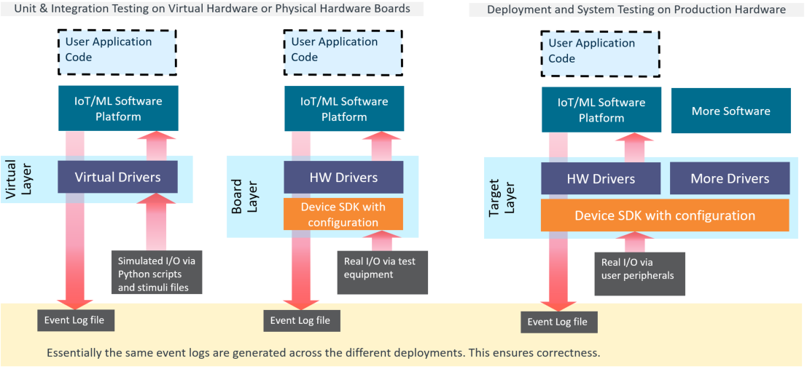
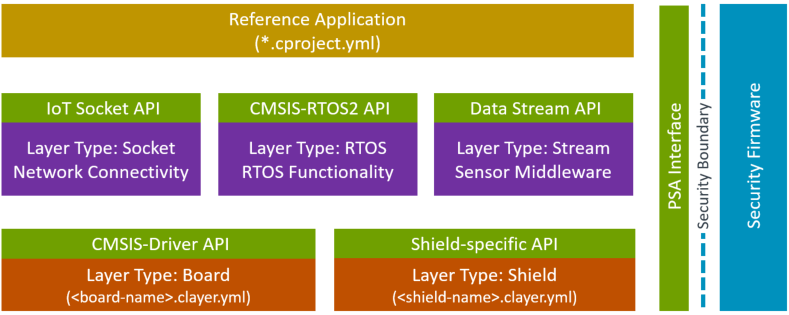
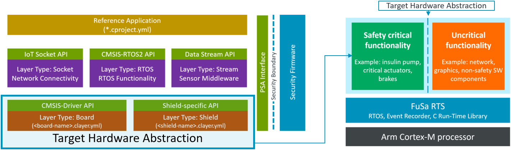

# Build Overview

<!-- markdownlint-disable MD013 -->
<!-- markdownlint-disable MD036 -->

[**> CMSIS-Toolbox**](README.md) **> Build Overview**

This chapter describes the overall concept of the CMSIS-Toolbox build process. It outlines the content of *user input files* that describes the software application, and contains references to examples and project templates.

- [Project Examples](#project-examples) helps to get started with the tools.
- [Project Structure](#project-structure) describes the overall structure of projects.
- [Linker Script Management](#linker-script-management) defines the  available memory and controls the linker operation.
- [Reference Application Framework](#reference-application-framework) describes how example projects can scale to many boards and production hardware.

**Chapter Contents:**

- [Build Overview](#build-overview)
  - [Overview of Operation](#overview-of-operation)
  - [Project Examples](#project-examples)
    - [GitHub repositories](#github-repositories)
    - [Project Templates](#project-templates)
    - [Minimal Project Setup](#minimal-project-setup)
    - [Toolchain Agnostic Project](#toolchain-agnostic-project)
    - [Software Layers](#software-layers)
      - [Configuration Settings](#configuration-settings)
      - [Software Layers in Packs](#software-layers-in-packs)
    - [Project Setup for Multiple Targets and Builds](#project-setup-for-multiple-targets-and-builds)
    - [Project Setup for Related Projects](#project-setup-for-related-projects)
  - [Project Structure](#project-structure)
    - [Working Areas](#working-areas)
    - [Project Area](#project-area)
    - [RTE Directory Structure](#rte-directory-structure)
    - [Output Directory Structure](#output-directory-structure)
    - [Software Components](#software-components)
    - [PLM of Configuration Files](#plm-of-configuration-files)
    - [RTE\_Components.h](#rte_componentsh)
  - [Linker Script Management](#linker-script-management)
    - [Linker Script Preprocessing](#linker-script-preprocessing)
    - [Automatic Linker Script generation](#automatic-linker-script-generation)
      - [File locations](#file-locations)
      - [User Modifications to Memory Regions](#user-modifications-to-memory-regions)
      - [Linker Script Templates](#linker-script-templates)
  - [Reference Application Framework](#reference-application-framework)
    - [Interface Definitions](#interface-definitions)
    - [Target Hardware Abstraction](#target-hardware-abstraction)
    - [Connections](#connections)
      - [Arduino Shield](#arduino-shield)
    - [Software Layer Types](#software-layer-types)
      - [Board](#board)
      - [Shield](#shield)
      - [RTOS](#rtos)
      - [Socket](#socket)
      - [Stream](#stream)
    - [Working with Layers](#working-with-layers)
      - [Known problems](#known-problems)
      - [Finalize Workflow](#finalize-workflow)

## Overview of Operation

The following tools support the creation of build information for embedded applications:

Tool                     | Description
:------------------------|:-----------------------
cpackget                 | Pack Manager: install and manage software packs in the development environment.
cbuild                   | Build Invocation: orchestrate the build steps utilizing CMSIS tools and a CMake compilation process.
csolution                | Project Manager: create build information for embedded applications that consist of one or more related projects.

The tools processes *user input files* (in YAML format) and *software packs*
(in Open-CMSIS-Pack format) to generate independent projects which may be a part of a more complex application.

> **Note:**
>
>This documentation uses the filename extension `*.yml`, but the extension `*.yaml` is also supported.

The overall features are:

- Access to the content of software packs in Open-CMSIS-Pack format to:
  - Setup the tool chain based on a *Device* or *Board* that is defined in the CMSIS-Packs.
  - Add software components that are provided in the various software packs to the application.
- Organize applications (with a `*.csolution.yml` file) into projects that are independently managed
  (using `*.cproject.yml` files).
- Organize software layers (with a `*.clayer.yml` file) with pre-configured software components that enable code reuse across similar applications.
- Manage multiple hardware targets to allow application deployment to different hardware
  (test board, production hardware, etc.).
- Manage multiple build types to support software verification (debug build, test build, release build, ect.)
- Support multiple compiler toolchains (GCC, Arm Compiler 6, IAR, etc.) for project deployment.

The diagram below outlines the operation of the `csolution convert` command that processes one or more [`context`](YML-Input-Format.md#context) configurations of the application project (called solution). Refer to [Project Examples](#project-examples) for more information.


Input Files              | Description
:------------------------|:---------------------------------
[Generic Software Packs](https://open-cmsis-pack.github.io/Open-CMSIS-Pack-Spec/main/html/cp_PackTutorial.html#cp_SWComponents) | Provide re-usable software components that are typically configurable  towards a user application.
[DFP Software Packs](https://open-cmsis-pack.github.io/Open-CMSIS-Pack-Spec/main/html/cp_PackTutorial.html#createPack_DFP)     | Device related information (including memory sizes) for the tool configuration.
[BSP Software Packs](https://open-cmsis-pack.github.io/Open-CMSIS-Pack-Spec/main/html/cp_PackTutorial.html#createPackBoard)    | Board specific configuration (i.e. additional memory resources).
[cdefault.yml](YML-Input-Format.md#default)           | When enabled with [`cdefault:`](YML-Input-Format.md#solution), setup of toolchain specific controls and pre-defined toolchains.
[*.csolution.yml](YML-Input-Format.md#solution)         | Complete scope of the application with build order of sub-projects. Defines [target](YML-Input-Format.md#target-types) and [build](YML-Input-Format.md#build-types) types.
[*.cproject.yml](YML-Input-Format.md#project)           | Content of an independent build (linker or archiver run) - directly relates to a `*.cprj` file.
[*.clayer.yml](YML-Input-Format.md#layer)               | Set of source files along with pre-configured components for reuse in different applications.

Output Files             | Description
:------------------------|:---------------------------------
[*.cbuild-idx.yml](YML-CBuild-Format.md#file-structure-of-cbuild-idxyml)  | Index file of all `*.cbuild.yml` build descriptions; contains also overall information for the application.
[*.cbuild.yml](YML-CBuild-Format.md#file-structure-of-cbuild-yml)      | Build description of a single [`*.cproject.yml`](YML-Input-Format.md#project-file-structure) input file (replaces *.CPRJ in CMSIS-Toolbox 2.1 - schedule for Q3'23)
[Project Build Files *.cprj](https://arm-software.github.io/CMSIS_5/Build/html/cprjFormat_pg.html) | Project build information in legacy format.
[Run-Time Environment (RTE)](#rte-directory-structure)  | Contains the user configured files of a project along with RTE_Components.h inventory file.
[Linker Script Files](Linker-Script-Management.md#automatic-linker-script-generation) | Header file that describes the memory resources.

To build an application project, the `csolution convert` command executes the following steps:

1. Read Input Files:
   - Read *.YML input files and check files against schema (disable schema check with option: `--no-check-schema`)
   - Parse *.YML input nodes.
   - Load software packs for selected contexts (control packs with option: `--load [latest|all|required]`).

2. Process each project context (select a specific context with option: `--context`):
   - Apply [`pack:`](YML-Input-Format.md#pack), [`device:`](YML-Input-Format.md#device), [`board:`](YML-Input-Format.md#board), and [`compiler:`](YML-Input-Format.md#compiler) to filter the content of software packs.
   - From [`groups:`](YML-Input-Format.md#groups) add the list of user source files.
   - From [`components:`](YML-Input-Format.md#components) add the list of component source files.
   - From [*.GPDSC files](build-tools.md#use-generators-ie-cubemx) add the list of generated source files.

3. Generate output files:
   - Update [configuration files](#plm-of-configuration-files) in RTE directory (disable with option: `--no-update-rte`).
   - Print results of software component dependency validation.
   - Create `cbuild-idx.yml`, `cbuild.yml` and `*.CPRJ` files.

## Project Examples

### GitHub repositories

The following repositories provide several working examples:

Repository            | Description
:---------------------|:-------------------------------------
[csolution-examples](https://github.com/Open-CMSIS-Pack/csolution-examples) | Contains a simple Hello World example and links to other working examples.  
[vscode-get-started](https://github.com/Open-CMSIS-Pack/vscode-get-started) | Contains the setup for a VS Code development environment including an example project.

The section below explains the the overall concepts consider by the **csolution - CMSIS Project Manager** based on examples.

### Project Templates

The following `*.csolution.yml` templates may be used to create own embedded applications.

Template    | Description
:-----------|:------------------------------
[Simple](https://github.com/Open-CMSIS-Pack/csolution-examples/tree/main/Templates/Simple)        | A csolution.yml template with a single cproject.yml.
[Multicore](https://github.com/Open-CMSIS-Pack/csolution-examples/tree/main/Templates/Multicore)  | A csolution.yml template with multiuple cproject.yml each targeting one processor of a multicore device.
[TrustZone](https://github.com/Open-CMSIS-Pack/csolution-examples/tree/main/Templates/TrustZone)  | A csolution.yml template with a non-secure cproject.yml and an optional secure cproject.yml.
[UnitTest](https://github.com/Open-CMSIS-Pack/csolution-examples/tree/main/Templates/UnitTest)    | A csolution.yml template that shares one HAL clayer.yml with multiple cproject.yml files for unit testing.

To use these templates, copy the content of the folder to your own application folder. Then adapt the names accordingly and add missing information.

Refer to [Overall Workflow](https://github.com/Open-CMSIS-Pack/csolution-examples/tree/main/Templates#overall-workflow) for more details.

### Minimal Project Setup

A minimal application requires two files:

- `Sample.csolution.yml` that defines the a [target type](YML-Input-Format.md#target-types) with [board](YML-Input-Format.md#board) or [device](YML-Input-Format.md#device). It includes [projects](YML-Input-Format.md#projects) and selects a [compiler](YML-Input-Format.md#compiler).
- `Sample.cproject.yml` that defines the files and software components that are translated into an image or library archive.

>**Note:**
>
> When no [`packs:`](YML-Input-Format.md#packs) are specified in user input files, the tools use the latest version of the installed packs.

**Simple Project: `Sample.csolution.yml`**

```yml
solution:
  created-for: CMSIS-Toolbox@2.0.0
  compiler: AC6                               # explicit selection of compiler
  
  packs:                                      # explicit pack selection may be omitted
    - pack: NXP::K32L3A60_DFP@16.0.0          # specify DFP
    - pack: NXP::FRDM-K32L3A6_BSP@16.0.0 

  target-types:
    - type: FRDM-K32L3A6
      board: FRDM-K32L3A6

  build-types:                                # defines toolchain options for 'debug' and 'release'
    - type: Debug
      debug: on
      optimize: none

    - type: Release
      debug: off
      optimize: balanced

  projects:
    - project: ./Sample.cproject.yml
```

**Simple Project: `Sample.cproject.yml`**

```yml
project:
  packs:
    - pack: ARM::CMSIS                        # specify additional packs

  groups:
    - group: App
      files:
        - file: ./main.c

  components:
    - component: ARM::CMSIS:CORE
    - component: Device:Startup
```

### Toolchain Agnostic Project

With generic [**Translation Control**](YML-Input-Format.md#translation-control) settings it is possible to create projects that work across the range of supported compilers (AC6, GCC, IAR).  The compiler selection and potential compiler specific settings can be stored in the file `cdefault.yml`. By replacing the `cdefault.yml` file it is possible to re-target application projects.  [**Translation Control**](YML-Input-Format.md#translation-control) settings are mapped to specify compiler by the build tools.

**Default settings for multiple compiler toolchains**

```yml
default:
  compiler: GCC          # selects the default compiler for an installation

  misc:
    - for-compiler: GCC
      C:
        - -std=gnu11
      Link:
        - --specs=nano.specs
        - --specs=rdimon.specs

    - for-compiler: AC6
      C-CPP:
        - -Wno-macro-redefined
        - -Wno-pragma-pack
        - -Wno-parentheses-equality
      C:
        - -std=gnu11
      ASM:
        - -masm=auto
      Link:
        - --entry=Reset_Handler
        - --info summarysizes

    - for-compiler: IAR
      C-CPP:
        - --dlib_config DLib_Config_Full.h
      Link:
        - --semihosting
```

**Simple Compiler Agnostic Project: `Sample.csolution.yml`**

```yml
solution:
  cdefault:                      # use default setup of toolchain specific controls
  compiler: AC6                  # explicit compiler selection (optional)

  packs:
    - pack: ARM::CMSIS
    - pack: Keil::LPC1700_DFP

  target-types:                  # multiple device or boards
    - type: MyHardware
      device: NXP::LPC1768

    - type: MyBoard
      board: MCB1700

  build-types:
    - type: debug                # options for 'debug'
      optimize: none
      debug: on

    - type: release              # options for 'release'
      optimize: balanced
      debug: off
      
  projects:
    - project: ./Sample.cproject.yml
```

**Simple Compiler Agnostic Project: `Sample.cproject.yml`**

```yml
project:
  groups:
    - group: App
      files:
        - file: ./main.c

  components:
    - component: ARM::CMSIS:CORE
    - component: Device:Startup
```

### Software Layers

Software layers collect source files and software components along with configuration files for re-use in different projects as shown in the picture below.


An application could be composed of various layers, for example to compose an IoT cloud application:

- **Demo.cproject.yml**: Implements the IoT Reference example.
- **Socket.clayer.yml**: A software layer that provides the Socket interface for internet connectivity.
- **Board.clayer.yml**: A software layer that provides the hardware interfaces to the device hardware.

**Example:**

The project [AWS_MQTT_MutualAuth_SW_Framework](https://github.com/Open-CMSIS-Pack/AWS_MQTT_MutualAuth_SW_Framework) provides an example for software layers.

#### Configuration Settings

A software layer is a set of source files and pre-configured software components that can be shared across multiple projects. For sharing the configuration settings of software components across multiple projects,
the configuration files of a [`layer`](YML-Input-Format.md#layer) are stored within the directory structure of the software layer. This separate [RTE Directory Structure](#rte-directory-structure) allows that projects
can share a `layer` with common configuration settings.

#### Software Layers in Packs

A collection of software layers can be stored in software packs using the element [`<csolution>`](todo-link). Using the `list layers` command it is possible to identify compatible software by iterating the [`layers:` - `type:`](YML-Input-Format.md#layers---type)
 [`connections`](YML-Input-Format.md#connections).
filter conditions to it. In combination with interfaces specifications, an interactive IDE should be able to display suitable layers that could be added to an application.

### Project Setup for Multiple Targets and Builds

Complex examples require frequently slightly different targets and/or modifications during build, i.e. for testing. The
picture below shows a setup during software development that supports:

- Unit/Integration Testing on simulation models (called Virtual Hardware) where Virtual Drivers implement the interface
  to simulated I/O.
- Unit/Integration Testing the same software setup on a physical board where Hardware Drivers implement the interface to
  physical I/O.
- System Testing where the software is combined with more software components that compose the final application.



As the software may share a large set of common files, provisions are required to manage such projects. The common way
in other IDE's is to add:

- **target-types** (required) that select a target system. In the example this would be:
  - `Virtual`: for Simulation Models.
  - `Board`: for a physical evaluation board.
  - `Production-HW`: for system integration test and the final product delivery.
- **build-types** (optional) add the flexibility to configure each target build towards a specific testing. It might be:
  - `Debug`: for a full debug build of the software for interactive debug.
  - `Test`: for a specific timing test using a test interface with code maximal optimization.
  - `Release`: for the final code deployment to the systems.

It is required to generate reproducible builds that can deployed on independent CI/CD test systems. To achieve that, the **csolution - CMSIS Project Manager** generates *.cprj output files with the following naming conventions:

`<project-name>[.<build-type>][+target-type].cprj` this would generate for example: `Multi.Debug+Production-HW.cprj`

This output file convention is identical with the [context: name conventions](YML-Input-Format.md#context-name-conventions) and enables that each `target-type:` and/or `build-type:` can be identified and independently generated which provides the support for test automation. It is however not required to build every possible combination, this should be under user control.

**Flexible Builds for multi-target projects**

Multi-target projects may be created using `target-types` that select different physical or virtual hardware systems.

**File: MultiTarget.csolution.yml**

```yml
solution:
  cdefault:                        # use default setup of toolchain specific controls
  compiler: AC6

    :                              # pack definition not shown

  target-types:
    - type: Board
      board: NUCLEO-L552ZE-Q

    - type: Production-HW
      device: STM32L552XY          # specifies device

    - type: Virtual
      board: VHT-Corstone-300      # Virtual Hardware platform (appears as board)
      
  build-types:
    - type: Debug
      optimize: none
      debug: on

    - type: Test
      optimize: size
      debug: on

    - type: Release
      optimize: size
      debug: off

projects:
  - project: ./MyProject.cproject.yml
```

**File: MyProject.csolution.yml**

```yml
project:
  groups:
    - group: My group1
      files:
        - file: file1a.c
        - file: file1b.c
        - file: file1c.c

    - group: My group2
      files:
        - file: file2a.c

    - group: Test-Interface
      for-context: .Test
      files:
        - file: fileTa.c

  layers:
    - layer: NUCLEO-L552ZE-Q/Board.clayer.yml   # tbd find a better way: i.e. $Board$.clayer.yml
      for-context: +Board

    - layer: Production.clayer.yml              # added for target type: Production-HW
      for-context: +Production-HW

    - layer: Corstone-300/Board.clayer.yml      # added for target type: AVH-Corstone-300
      for-context: +AVH-Corstone-300

  components:
    - component: Device:Startup
    - component: CMSIS:RTOS2:FreeRTOS
    - component: ARM::CMSIS:DSP&Source          # not added for build type: Test
      not-for-context: .Test                           
```

### Project Setup for Related Projects

A solution is the software view of the complete system. It combines projects that can be generated independently and
therefore manages related projects. It may be also deployed to different targets during development as described in the
previous section under [Project Setup for Multiple Targets and Builds](#project-setup-for-multiple-targets-and-builds).

The picture below shows a system that is composed of:

- Project A: that implements a time-critical control algorithm running on a independent processor #2.
- Project B: which is a diagram of a cloud connected IoT application with Machine Learning (ML) functionality.
- Project C: that is the data model of the Machine Learning algorithm and separate to allow independent updates.
- Project D: that implements the device security (for example with TF-M that runs with TrustZone in secure mode).

In addition such systems may have a boot-loader that can be also viewed as another independent project.


To manage the complexity of such related a projects, the `*.csolution.yml` file is introduced. At this level the
`target-types:` and `build-types:` may be managed, so that a common set is available across the system. However it should
be also possible to add project specific `build-types` at project level. (tdb: `target-types` might be only possible at
solution level).

- `target-types:` describe a different hardware target system and have therefore different API files for peripherals or a
  different hardware configuration.

- `build-types:` describe a build variant of the same hardware target. All `build-types` share the same API files for
  peripherals and the same hardware configuration, but may compile a different variant (i.e. with test I/O enabled) of
  an application.

**Related Projects: `iot-product.csolution.yml`**

```yml
solution:
   :                            # setup not shown

  target-types:
    - type: Board
      board: NUCLEO-L552ZE-Q

    - type: Production-HW
      device: STM32U5X          # specifies device
      
  build-types:
    - type: Debug
      optimize: none
      debug: on

    - type: Test
      optimize: size
      debug: on
    
  projects:
    - project: ./security/TFM.cproject.yml
      for-context: .Release
    - project: ./application/MQTT_AWS.cproject.yml
    - project: ./bootloader/Bootloader.cproject.yml
      not-for-context: +Virtual
```

## Project Structure

This section describes how the files of a `csolution` based project should be organized to allow the scenarios described above. This section gives also guidelines for a directory structure.

Refer to [Directory Control](./YML-Input-Format.md#directory-control) for information about configuring this directories.

### Working Areas

The table below explains the different working area sections of an application project.

Working Area                                                      | Access | Description
:-----------------------------------------------------------------|:------:|:------------------
[Project Area](#project-area)                                     | RW     | Contains user source code files managed by the user along with the  project files (see next item).
[Project files](./YML-Input-Format.md#project-file-structure)     | RW     | Created by a user or an IDE front-end to describe the application project.
Component source code                                             | RO     | Content of software packs; specified by environment variable [`CMSIS_PACK_ROOT`](https://github.com/Open-CMSIS-Pack/cmsis-toolbox/blob/main/docs/installation.md#environment-variables) or [`pack: path`](./YML-Input-Format.md#pack) in project files.
[Component Configuration​](#rte-directory-structure)               | RW     | User editable config files of software components that are copied to the RTE directory.
Generator artifacts​                                               | RO     | Managed by domain specific configuration tools such as STM32CubeMX or MCUXpresso.
[Build artifacts](./YML-Input-Format.md#directory-control)        | RW     | Created during the build process for example by a compiler.

### Project Area

There are no strict rules on how to organize the project area that stores the user source code. However the following guidelines are given:

- Each [solution](#project-examples) should have a distinct base directory. This directory contains the file `*.csolution.yml` which refers to the independent projects defined with `*.cproject.yml` files.

- Each project should have a distinct base directory. This directory contains the file `*.cproject.yml` that defines the content of the project. The source code of the project might be grouped in sub-directories that are typically stored in this base directory. The [component configuration​](#rte-directory-structure) of the software components is typically stored in a sub-directory with the name `./RTE`. A `*.cproject.yml` may refer one or more [software layers](#software-layers) with `*.clayer.yml` files.

- Each software layer should have a distinct base directory with a similar structure as a project. This base directory contains the file `*.clayer.yml` that defines the content of the software layer. It also contains the user source code (optionally organized in sub-directories and the [component configuration​](#rte-directory-structure) of software components that belong to this layer, typically stored in a sub-directory with the name `./RTE`.

### RTE Directory Structure

The table below summarizes the overall directory structure and further details the `./RTE` directory. The `./RTE` directory contains the configuration information for software components and is managed by the **csolution - CMSIS Project Manager**. It contains:

- Configuration files of the software components. These files have `attr="config"` in the PDSC-file of the software packs.  Refer to [PLM of Configuration Files](#plm-of-configuration-files) for more information.
- The file [`RTE_components.h`](#rte_componentsh) and pre-include files that are generated based on the PDSC-file information of the software packs.

> **Note:**
>
> The `./RTE` directory structure is maintained by tools. You should not modify the structure of this directory.  However the complete directory should be committed to a repository of a version control system.

Directory Structure                 | Content
:-----------------------------------|:---------------
`<csolution>`                       | Base directory that contains one or more `*.csolution.yml` files.
`<project>`                         | Each project has its own directory, this base directory contains the `*.cproject.yml` file.
`<project>/RTE/<Cclass>`            | Configurable files for each component `Cclass` have a common directory.
`<project>/RTE/<Cclass>/<device>`   | Configurable files for components that have a condition to a `device` are in a separate directory.
`<project>/RTE/<context-dir>`       | Directory for `RTE_components.h` and pre-include files that are generated by the **csolution - CMSIS Project Manager**.
`<layer>`                           | Each layer has its own base directory; this directory contains the `*.clayer.yml` file.
`<layer>/RTE/<Cclass>`              | Configurable files for each component `Cclass` have a common directory.
`<layer>/RTE/<Cclass>/<device>`     | Configurable files for components that have a condition to a `device` are in a separate directory.

- The `<context-dir>` has the following format: `_<build-type>_<target-type>`.

> **Note:**
>
> CBuild does no longer generate the `<context-dir>` by default. It is therefore required to align the naming of `<context-dir>` with other tools (MDK, CMSIS-Pack-Eclipse, etc.) that support the CMSIS-Pack system.

### Output Directory Structure

By default the following output and working directories are used. The content of these output directories is generated by the `cbuild` step.

Output / Working Directory                    | Content
:---------------------------------------------|:---------------
`./out/<project>/<target>/<build>`            | Contains the final binary and symbol files of a project context.
`./tmp/<project>/<target>/<build>`            | Contains interim files (`*.o`, `*.lst`) of a project context.

### Software Components

Software components are re-usable library or source files that require no modification in the user application.
Optionally, configurable source and header files are provided that allow to set parameters for the software component.

- Configurable source and header files are copied to the project using the directory structure explained above.
- Libraries, source, and header files that are not configurable (and need no modification) are stored in the directory
  of the software component (typically part of CMSIS_Pack_ROOT) and get included directly from this location into the
  project.
- An Include Path to the header files of the software component is added to the C/C++ Compiler control string.

> **Note:**
>
> The `csolution` command `convert` provides the option `--no-update-rte` that disables generation of files in the `./RTE` directory and therefore the management of configuration files and the `RTE_Components.h` file.
>
> The `csolution` command `update-rte` only updates the configuration files in the `RTE` directory and provides with the option `--verbose` additional version details.

### PLM of Configuration Files

Configurable source and header files have a version information that is required during Project Lifetime Management
(PLM) of a project. The version number is important when the underlying software pack changes and provides a newer
configuration file version.

Depending on the PLM status of the application, the `csolution` performs for configuration files the following
operation:

1. **Add** a software component for the first time: the related config file is copied twice into the related `RTE`
   project directory. The first copy can be modified by the user with the parameters for the user application. The
   second copy is an unmodified  backup file with the format `<configfile>.<ext>.base@version`.

    **Example:** A configuration file `ConfigFile.h` at version `1.2.0` is copied:

    ```c
    ./RTE/component_class/ConfigFile.h                  // user editable configuration file
    ./RTE/component_class/ConfigFile.h.base@1.2.0       // current unmodified configuration file with version
                                                        // information; used as a base for version comparison
    ```

    The `csolution` outputs a user notification to indicate that files are added:

    ```text
    ./RTE/component_class/ConfigFile.h -  info: component 'name' added configuration file version '1.2.0'
    ```

    >**NOTE:**
    >
    > The unmodified files with `@version` information should be committed to the repository of the version control system as this files are used to upgrade configuration information using merge utilities.

2. **Upgrade** (or downgrade) a software component: if the version of the unmodified backup file is identical, no
   operation is performed. If the version differs, the new configuration file is copied with the format
   `<configfile>.<ext>.update@version`.

    **Example:** after configuration file `ConfigFile.h` to version `1.3.0` the directory contains these files:

    ```c
    ./RTE/component_class/ConfigFile.h                  // user editable configuration file (based on current version)
    ./RTE/component_class/ConfigFile.h.update@1.3.0     // new configuration file; used to start a 3-way merge
    ./RTE/component_class/ConfigFile.h.base@1.2.0       // current unmodified configuration file with version 
                                                        // information; used as a base for version comparison
    ```

    The `csolution` outputs a user notification to indicate that configuration files have changed:

    ```text
    ./RTE/component_class/ConfigFile.h - warning: component 'name' upgrade for configuration file version '1.3.0'
                                                  added, but file inactive
    ```

3. **User action to complete upgrade**: The user has now several options (outside of `csolution`) to merge the
   configuration file information. A potential way could be to use a 3-way merge utility. After merging the
   configuration file, the hidden backup should be deleted and the unmodified new version should become the hidden
   backup. The previous configuration file may be stored as backup as shown below.

    ```c
    ./RTE/component_class/ConfigFile.h                  // new configuration file with merge configuration
    ./RTE/component_class/ConfigFile.h.bak              // previous configuration file stored as backup
    ./RTE/component_class/ConfigFile.h.base@1.3.0       // current unmodified configuration file with version 
                                                        // information; used as a base for version comparison
    ```

> **Note: Multiple Instances of Configuration files**
>
>The system is also capable of handling multiple instances of configuration files as explained in the CMSIS-Pack specification under
>[Component Instances](https://open-cmsis-pack.github.io/Open-CMSIS-Pack-Spec/main/html/pdsc_components_pg.html#Component_Instances).
>In this case the instance %placeholder% is expanded as shown below:
>
>  ```c
>  ./RTE/component_class/ConfigFile_0.h
>  ./RTE/component_class/ConfigFile_0.h.base@1.2.0
>  ./RTE/component_class/ConfigFile_1.h
>  ./RTE/component_class/ConfigFile_1.h.base@1.2.0
>  ```

### RTE_Components.h

The file `./RTE/RTE_Components.h` is automatically created by the CMSIS Project Manager (during CONVERT). For each
selected software component it contains `#define` statements required by the component. These statements are defined in
the `*.PDSC` file for that component. The following example shows a sample content of a RTE_Components.h file:

```c
/* Auto generated Run-Time-Environment Component Configuration File *** Do not modify ! *** */

#ifndef RTE_COMPONENTS_H
#define RTE_COMPONENTS_H

/* Define the Device Header File: */
#define CMSIS_device_header "stm32f10x.h"

#define RTE_Network_Interface_ETH_0     /* Network Interface ETH 0 */
#define RTE_Network_Socket_BSD          /* Network Socket BSD */
#define RTE_Network_Socket_TCP          /* Network Socket TCP */
#define RTE_Network_Socket_UDP          /* Network Socket UDP */

#endif /* RTE_COMPONENTS_H */
```

The typical usage of the `RTE_Components.h` file is in header files to control the inclusion of files that are related
to other components of the same software pack.

```c
#include "RTE_Components.h"
#include  CMSIS_device_header

#ifdef  RTE_Network_Interface_ETH_0  // if component Network Interface ETH 0 is included
#include "Net_Config_ETH_0.h"        // add the related configuration file for this component
#endif
```

## Linker Script Management

A Linker Script contains a series of Linker directives that specify the available memory and how it should be used by a project. The Linker directives reflect exactly the available memory resources and memory map for the project context.

The following sequence describes the Linker Script management of the **`csolution` Project Manager**:

1. The [`linker:`](YML-Input-Format.md#linker) node specifies an explicit linker script and/or memory regions header file. This overrules linker scripts that are part of software components or specified using the `file:` notation.

2. If no [`linker:`](YML-Input-Format.md#linker) node is used, a linker script file can be provided as part of software components. The extensions `.sct`, `.scf`, `.ld`, and `.icf` are recognized as Linker Script files.

3. If no Linker script is found, a [Linker Script is generated](#automatic-linker-script-generation) based on information that is provided by the `<memory>` element in Device Family Packs (DFP) and Board Support Packs (BSP).

### Linker Script Preprocessing

A Linker Script file is preprocessed when a `regions:` header file is specified in the [`linker:`](YML-Input-Format.md#linker) node or when the [Linker Script file is automatically generated](#automatic-linker-script-generation). A standard C preprocessor is used to create the final linker script as shown below.


### Automatic Linker Script generation

If a project context does not specify any linker script a `regions_<device_or_board>.h` is generated and a toolchain specific linker script template is used.

If `regions_<device_or_board>.h` is **not** available, it is generated based on information of the software packs using the:

- [`<device>` - `<memory>` element in the DFP](https://open-cmsis-pack.github.io/Open-CMSIS-Pack-Spec/main/html/pdsc_boards_pg.html#element_board_memory)
- [`<board>` - `<memory>` element in the BSP](https://open-cmsis-pack.github.io/Open-CMSIS-Pack-Spec/main/html/pdsc_family_pg.html#element_memory)

#### File locations

The file `regions_<device_or_board>.h` is generated in the [RTE directory](Overview.md#rte-directory-structure) path `\RTE\Device\<device>`. The actual file name is extended with:

- `Bname` when the `*.cproject.yml` file uses in the project context a [`board:`](YML-Input-Format.md#board-name-conventions) specification, i.e. `regions_IMXRT1050-EVKB.h`
- `Dname` name when the `*.cproject.yml` file uses in the project context only a [`device:`](YML-Input-Format.md#device-name-conventions) specification, i.e. `regions_stm32u585xx.h`.
  
#### User Modifications to Memory Regions

The file `regions_<device_or_board>.h` can be modified by the user as it might be required to adjust the memory regions or give additional attributes (such as `noinit`).  Therefore this file should have [Configuration Wizard Annotations](https://open-cmsis-pack.github.io/Open-CMSIS-Pack-Spec/main/html/configWizard.html).

#### Linker Script Templates

The following compiler specific Linker Script files are used when no explicit file is specified.  The files are located in the directory `<cmsis-toolbox-installation-dir>/etc` of the CMSIS-Toolbox.

Linker Script Template  | Linker control file for ...
:-----------------------|:-----------------------------
ac6_linker_script.sct   | Arm Compiler
gcc_linker_script.ld    | GCC Compiler
iar_linker_script.icf   | IAR Compiler
clang_linker_script.ld  | CLANG Compiler (experimental)

## Reference Application Framework

The following section describes work in progress and shows the potential of the CMSIS-Toolbox. It outlines a potential structure of a standardized **Reference Application Framework** that allows to demonstrate a range of application examples:
  
- Cloud connectivity using SDKs from Cloud Service Providers.
- Sensor reference examples.
- Machine Learning applications that use sensors and audio inputs.
- Middleware examples such as TCP/IP stack and file system.

These reference examples can target various evaluation boards. It is also possible to target production hardware and use the examples as starting point for embedded IoT and ML applications. This is enabled by:

- Software layers with defined and standardized interfaces that contain re-usable parts of applications.
- Description of standardized connections (provided and consumed interfaces) between these software layers.
- Consistent bootstrap and startup sequence that initializes the system resources and starts the application software.
- Board software layer that provides connections for many different applications.



> **Note:**
>
> The various software layer types are optional; the usage depends on the reference application. The layer type board is an exception, as it is the base software layer that implements the system startup.

The following table lists the various software layers types that are used to compose reference applications.

Software Layer Type    | Description of the operations
:----------------------|:----------------------------------
Socket                 | Provides an IoT_Socket for network connectivity.
RTOS                   | Provides a CMSIS-RTOS2 compliant RTOS; various RTOS implementations may provide extra functionality.
Stream                 | Provides middleware for sensor, audio, and video data streaming to DSP and ML algorithms.
Board                  | System startup: board/device hardware initialization; transfers control to application. Exposes various drivers and interfaces.
Shield                 | Provides software definitions and support for additional hardware provided on shields that extend a physical hardware board.

Each of the software layers is described in the section [Software Layer Types](#software-layer-types)

### Interface Definitions

The interfaces between the software layers are defined in header files.  As such is it possible to reuse the various software blocks with other build systems that are not CMSIS aware.

The header files `CMSIS_board_header`, `iot_socket.h`, `cmsis_os2.h`, and `todo: cmsis_stream.h` are typically used by the reference application to access the software layers.

Header File              | Description
:------------------------|:----------------------------------
`CMSIS_board_header`     | `#define` of the board header file; gives access to drivers defined in the board connections.
`CMSIS_shield_header`    | `#define` of the shield header file; gives access to drivers defined in the shield connections.
`CMSIS_target_header`    | `#define` of the target header file; combines drivers defined in Board and Shield layers.
[`iot_socket.h`](https://github.com/MDK-Packs/IoT_Socket/blob/develop/include/iot_socket.h)           | Defines the interface to the [IoT Socket](https://github.com/MDK-Packs/IoT_Socket).
[`cmsis_os2.h`](https://github.com/ARM-software/CMSIS_5/blob/develop/CMSIS/RTOS2/Include/cmsis_os2.h) | Defines the interface to the [RTOS](https://arm-software.github.io/CMSIS_5/RTOS2/html/group__CMSIS__RTOS.html).
`cmsis_stream.h`                                                                                      | ToDo: Defines the interface for data streaming.

### Target Hardware Abstraction

Note that this is a **proposed software structure (work-in-progress)**.

The Board and Shield layer combined are the Target Hardware Abstraction (defined in `CMSIS_target_header`) for the IoT/ML Software Platform (composed of Reference Application, Socket, RTOS and Stream layer). Using the CMSIS-Toolbox, the `target-type:` selection allows to change both  the Board and Shield layer along with the `CMSIS_target_header` definition. This retargets the IoT/ML Software Platform to run on a different hardware target as shown in the picture below. This is a typical use case for validation and prototyping during software development.


Some applications require Process Isolation to separate safety critical functionality from uncritical functionality. The parts of the IoT/ML Software Platform are typical qualified uncritical functionality. In such a design the it is required that the Target layer provides provisions for access protection that typically uses a MPU.



### Connections

The [connections](YML-Input-Format.md#connections) are only used to identify compatible software layers. There are no strict rules for the **`connect` Name** it is therefore possible to extend it with additional name spacing, i.e. prefix with *ST_* to denote ST specific interfaces.

There are also no strict rules how the different software layers consume or provide the `connect` names.  However guidelines will be developed once reference applications mature.

Currently the following **`connect` names** are used.

`connect` name         | Value                  | Description
:----------------------|:-----------------------|:--------------------
.                      |.                       | **Arduino Shield Interface**
ARDUINO_UNO_UART       | CMSIS-Driver instance  | CMSIS-Driver UART connecting to UART on Arduino pins D0..D1
ARDUINO_UNO_SPI        | CMSIS-Driver instance  | CMSIS-Driver SPI connecting to SPI on Arduino pins D10..D13
ARDUINO_UNO_I2C        | CMSIS-Driver instance  | CMSIS-Driver I2C connecting to I2C on Arduino pins D20..D21
ARDUINO_UNO_I2C-Alt    | CMSIS-Driver instance  | CMSIS-Driver I2C connecting to I2C on Arduino pins D18..D19
ARDUINO_UNO_D0 .. D21  | -                      | CMSIS-Driver GPIO connecting to Arduino pins D0..D21
.                      |.                       | **CMSIS Driver and RTOS Interfaces**
CMSIS_\<driver-name\>  | CMSIS-Driver instance  | [CMSIS-Driver](https://arm-software.github.io/CMSIS_5/Driver/html/modules.html) name, i.e. CMSIS_I2C, CMSIS_ETH_MAC.
CMSIS-RTOS2            |.                       | CMSIS-RTOS2 compliant RTOS
.                      |                        | **Network Connectivity**
IoT_Socket             |.                       | IP Socket (BSD like) Network layer
.                      |.                       | **I/O Retargeting**
STDERR                 |.                       | Standard Error output
STDIN                  |.                       | Standard Input
STDOUT                 |.                       | Standard Output
.                      |.                       | **Memory allocation**
Heap                   | Heap Size              | Memory heap configuration in startup
.                      |.                       | **Data Streaming Interfaces**
Stream_Audio           |.                       | Audio Data Stream (todo)
Stream_SDS             |.                       | Synchronous Data Stream (Sensors) (todo)
.                      |                        | **PSA Security Interfaces**
PSA_\<interface-name\> |.                       | Interfaces for Crypto, Storage, Firmware Update

#### Arduino Shield

The software layers [Board](#board) and [Shield](#shield) are currently based on Arduino UNO connectors. To combine different boards and shields a consistent pin naming is required. The standardized mapping is shown in the diagram below.


### Software Layer Types

#### Board

Provides system startup, board/device hardware initialization, and transfers control to the application. It also exposes various drivers and interfaces.

**Features:**

- System startup
- Heap and Stack configuration
- Device/Board hardware initialization
- Shield setup [optional]
- Application startup for applications with and without RTOS
- [Event Recorder](https://arm-software.github.io/CMSIS-View/main/evr.html) initialization [optional]
- [Fault Storage](https://arm-software.github.io/CMSIS-View/main/evr.html) [optional]
- RTOS initialization and startup [optional]
- Drivers for peripherals or Arduino interfaces [optional]
- STDIO re-targeting to debug interfaces [optional]
- PSA interfaces [optional]

**Files:**

- CMSIS startup and system file for device initialization.
- `main.c` source module that implements the function `main`.
- Optional drivers and interfaces (CMSIS-Drivers, GPIO, STDIO).
- Files that relate to the device and/or board configuration (i.e. generated by MCUXpresso or STM32CubeMX)
- Linker script definition

The `main.c` source module of the Board software layer uses the following entry points to the application code:

- `app_initialize` initializes the software stack and is executed in Handler mode.
- `app_main` transfers execution to the application. For RTOS-based applications this is a RTOS thread.

**RTOS Usage**

The board layer supports application with or without RTOS. The function  `extern void app_main (void *argument)` defines the entry point of the application.

- Application using RTOS:

  Before RTOS is started the function `app_initialize` is called where the user can create application threads. A default implementation (defined `weak`) is part of the board layer:

  ``` c
  __WEAK int32_t app_initialize (void) {
    osThreadNew(app_main, NULL, NULL);
  }
  ```

  By default, `app_main` is the thread that starts executing with default settings (priority, stack).

- Application not using RTOS:
  
  `app_main` is the entry of the application and executes as a single thread.

#### Shield

Support for additional hardware via plugin shields (i.e. Arduino Uno).  Arduino shields [*consume connections*](YML-Input-Format.md#example-sensor-shield) with the prefix `ARDUINO_UNO_`.  Potentially other shields could be covered.

Shields may feature various hardware modules such as WiFi chips or MEMS sensors.  Frequently the Shield software layer only defines a header file that redirects the Arduino specific `connect:` to a chip specific `connect:` that is then used by application software.

The Shield software layer is configured from the Board software layer which calls the following function:

``` c
extern int32_t shield_setup (void);
```

**Example:**

Connections (consumed):

- ARDUINO_UNO_* (provided by board layer)
- STDIN/OUT (if used by the driver)
- RTOS2 (if used by the driver)

Connections (provided):

- CMSIS_WiFi (WiFi Shield)
- \<Sensor\>
- \<Sensor\>_\<Feature\>

Note regarding sensors:

\<Sensor\> is typically a sensor name (for example NXP sensors: FXLS8974, FXAS21002, …
Sensor can use different buses (I2C, SPI) and have optional interrupt lines. It makes sense to define sensor connections with specifying features to cover various layer combinations. Examples of connections:
FXLS8974 sensor:

- Connected via I2C:
  - FXLS8974_I2C: connected via I2C
  - FXLS8974_INT: interrupt line (optional)
- Connected via SPI:
  - FXLS8974_SPI: connected via SPI
  - FXLS8974_CS: SPI CS (can be any Arduino Dx pin to cover multiple devices on the same SPI bus)
  - FXLS8974_INT: interrupt line (optional)

#### RTOS

The RTOS software layer provides a CMSIS-RTOS2 compliant RTOS. Various implementations can be used; currently RTX and FreeRTOS is provided as software layer. Some RTOS functionality might be used by peripheral drivers, the PSA interface or the application itself. When present, the RTOS is initialized and started in the [Board](#board) software layer.

> **Note:**
>
> The *CMSIS-RTOS2 connect name* may be also provided by the application software. For example, the AWS IoT stack implements FreeRTOS and also exposes CMSIS-RTOS2 API as the underlying driver interfaces may require it.

#### Socket

Provides an [IoT Socket](https://github.com/MDK-Packs/IoT_Socket) compliant socket. Various implementation can be used.

Currently layers are available for:

- WiFi using CMSIS-Driver with built-in TCP/IP stack.
- TCP/IP middleware over Ethernet (using Ethernet CMSIS-Driver).
- VSocket over Arm Virtual Hardware (AVH).

The IoT Socket is initialized and started from the application by calling the following function:

``` c
extern int32_t socket_startup (void);
```

#### Stream

Provides middleware for data streaming in a format that is consumed by DSP or ML algorithms.  Proposals for these interfaces will be provided.

The data streaming interfaces relate to:

- [SDS-Framework](https://github.com/Arm-software/SDS-Framework) for recording, analyzing, and playback of data streams.
- [CMSIS-DSP compute graph](https://github.com/ARM-software/CMSIS-DSP) that allows to optimize data flows between DSP and ML algorithms.

### Working with Layers

The following section explains how to operate with layers. It uses the projects:

- [AWS_MQTT_MutualAuth_SW_Framework](https://github.com/Open-CMSIS-Pack/AWS_MQTT_MutualAuth_SW_Framework/tree/develop) - currently the branch `develop`. When cloning this project ensure that you also get the git sub-module `framework`.
- [RefApp-Framework](https://github.com/Open-CMSIS-Pack/RefApp-Framework) contains the software layers that are used by various projects. It is represented by the git sub-module `framework` in the example above.

[AWS_MQTT_MutualAuth_SW_Framework](https://github.com/Open-CMSIS-Pack/AWS_MQTT_MutualAuth_SW_Framework/tree/develop) is a AWS Cloud connector project that is defined in `Demo.csolution.yml`.  The directory `framework` contains various [software layers](#software-layers) that are compatible with this application.

1. Install missing software packs

   Before using the examples install the missing packs.

   ```text
   csolution list packs -s Demo.csolution.yml -m >packs.txt
   cpackget update-index               // optional to ensure that pack index is up-to-date
   cpackget add -f packs.txt
   ```

2. Compile application

   To generate the application variants enter:

   ``` txt
   csolution convert -s Demo.csolution.yml
   ```

   Despite the fact that currently warnings are generated, it creates the following projects:

   ``` txt
   ./AWS_MQTT_MutualAuth_SW_Framework/Demo.Debug+AVH_MPS3_Corstone-300.cprj - info csolution: file generated     successfully
   ./AWS_MQTT_MutualAuth_SW_Framework/Demo.Debug+AVH_MPS3_Corstone-310.cprj - info csolution: file generated     successfully
   ./AWS_MQTT_MutualAuth_SW_Framework/Demo.Debug+B-U585I-IOT02A.cprj - info csolution: file generated     successfully
   ./AWS_MQTT_MutualAuth_SW_Framework/Demo.Debug+IMXRT1050-EVKB.cprj - info csolution: file generated     successfully
   ./AWS_MQTT_MutualAuth_SW_Framework/Demo.Debug+IMXRT1050-EVKB_DA16200.cprj - info csolution: file generated     successfully
   ./AWS_MQTT_MutualAuth_SW_Framework/Demo.Debug+IMXRT1050-EVKB_WizFi360.cprj - info csolution: file generated     successfully
   ./AWS_MQTT_MutualAuth_SW_Framework/Demo.Release+AVH_MPS3_Corstone-300.cprj - info csolution: file generated     successfully
   ./AWS_MQTT_MutualAuth_SW_Framework/Demo.Release+AVH_MPS3_Corstone-310.cprj - info csolution: file generated     successfully
   ./AWS_MQTT_MutualAuth_SW_Framework/Demo.Release+B-U585I-IOT02A.cprj - info csolution: file generated     successfully
   ./AWS_MQTT_MutualAuth_SW_Framework/Demo.Release+IMXRT1050-EVKB.cprj - info csolution: file generated     successfully
   ./AWS_MQTT_MutualAuth_SW_Framework/Demo.Release+IMXRT1050-EVKB_DA16200.cprj - info csolution: file generated     successfully
   ./AWS_MQTT_MutualAuth_SW_Framework/Demo.Release+IMXRT1050-EVKB_WizFi360.cprj - info csolution: file generated     successfully
   ```

   Each of these projects can be translated using:

   ```txt
   cbuild "Demo.Debug+AVH_MPS3_Corstone-300.cprj"
   ```

3. Add new targets

   To add a new target, add in `Demo.csolution.yml` under `target-types:` a new type as shown below:

   ```txt
       - type: test
         device: NXP::MIMXRT1052DVL6B
   ```

   Compatible layers can be listed using the command:

   ```txt
   csolution list layers -s Demo.csolution.yml -c Demo.Release+test verbose -L ./framework -l all
   
   ./AWS_MQTT_MutualAuth_SW_Framework/framework/layer/Board/B-U585I-IOT02A/IoT/Board.clayer.yml (layer type:    Board)
   ./AWS_MQTT_MutualAuth_SW_Framework/framework/layer/Shield/WiFi/Inventek_ISMART43362-E/Shield.clayer.yml    (layer type: Shield)
   ./AWS_MQTT_MutualAuth_SW_Framework/framework/layer/Shield/WiFi/Sparkfun_DA16200/Shield.clayer.yml (layer    type: Shield)
   ./AWS_MQTT_MutualAuth_SW_Framework/framework/layer/Shield/WiFi/Sparkfun_ESP8266/Shield.clayer.yml (layer    type: Shield)
   ./AWS_MQTT_MutualAuth_SW_Framework/framework/layer/Shield/WiFi/WizNet_WizFi360-EVB/Shield.clayer.yml (layer    type: Shield)
   ./AWS_MQTT_MutualAuth_SW_Framework/framework/layer/Socket/WiFi/Socket.clayer.yml (layer type: Socket)
   ```

   Each of the different layers is working with the new added target.

#### Known problems

- Not every target requires a `Shield`, but `csolution` complains about a missing $Shield-Layer$.  csolution should not search for additional layers when all `consumed connections` are `provided` the the layers already.
- The board `B-U585I-IOT02A` as onboard WiFi and would not work with a `Shield`.  The tool does not raise a conflict when the same `connection:` is `provided` multiple times, nor does check that a Shield layer is not required.

#### Finalize Workflow

- The current workflow needs review and improvements in the usability.
- Layers should be provided in packs, the workflow with packs has not been validated yet.
