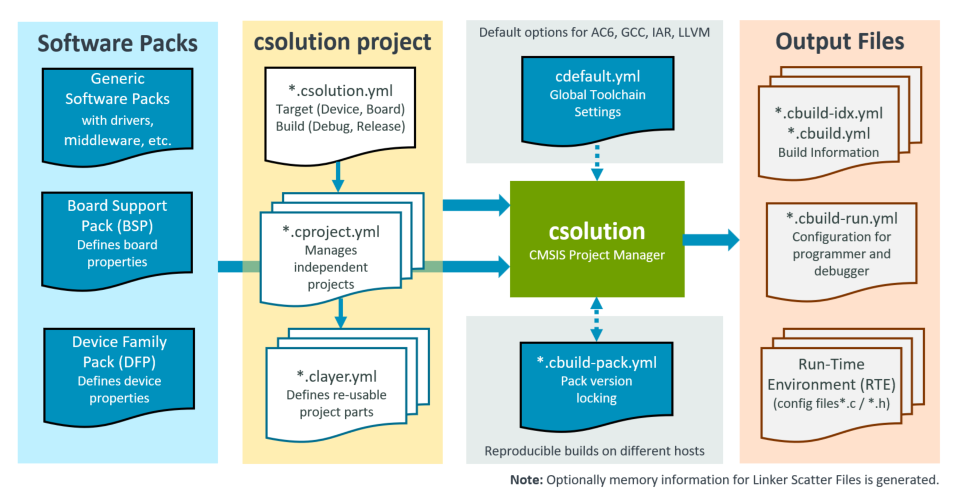
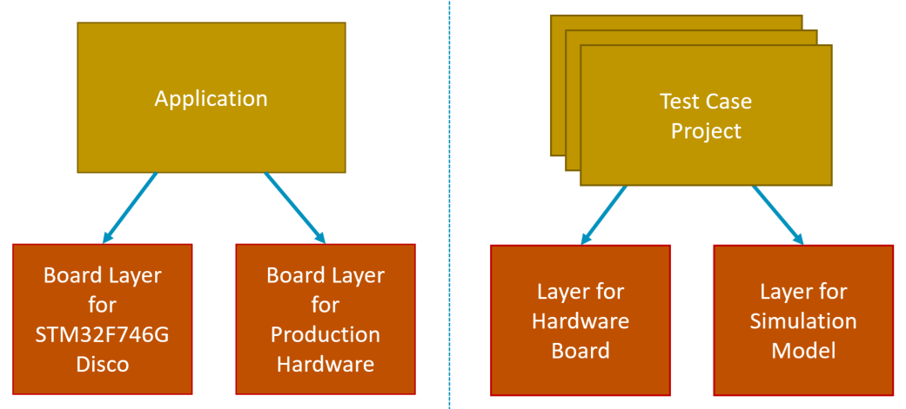
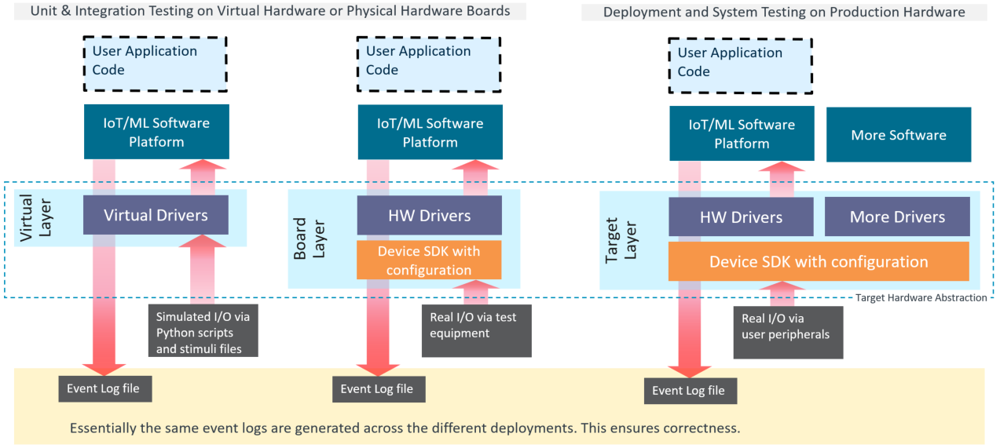
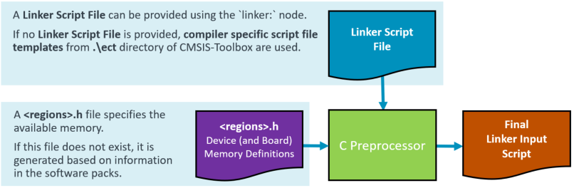

# Build Overview

<!-- markdownlint-disable MD013 -->
<!-- markdownlint-disable MD036 -->

[**CMSIS-Toolbox**](README.md) **&raquo; Build Overview**

This chapter describes the overall concept of the CMSIS-Toolbox build process. It outlines the content of *csolution project files* that describes the software application, and contains references to examples and project templates.

- [Project Examples](#project-examples) helps to get started with the tools.
- [Project Structure](#project-structure) describes the overall structure of projects.
- [Linker Script Management](#linker-script-management) defines the  available memory and controls the linker operation.
- [Generator Support](#generator-support) explains how to use configuration tools such as STM32CubeMX or MCUXpresso Config.

**Chapter Contents:**

- [Build Overview](#build-overview)
  - [Overview of Operation](#overview-of-operation)
    - [Source Code of Software Packs](#source-code-of-software-packs)
  - [Project Examples](#project-examples)
    - [GitHub repositories](#github-repositories)
    - [Template Projects](#template-projects)
    - [Minimal Project Setup](#minimal-project-setup)
    - [Context](#context)
    - [Toolchain Agnostic Project](#toolchain-agnostic-project)
      - [cdefault.yml](#cdefaultyml)
      - [Compiler Selection](#compiler-selection)
    - [Reproducible builds](#reproducible-builds)
      - [Repository Contents](#repository-contents)
    - [Software Layers](#software-layers)
      - [Configuration Settings](#configuration-settings)
      - [Software Layers in Packs](#software-layers-in-packs)
    - [Project Setup for Multiple Targets and Builds](#project-setup-for-multiple-targets-and-builds)
    - [Project Setup for Related Projects](#project-setup-for-related-projects)
    - [Working with context-set](#working-with-context-set)
    - [External Tools and Build Order](#external-tools-and-build-order)
      - [Project Dependency](#project-dependency)
  - [Project Structure](#project-structure)
    - [Working Areas](#working-areas)
    - [Project Area](#project-area)
    - [RTE Directory Structure](#rte-directory-structure)
    - [Output Directory Structure](#output-directory-structure)
    - [Software Components](#software-components)
    - [PLM of Configuration Files](#plm-of-configuration-files)
    - [RTE\_Components.h](#rte_componentsh)
    - [CMSIS\_device\_header](#cmsis_device_header)
    - [\_RTE\_ Preprocessor Symbol](#_rte_-preprocessor-symbol)
  - [Linker Script Management](#linker-script-management)
    - [Linker Script Preprocessing](#linker-script-preprocessing)
    - [Automatic Linker Script generation](#automatic-linker-script-generation)
      - [Linker Script Templates](#linker-script-templates)
  - [Generator Support](#generator-support)
    - [Use a Generator](#use-a-generator)
    - [Configure Generator Output](#configure-generator-output)
    - [Detailed Usage Instructions](#detailed-usage-instructions)

## Overview of Operation

The following tools support the creation of build information for embedded applications:

Tool                     | Description
:------------------------|:-----------------------
[cpackget](build-tools.md#cpackget-invocation)  | Pack Manager: install and manage software packs in the host development environment.
[cbuild](build-tools.md#cbuild-invocation)      | Build Invocation: orchestrate the build steps utilizing CMSIS tools and a CMake compilation process.
[csolution](build-tools.md#csolution-invocation)| Project Manager: create build information for embedded applications that consist of one or more related projects.

The tools process *csolution project files* (in YAML format) and *software packs*
(in [Open-CMSIS-Pack](https://open-cmsis-pack.github.io/Open-CMSIS-Pack-Spec/main/html/index.html) format) to generate independent projects which may be a part of a more complex application.

> **Notes:**
>
> - This documentation uses the filename extension `*.yml`, but the extension `*.yaml` is also supported.
> - The term *CMSIS solution* refers to an application project that is specified with *csolution project files*.
> - *Software packs* describe software components in Open-CMSIS-Pack format that can contain middleware, drivers, board support, or device support. *Software packs* also provide documentation, examples, and reusable software layers.

The overall features are:

- Access the content of software packs in Open-CMSIS-Pack format to:
  - Setup the tool chain based on a *Device* or *Board* that is defined in software packs.
  - Add software components that are provided in the various software packs to the application.
- Organize applications (with a `*.csolution.yml` file) into projects that are independently managed
  (using `*.cproject.yml` files).
- Organize software layers (with a `*.clayer.yml` file) with pre-configured software components that enable code reuse across similar applications.
- Manage multiple hardware targets to allow application deployment to different hardware
  (test board, production hardware, etc.).
- Manage multiple build types to support software verification (debug build, test build, release build, etc.)
- Support multiple compiler toolchains (GCC, Arm Compiler 6, IAR, LLVM) for project deployment.

The diagram below outlines the operation of the `csolution` command `convert` that processes one or more [`context`](YML-Input-Format.md#context) configurations of the application (called *csolution project*). Refer to [Project Examples](#project-examples) for more information.



Input Files              | Description
:------------------------|:---------------------------------
[Generic Software Packs](https://open-cmsis-pack.github.io/Open-CMSIS-Pack-Spec/main/html/cp_PackTutorial.html#cp_SWComponents) | Provide re-usable software components that are typically configurable  towards a user application.
[DFP Software Packs](https://open-cmsis-pack.github.io/Open-CMSIS-Pack-Spec/main/html/cp_PackTutorial.html#createPack_DFP)     | Device related information (including memory sizes) for the tool configuration.
[BSP Software Packs](https://open-cmsis-pack.github.io/Open-CMSIS-Pack-Spec/main/html/cp_PackTutorial.html#createPackBoard)    | Board specific configuration (i.e. additional memory resources).
[cdefault.yml](YML-Input-Format.md#cdefault)           | When enabled with [`cdefault:`](YML-Input-Format.md#solution), setup of toolchain specific controls and pre-defined toolchains.
[*.csolution.yml](YML-Input-Format.md#solution)         | Complete scope of the application with build order of sub-projects. Defines [target](YML-Input-Format.md#target-types) and [build](YML-Input-Format.md#build-types) types.
[*.cproject.yml](YML-Input-Format.md#project)           | Content of an independent build (linker or archiver run) - directly relates to a `*.cprj` file.
[*.clayer.yml](YML-Input-Format.md#layer)               | Set of source files along with pre-configured components for reuse in different applications.

Input/Output Files       | Description
:------------------------|:---------------------------------
[*.cbuild-pack.yml](YML-CBuild-Format.md#file-structure-of-cbuild-packyml)  | Exact list of the packs that are used by the application; enables [reproducible builds](#reproducible-builds) as it locks the pack versions.
[*.cbuild-set.yml](YML-CBuild-Format.md#file-structure-of-cbuild-setyml)    | Specifies the [context set](#working-with-context-set) of projects, target-types, and build-types that are used to generate the application image.

Output Files             | Description
:------------------------|:---------------------------------
[*.cbuild-idx.yml](YML-CBuild-Format.md#file-structure-of-cbuild-idxyml)  | Index file of all `*.cbuild.yml` build descriptions; contains also overall information for the application.
[*.cbuild.yml](YML-CBuild-Format.md#file-structure-of-cbuild-idxyml)      | Build description of a single [`*.cproject.yml`](YML-Input-Format.md#project-file-structure) input file for each context.
[Project Build Files *.cprj](https://arm-software.github.io/CMSIS_5/Build/html/cprjFormat_pg.html) | Project build information in legacy format.
[Run-Time Environment (RTE)](#rte-directory-structure)  | Contains the user configured files of a project along with `RTE_Components.h` inventory file.
[Linker Script Files](#automatic-linker-script-generation) | Header file that describes the memory resources.

To build an application project, the `csolution` command `convert` executes the following steps:

1. Read Input Files:
   - Read *.YML input files and check files against schema (disable schema check with option: `--no-check-schema`)
   - Parse *.YML input nodes.
   - Load software packs for selected contexts (control packs with option: `--load [latest|all|required]`).

2. Process each project context (select a specific context with option: `--context`):
   - Apply [`pack:`](YML-Input-Format.md#pack), [`device:`](YML-Input-Format.md#device), [`board:`](YML-Input-Format.md#board), and [`compiler:`](YML-Input-Format.md#compiler) to filter the content of software packs.
   - From [`groups:`](YML-Input-Format.md#groups) add the list of user source files.
   - From [`components:`](YML-Input-Format.md#components) add the list of component source files.
   - From [*.GPDSC files](build-tools.md#use-generators) add the list of generated source files.

3. Generate output files:
   - Update [configuration files](#plm-of-configuration-files) in RTE directory (disable with option: `--no-update-rte`).
   - Print results of software component dependency validation.
   - Create `cbuild-idx.yml`, `cbuild.yml` and `*.CPRJ` files.

### Source Code of Software Packs

Software packs and the related [components:](#software-components) allow you to share and reuse code. The content of a software pack is therefore *read-only* (with the exception of [configuration files](#configuration-settings) that are copied to the [RTE directory](#rte-directory-structure)) as these source code files should not be modified by a user.

The **benefit** is a clean project directory that only contains the user code as well as [configuration files](#configuration-settings) for [components:](#software-components). This keeps a [repository](#repository-contents) small and makes it easy to upgrade to a [new pack version](#plm-of-configuration-files).

> **Notes:**
>
> - During development of a software pack you may [install a repository](build-tools.md#install-a-repository) that contains the source of the software pack.
> - You may copy the content of a software pack to your project workspace and provide a [path to the pack](YML-Input-Format.md#pack).

## Project Examples

### GitHub repositories

The following repositories provide several working examples:

Repository            | Description
:---------------------|:-------------------------------------
[csolution-examples](https://github.com/Open-CMSIS-Pack/csolution-examples) | Contains several getting started examples that show single-core, multi-core, and TrustZone setup as well as how to use a generator (CubeMX).
[vscode-get-started](https://github.com/Open-CMSIS-Pack/vscode-get-started) | Contains the setup for a VS Code development environment including an example project.
[github.com/Arm-Examples](https://github.com/Arm-Examples) | Contains many examples that include CMSIS-Toolbox setup.

The section below explains the overall concepts considered by the **`csolution` Project Manager** based on examples.

### Template Projects

The following `*.csolution.yml` templates may be used to create embedded applications.

Template    | Description
:-----------|:------------------------------
[Simple](https://github.com/Open-CMSIS-Pack/csolution-examples/tree/main/Templates/Simple)        | A csolution.yml template with a single `*.cproject.yml`.
[Multicore](https://github.com/Open-CMSIS-Pack/csolution-examples/tree/main/Templates/Multicore)  | A csolution.yml template with multiple `*.cproject.yml` files, each targeting one processor of a multicore device.
[TrustZone](https://github.com/Open-CMSIS-Pack/csolution-examples/tree/main/Templates/TrustZone)  | A csolution.yml template with a non-secure `*.cproject.yml` and an optional secure `*.cproject.yml` file.
[UnitTest](https://github.com/Open-CMSIS-Pack/csolution-examples/tree/main/Templates/UnitTest)    | A csolution.yml template that shares one HAL `*.clayer.yml` with multiple `*.cproject.yml` files for unit testing.

To use these templates, copy the content of the folder to your own application folder. Then adapt the names accordingly and add missing information.

Refer to [CMSIS-Toolbox Templates](https://github.com/Open-CMSIS-Pack/csolution-examples/tree/main/Templates) for more details.

### Minimal Project Setup

A minimal application requires two files:

- `Sample.csolution.yml` that defines a [target type](YML-Input-Format.md#target-types) with [board](YML-Input-Format.md#board) or [device](YML-Input-Format.md#device). It includes a [project](YML-Input-Format.md#projects) and selects a [compiler](YML-Input-Format.md#compiler).
  
- `Sample.cproject.yml` that defines the files and software components that are translated into an image or library archive.

>**Note:**
>
> When no [`packs:`](YML-Input-Format.md#packs) are specified in *csolution project files*, the tools use the latest version of the installed packs.

**Simple Project: `Sample.csolution.yml`**

```yml
solution:
  cdefault:                                   # use default setup for toolchains
  compiler: AC6                               # select the compiler to use
  
  packs:                                      # explicit pack selection may be omitted
    - pack: NXP::K32L3A60_DFP@16.0.0          # specify DFP
    - pack: NXP::FRDM-K32L3A6_BSP@16.0.0 

  target-types:
    - type: FRDM-K32L3A6
      board: FRDM-K32L3A6

  build-types:                                # defines toolchain options for 'debug' and 'release'
    - type: Debug
      debug: on
      optimize: debug

    - type: Release
      debug: off
      optimize: balanced

  projects:
    - project: ./Sample.cproject.yml
```

**Simple Project: `Sample.cproject.yml`**

```yml
project:
  packs:
    - pack: ARM::CMSIS                        # specify additional packs

  groups:
    - group: App
      files:
        - file: ./main.c

  components:
    - component: CMSIS:CORE
    - component: Device:Startup
```

### Context

A [context](YML-Input-Format.md#context-name-conventions) is defined in the `*.csolution.yml` file by `projects:`, `target-types:`, and `build-types:`. It identifies a configuration with `project-name`, `build-type`, and `target-type` and is used on various places in the CMSIS-Toolbox.

The following [context](YML-Input-Format.md#context-name-conventions) refers to the example above and selects the `project: Sample.cproject.yml`, with `build-type: Debug` and `target-type: FRDM-K32L3A6`:

```txt
Sample.Debug+FRDM-K32L3A6
```

The [context](YML-Input-Format.md#context-name-conventions) allows to refer to each possible build combination that by default uses a different [output directory](#output-directory-structure). A context may be partly specified in many places.

The [context-set](#working-with-context-set) defines a combination of projects and is useful when an application is composed of [multiple related projects](#project-setup-for-related-projects).

### Toolchain Agnostic Project

Generic [**Translation Control**](YML-Input-Format.md#translation-control) settings enable projects that work across the range of supported compilers (AC6, GCC, IAR, CLANG). The [**Translation Control**](YML-Input-Format.md#translation-control) settings are mapped to specify compiler controls by the build tools.

#### cdefault.yml

The `cdefault.yml` file contains a common set of compiler specific settings that select reasonable defaults with [`misc:`](YML-Input-Format.md#misc) controls for each compiler. The [`cdefault:`](YML-Input-Format.md#cdefault) node in the `*.csolution.yml` file enables the usage of this file. The directory [`<cmsis-toolbox-installation-dir>/etc`](installation.md) contains a `cdefault.yml` file that is used when no local copy of the `cdefault.yml` file is provided.

> **Note:**
>
> It is recommended to provide a local copy of the `cdefault.yml` file in the same directory that stores the `*.csolution.yml` file.

**Example:**

```yml
default:

  misc:
    - for-compiler: AC6
      C-CPP:
        - -Wno-macro-redefined
        - -Wno-pragma-pack
        - -Wno-parentheses-equality
        - -Wno-license-management
      C:
        - -std=gnu11
      ASM:
        - -masm=auto
      Link:
        - --entry=Reset_Handler
        - --map
        - --info summarysizes
        - --summary_stderr
        - --diag_suppress=L6314W

    - for-compiler: GCC
      C-CPP:
        - -masm-syntax-unified
        - -fomit-frame-pointer
        - -ffunction-sections
        - -fdata-sections
      C:
        - -std=gnu11
      Link:
        - --specs=nano.specs
        - --specs=nosys.specs
        - -Wl,-Map=$elf()$.map
        - -Wl,--gc-sections
        - -Wl,--no-warn-rwx-segments   # suppress incorrect linker warning

    - for-compiler: CLANG
      C-CPP:
        - -fomit-frame-pointer
        - -ffunction-sections
        - -fdata-sections
      C:
        - -std=gnu11
      Link:
        - -lcrt0
        - -Wl,-Map=$elf()$.map
        - -Wl,--gc-sections

    - for-compiler: IAR
      C-CPP: 
        - --dlib_config DLib_Config_Full.h
      Link:
        - --map=$elf()$.map
```

#### Compiler Selection

Toolchain agnostic projects do not contain a [`compiler:`](YML-Input-Format.md#compiler) selection in the `*.csolution.yml` project file. Instead the [`select-compiler:`](YML-Input-Format.md#select-compiler) node may list the compilers that this *csolution project* is tested with.

There are two ways to select a toolchain:

- An explicit [`compiler:`](YML-Input-Format.md#compiler) selection in the `*.csolution.yml` project file:

   ```yml
   solution:
     cdefault:           # use the cdefault.yml file with toolchain specific controls
     compiler: AC6       # select Arm Compiler

     :
   ```

- The command line option `--toolchain` of the `cbuild` or `csolution` tool overwrites any `compiler:` definition in the csolution project files.

   ```bash
   > cbuild Hello.csolution.yml --toolchain GCC
   ```

### Reproducible builds

Reproducible builds are supported by the [*.cbuild-pack.yml](YML-CBuild-Format.md#file-structure-of-cbuild-packyml) file that is created and read by the **csolution** project manager. This file:

- Records the exact list of the pack versions used during creation of an application.
- Ensures that pack versions do not change during development even when new packs are installed on the host computer, for example to develop other applications.

> **Notes:**
>
> - The [*.cbuild-pack.yml](YML-CBuild-Format.md#file-structure-of-cbuild-packyml) file should be committed to a repository to ensure reproducible builds.
> - The `cbuild` option `--frozen-packs` checks that the [*.cbuild-pack.yml](YML-CBuild-Format.md#file-structure-of-cbuild-packyml) file exists and reports an error if any pack is changed or not available.
> - To update a pack to a new version, delete the file [*.cbuild-pack.yml](YML-CBuild-Format.md#file-structure-of-cbuild-packyml) or remove the information about a specific pack in this file.

#### Repository Contents

To support reproducible builds the following files should be committed to a repository of a version control system.

- All user source code files.
- All csolution project files (`cdefault.yml`, `*.csolution.yml`, `*.cproject.yml`, etc.).
- All files in the RTE directory
  - Ensure that there are no files with the extension *.update@* as this indicates that configuration files are not up-to-date due to updated software packs.
- The file `*.cbuild-pack.yml` to allow [reproducible builds](#reproducible-builds).
- Optionally, the file `*.cbuild-set.yml` which defines the context set of the application that should be generated.

> **Note:**
>
> If the file `*.cbuild-set.yml` file is missing, the `setup` command creates a `*.cbuild-set` file with selection of the first `target-type` and the first `build-type`.

### Software Layers

Software layers collect source files and software components along with configuration files for re-use in different projects as shown in the picture below.



**Simple Example:**

This example uses a layer to include an RTOS kernel.  Using a layer has several benefits, for example that the configuration can be shared across many projects.

The file `MyProject.cproject.yml` includes the file `RTOS.clayer.yml` using the [`layers:`](YML-Input-Format.md#linker) node:

```yml
project:
  groups:
    - group: App
      files:
        - file: ./main.c

  components:
    - component: CMSIS:CORE
    - component: Device:Startup

  layers:
    - layer: ../Layer/RTOS.clayer.yml
```

The `RTOS.clayer.yml` file defines the kernel along with configuration settings.

```yml
layer:
  description: RTX RTOS with configuration settings

  packs:
    - pack: ARM:CMSIS-RTX

  components:
    - component: CMSIS:RTOS2:Keil RTX5&Source
```

**Re-target Example:**

The project [AVH-MLOps-Main](https://github.com/ARM-software/AVH-MLOps/tree/main/AVH-MLOps-main) is a test project that shows retargeting to different processors using a layer.

**IoT Example:**

The project [AWS_MQTT_MutualAuth_SW_Framework](https://github.com/Open-CMSIS-Pack/AWS_MQTT_MutualAuth_SW_Framework) provides an IoT cloud application that is composed of various layers:

- **Demo.cproject.yml**: Implements the IoT Reference example.
- **Socket.clayer.yml**: A software layer that provides the socket interface for Internet connectivity.
- **Board.clayer.yml**: A software layer that provides the hardware interfaces to the device hardware.

**Example:**

#### Configuration Settings

A software layer is a set of source files and pre-configured software components or source code that can be shared across multiple projects. To achieve this, the configuration files of a [`layer`](YML-Input-Format.md#layer) are stored within the directory structure of the software layer. This separate [RTE Directory Structure](#rte-directory-structure) allows that projects
can share a `layer` with common configuration settings.

> **Note:**
>
> When using a generator, such as CubeMX or MCUxpresso, the output should be redirected as described under [Configure Generator Output](#configure-generator-output).

#### Software Layers in Packs

Software layers for [*reference applications*](ReferenceApplications.md) may be published in software packs. Refer to [Pack Creation &raquo; Layers](pack-tools.md#layers) for more information.

### Project Setup for Multiple Targets and Builds

Complex examples require frequently slightly different targets and/or modifications during build, i.e. for testing. The
picture below shows a setup during software development that supports:

- Unit/Integration Testing on simulation models (called Virtual Hardware) where Virtual Drivers implement the interface
  to simulated I/O.
- Unit/Integration Testing for the same software setup on a physical board where Hardware Drivers implement the interface to
  physical I/O.
- System Testing where the software is combined with more software components that compose the final application.



As the software may share a large set of common files, provisions are required to manage such projects. The common is to add:

- **target-types** (required) that select a target system. In the example this would be:
  - `Virtual`: for simulation models.
  - `Board`: for a physical evaluation board.
  - `Production-HW`: for system integration test and product delivery on the final hardware.
- **build-types** (optional) add the flexibility to configure each target build towards a specific test. For example:
  - `Debug`: for a full debug build of the software used in an interactive debug session.
  - `Test`: for a specific timing test using a test interface with maximum code optimization.
  - `Release`: for the final code deployment to the system.

**Flexible Builds for Multi-Target Projects**

Multi-target projects may be created using `target-types` that select different physical or virtual hardware systems.

**File: MultiTarget.csolution.yml**

```yml
solution:
  cdefault:
  compiler: AC6

    :                              # pack definition not shown

  target-types:
    - type: Board
      board: NUCLEO-L552ZE-Q
      variables:
        - HAL-Layer: ./NUCLEO-L552ZE-Q/Board.clayer.yml

    - type: Production-HW
      device: STM32L552XY          # specifies device
      variables:
        - HAL-Layer: ./HW/Production.clayer.yml

    - type: Virtual
      board: VHT-Corstone-300      # Virtual Hardware platform (appears as board)
      variables:
        - HAL-Layer: ./Corstone-300/AVH.clayer.yml
      
  build-types:
    - type: Debug
      optimize: none
      debug: on

    - type: Test
      optimize: size
      debug: on

    - type: Release
      optimize: size
      debug: off

projects:
  - project: ./MyProject.cproject.yml
```

**File: MyProject.cproject.yml**

```yml
project:
  groups:
    - group: My group1
      files:
        - file: file1a.c
        - file: file1b.c
        - file: file1c.c

    - group: My group2
      files:
        - file: file2a.c

    - group: Test-Interface
      for-context: .Test
      files:
        - file: fileTa.c

  layers:
    - layer: $HAL-Layer$                        # include target-type specific HAL layer

  components:
    - component: Device:Startup
    - component: CMSIS:RTOS2:FreeRTOS
    - component: ARM::CMSIS:DSP&Source          # not added for build type: Test
      not-for-context: .Test                           
```

### Project Setup for Related Projects

A solution is the software view of the complete system. It combines projects that can be generated independently and
therefore manages related projects. It may be also deployed to different targets during development as described in the
previous section under [Project Setup for Multiple Targets and Builds](#project-setup-for-multiple-targets-and-builds).

The picture below shows a system that is composed of:

- Project A that implements a time-critical control algorithm running on a independent processor #2.
- Project B that is a cloud connected IoT application with Machine Learning (ML) functionality.
- Project C that is the separate data model of the ML algorithm allowing independent updates.
- Project D that implements the device security (for example with TF-M that runs with TrustZone in secure mode).

In addition, such systems may have a boot-loader that can also be implemented as another independent project.


At the level of the `*.csolution.yml` file, the `target-types:` and `build-types:` are managed, so that a common set is available across all `*.cproject.yml` files the system.

- `target-types:` typically describe a different hardware target system.

- `build-types:` typically describe a build variant of the same hardware target system.

Both types are used for peripherals and the same hardware configuration, but may compile a different variant (i.e. with test I/O enabled) of an application.

**Related Projects: `iot-product.csolution.yml`**

```yml
solution:
   :                            # setup not shown

  target-types:
    - type: Board
      board: NUCLEO-L552ZE-Q    # uses device defined by the board

    - type: Production-HW
      device: STM32U5X          # specifies device
      
  build-types:
    - type: Debug
      optimize: none
      debug: on

    - type: Release
      optimize: balanced
      debug: on

    - type: Test
      optimize: size
      debug: on
    
  projects:
    - project: ./security/TFM.cproject.yml           # Only generated for build type: Release
      for-context: .Release
    - project: ./application/MQTT_AWS.cproject.yml
    - project: ./bootloader/Bootloader.cproject.yml  # Not generated for target type: Board
      not-for-context: +Board
```

### Working with context-set

Frequently, it is required to build applications with different [context](#context) types. The following command line example generates the `iot-product.csolution.yml` with build type `Debug` for the project `MQTT_AWS.cproject.yml`, while the other projects use the build type `Release`. When using the option `-S` or `--context-set`, this selection is saved to the file `iot-product.cbuild-set.yml` located in the same directory as the `*.csolution.yml` file. Refer to [File Structure of `*.cbuild-set.yml`](YML-CBuild-Format.md#file-structure-of-cbuild-setyml) for details.

```txt
cbuild iot-product.csolution.yml -c TFM.Release+Board -c MQTT_AWS.Debug+Board -c Bootloader.Release+Board -S
```

The saved context-set (`iot-product.cbuild-set.yml`) is used when the option `-S` or `--context-set` is used without option `--context` or `-c`.

```txt
cbuild iot-product.csolution.yml -S
```

**Rules for context-set**

- The same [target-type](#context) must be selected for all projects.
- Only one [build-type](#context)  can be selected for a project.
- Projects that are not required can be excluded.

### External Tools and Build Order

The [`executes:`](YML-Input-Format.md#executes) node integrates [CMake](build-operation.md#cmake-integration) scripts, projects, and external tools. The `input:` and  `output:` list typically refers to files and therefore defines the build order of projects:

- When `input:` contains files that are the [output](YML-Input-Format.md#output) of a `cproject.yml` this project part is build first.
- When `output:` contains files that are the input of a `cproject.yml` the `execute:` node is build first.

**Example:**

The `KeyGenerator` tool builds the file `keys.c` which is added as source [file:](YML-Input-Format.md#files) in other projects. Using `cbuild My.csolution.yml [--context-set]` starts the build process of the application and runs the `KeyGenerator` before building projects that use the source file `keys.c` as input.

> **Note:**
>
> - Using `cbuild` with the option `--context` does not run `execute:` nodes as it triggers project builds only. The option `--context-set` must be used.

```yml
solution:
    :
  executes:
    - execute: GenKeys                      # is a CMake target name
      run: KeyGenerator -k $input(0)$ -p $input(1)$ -o $output$
      input:
        - $SolutionDir()$/keyfile.txt       # input(0) contains key in text format
        - $SolutionDir()$/passcode.txt      # input(1) contains pass code in text format
      output:
        - $SolutionDir()$/keys.c            # output keys source file (input to other projects)
```

#### Project Dependency

An [access sequence](YML-Input-Format.md#access-sequences) that refers to the output of another project also impacts the build order.

**Example:**

The [access sequence](YML-Input-Format.md#access-sequences) `$cmse-lib(Project_S)$` includes the secure entry library of `Project_S`. Hence, `Project_S` is built before the non-secure project part of the application.

```yml
project:                                 # Non-secure project
    :
  groups:
    - group: CMSE Library
      files:
        - file: $cmse-lib(Project_S)$    # Secure part of an application
```

## Project Structure

This section describes how the `csolution` based project files should be organized to allow the scenarios described above. This section gives also guidelines for a directory structure.

Refer to [Directory Control](./YML-Input-Format.md#directory-control) for information about configuring these directories.

### Working Areas

The table below explains the different working area sections of an application project.

Working Area                                                      | Access | Description
:-----------------------------------------------------------------|:------:|:------------------
[Project Area](#project-area)                                     | RW     | Contains user source code files managed by the user along with the  project files (see next item).
[Project files](./YML-Input-Format.md#project-file-structure)     | RW     | Created by a user or an IDE to describe the application project.
Component source code                                             | RO     | Content of software packs; the location is specified by the environment variable [`CMSIS_PACK_ROOT`](https://github.com/Open-CMSIS-Pack/cmsis-toolbox/blob/main/docs/installation.md#environment-variables) or the node [`pack: path`](./YML-Input-Format.md#pack) in project files.
[Component Configuration​](#rte-directory-structure)               | RW     | User editable config files of software components that are copied to the RTE directory.
Generator artifacts​                                               | RO (see note) | Managed by domain specific configuration tools such as STM32CubeMX or MCUXpresso.
[Build artifacts](./YML-Input-Format.md#directory-control)        | RW     | Created during the build process for example by a compiler.

> **Note:**
>
> Some generators allow user modification to the generated files. For example, STM32CubeMX allows to modify source code between `/* USER CODE BEGIN */` and `/* USER CODE END */` and preserves this modification even when the STM32CubeMX regenerates the files.

### Project Area

There are no strict rules on how to organize the project area that stores the user source code. However, the following guidelines apply:

- Each [solution](#project-examples) should have a distinct base directory. This directory contains the file `*.csolution.yml` which refers to the independent projects defined with `*.cproject.yml` files.

- Each project should have a distinct base directory. This directory contains the file `*.cproject.yml` that defines the content of the project. The source code of the project might be grouped in sub-directories that are typically stored in this base directory. The [configuration​ files](#rte-directory-structure) of the software components are typically stored in a sub-directory with the name `./RTE`.

- A `*.cproject.yml` may refer one or more [software layers](#software-layers) with `*.clayer.yml` files. Each software layer should have a distinct base directory with a similar structure as a project. This base directory contains the file `*.clayer.yml` that defines the content of the software layer. It also contains the user source code (optionally organized in sub-directories) and the [configuration​ files](#rte-directory-structure) of software components that belong to this layer, typically stored in a sub-directory with the name `./RTE`.

### RTE Directory Structure

The table below summarizes the overall directory structure and further details the `./RTE` directory. The `./RTE` directory contains the configuration information for software components and is managed by the **`csolution` Project Manager**. It contains:

- Configuration files of the software components. These files have `attr="config"` in the PDSC-file of the software packs.  Refer to [PLM of Configuration Files](#plm-of-configuration-files) for more information.
- The file [`RTE_components.h`](#rte_componentsh) and pre-include files that are generated based on the PDSC-file information of the software packs.

> **Note:**
>
> The `./RTE` directory structure is maintained by tools. You should not modify the structure of this directory. However, the complete directory should be committed to a repository of a version control system.

Directory Structure                 | Content
:-----------------------------------|:---------------
`<csolution>`                       | Base directory that contains one or more `*.csolution.yml` files.
`<project>`                         | Each project has its own directory; this base directory contains the `*.cproject.yml` file.
`<project>/RTE/<Cclass>`            | Configurable files for each component `Cclass` have a common directory.
`<project>/RTE/<Cclass>/<device>`   | Configurable files for components that have a condition to a `device` are in a separate directory.
`<project>/RTE/<context-dir>`       | Directory for `RTE_components.h` and pre-include files that are generated by the **`csolution` Project Manager**.
`<layer>`                           | Each layer has its own base directory; this directory contains the `*.clayer.yml` file.
`<layer>/RTE/<Cclass>`              | Configurable files for each component `Cclass` have a common directory below the layer base directory.
`<layer>/RTE/<Cclass>/<device>`     | Configurable files for components that have a condition to a `device` are in a separate directory below the layer base directory.

The `<context-dir>` has the following format: `_<build-type>_<target-type>`.

> **Note:**
>
> `cbuild` does no longer generate the `<context-dir>` by default. It is therefore required to align the naming of `<context-dir>` with other tools (MDK, CMSIS-Pack-Eclipse, etc.) that support the CMSIS-Pack system.

### Output Directory Structure

By default, the following output directories are used. Use [`cbuild`](build-tools.md#build-a-project) to generate the content of these output directories.

Output                                        | Content
:---------------------------------------------|:---------------
`./out/<project>/<target>/<build>`            | Contains the final binary and symbol files of a project context.

### Software Components

Software components are re-usable library or source files that require no modification in the user application.
Optionally, configurable source and header files are provided that allow to set parameters for the software component.

- Configurable source and header files are copied to the project using the directory structure explained above.
- Libraries, source, and header files that are not configurable (and need no modification) are stored in the directory
  of the software component (typically part of CMSIS_Pack_ROOT) and get included directly from this location into the
  project.
- An include path to the header files of the software component is added to the C/C++ Compiler control string.

> **Note:**
>
> The `csolution` command `convert` provides the option `--no-update-rte` that disables generation of files in the `./RTE` directory and therefore the management of configuration files and the `RTE_Components.h` file.
>
> The `csolution` command `update-rte` only updates the configuration files in the `RTE` directory and provides with the option `--verbose` additional version details.

### PLM of Configuration Files

Configurable source and header files have a version information that is required during Project Lifetime Management
(PLM) of a project. The version number is important when the underlying software pack changes and provides a newer
configuration file version.

Depending on the PLM status of the application, `csolution` performs the following operation for configuration files:

1. **Add** a software component for the first time: the related config file is copied twice into the related `RTE`
   project directory. The first copy can be modified by the user with the parameters for the user application. The
   second copy is an unmodified  backup file with the format `<configfile>.<ext>.base@version`.

    **Example:** A configuration file `ConfigFile.h` at version `1.2.0` is copied:

    ```c
    ./RTE/component_class/ConfigFile.h                  // user editable configuration file
    ./RTE/component_class/ConfigFile.h.base@1.2.0       // current unmodified configuration file with version
                                                        // information; used as a base for version comparison
    ```

    `csolution` shows a user notification to indicate that files are added:

    ```text
    ./RTE/component_class/ConfigFile.h -  info: component 'name' added configuration file version '1.2.0'
    ```

    >**Note:**
    >
    > The unmodified files with `@version` information should be committed to the repository of the version control system as these files are used to upgrade configuration information using merge utilities.

2. **Upgrade** (or downgrade) a software component: if the version of the unmodified backup file is identical, no
   operation is performed. If the version differs, the new configuration file is copied with the format
   `<configfile>.<ext>.update@version`.

    **Example:** after updating the configuration file `ConfigFile.h` to version `1.3.0`, the directory contains these files:

    ```c
    ./RTE/component_class/ConfigFile.h                  // user editable configuration file (based on current version)
    ./RTE/component_class/ConfigFile.h.update@1.3.0     // new configuration file; used to start a 3-way merge
    ./RTE/component_class/ConfigFile.h.base@1.2.0       // current unmodified configuration file with version 
                                                        // information; used as a base for version comparison
    ```

    `csolution` displays a user notification to indicate that configuration files have changed:

    ```text
    ./RTE/component_class/ConfigFile.h - warning: component 'name' upgrade for configuration file version '1.3.0'
                                                  added, but file inactive
    ```

3. **User action to complete upgrade**: The user has now several options (outside of `csolution`) to merge the
   configuration file information. A potential way could be to use a 3-way merge utility. After merging the
   configuration file, the original `base@version` file should be deleted and the unmodified new version should become the new `base@version`. The previous configuration file may be stored as backup as shown below.

    ```c
    ./RTE/component_class/ConfigFile.h                  // new configuration file with merge configuration
    ./RTE/component_class/ConfigFile.h.bak              // previous configuration file stored as backup
    ./RTE/component_class/ConfigFile.h.base@1.3.0       // current unmodified configuration file with version 
                                                        // information; used as a base for version comparison
    ```

> **Note:** Multiple Instances of Configuration files
>
>The system is also capable of handling multiple instances of configuration files as explained in the CMSIS-Pack specification under
>[Component Instances](https://open-cmsis-pack.github.io/Open-CMSIS-Pack-Spec/main/html/pdsc_components_pg.html#Component_Instances).
>In this case, the instance %placeholder% is expanded as shown below:
>
> ```c
> ./RTE/component_class/ConfigFile_0.h
> ./RTE/component_class/ConfigFile_0.h.base@1.2.0
> ./RTE/component_class/ConfigFile_1.h
> ./RTE/component_class/ConfigFile_1.h.base@1.2.0
> ```

### RTE_Components.h

The file `./RTE/RTE_Components.h` is created by the CMSIS Project Manager when the option `--update-rte` is used. This option is default for the `csolution convert` command. For each selected software component, it contains `#define` statements required by the component. These statements are defined in the `*.PDSC` file for that component. The following example shows a sample content of a RTE_Components.h file:

```c
/* Auto generated Run-Time-Environment Component Configuration File *** Do not modify ! *** */

#ifndef RTE_COMPONENTS_H
#define RTE_COMPONENTS_H

/* Define the Device Header File: */
#define CMSIS_device_header "stm32f10x.h"

#define RTE_Network_Interface_ETH_0     /* Network Interface ETH 0 */
#define RTE_Network_Socket_BSD          /* Network Socket BSD */
#define RTE_Network_Socket_TCP          /* Network Socket TCP */
#define RTE_Network_Socket_UDP          /* Network Socket UDP */

#endif /* RTE_COMPONENTS_H */
```

The typical usage of the `RTE_Components.h` file is in other header files to control the inclusion of files that are related to other components of the same software pack.

```c
#include "RTE_Components.h"
#include  CMSIS_device_header

#ifdef  RTE_Network_Interface_ETH_0     // if component Network Interface ETH 0 is included
#include "Net_Config_ETH_0.h"           // add the related configuration file for this component
#endif
```

### CMSIS_device_header

The preprocessor symbol `CMSIS_device_header` represents the [device header file](https://arm-software.github.io/CMSIS_6/latest/Core/using_pg.html#using_packs) provided by the CMSIS-Core. It defines the registers and interrupt mapping of the device that is used. Refer to [Reference Applications > Header File Structure](ReferenceApplications.md#header-file-structure) for more information.

### \_RTE\_ Preprocessor Symbol

The preprocessor symbol `_RTE_` is added to the compiler invocation when a CMSIS build system manages the file `RTE_Components.h`. This symbol can be used as follows:

```c
#ifdef _RTE_                           // Is a CMSIS build system used?
#include "RTE_Components.h"            // Include Run-Time-Environment symbols
#else                                  // Otherwise use different ways to supply required symbols
#define CMSIS_device_header "stm32f10x.h"     
#endif
```

## Linker Script Management

A Linker Script contains a series of Linker directives that specify the available memory and how it should be used in a project. The Linker directives reflect exactly the available memory resources and memory map for the project context.

This section describes the Linker Script management of the **`csolution` Project Manager**:

1. The [`linker:`](YML-Input-Format.md#linker) node specifies an explicit Linker Script and/or memory regions header file. This overrules Linker Scripts that are part of software components or specified using the `file:` notation.

1. The [`linker:`](YML-Input-Format.md#linker) `auto:` enables the [automatic Linker Script generation](#automatic-linker-script-generation).
  
1. If no [`linker:`](YML-Input-Format.md#linker) node is used, a Linker Script file can be provided as part of software components. The extensions `.sct`, `.scf`, `.ld`, and `.icf` are recognized as Linker Script files.

1. If no Linker Script is found, the [automatic Linker Script generation](#automatic-linker-script-generation) is used.

### Linker Script Preprocessing



A standard C preprocessor is used for the Linker Script file when:

- the linker script file extension is `*.src`.
- the [`linker:`](YML-Input-Format.md#linker) node contains a `regions:` header file or a `define:`.

Otherwise, no preprocessor is used and the Linker Script file is directly passed to the linker.

### Automatic Linker Script generation

The automatic Linker Script generation uses a Linker Script template and generates a `<regions>.h` file based on information of the software packs using the:

- [`<device>` - `<memory>` element in the DFP](https://open-cmsis-pack.github.io/Open-CMSIS-Pack-Spec/main/html/pdsc_boards_pg.html#element_board_memory)
- [`<board>` - `<memory>` element in the BSP](https://open-cmsis-pack.github.io/Open-CMSIS-Pack-Spec/main/html/pdsc_family_pg.html#element_memory)

Both files, the Linker Script template and the `<regions>.h` are located in the [RTE directory](build-overview.md#rte-directory-structure) path `\RTE\Device\<device>`. The `<regions>.h` file name is extended with:

- `Bname` when the project context uses a [`board:`](YML-Input-Format.md#board-name-conventions) specification, i.e. `regions_IMXRT1050-EVKB.h`
- `Dname` when the project context only uses a [`device:`](YML-Input-Format.md#device-name-conventions) specification, i.e. `regions_stm32u585xx.h`.
  
Both files, the Linker Script template and the `<regions>.h` can be modified by the user as it might be required to adjust the memory regions or give additional attributes (such as `noinit`).

> **Note:**
>
> - Refer to [Create Applications - Configure Linker Scripts](CreateApplications.md#configure-linker-scripts) for more information.

#### Linker Script Templates

The following compiler specific Linker Script template files are copied to the `\RTE\Device\<device>` directory when no Linker Script exists. The files are located in the directory [`<cmsis-toolbox-installation-dir>/etc`](installation.md) of the CMSIS-Toolbox.

Linker Script Template       | Linker control file for ...
:----------------------------|:-----------------------------
`ac6_linker_script.sct.src`  | Arm Compiler
`gcc_linker_script.ld.src`   | GCC Compiler
`iar_linker_script.icf.src`  | IAR Compiler
`clang_linker_script.ld.src` | CLANG Compiler (LLVM)

## Generator Support

*Generators*, such as STM32CubeMX or MCUXpresso Config Tools, simplify the configuration for devices and boards. The CMSIS-Toolbox implements a [generic interface for generators](build-operation.md#generator-integration). *Generators* may be used to:

- Configure device and/or board settings, for example clock configuration or pinout.
- Add and configure software drivers, for example for UART, SPI, or I/O ports.
- Configure parameters of an algorithm, for example DSP filter design or motor control parameters.

The steps for creating a `*.csolution.yml` application with a *Generator* are:

1. Create the `*.csolution.yml` container that refers the projects and selects `device:` or `board:`  (by using `target-types:`)
1. Create `*.cproject.yml` files that are referred by the `*.csolution.yml` container.
1. Add `components:` to the `*.cproject.yml` file.
1. For components that have a `<generator-id>`, run the related generator.

The *Generator* can add files, components, and settings to a project using the [*Generator* import file (`*.cgen.yml`)](YML-CBuild-Format.md#generator-import-file). The format of this file is similar to a [software layer](#software-layers).

### Use a Generator

An example that uses STM32CubeMX is provided in [github.com/Open-CMSIS-Pack/csolution-examples](https://github.com/Open-CMSIS-Pack/csolution-examples). The `./CubeMX` example is used below.

To list the *Generator* configuration of a `*.csolution.yml` use:

```bash
> csolution CubeMX.csolution.yml list generators --verbose
CubeMX (Global Registered Generator)                 # Name of the Generator
  base-dir: STM32CubeMX/MyBoard                      # Generator output directory for contexts listed below
    cgen-file: STM32CubeMX/MyBoard/CubeMX.cgen.yml   # Generator import file for contexts listed below
      context: CubeMX.Debug+MyBoard
      context: CubeMX.Release+MyBoard
```

To run the generator (in this case CubeMX) use:

```bash
> csolution CubeMX.csolution.yml run --generator CubeMX
```

### Configure Generator Output

The *Generator* output directory and the name of the [*Generator* import file (`*.cgen.yml`)](YML-CBuild-Format.md#generator-import-file) can be configured using the node [`generators:`](https://github.com/Open-CMSIS-Pack/cmsis-toolbox/blob/main/docs/YML-Input-Format.md#generators) as shown below.

```yml
  generators:
    options:
    - generator: CubeMX
      path: ../STM32CubeMX
      name: MyConfig
```

A Generator output configuration is useful for:

- Using a [board layer](#software-layers) that is shareable across multiple projects.
- Using different configurations across a `*.csolution.yml` project.

### Detailed Usage Instructions

[**Configure STM32 Devices with CubeMX**](CubeMX.md) explains how to use [STM32CubeMX](https://www.st.com/en/development-tools/stm32cubemx.html) to manage device and board configuration.

[**Installation**](installation.md) **&laquo; Chapters &raquo;** [**Build Tools**](build-tools.md)
