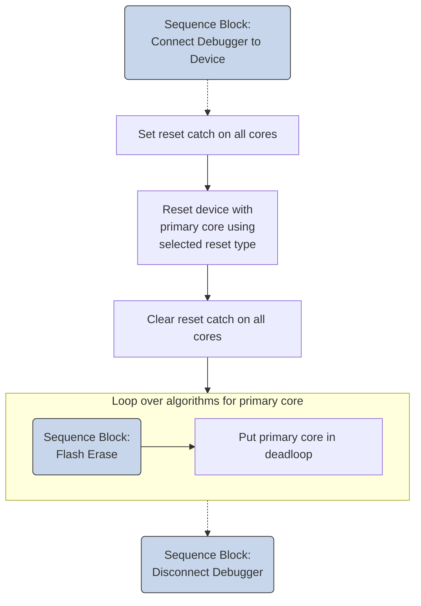
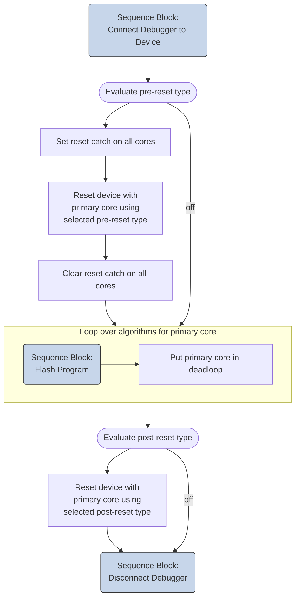
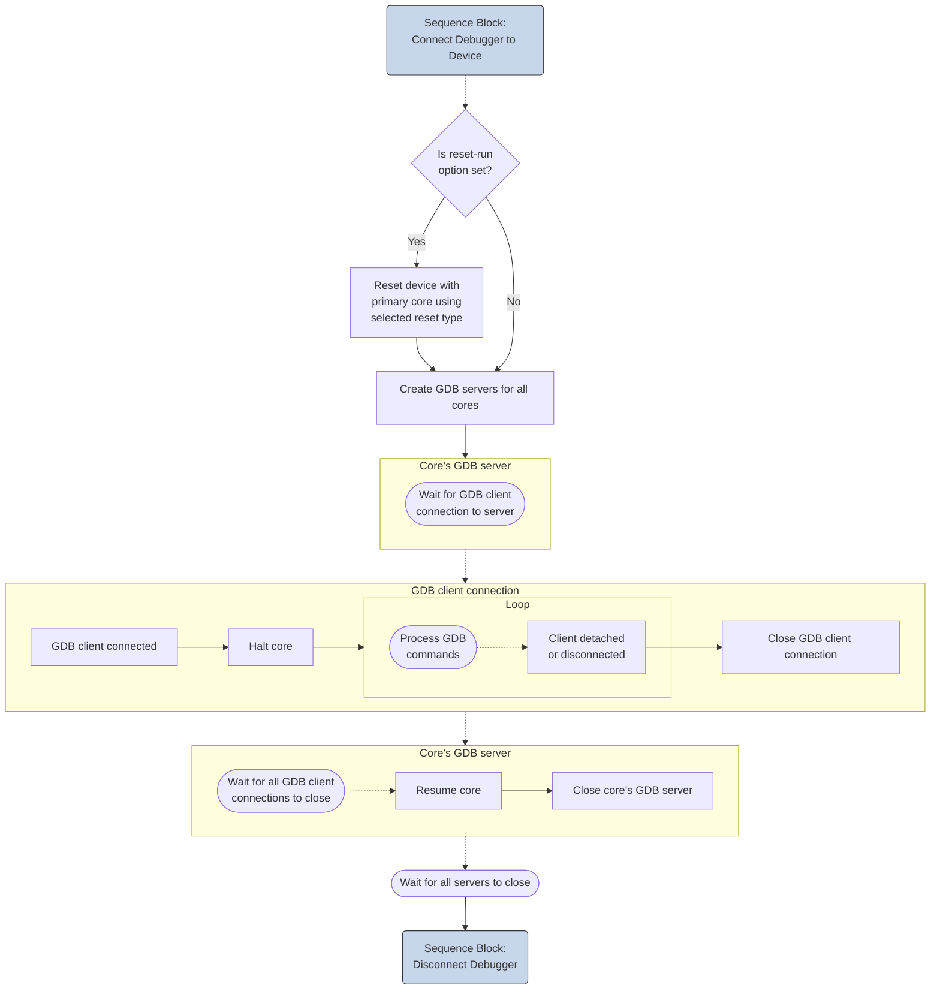
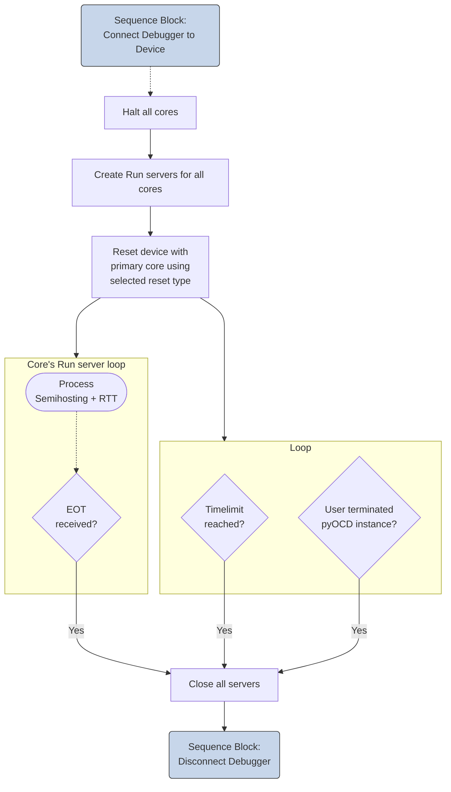

# pyOCD Debugger

The pyOCD Debugger connects to CMSIS-DAP (for example ULINKplus) or ST-Link debug adapters.
The CMSIS-Toolbox defines the [debug configuration](YML-Input-Format.md#debugger-configuration) as part of the *csolution project*, ensuring consistent debug sessions across development teams, CI/CD environments, and different host platforms.
This chapter describes how to use the [pyOCD](https://pyocd.io/) Debugger with the CMSIS-Toolbox.

- [Extended Options](#extended-options) explains additional configuration features that are required in specific use-cases.
- [Command Line Invocation](#command-line-invocation) describes how to call pyOCD directly from the command-line.
- [`cbuild-run:`](#cbuild-run) explains the configuration file that describes the overall pyOCD system setup.

Other manual sections describe how to configure debuggers:

- [Run and Debug Configuration](build-overview.md#run-and-debug-configuration) explains overall structure and how projects and images are configured.
- [Debugger Configuration - pyOCD](YML-Input-Format.md#pyocd) contains details about the options that are specific to pyOCD.

## Extended Options

The section [CSolution Project Format - pyOCD](YML-Input-Format.md#pyocd) contains the pyOCD configuration for typical systems.

Extended YML options are required to configure specific use-cases or overwrite information that is typically provided in the [DFP](build-overview.md#overview-of-operation).

CMSIS-DAP based Debug Adapters implement [debug access sequences](https://open-cmsis-pack.github.io/Open-CMSIS-Pack-Spec/main/html/debug_description.html#pdsc_SequenceNameEnum_pg) that are configured in the [DFP for a device](build-overview.md#overview-of-operation).

### `connect:`

Configures the behavior for connecting pyOCD to the hardware target.

&nbsp;                                            |              | Description
:-------------------------------------------------|--------------|:------------------------------------
`connect:`                                        |   Optional   | Selects the connect mode: `pre-reset`, `under-reset`, `attach` (default), `halt`.

Connect Mode  | Description
:-------------|:------------------------------------
`pre-reset`   | Apply a hardware reset before connect. Sequence: [ResetHardware](https://open-cmsis-pack.github.io/Open-CMSIS-Pack-Spec/main/html/debug_description.html#resetHardware).
`under-reset` | Asserts a hardware reset during connect and deasserts after core(s) are halted. Sequence: [ResetHardwareAssert](https://open-cmsis-pack.github.io/Open-CMSIS-Pack-Spec/main/html/debug_description.html#resetHardwareAssert), [ResetHardwareDeassert](https://open-cmsis-pack.github.io/Open-CMSIS-Pack-Spec/main/html/debug_description.html#resetHardwareDeassert).
`attach`      | Do not change status of the core(s).
`halt`        | Halt core(s) after connect.

### `reset:`

Configures the reset behavior for each core when a reset is requested.

`reset:`                                          |              | Description
:-------------------------------------------------|--------------|:------------------------------------
`- pname:`                                        |   Optional   | Identifies the processor (not required for single core system).
&nbsp;&nbsp;&nbsp; `type:`                        | **Required** | Selects the reset type: `hardware`, `system`, `core`. Default: specified in DFP.

Reset Types   | Description
:-------------|:------------------------------------
`hardware`    | Use a system-wide reset via dedicated debugger reset line. Sequence: [ResetHardware](https://open-cmsis-pack.github.io/Open-CMSIS-Pack-Spec/main/html/debug_description.html#resetHardware).
`system`      | Use a system-wide reset via software mechanism. Sequence: [ResetSystem](https://open-cmsis-pack.github.io/Open-CMSIS-Pack-Spec/main/html/debug_description.html#resetSystem).
`core`        | Use a processor reset via software mechanism. Sequence: [ResetProcessor](https://open-cmsis-pack.github.io/Open-CMSIS-Pack-Spec/main/html/debug_description.html#resetProcessor).

!!! Note
    The `defaultResetSequence` in DFP element [/package/devices/family/.../debug](https://open-cmsis-pack.github.io/Open-CMSIS-Pack-Spec/main/html/pdsc_family_pg.html#element_debug) can define a different default reset type. If no `defaultResetSequence`, the default reset type is `system`.

### `load-setup:`

Configures the debug sequences executed during the `load` command of pyOCD.

`load-setup:`                     |              | Description
:---------------------------------|:-------------|:------------------------------------
&nbsp;&nbsp;&nbsp; `halt:`        |   Optional   | Halt core(s) before load: `on` (default), `off`.
&nbsp;&nbsp;&nbsp; `pre-reset:`   |   Optional   | Reset type before loading: `off`, `hardware`, `system`, `core`. Default: specified in DFP or defined with [`reset`](#reset).
&nbsp;&nbsp;&nbsp; `post-reset:`  |   Optional   | Reset type after loading: `off`, `hardware` (default), `system`, `core`.

**Examples:**

```yml
debugger:
  name: CMSIS-DAP@pyOCD     # default connect, halt and reset behavior
```

```yml
debugger:
  name: CMSIS-DAP@pyOCD
  connect: under-reset      # connect under hardware reset
  reset:
    - type: system          # use system reset
  load-setup:
    halt: on                # halt core(s) before load
    post-reset: hardware    # use hardware reset after load
```

```yml
debugger:
  name: CMSIS-DAP@pyOCD
  connect: pre-reset        # apply hardware reset before connect
  reset:
    - pname: Core0          # for Core0
      type: hardware        # use hardware reset
    - pname: Core1          # for Core1
      type: system          # use system reset
  load-setup:
    pre-reset: system       # use system reset before load
    post-reset: off         # no reset after load
```

### `rtt:`

[SEGGER RTT](https://www.segger.com/products/debug-probes/j-link/technology/about-real-time-transfer/) implements low-latency debug I/O via RAM ring buffers. The `rtt:` node configures the RTT features and the RTT channel usage.

- By default, RTT channel 0 is used for character I/O to the console (STDIO) of the host system that runs pyOCD. The setting `stdio: false` disables this console I/O.

- The [`telnet:`](#telnet) node maps any RTT channel to a TCP Telnet port. pyOCD starts a Telnet server on each port and connects the corresponding RTT channel.

- The [`system-view:`](#system-view) node maps any RTT channel to a core-specific [SystemView](https://www.segger.com/products/development-tools/systemview/) data file.

!!! Note
    RTT is only enabled when using the pyOCD [run command](#run).

`rtt:`                                               |              | Description
:----------------------------------------------------|--------------|:------------------------------------
`- pname:`                                           |   Optional   | Processor identifier (not required for single-core systems).
&nbsp;&nbsp;&nbsp; [`control-block:`](#control-block)|   Optional   | RTT control block configuration.
&nbsp;&nbsp;&nbsp; `stdio:`                          |   Optional   | Route STDIO over RTT channel 0: `true`, `false` (default: `true`).
&nbsp;&nbsp;&nbsp; [`telnet:`](#telnet)              |   Optional   | Map additional RTT channels to Telnet ports.
&nbsp;&nbsp;&nbsp; [`system-view:`](#system-view)    |   Optional   | Capture SystemView data from a designated RTT channel to a file.

#### `control-block:`

The `control-block:` node configures the RTT control block discovery in pyOCD.

`control-block:`                                    |              | Description
:---------------------------------------------------|--------------|:------------------------------------
&nbsp;&nbsp;&nbsp; `auto-detect:`                   |   Optional   | Scan default memory regions for the RTT control block signature: `true`, `false` (default: `false`).
&nbsp;&nbsp;&nbsp; `address:`                       |   Optional   | Explicit control block address; when combined with `size`, acts as scan start address.
&nbsp;&nbsp;&nbsp; `size:`                          |   Optional   | Scan length in bytes when `address` is provided.

pyOCD discovers the RTT control block using the prioritized steps for each core on the target:

1. `control-block:` provides an explicit `address:`:  
    a. `size:` is provided: pyOCD scans that memory range.  
    b. `size:` is not provided: pyOCD checks the provided explicit address.  
2. When `auto-detect: true` pyOCD scans default memory region (RAM) for the RTT control block signature. If multiple regions are marked as default, the region with the lowest start address is selected.
4. When `control-block:` is empty or not specified, pyOCD checks the ELF file for the symbol `_SEGGER_RTT` that specifies the control block location.

If the RTT control block cannot be found, RTT will be disabled for that core.

#### `telnet:`

The `telnet:` node maps the individual RTT channels (upstream and downstream) to specific Telnet ports.

`telnet:`                                           |              | Description
:---------------------------------------------------|--------------|:------------------------------------
`- channel:`                                        | **Required** | RTT channel that is connected to Telnet Server
&nbsp;&nbsp;&nbsp; `port:`                          | **Required** | TCP port for the Telnet server.

!!! Note
    Channel 0 configuration is available only when `stdio: false` is specified.

#### `system-view:`

The `system-view:` node configures the RTT channel data capturing for [SEGGER SystemView](https://www.segger.com/products/development-tools/systemview/).

`system-view:`                                      |              | Description
:---------------------------------------------------|--------------|:------------------------------------
&nbsp;&nbsp;&nbsp; `channel:`                       |   Optional   | RTT channel used for SystemView (default: `1`). Disabled if used by `stdio` or `telnet`.
&nbsp;&nbsp;&nbsp; `file-out:`                      |   Optional   | SystemView output data file. Default: `./out/<solution-name>+<target-type>.<pname>.SVDat` (derived from [`*.cbuild-run.yml`](YML-CBuild-Format.md#run-and-debug-management)).
&nbsp;&nbsp;&nbsp; `auto-start:`                    |   Optional   | Send SystemView start command automatically: `true`, `false` (default: `true`).
&nbsp;&nbsp;&nbsp; `auto-stop:`                     |   Optional   | Send SystemView stop command automatically: `true`, `false` (default: `true`).

**Examples:**

Enable RTT with STDIO and map RTT channel 2 to a Telnet Server port `4444` and channel 3 to a Telnet Server port `4445`:

```yml
debugger:
  name: CMSIS-DAP@pyOCD
  protocol: swd
  rtt:
    - pname: Core0
      stdio: true
      telnet:
        - channel: 2
          port: 4444
        - channel: 3
          port: 4445
```

Configure explicit control block and SystemView capture on channel 1:

```yml
debugger:
  name: CMSIS-DAP@pyOCD
  protocol: swd
  rtt:
    - pname: Core0
      control-block:
        address: 0x20000000
        size: 0x00020000
      system-view:
        channel: 1
        file-out: ./out/MyApp+MyBoard.Core0.SVDat
        auto-start: true
        auto-stop: true
```

### `trace:`

!!! Note
    The `trace:` feature will be implemented in the future. This section is only a preview.

CMSIS-DAP supports the SWO trace output of Cortex-M devices. The device-specific trace features are configured using the `*.dbgconf` file.

The default trace output file and location is derived from the [`cbuild-run.yml` file](YML-CBuild-Format.md#run-and-debug-management)
and uses the extension `<pname>.txt`, format: `<solution-name>+<target-type>.trace`

`trace:`                                                  |              | Description
:---------------------------------------------------------|--------------|:------------------------------------
&nbsp;&nbsp;&nbsp; `mode:`                                | **Required** | Trace: `off` (default), `server`, `file`.
&nbsp;&nbsp;&nbsp; `clock:`                               | **Required** | Trace clock frequency in Hz.
&nbsp;&nbsp;&nbsp; `port-type:`                           |   Optional   | Set Trace Port transport mode. Currently only `SWO-UART` is accepted.
&nbsp;&nbsp;&nbsp; `baudrate:`                            |   Optional   | Maximum baudrate for `SWO-UART` mode.
&nbsp;&nbsp;&nbsp; `port:`                                |   Optional   | Set TCP/IP port number of Trace server (default: 5555).
&nbsp;&nbsp;&nbsp; `file:`                                |   Optional   | Explicit path and name of the trace output file. Default: `<solution-name>+<target-type>.trace`.

## Command Line Invocation

The CMSIS-Toolbox debugger configuration is provided in the [file `*.cbuild-run.yml`](YML-CBuild-Format.md#file-structure-of-cbuild-runyml).
Use the following command line syntax to leverage this information:

```bash
>pyocd <command> [--probe <probe>] [--uid <uid>] [options] --cbuild-run <cbuild-run.yml file>
```

`<command>`                                       | Description
:-------------------------------------------------|:------------------------------------
[`gdbserver`](#gdbserver)                         | Start GDB server(s).
[`run`](#run)                                     | Execute application.
[`erase`](#erase)                                 | Erase device.
[`load`](#load)                                   | Load image to device.
[`reset`](#reset)                                 | Reset device.

`[options]`          | Description
:--------------------|:------------------------------------
`--probe`            | Specify the probe type (`cmsisdap:` or `jlink:`).
`--uid`              | Specify the ID or serial number of a debug probe.

!!! Info
    When only one probe is connected to the host computer, `--probe` and `--uid` can be omitted.

**Example:**

Connect to a specific probe on the host computer.

```bash
pyocd load --probe cmsisdap: --uid XP0GA4C42ZQAA --cbuild-run c:\Test\Dec11\DualCore\out\DualCore+FRDM-MCXN947.cbuild-run.yml
```

### `gdbserver`

Start GDB servers for each target device core, used for debugging the applications.

`<options>`          | Description
:--------------------|:------------------------------------
`--semihosting`      | Enable semihosting (default: disabled).
`--persist`          | Keep GDB server running even after remote has detached (default: disabled).
`--reset-run`        | Reset and run before running GDB server.

**Example:**

```bash
pyocd gdbserver --persist --reset-run --semihosting --cbuild-run out/DualCore+Alif-AppKit-E7.cbuild-run.yml
```

### `run`

Run the target until `timelimit` is reached or an `EOT (0x04)` character is detected on stdout.

`<options>`          | Description
:--------------------|:------------------------------------
`--timelimit <sec>`  | Maximum execution time in seconds before terminating (default: no time limit).
`--eot`              | Terminate execution when EOT character (`0x04`) is detected on stdout (default: disabled).

**Example:**

```bash
pyocd run --cbuild-run out/DualCore+Alif-AppKit-E7.cbuild-run.yml --eot --timelimit 30
```

### `erase`

Erase target using `chip` erase.

`<options>`          | Description
:--------------------|:------------------------------------
`--chip`             | Perform a chip erase.

!!! Note
    Currently erase without `--chip` option is not supported.

**Example:**

```bash
pyocd erase --chip --cbuild-run out/DualCore+Alif-AppKit-E7.cbuild-run.yml
```

### `load`

Program target with images listed under the [`output`](#output) node.

**Example:**

```bash
pyocd load --cbuild-run out/DualCore+Alif-AppKit-E7.cbuild-run.yml
```

### `reset`

Reset target using selected [`reset`](#reset) type.

**Example:**

```bash
pyocd reset --cbuild-run out/DualCore+Alif-AppKit-E7.cbuild-run.yml
```

## Content of `cbuild-run.yml`

This section details the content of `cbuild-run.yml` file and how it is used to configure pyOCD. The `cbuild-run.yml`
file is generated by the CMSIS-Toolbox from the information provided in the *csolution project*.
However, it is possible to create a `*.cbuild-run.yml` file manually and the following section explains
the file structure.

### `cbuild-run:`

The `cbuild-run:` node is the start of a `*.cbuild-run.yml` file. The table below is an excerpt of the [File Structure of `*.cbuild-run.yml`](YML-CBuild-Format.md#file-structure-of-cbuild-runyml)

`cbuild-run:`                                                     |              | Content
:-----------------------------------------------------------------|:-------------|:------------------------------------
&nbsp;&nbsp;&nbsp; [`device:`](#device)                           | **Required** | Identifies the device.
&nbsp;&nbsp;&nbsp; [`device-pack:`](#device-pack)                 |   Optional   | Identifies the device pack used.
&nbsp;&nbsp;&nbsp; [`board-pack:`](#board-pack)                   |   Optional   | Identifies the board pack used.
&nbsp;&nbsp;&nbsp; [`output:`](#output)                           |   Optional   | Lists the images (ELF, HEX, BIN) in this solution.
&nbsp;&nbsp;&nbsp; [`system-resources:`](#system-resources)       |   Optional   | Lists target system resources.
&nbsp;&nbsp;&nbsp; [`system-descriptions:`](#system-descriptions) |   Optional   | Lists target's description files for peripherals and software components.
&nbsp;&nbsp;&nbsp; [`programming:`](#programming)                 |   Optional   | Lists flash algorithms for programming.
&nbsp;&nbsp;&nbsp; [`debugger:`](#debugger)                       |   Optional   | Configures the debugger.
&nbsp;&nbsp;&nbsp; [`debug-vars:`](#debug-vars)                   |   Optional   | Debug variables.
&nbsp;&nbsp;&nbsp; [`debug-sequences:`](#debug-sequences)         |   Optional   | Debug sequences.
&nbsp;&nbsp;&nbsp; [`debug-topology:`](#debug-topology)           |   Optional   | Debug topology.

### `device:`

pyOCD uses the `device` node to name the target in the current debug session. The node value is structured as
`[<vendor>::]<device>[:<pname>]`, where only the `<device>` part is used to name the target. The default value
is an empty string.

**Example:**

```yml
  device: Alif Semiconductor::AE722F80F55D5LS
```

### `device-pack:`

The `device-pack` (DFP) improves pyOCD's error reporting when a required file is provided by the device pack.

**Example:**

```yml
  device-pack: AlifSemiconductor::Ensemble@2.0.4
```

### `board-pack:`

The `board-pack` (BSP) improves pyOCD's error reporting when a required file is provided by the board pack.

**Example:**

```yml
  board-pack: AlifSemiconductor::Ensemble@2.0.4
```

### `output:`

pyOCD uses the information from the `output` node to determine which images need to be loaded into the device's
flash memory and at what addresses. The image file type is determined by the `type` node, and the load offset
for binary image files is provided by the `load-offset` node. Only files with `image` in the `load:` node are
programmed to the device.

`output:`                                                 |              | Content
:---------------------------------------------------------|--------------|:------------------------------------
`- file:`                                                 | **Required** | Specifies the file name.
&nbsp;&nbsp;&nbsp; [`type:`](YML-Input-Format.md#type)    | **Required** | Specifies the file type.
&nbsp;&nbsp;&nbsp; `info:`                                |   Optional   | Brief description of the file.
&nbsp;&nbsp;&nbsp; [`load:`](YML-Input-Format.md#load)    | **Required** | Load mode of the image file for programmers and debug tools.
&nbsp;&nbsp;&nbsp; `load-offset:`                         |   Optional   | Offset applied in `*.csolution.yml` when loading the binary image file.
&nbsp;&nbsp;&nbsp; `pname:`                               |   Optional   | Image belongs to processor in a multi-core system.

**Example:**

```yml
  output:
    - file: M55_HP/Alif-AppKit-E7/Debug/M55_HP.axf
      info: generated by M55_HP.Debug+Alif-AppKit-E7
      type: elf
      load: image+symbols
      pname: M55_HP
    - file: M55_HE/Alif-AppKit-E7/Debug/M55_HE.axf
      info: generated by M55_HE.Debug+Alif-AppKit-E7
      type: elf
      load: symbols
      pname: M55_HE
    - file: M55_HE/Alif-AppKit-E7/Debug/M55_HE.hex
      info: generated by M55_HE.Debug+Alif-AppKit-E7
      type: hex
      load: image
      pname: M55_HE
    - file: M55_HE/Alif-AppKit-E7/Debug/M55_HE.bin
      info: generated by M55_HE.Debug+Alif-AppKit-E7
      type: bin
      load: none
      pname: M55_HE
```

### `system-resources:`

Contains a list of memory regions that pyOCD uses to build the device memory map. A default Cortex-M memory map is used
as the baseline and is then updated with the information provided in the `memory:` node. If no memory regions are specified,
pyOCD falls back to the default Cortex-M memory map.

`system-resources:`                               |              | Content
:-------------------------------------------------|--------------|:------------------------------------
&nbsp;&nbsp;&nbsp; `memory:`                      |   Optional   | Identifies the section for memory.

`memory:`                                         |              | Content
:-------------------------------------------------|--------------|:------------------------------------
`- name:`                                         | **Required** | Name of the memory region (when PDSC contains id, it uses the id as name).
&nbsp;&nbsp;&nbsp; `access:`                      | **Required** | Access attribute string for the memory ([see `access:` table here](YML-CBuild-Format.md#system-resources)).
&nbsp;&nbsp;&nbsp; `start:`                       | **Required** | Base address of the memory.
&nbsp;&nbsp;&nbsp; `size:`                        | **Required** | Size of the memory.
&nbsp;&nbsp;&nbsp; `pname:`                       |   Optional   | Only accessible by a specific processor.
&nbsp;&nbsp;&nbsp; `alias:`                       |   Optional   | Name of identical memory exposed at a different address.

**Default Cortex-M memory map:**

```yml
  system-resources:
    memory:
      - name: Code
        access: rx
        start: 0x00000000
        size: 0x20000000
      - name: SRAM
        access: rwx
        start: 0x20000000
        size: 0x20000000
      - name: Peripherals
        access: rwp
        start: 0x40000000
        size: 0x20000000
      - name: RAM1
        access: rwx
        start: 0x60000000
        size: 0x20000000
      - name: RAM2
        access: rwx
        start: 0x80000000
        size: 0x20000000
      - name: Devices-Shareable
        access: rwp
        start: 0xA0000000
        size: 0x20000000
      - name: Devices-NonShareable
        access: rwp
        start: 0xC0000000
        size: 0x20000000
      - name: System-Peripherals
        access: rwp
        start: 0xE0000000
        size: 0x20000000
```

**Example:**

```yml
  system-resources:
    memory:
      - name: ITCM_HE
        access: rwx
        start: 0x00000000
        size: 0x00040000
        pname: M55_HE
        alias: SRAM4
      - name: ITCM_HP
        access: rwx
        start: 0x00000000
        size: 0x00040000
        pname: M55_HP
        alias: SRAM2
      - name: MRAM
        access: rx
        start: 0x80000000
        size: 0x00580000
      - name: SRAM2
        access: rwx
        start: 0x50000000
        size: 0x00040000
      - name: SRAM4
        access: rwx
        start: 0x58000000
        size: 0x00040000
```

### `system-descriptions:`

Contains a list of system description files for the target's peripherals and software components. The `svd` files are
processed by pyOCD to present debug views and decode register reads/writes.

`system-descriptions:`                            |              | Content
:-------------------------------------------------|--------------|:------------------------------------
`- file:`                                         | **Required** | Specifies the file name including the path.
&nbsp;&nbsp;&nbsp; `type:`                        | **Required** | Specifies the file type (see table below).
&nbsp;&nbsp;&nbsp; `info:`                        |   Optional   | Brief description of the file.
&nbsp;&nbsp;&nbsp; `pname:`                       |   Optional   | File is used only for a specific processor; default is for all processors.

`type:` | Description
:-------|:------------------
`svd`   | [System View Description (`*.svd`) file](https://open-cmsis-pack.github.io/svd-spec/main/index.html) specified in the [DFP](https://open-cmsis-pack.github.io/Open-CMSIS-Pack-Spec/main/html/pdsc_family_pg.html#element_debug).

!!! Note
    Currently pyOCD has a limitation of only processing the `svd` file for the processor listed in `start-pname`.

**Example:**

```yml
  system-descriptions:
    - file: ${CMSIS_PACK_ROOT}/AlifSemiconductor/Ensemble/2.0.4/Debug/SVD/AE722F80F55D5LS_CM55_HE_View.svd
      type: svd
      pname: M55_HE
    - file: ${CMSIS_PACK_ROOT}/AlifSemiconductor/Ensemble/2.0.4/Debug/SVD/AE722F80F55D5LS_CM55_HP_View.svd
      type: svd
      pname: M55_HP
```

### `programming:`

Contains a list of the target's flash programming algorithms. pyOCD uses these algorithms to identify which
memory regions should be treated as flash, and it will automatically select the appropriate algorithm when
programming flash on the target.

`programming:`                                    |              | Content
:-------------------------------------------------|--------------|:------------------------------------
`- algorithm:`                                    | **Required** | Programming algorithm file including the path.
&nbsp;&nbsp;&nbsp; `start:`                       | **Required** | Start address of memory covered by the programming algorithm.
&nbsp;&nbsp;&nbsp; `size:`                        | **Required** | Size of memory covered by the programming algorithm.
&nbsp;&nbsp;&nbsp; `ram-start:`                   | **Required** | Start address of RAM where the algorithm will be executed from.
&nbsp;&nbsp;&nbsp; `ram-size:`                    | **Required** | Maximum size of RAM available for executing the programming algorithm.
&nbsp;&nbsp;&nbsp; `pname:`                       |   Optional   | Specifies the processor for the execution of the algorithm.

**Example:**

```yml
  programming:
    - algorithm: ${CMSIS_PACK_ROOT}/AlifSemiconductor/Ensemble/2.0.4/Flash/algorithms/Ensemble.FLM
      start: 0x80000000
      size: 0x00580000
      ram-start: 0x00000000
      ram-size: 0x00020000
    - algorithm: ${CMSIS_PACK_ROOT}/AlifSemiconductor/Ensemble/2.0.4/Flash/algorithms/Ensemble_IS25WX256.FLM
      start: 0xC0000000
      size: 0x02000000
      ram-start: 0x00000000
      ram-size: 0x00040000
```

### `debugger:`

Contains the user's debugger configuration settings. The available options are described in detail in the
CSolution Project Format section [Debugger Configuration - pyOCD](YML-Input-Format.md#debugger-for-pyocd).

**Example:**

```yml
  debugger:
    name: CMSIS-DAP@pyOCD
    protocol: swd
    clock: 10000000
    start-pname: M55_HP
    connect: attach
    reset:
      - type: system
        pname: M55_HP
      - type: core
        pname: M55_HE
    gdbserver:
      - port: 3333
        pname: M55_HP
      - port: 3334
        pname: M55_HE
    telnet:
      - mode: console
        pname: M55_HE
        port: 4445
      - mode: monitor
        pname: M55_HP
        port: 4444
```

### `debug-vars:`

Contains default values for debug sequence variables. These values can be overridden by explicit settings in a
`*.dbgconf` file provided in the [`debugger:`](#debugger) node.

**Example:**

```yml
  debug-vars:
    vars: |
      // Default values for variables in debug sequences. Can be configured with a *.dbgconf file in the user project
      __var SWO_Pin               = 0;                    // Serial Wire Output pin: 0 = PIO0_10, 1 = PIO0_8
      __var Dbg_CR                = 0x00000000;           // DBG_CR
      __var BootTime              = 10000;                // 10 milliseconds
```

### `debug-sequences:`

Contains [debug sequences](https://open-cmsis-pack.github.io/Open-CMSIS-Pack-Spec/main/html/pdsc_family_pg.html#element_sequence)
from the DFP for the target. A sequence with no `blocks` disables the default sequence; sequence names can override
default sequences from the DFP.

**Example:**

```yml
  debug-sequences:
    - name: DisableWarmResetHandshake
      blocks:
        - execute: |
            Write32(0x1A601024, 0);
      pname: M55_HE
    - name: DisableWarmResetHandshake
      blocks:
        - execute: |
            Write32(0x1A600024, 0);
      pname: M55_HP
    - name: DebugDeviceUnlock
      blocks:
        - execute: |
            DAP_Delay(500000);  // Delay for 500ms
    - name: ResetSystem
      blocks:
        - execute: |
            Sequence("DisableWarmResetHandshake");
        - execute: |
            // System Control Space (SCS) offset as defined in Armv6-M/Armv7-M.

            __var SCS_Addr   = 0xE000E000;
            __var AIRCR_Addr = SCS_Addr + 0xD0C;
            __var DHCSR_Addr = SCS_Addr + 0xDF0;

            // Execute SYSRESETREQ via AIRCR
            Write32(AIRCR_Addr, 0x05FA0004);
        - while: (Read32(DHCSR_Addr) & 0x02000000)
          timeout: 500000
```

### `debug-topology:`

Describes the properties of the system hardware for debug functionality. The information for this node is taken from
the DFP. If the information is not provided in the `*.cbuild-run.yml` file, pyOCD will use the default values described below.

`debug-topology:`                                 |              | Content
:-------------------------------------------------|--------------|:------------------------------------
&nbsp;&nbsp;&nbsp; `debugports:`                  |   Optional   | Describes the CoreSight debug ports of the device and its capabilities.
&nbsp;&nbsp;&nbsp; `processors:`                  |   Optional   | Map of `pname` identifiers to access port IDs (mandatory for multi-processor devices).
&nbsp;&nbsp;&nbsp; `swj:`                         |   Optional   | Device allows switching between Serial Wire Debug (SWD) and JTAG protocols (`true` or `false`).
&nbsp;&nbsp;&nbsp; `dormant:`                     |   Optional   | Device requires the dormant state to switch debug protocols (`true` or `false`).

`debugports:`                                     |              | Content
:-------------------------------------------------|--------------|:------------------------------------
`- dpid:`                                         | **Required** | Unique ID of this debug port.
&nbsp;&nbsp;&nbsp; `accessports:`                 |   Optional   | List of CoreSight access ports (APv1/APv2) (mandatory for multi-processor devices).

`accessports:`                                    |              | Content
:-------------------------------------------------|--------------|:------------------------------------
`- apid:`                                         | **Required** | Unique ID of this access port. If only `apid` is provided, access port (APv1) with index `0` will be implicitly used.
&nbsp;&nbsp;&nbsp; `index:`                       |   Optional   | Index to select this access port (APv1) for a target access.
&nbsp;&nbsp;&nbsp; `address:`                     |   Optional   | Address to select this access port (APv2) in its parent's address space for a target access.

!!! Note
    `index:` and `address:` cannot be specified at the same time.

`processors:`                                     |              | Content
:-------------------------------------------------|--------------|:------------------------------------
`- pname:`                                        | **Required** | Processor identifier (mandatory for multi-processor devices).
&nbsp;&nbsp;&nbsp; `apid:`                        |   Optional   | Access port ID to use for this processor.
&nbsp;&nbsp;&nbsp; `reset-sequence:`              |   Optional   | Name of debug sequence for reset operation (default: `ResetSystem` sequence).

**Default values:**

```yml
debug-topology:
  dormant: false
  swj: true
  debugports:
    - dpid: 0
      accessports:
        - apid: 0
          index: 0
```

**Example:**

```yml
  debug-topology:
    debugports:
      - dpid: 0
        accessports:
          - apid: 0
            address: 0x00200000
          - apid: 1
            address: 0x00300000
    processors:
      - pname: M55_HP
        apid: 0
      - pname: M55_HE
        apid: 1
    dormant: true
```

## Debug Access Sequence Usage for pyOCD Commands

The sequence diagrams below show the usage of the debug access sequences for pyOCD commands. The specification [Open-CMSIS-Pack - Usage of debug access sequences](https://open-cmsis-pack.github.io/Open-CMSIS-Pack-Spec/main/html/debug_description.html#usage_of_sequences) describes the following sequence blocks. pyOCD uses these concepts, but implements these deviations:

- **Connect Debugger to Device**:  
    - For the [`connect:`](#connect) mode `attach`, no reset or halt operations are issued.
    - For multi-processor systems, only the following blocks are executed once per processor core: **Read Target Features**, **DebugCoreStart**, **Stop Processor** / **ResetCatchSet**,
    **Wait for Processor to Stop**, and **Initialize Debug Components**. The remaining diagram elements run once for the device as a whole. This distinction is important for multi-core targets, where some blocks run once per core and others run once for the device.

!!! Info
    Sequence Blocks in the diagrams below link to the [Open-CMSIS-Pack](https://open-cmsis-pack.github.io/Open-CMSIS-Pack-Spec/main/html/debug_description.html#usage_of_sequences) specification that provides further details.

---

### Command: pyOCD erase



---

### Command: pyOCD load



---

### Command: pyOCD gdbserver



---

### Command: pyOCD run


